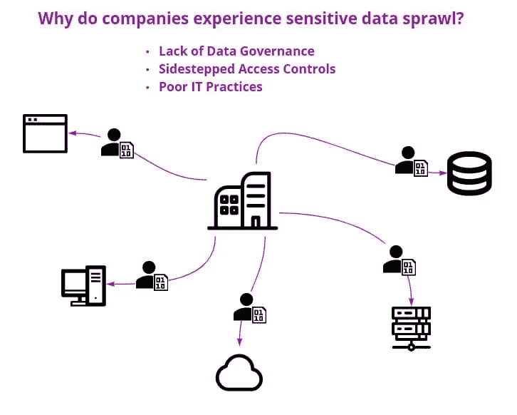

# 如何应对敏感数据激增

> 原文：<https://betterprogramming.pub/how-to-address-sensitive-data-sprawl-c262787538de>

## 为您的应用程序提供更多安全性的简要指南

每个组织都有敏感数据—客户数据、员工数据或运营数据。敏感数据可能以多种形式出现，包括:

*   人事记录
*   应用程序代码或云服务中使用的凭据
*   个人身份信息(PII)
*   个人健康信息(PHI)
*   受 PCI DSS 约束的支付卡数据

每种类型的敏感数据都有其独特的安全要求和相关风险。基础架构和应用程序的复杂性加剧了这些风险，它们会将组织的敏感数据分散到不同的存储位置、云服务提供商或集群中。这种分散被称为“敏感数据蔓延”

如果没有适当的数据治理计划，跟踪和管理这些数据将是一个巨大的挑战。维护安全性和合规性的难度非常高。

本文将讨论什么是敏感数据蔓延以及它是如何发生的。然后，我们将看看这种蔓延的解决方案:集中敏感数据。

最后，我们将看看采用解决方案的好处:如果您采取了集中敏感数据的关键步骤，您可能会避免哪些麻烦，以及您可能会抓住哪些机会？

让我们开始吧。

# 什么是敏感数据蔓延？

随着私有信息在公司基础架构和系统中传播，敏感数据激增。

# 成因

敏感数据蔓延是组织无意于其数据治理策略、安全控制和 IT 实践的自然结果。让我们逐一检查这些因素。

## 缺乏数据治理

随着公司的发展，其数据量也在增长，一个典型的结果是关于哪些数据是敏感数据、数据位于何处以及如何管理这些数据的记录丢失或不准确。

数据治理围绕数据标记、安全数据处置和明确定义的数据所有权建立策略。如果数据治理不能提供组织数据流的清晰画面，组织将会有未知的、不受保护的数据在基础设施和系统中流动。

## 旁路访问控制

访问控制，如基于角色的访问控制(RBAC)或基于属性的访问控制(ABAC)，对于限制对敏感数据的访问至关重要。组织必须考虑并实施周密的安全控制，以最大限度地降低可能危及敏感数据的内部威胁或外部攻击的可能性。

然而，当一个组织实施太多(或过于复杂)的安全控制时，员工可能会避开这些控制，走阻力最小的路。他们可能会采用未经您的安全团队审查的第三方应用或服务。这种“影子 IT”的使用，即一个部门以自己的方式处理其数据集，可能会导致数据孤岛、重复数据集，并进一步加剧敏感数据的蔓延。

## 糟糕的 IT 实践

当一个组织需要对其分布式系统实施变更，但是 IT 实践很差时，人为错误的可能性就会增加。结果是敏感数据得不到跟踪和不安全地分发。这些做法包括:

*   没有建立或记录的变更管理流程
*   没有风险评估
*   没有可重复的部署流程
*   更新和补丁程序的应用不一致
*   未跟踪的配置更改
*   未经批准的服务或应用程序集成

# 负面影响

敏感数据蔓延的潜在影响不容忽视。安全控制缺失、薄弱或经常被绕过的组织面临数据泄露的高风险，数据泄露的[财务成本](https://www.ibm.com/security/data-breach)可能会造成严重后果。

如果没有适当的数据治理，您的组织就无法完全了解其敏感数据管理的当前状态。在这些情况下，正确保护和审核敏感记录所需的时间和资源可能会使遵从数据主体的请求(许多数据隐私法的一个常见特征)成为不可能。

最后，你不能忽视公司形象的影响。分散且不受管理的敏感数据会让公司面临诉讼、失去客户信任和市场声誉受损的风险。

# 你应该如何面对挑战？

解决敏感数据蔓延的主动方法提高了对敏感数据的收集、传输、存储和处理的认识。您的公司可以先发制人地创建、实施并遵循一个完整的数据治理策略来实现这一目标。它从评估你当前的状态开始，以确定你需要修复什么。

# 审计

作为一个负责任的企业，你应该全面审计你的基础设施，以[评估你的数据隐私状况](https://www.skyflow.com/post/top-five-reasons-to-re-evaluate-your-privacy-posture)。从识别每一份敏感数据和相关的安全风险开始。这是建立适用于整个公司的适当治理策略的必要步骤。

您的组织应该使用这些审核的结果对未发现的敏感数据进行分类，并评估当前的安全问题。不要对所有数据一视同仁。应用程序遥测数据或性能日志等信息的泄露远不如 PII 或 PHI 的暴露那样令人担忧。您的审核应涵盖所有数据源，包括:

*   网络文件共享
*   基于 SaaS 的日志管理解决方案中的日志文件
*   数据集
*   软件源代码
*   其他相关数据存储库

# 安全的

接下来，您的组织必须考虑对所有敏感数据的安全控制。不同的安全控制都有助于形成有效的总体安全策略。这些控制措施包括:

*   RBAC 和 ABAC
*   用户培训
*   数据加密(静态、内存中和传输中)
*   安全数据处理
*   定期审计

虽然这些安全控制措施至关重要，但在应对不断增长的敏感数据激增的同时实施这些措施可能是一场艰苦的战斗。

# 使集中

当您的组织审查其数据审核结果并开始制定数据治理策略时，您应该考虑对您管理的所有敏感数据采用集中管理解决方案。确定一种或多种技术的解决方案，保持严格的安全控制。

考虑您的业务目标和要求，以确保整个企业的协作并降低影子 IT 的风险。您应该通过集中监控、分析、管理和配置安全控制和敏感数据，避免或防止许多导致敏感数据蔓延的因素。

虽然您可以手动实施集中式敏感数据存储解决方案，但这种方法风险很大、成本很高且效率低下。有时候，“自己动手”带来的问题比解决的问题还多。更可靠的选择是使用已建立的外部数据保密库来集中和管理敏感数据。

# 集中敏感数据的好处

除了获得您负责任地处理敏感数据的信心之外，集中敏感数据还有额外的好处:它让您避免头痛并抓住机会。

# 避免头痛

任何处理敏感数据的公司都必须准备好处理以下问题:

*   数据主体请求，其中用户请求访问或修改公司可能拥有的关于他们的个人信息
*   用户要求行使擦除权(也称为“被遗忘权”)，公司有义务删除该用户的任何个人信息
*   外部监管机构对贵公司敏感数据的使用、范围或处理提出的审计请求

这些请求——无论是与 [GDPR](https://gdpr-info.eu/) 、加州 [CCPA](https://oag.ca.gov/privacy/ccpa) 、康涅狄格州 [CTDPA](https://www.cga.ct.gov/2022/ACT/PA/PDF/2022PA-00015-R00SB-00006-PA.PDF) 等最近的法律，还是任何其他数据隐私法律或法规相关——都是那些遭受敏感数据激增之苦的公司令人难以置信的头痛的原因。当敏感数据分散在不同的基础架构和系统之间且无法跟踪时，满足这些请求可能会非常耗时，而且会消耗大量资源。

另一方面，当一个组织的所有敏感数据都集中在一个存储库中进行跟踪时，这些令人头痛的问题就消失了。例如，有了来自 [Skyflow](https://www.skyflow.com/) 的数据隐私库，完全满足审计或数据主体请求只需要对 API 进行几次简单的调用。因为为敏感数据收集的所有信息都在一个地方管理，所以您可以确保对审计或数据主题请求的响应包含可靠、完整和准确的结果。

# 抓住机遇

数据隐私和保护法千变万化，不断发展。您的公司可能不知疲倦地努力满足当前市场的数据法规遵从性要求，但是如果一个新市场(在一个新的地区或行业)出现了机会，您需要多少时间来实施进入该市场所需的法规遵从性措施？面对敏感数据的激增和新要求的挑战，您的组织可能会错失良机。

但是，通过使用符合跨地区和行业的数据隐私和保护法规的保险库集中您的敏感数据，您可以有效地将大部分合规工作转移给值得信赖的专家。当需要开拓新市场时，您的公司可以快速而自信地完成，因为您已经准备好满足该市场的法规遵从性要求。

# 结论

希望高效可靠地集中和管理其敏感数据的公司可以使用集中式数据隐私保险库作为解决方案。通过 API 管理， [Skyflow](https://www.skyflow.com/) 是一个建立在零信任原则基础上的数据保密库。您可以使用它来防止敏感数据蔓延等问题，同时享受通过应用程序、基础架构和操作级控制维护的高级别安全性。

由于信息管理不善而导致敏感数据激增的公司面临着巨大的风险。手动解决方法可能成本更高，效率更低。实施全面的数据治理策略并使用安全高效的数据隐私库是控制敏感数据并避免其在复杂基础设施和系统中传播的绝佳解决方案。

好处包括轻松满足审计或数据主体请求，以及利用数据隐私法规开拓新市场时的灵活性。

*感谢阅读！敬请关注更多内容。*