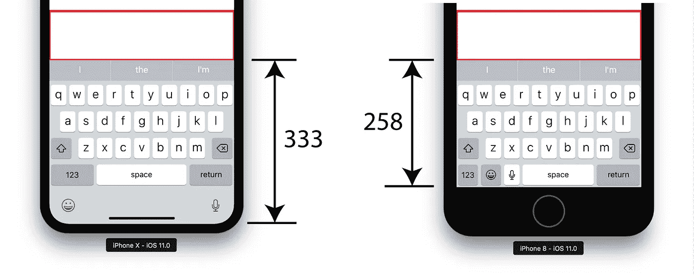
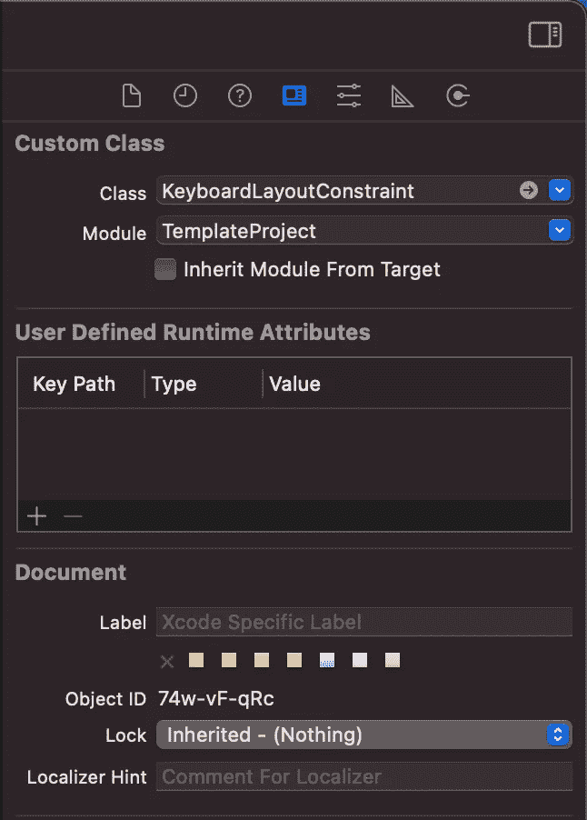

# 如何在 iOS 中调整视图以适应键盘

> 原文：<https://betterprogramming.pub/how-to-adjust-views-to-fit-the-keyboard-in-ios-63bcf42163b8>

## 使用 NSLayoutConstraint 子类



作者照片。

对于可滚动视图，无论是`UITableView`、`UIScrollView`，甚至是`UIView`，当键盘出现时，它会占用空间，通常意味着您必须根据键盘的可见性调整视图以动态响应。

最常见的处理方式是使用`NotificationCenter`来响应以下事件:

```
UIResponder.keyboardWillHideNotification
UIResponder.keyboardWillChangeFrameNotification
```

这是可行的，但是您必须在每个使用键盘处理它的类中添加代码。 [Hacking 与 Swift](https://www.hackingwithswift.com/example-code/uikit/how-to-adjust-a-uiscrollview-to-fit-the-keyboard) 提出的一个选项是:

这个很好用，没毛病。然而，让我们看看是否有另一种处理方法。

我的偏好是让我的`UIView`和`UIViewController`的逻辑尽可能具体到那个视图，并尽可能抽象出共同的逻辑。我发现它提高了代码的可读性，提高了你理解一个不熟悉的类的速度。

# NSLayoutConstraint 子类简介

这就是子类化一个`NSLayoutConstraint`变得有用的地方。根据键盘是显示还是隐藏来放置扩展和收缩的所有逻辑允许我们简单地设置一个约束，而不必担心处理它的逻辑。

如果您使用`AutoLayout`，那么您可以简单地将类设置为项目中的子类变量，如下所示:



或者，您可以通过编程来创建约束，尽管我更喜欢在适当的地方使用`AutoLayout`。

这种方法的唯一缺点是，如果有人最终用一个非子类化的约束替换这个约束，就会破坏视图。也就是说，类似这样的事情应该被开发人员发现，或者，在最坏的情况下，被良好的测试实践发现。我相信这种方法的好处远远大于坏处。

下面是我的子类的变体，它是对由 [Meng 到](https://raw.githubusercontent.com/MengTo/Spring/master/Spring/KeyboardLayoutConstraint.swift)创建的子类的修改，非常欢迎您在您的项目中使用:

就是这样！感谢阅读这篇文章。希望它教会了你一些新的东西。