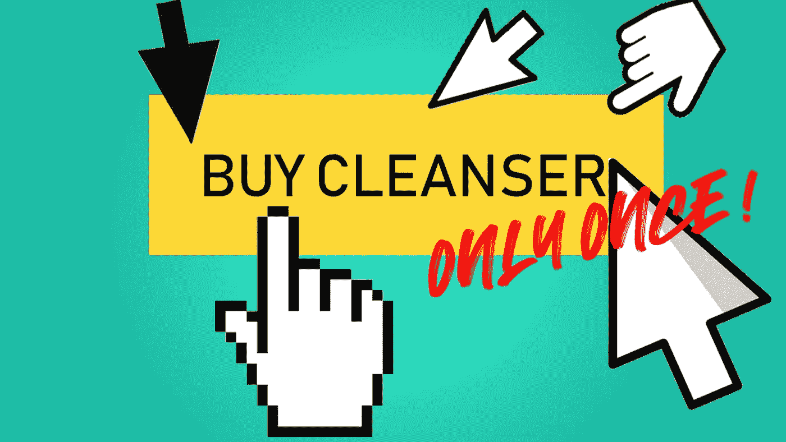

# 如何在 JavaScript 中只允许一次点击事件

> 原文：<https://betterprogramming.pub/how-to-allow-only-one-click-events-in-javascript-72938027fbf5>

## 利用函数式编程的力量避免相关的缺陷

作者图片

你发现自己回到了一个舒适的位置，因为实现了一个简单的任务。然而，你却在认真思考如何实现它。

**我说的是“一件事只做一次”的问题。**

你可能正在用几种常用的方法来解决和思考你将会遇到的*相关缺陷*。你一定会找到实现它的方法。但是，你仍然要回答这个问题，“它也很容易测试吗？”。

让我们发现解决这个问题的几种方法，以及为什么如果你用功能性的方法来做，那么*相关的缺陷*就会被消除。

# 问题:在细节上

假设你正在开发一个电子商务网站，你想让用户在你的网站上购物。一旦他们装满了购物车，他们就想订购商品并付款。

很明显，这个按钮只能按一次。没人想收到双倍或三倍的账单。不要去想被多次计费。

按钮的 HTML 代码可能如下所示:

JavaScript 中的处理函数可以是:

**那么，如何才能满足只被点击一次的标准呢？**

很明显，你不会考虑一个叫做“希望用户只点击一次”的解决方案此外，简单地禁用按钮不是一个有效的选项。

# 尝试 1:全局标志用法

这可能是你的第一个想法。大多数人可能会这样做。让我给你改一下代码:

如果用户点击按钮，代码会将变量`clicked`更改为`true`，我们不再执行这段代码。

代码做你想让它做的事情。要求满足了，现在我们去午休吧！

不要！

该解决方案解决的几个问题是:

*   你使用一个全局变量。在编码的历史上，这是一个好主意吗？
*   您可能会意外更改全局变量的值。
*   每当用户想购买其他产品时，总是将变量重新初始化为`false`。
*   测试代码变得有点困难。它具有外部依赖性。

最好继续前进。

# 尝试 2:使用后移除处理程序

与其允许该功能进入计费过程，不如取消整个处理过程。

让我给你改一下代码:

看起来很不错，是吧？

不要！

我猜你已经发现了这段代码的第一个问题，下面是更多的问题:

*   代码现在与这个 ID 为`billButton`的按钮紧密耦合。不能重复使用。
*   既然去掉了处理功能，就要把它重新附加到别的地方，这样用户才能重新购买。
*   测试现在比以前工作量更大了。您必须提供 DOM 元素作为依赖项。

*甚至不要考虑给函数传入一个 ID 来使它更加通用，例如:*

因为在内心深处，您仍然在使用一个全局元素——`onclick`值。

# 尝试三:换手柄

现在你在扮演聪明探长，是吗？💃

好的，让我帮你修改代码，然后检查下面的质量:

将按钮改回默认状态(不传递 ID)。创建一个名为`alreadyBilled`的新处理函数，并指定`onclick`处理程序。

从用户的角度来看，这可能更好。用户不会被开两次账单，他会被告知订单已被接受，账单已被处理。

还是那句话:

不要！

这种解决方案具有与以前相同的问题:

*   耦合代码(按钮)。
*   需要重置处理程序。
*   测试变得更加困难。

# 尝试 4:棘手的处理程序重定义

现在你转行了，成为了一名创作型艺术家。

通过下面更改后的代码，处理程序本身突然变得不存在。第一次调用它做它应该做的事情。第二次(以及所有其他时间)调用时，它不再执行任何操作:

检查第 2 行，在这里我将`getBill`函数重新分配给一个新的空函数声明语句。

特殊技巧:函数是全局的。

不要！

*   这个解决方案仍然很难测试。
*   你必须管理`getBill`功能的恢复。怎么会？Idk —我没有想到任何实际的、有意义的东西。

# 尝试 5:本地标志

传统的当地旗帜。所以我从全球国旗开始；在深入研究受功能设计影响的解决方案之前，为什么不以本地标志作为结束呢？

也许这个不算太坏。

为了很好地实现这一点，我们使用一个 life(立即调用的函数表达式),如下所示:

*这真的是一个合适的解决方案吗？*

是啊！

使用私有变量代替全局变量是一个巨大的改进。你必须记住，你需要设计每一个像这样的使用这个原理的函数。

此外，[保持 D.R.Y .原则](https://medium.com/next-level-source-code/do-you-follow-these-10-principles-for-good-programmers-1445727af447)。

# 最终的函数尝试:高阶函数

保持现有的工作代码不变符合您的利益。

因此，我将演示一个*高阶函数*。这个函数将接收另一个函数作为参数，并返回一个新函数，这个函数只工作一次。

在您进入函数式方法之前，我必须说一下`HTML`中的`onclick`属性:

1.  它只以纯文本形式存储函数调用语句。
2.  当您单击 HTML 元素时，它会检查`onclick`属性中是否有任何内容。
3.  如果在`onclick`属性中有任何东西，它将简单地用`eval`执行它。

因此，无论何时处理 DOM 元素，都必须使用正确的方式在 JavaScript 中为高阶函数添加事件侦听器。

`eventListener`的工作方式如下:

1.  EventListeners 将函数引用绑定到事件。
2.  因此，每当特定事件发出时，它都会调用绑定到它的函数。

绑定高阶函数响应的正确方法是使用`bind`。代码如下:

这个高阶函数实现的细节:

第一行显示`once`接收一个函数`f`作为它的参数。定义一个内部私有`finished`变量。利用闭包，与尝试#5 相同。

这是一种可以重用的通用方法。此外，您并不局限于按钮点击处理程序。

第`return(...args) =>`行表示`once`正在返回一个带有一些参数的函数。我使用了[扩展操作符](https://javascript.plainenglish.io/upgrade-your-legacy-coding-style-with-these-6-modern-ways-of-coding-6a9db753a574)。扩展操作符传递原始`f`的任何参数。

[如果你不在 ES8](https://medium.com/nerd-for-tech/10-javascript-productivity-booster-you-better-not-miss-15157804c1b5) 中，你必须使用`arguments`对象来解决这个问题。

该函数在调用`f()`之前分配`finished = true`。这可以看作是防止`f`抛出异常，并且完全只调用这个函数一次。

如果您不想禁用该功能，除非它已经成功结束，那么您必须将赋值移动到调用`f`的正下方。

当一切都设置好后，我们调用`getBill`的函数。

你甚至可以更进一步。相反，你可以放一个 else-if 子句并调用另一个函数来向用户显示他们的愿望已经得到了满足。

# 结论

本文根据实际情况陈述了一个常见而简单的问题。在展示了几种常用的解决方法之后，你选择了一个*功能性*的解决方案。

第一次可能会有很多开销，但是一旦你熟悉了这种思维方式，你就会非常快地掌握这种编码，而且对你来说，这似乎不仅仅是逻辑上的。

您看到了如何将 FP 应用于一个问题，并且还发现了一种更通用的高阶方法，我们可以将它应用于类似的问题。

这个解决方案最好的部分是——不需要进一步修改代码。

获取 26 份备忘单，只研究你真正需要的东西，以获得你的第一份网络开发工作！

[Arnold Code Academy 26 网站开发者备忘单](https://arnoldcodeacademy.ck.page/26-web-dev-cheat-sheets)