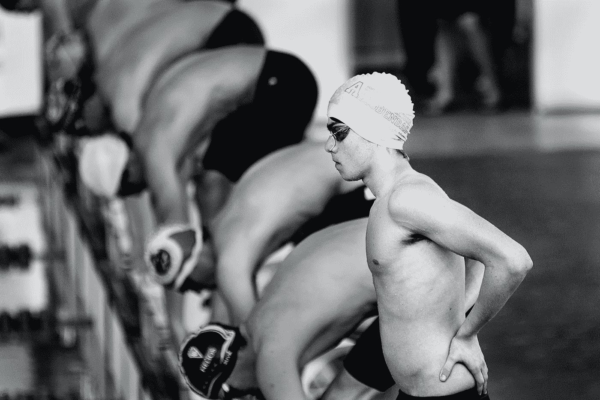

# 作为一名开发人员，如何始终处于游戏的顶端

> 原文：<https://betterprogramming.pub/how-to-always-be-at-the-top-of-your-game-when-you-are-a-developer-bae0dcbe10ae>

## 他们称之为革命性的，不是因为它很大，而是因为它与众不同

照片由[奎诺·阿尔](https://unsplash.com/@quinoal?utm_source=unsplash&utm_medium=referral&utm_content=creditCopyText)在 [Unsplash](https://unsplash.com/s/photos/win?utm_source=unsplash&utm_medium=referral&utm_content=creditCopyText) 上拍摄

> “发现我们是谁的行为将迫使我们接受我们可以比我们想象的走得更远。”——保罗·柯艾略

**让我们自学如何变得伟大。它总是始于认识到我们有能力做得更多，我们应该比我们想象的更好，我们可以创造更好的生活，当那个时刻到来时，我们就会成为超人。**

不停地工作，最早起床，最后一个睡觉，日复一日，接下来的五年，是野心的代价。

小小的竞争会迫使我们前进，它会激励我们付出比我们想象中更多的东西。所以，不要害怕有竞争，他们会迫使你做得更好。

做个好人，让他们无法忽视你。你听说过里奥·梅西吗？他离开巴塞罗那足球队的计划，甚至没有在公开场合说一句话，使他成为全世界的趋势。

他话不多，也不一定要说，他的手艺如此之好，以至于他什么都没说就震撼了世界。

他也是白手起家，只有远大的梦想。

# 每天花两到三个小时学习一些东西

如果你持续这样做几个月，它会成为你一天的一部分——不花些时间学习会开始觉得奇怪。

如果你想作为一个开发者生存下来，你需要技能来跟上。

总有东西要学。这不一定是一种技能，也不一定是什么了不起的东西。你不必一天就构建一个应用程序——我们都有自己的义务和差事，保持平衡是最重要的。在朝着梦想努力的同时，我们需要保持理智。

一致性是你实现任何目标的通行证。正是我们每天所做的小事造就了我们的未来。要在马拉松中生存，你必须不断前进。哪怕只是一步一个脚印，*你也要动*。

你不需要每天花五到十个小时——你只需要花足够的时间来获得一些东西和提高你的技能。即使只有两到三个小时，你也会惊讶地发现，它不仅能培养你的技术技能，还能培养你养成习惯的内在自律。

重要的是让它成为一种习惯。这就像肌肉——为了锻炼它，你必须日复一日地练习，直到变得不可能为止。

如果你梦想建一座摩天大楼，那么就为这个梦想付出你的一切，因为它值得。

# 听从你的高级开发人员

他们知道很多你不知道的事情。即使感觉他们不喜欢你，你也需要尊重他们，保持谦逊。

成为一名优秀的开发人员不仅仅是技术技能的问题。也是为了成为一个好的队友和人类。要尊重，不管你有多优秀。相信我，你不想成为你的高级开发人员的更大敌人！

你需要学习如何与你的同事相处，不管他们是否也是开发人员。试着多听少说——人们喜欢被倾听。我不是说你需要处理他们的生活，只是要尊重他们——尤其是那些比你工作时间长的人。

我们从实践中学到很多东西，我们也可以从别人的经验中学习。你最好的老师是你的高级开发人员。

我遇到过最糟糕的情况——一个不关心也不教人的人。但他们也教会了我一些东西——他成了我未来想成为的人的完全相反的一面。

如果你是初级开发人员，你的主要精力应该是尽可能多地从你的高级开发人员那里学习。他们可以教你一千件你在网上或大学里找不到的事情。停止思考书本和训练营，开始思考真实的世界。真正的教训是从你的高级开发人员的技术、语言和智慧中学习。

# 跟上潮流

这并不意味着你可以跳来跳去，也不意味着你必须跟随他们去任何地方，你只需要注意。

你不会想蒙着眼睛走在路上，所以要及时了解技术领域的最新动态——瞬息万变，你不想被遗忘。

跟上潮流也是开发人员工作的一部分。如果你想成长和变得更好，把这一条列在你的清单上。

一个好方法是跟随其他开发人员——那些你尊敬、跟随和信任的人。它可以是你信任的一个人或一个组织，给你正确的资源和信息。

另一个好主意是加入一个社团。和志同道合的人在一起。他们不仅会在你的旅程中全程支持你，还会帮助你成长和进化。在一天结束的时候，你需要一个朋友或一个陌生人来交谈，那些理解我们工作的人，所以试着去交朋友。

你也可以从阅读科技博客文章开始你的一天，尤其是在 Medium。我非常喜欢阅读媒体——正确地开始你的一天。

如果你发现一些有趣的东西，可能是新技术或编程语言，那就去参加一门课程。Udemy 是最便宜的，物有所值。

最后，不要忘记更新你的投资组合和 Linkedin，你永远不知道机会何时到来。

# 总是不断创新

重新发明轮子，重新塑造自己，尤其是在对你最重要的事情上。

我已经说过很多次了:不要重新发明轮子——使用它。

但也有例外，总是有的。不搞例外，怎么创造东西？我们如何推动人类前进？我们怎样才能把不可能变成可能？

超越思维可能会令人生畏，但却是值得期待的。它让我每天早上都睡不着觉，想着通过改写我的未来，我可以日复一日地变得更好，如果这不是你想要追求的东西，那么你的想法不够远大。

如果没有例外，那么就不会有史蒂夫·乔布斯、杰夫·贝索斯、马克·扎克伯格、阿尔伯特·爱因斯坦或埃隆·马斯克。不一定要宏大，你只要改写自己的未来，从那里开始。比你自己想象的更大。你是开发者，技术有创造新世界的力量，作为开发者，你可以做任何事情。

它在你的手中。就像医生一样，他们可以拯救成千上万的生命——作为一名开发人员，我们可以改变世界，一次一项技术。

每一个突破都发生在有人引入新的东西时，一些以前不存在的东西——一些不同的东西。他们称之为革命性的，不是因为它很大，而是因为它与众不同。

保持愚蠢。

> “因为那些疯狂到认为自己可以改变世界的人才是真正改变世界的人。”—史蒂夫·乔布斯