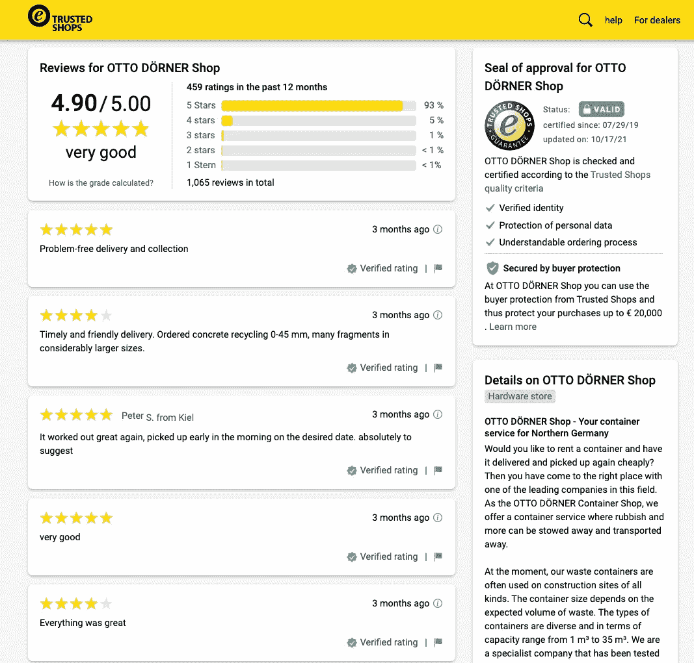
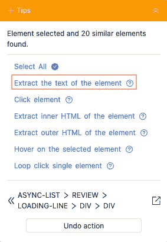
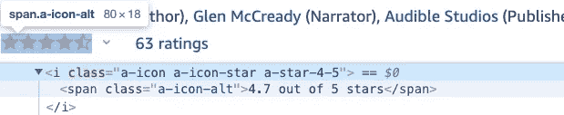
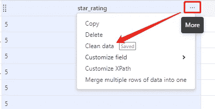
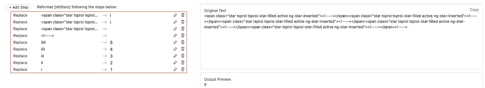
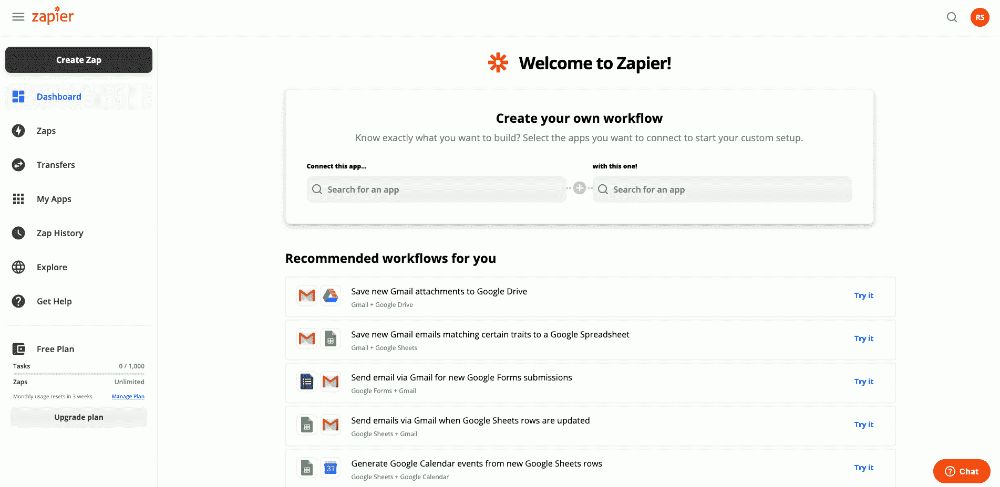
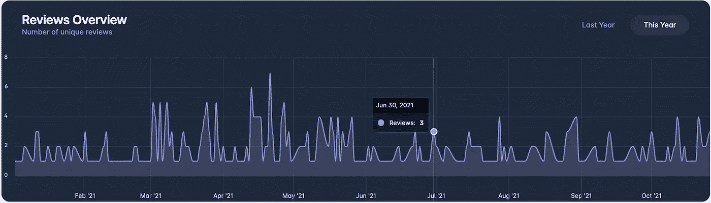
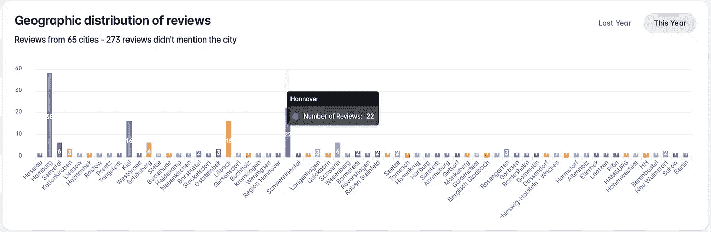
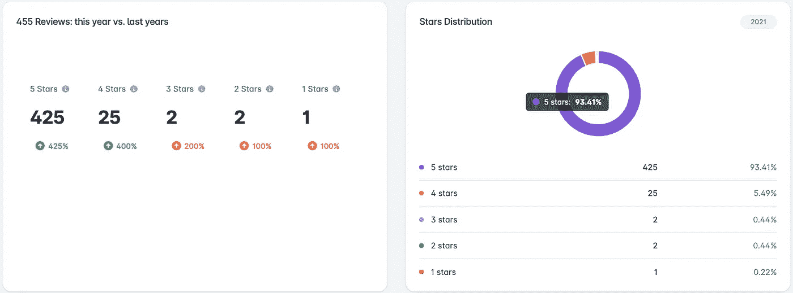

# 如何利用评论抓取来分析和可视化用户的反馈:Container Go 案例研究

> 原文：<https://betterprogramming.pub/how-to-analyze-and-visualize-users-feedback-by-leveraging-reviews-scraping-container-go-case-db53333716c8>

## [网页抓取](https://rakiabensassi.medium.com/list/software-engineering-7a179a23ebfd)

## 搭建一个启发式评估角度 app


照片由[安娜·涅克拉舍维奇](https://www.pexels.com/@anna-nekrashevich?utm_content=attributionCopyText&utm_medium=referral&utm_source=pexels)从[派克斯](https://www.pexels.com/photo/magnifying-glass-on-top-of-document-6801648/?utm_content=attributionCopyText&utm_medium=referral&utm_source=pexels)拍摄

在之前的一篇文章中，作为软件开发人员，我已经解决了五个心智模型来构建更好的产品。其中一个模型是启发式评估。

> [启发式评估](/ux-mental-models-34b8ede1d42b)是软件开发中流行的可用性测试方法。它衡量系统使用的难易程度。这种方法可以让你了解你的用户是如何与你的软件交互的，这样你就可以做出有益于他们的改进。”— [来源](/ux-mental-models-34b8ede1d42b)

在这篇文章中，我将展示如何将这种方法应用到一个真实的例子中，这个例子就是[容器 Go](https://go.doerner.de/) 。Container Go 是德国垃圾处理公司的 B2B 门户网站。它允许最终用户订购用于废物处理的容器，并为公司提供在其库存控制系统中直接跟踪订单的可能性。

对于本案例研究，我将收集用户在线评论，然后实施应用程序(您可以在以下视频中看到)来分析和可视化数据:

如果我们知道我们的产品对其受众有什么影响，并以结构化的方式解释反馈，我们就可以做出准确的决策来改进它或确定适当的战略来进入新的市场并获得竞争情报。

这就是为什么将用户反馈的收集和分析整合到产品开发生命周期和用户研究中是有意义的。这种方法培养了与用户的关系，同时增加了产品的社会证明。

事不宜迟，让我们开始，看看如何实现我们的使命。

# 第一步:收集数据

为了自动提取评论，我们必须利用一种特定类型的网络抓取，即评论抓取。

数据抓取或 web 抓取是数据科学家、机器学习爱好者和营销人员中众所周知的做法。但是不要担心，你不必为了收集公共数据而成为一个网页抓取专家。你可以使用像 [Octoparse](https://www.octoparse.com/?better=) 这样的工具，它对非编码人员来说也是用户友好的，有一个我们稍后会看到的自动检测功能，并提供免费试用。


资料来源:octoparse.com

亚马逊、猫途鹰、Glassdoor、Yelp、Google Places 都是一些最受欢迎的评论资源，但在我们的例子中，我们将使用 [trustedshops.de](https://www.trustedshops.de/bewertung/info_X6592E58520A1DD783E181C3002020802.html) 包含过去 12 个月中来自客户对 Container Go 解决方案的 450 多条评论。



Otto dner Container Go 服务的评论([来源](https://www.trustedshops.de/bewertung/info_X6592E58520A1DD783E181C3002020802.html))

## 设置刮擦任务

以下是我们可以提取的字段列表:

1.  用户名，
2.  用户 URL，
3.  用户城市，
4.  审查日期，
5.  审核类型(例如:“*验证评级*”)，
6.  星星的数量，
7.  和查看内容

调用 reviews 网站后，Octoparse 自动检测到前 5 个字段，我需要通过添加最后两个字段来调整抓取任务中的设置:

*   对于审核 的 ***内容，我点击了第一次审核的字段，然后从动作提示中选择了*提取元素*的文本。***



提取元素的文本(作者截图)

*   但是提取“ ***星星数量*** ”更具挑战性，因为没有 HTML 属性或 CSS 类或文本来读取该值。

例如，如果您在 Amazon 上检查星级的 HTML 元素，您会注意到星级的数量是作为一个`span`标记的文本提供的。不幸的是，我的情况不同。



亚马逊上评分星的 HTML 元素(作者截图)

为了获得每个评论中的星级数，我的解决方案是计算拥有 CSS 类`active`的`<span>`标签(在`<rating-stars>`元素中)的数量。如果您查看以下 4 星评级的代码片段，您会更好地理解我的意思:

trustedshops.de 中 4 星评级的代码片段

为此:

1.  我选择了网页上的星级字段，
2.  我选择了“*提取元素*的内部 HTML”
3.  然后我点击了三点图标
4.  然后在字段本身的上下文菜单中点击“*清除数据*”:



干净的数据

5.然后，在工具的 replace 特性的帮助下，我调整了设置，这样 Octoparse 将自动用字母`i`替换下面的 DOM 元素:

并删除没有`active` CSS 类的`span`标签。最后一步是数`i`的数量。



通过计算 CSS 类为“活动”的标签来计算星星的数量(作者截图)

下面的视频展示了我是如何进行这个过程的:

如何用 Octoparse 收集客户评论(Otto Dö rner Container Go 案例研究)

# 步骤 2:导出数据

完成抓取步骤之后，在导出数据之前，我需要删除重复的数据。当你抓取多个页面，并且该工具一直从最后一页或前几页收集数据时，就会出现重复。

您可以通过点击“*删除重复项*”按钮或者通过修改分页的自动生成的 XPath 来解决这个问题。

我已经在我的设备上本地运行了我的任务，然后以 JSON 格式导出了数据。但我可以在云上完成，这允许我用 Zapier 自动导出我的云数据到 Google Drive、Google Sheet、Dropbox、Trello 和更多应用程序。此功能自 octo parse 8 . 4 . 2 版起可用:



由于 Zapier 与 Octoparse(作者动画，[动画](https://helpcenter.octoparse.com/hc/en-us/articles/4407713565465-How-To-Export-Data-to-Google-Sheets-via-Zapier)中某些图层的来源)的集成，自动将数据导出到许多应用程序

以下是我搜集到的评论:

JSON 格式的评论列表

# 步骤 3:分析和可视化数据

数据很好，但是平面数据很无聊。这就是为什么我们将我们收集的东西形象化，以便于理解。

首先，我们需要创建一个简单的 Angular 应用程序，其中我们将使用 [ApexCharts](https://apexcharts.com/) 库来提供漂亮的交互式可视化。

## 项目设置

`ng new`命令将生成项目的框架，并提示您要包含的特性信息，如 SCSS 样式表格式。按下 ***y*** 选择“*您想添加角度布线吗？*”:

```
ng new reviews-analytics
cd reviews-analytics
```

然后安装角形材料、[角形柔性布局](https://github.com/angular/flex-layout)和 ApexCharts:

```
npm install @angular/material
npm install @angular/cdk
npm install @angular/flex-layout
npm install apexcharts
```

通过将此行添加到`src/style.scss`来导入角度主题:

```
@import "~@angular/material/prebuilt-themes/indigo-pink.css";
```

生成一个名为`analytics`的新模块:

```
ng generate module modules/analytics
```

生成一个名为`analytics`的新组件:

```
ng generate component modules/analytics/analytics
```

通过添加到`analytics`模块的路径来更新`app-routing.module.ts`中的路由:

## 深入细节

好了，现在是好东西的时候了。我们必须实现的第一个图表将显示每个日期的审查数量。它包含两条曲线:一条用于当前年份，一条用于上一年:



第一个图表显示了每个日期的评论数量(图片由作者提供)

第二个图表将显示德国不同城市之间数据的地理分布:



第二个图表显示了每个城市的顾客评论数量(图片由作者提供)

第三个图表将显示每颗星的评论数量，以及去年和今年之间每种评级类型的演变情况:

*   例如，2021 年，五星评论的数量增加了 425%,这对产品来说是一个好兆头，这就是为什么我用绿色来展示它。
*   4 星评论的数量增加了 400%，并且显示为绿色。
*   三星级评论的数量也增加了，但由于我们只喜欢增加 5 星级和 4 星级，我用红色显示了这个值。



第三个图表显示了每颗星的顾客评论的分布(图片由作者提供)

在对这些图形进行必要的设置之前，我们首先需要按照日期、城市和星级数量对评论进行分组。我们还需要提取城市列表，并按年拆分数据。

出于这个原因，我实现了一个助手(`reviews-data.helper.ts`)，它有一些功能来处理这项工作:

逻辑几乎是一样的:我调用`groupBy(reviewsList, key)`函数来获得如下分组的数据:

然后，我调用`getReviewsNumberPerKey(reviewsGroupedByKey)`函数来获取以下格式的数据，这些数据可以传递到图表中:

现在我们需要给`analytics.component.ts`添加一些代码，我们将从设置每个日期的评论图表开始:

组件有一个注入的`AnalyticsService`,它加载 JSON 数据，我把它作为`_prepareChartData()`方法的参数给出。最后一个负责图表的定义:`chartReviews: ApexOptions`。

在第 72 行，我将评论数据传达给图表:`series: data.reviews.series`。下面是显示每个日期的评论的 HTML 部分:

以下是可视化城市间地理分布的 HTML:

这是一张`donut`图表，显示每种评级星级的评论数量和百分比:

瞧啊！

分析应用程序已准备好部署，您可以享受与数据可视化的交互。

# 最后的想法

在信息时代，数据成为生存和发展的关键，知道如何收集数据并将其转化为有意义的见解是一项强大的技能..

在今天的案例研究中，我已经展示了如何仅通过几个图表来可视化数据，但是通过更多的努力和创造力，您可以获得更多的输出，例如每个用户性别的评论分布，或者确定哪个受众年龄组对产品更满意或更失望。

在分析过程中集成一个文本分析库或者一个[机器学习模型](/build-a-hand-pose-detector-web-app-powered-by-machine-learning-62131ec43db5)也将非常有助于按照功能对评论进行分组，例如[网页性能](/web-vitals-guide-b56e28798e7f)，UX，客户服务等等。

我希望你能在这篇文章中找到一些关于如何促进你的事业或职业的灵感。感谢阅读！

我为一群聪明、好奇的人写关于工程、技术和领导力的文章。[加入我的免费电子邮件简讯](https://rakiabensassi.substack.com/)独家访问。