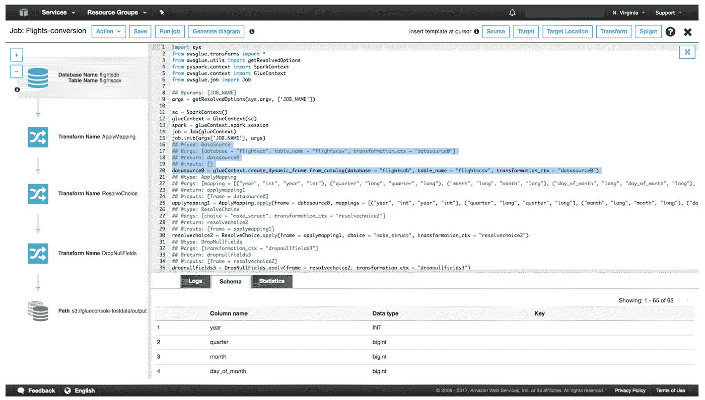

# 数据科学家如何在没有复杂 ETL 的情况下分析数据

> 原文：<https://betterprogramming.pub/how-to-analyze-data-without-complicated-etls-for-data-scientists-ffb818208618>

## 无代码/低代码和数据虚拟化

拉蒙·萨利内罗在 [Unsplash](https://unsplash.com/s/photos/technology?utm_source=unsplash&utm_medium=referral&utm_content=creditCopyText) 上的照片

数据科学家和数据分析师经常需要回答业务问题。这可能会导致更特别的分析或某种形式的模型，将在公司的工作流程中实施。

但是要执行数据科学和分析，团队首先需要访问来自多个应用程序和业务流程的高质量数据。这意味着将数据从 a 点移动到 b 点。通常的方法是使用一个自动化的过程，称为提取、转换和加载，简称 ETL。这些 ETL 通常会将数据加载到某种形式的数据仓库中，以便于访问。然而，ETL 和数据仓库有一个主要问题。

虽然是必要的，[ETL 需要大量的编码](https://www.theseattledataguy.com/data-engineering-101-writing-your-first-pipeline/)，专业知识和维护。除了这项工作对于数据科学家来说非常耗时之外，并不是所有的数据科学家都有开发 ETL 的经验。很多时候，这项工作会落在数据工程团队身上，他们正忙于更大的项目来引入基础数据层。

这并不总是符合数据科学家的需求，他们可能有希望快速获得信息和分析的企业主。等到数据工程团队有时间引入新的数据源可能不是一个好的选择。

这就是为什么在过去几年中开发了几种解决方案来减少科学家为获得所需数据而需要付出的努力。特别是，这已经以数据虚拟化、自动化 ETL 和无代码/低代码解决方案的形式出现。

# 自动化 ETL 和数据仓库

尽管 ETL 本身是一个自动化的过程。它们需要大量的手工开发和维护。

这导致了像 [Panoply](https://panoply.io/) 这样的工具的流行，这些工具提供了一个易于集成的自动化 ETL 和云数据仓库，可以与许多第三方工具同步，如 Salesforce、Google Analytics 和数据库。使用这些自动化集成，数据科学家可以快速分析数据，而无需部署复杂的基础架构。

不需要 Python 或 EC2 实例。只需要点击几下鼠标。然后，有了对您打算引入到团队中的数据类型的大致了解，您的团队就可以拥有一个填充的数据仓库。

这些自动化 ETL 系统非常容易使用，通常只需要最终用户设置数据源和目的地。从那里可以设置 ETL 在特定的时间运行。没有任何代码。

# 产品示例

图片由作者提供。

如前所述，Panoply 是自动化 ETL 和数据仓库的一个例子。

可以在 Panoply GUI 中设置整体摄取，您可以在其中选择源和目的地，并自动摄取数据。由于 Panoply [带有内置的数据仓库](https://www.youtube.com/watch?v=Mm3tu39ziZM)，它会自动存储您的数据的副本，可以使用您想要的任何 BI 或分析工具进行查询，而不必担心危及运营或生产。这种方式的数据基础架构对于希望保持简单，同时仍能在整个组织中访问近乎实时的数据的用户来说是有意义的。

反过来，这使数据科学家能够回答特别的问题，而不需要等待四周，让 BI 团队将数据带入[数据仓库](https://www.youtube.com/watch?v=VjlzuUzYJYM&t=2s)。

## 赞成的意见

*   易于学习和实施
*   以云为中心
*   易于扩展

## 骗局

*   自动化数据仓库和 ETL 本身不会管理复杂的逻辑
*   更复杂的转换可能需要添加无代码/低代码 ETL 工具

# 无代码/低代码

[无代码/低代码](https://www.mendix.com/low-code-guide/)离自动化 ETL 只有几步之遥。这些类型的 ETL 工具有更多的拖放方法。这意味着可以将集合转换和数据操作函数拖放到位。其他类似的解决方案可能更加基于 GUI，允许用户指定源、目的地和转换。此外，许多这些无代码/低代码解决方案允许最终用户查看代码，如果他们想要的话，并编辑它。

对于没有代码经验的用户来说，这是一个很好的解决方案。没有代码/低代码数据，科学家可以用有限的语法开发 ETL，以创建一些相当复杂的数据管道。而不是需要建立大量复杂的基础设施来管理数据管道何时运行以及它们依赖于什么。用户只需要在较高的层次上了解他们的数据在哪里，他们希望数据移动到哪里，以及他们希望数据何时移动到哪里。

## 骗局

*   代码中有限的可定制性
*   每个工具都是不同的，因此开发人员必须在下一次工作中重新学习 ETL
*   无代码/低代码可能太简单，导致糟糕的高层设计

## 赞成的意见

*   技术上不需要编码经验
*   易于集成到许多流行的第三方
*   许多是基于云的解决方案

# 产品示例

图片来源:[aws.amazon.com](http://aws.amazon.com/)

这一类的产品有很多。有像 AWS 胶水、Stitch、FiveTran 这样的产品。

[AWS Glue](https://aws.amazon.com/glue/) 是现代基于云的 ETL 解决方案的一个很好的例子。这允许开发人员通过几次点击和参数设置来设置作业。这可以让数据科学家能够移动和转换数据，而无需太多代码。

Glue 是 AWS 的一部分，可以轻松地与 S3、RDS 和 Redshift 等其他服务集成。这使得在 AWS 上开发数据管道变得非常容易和直观。然而，AWS Glue 有一个主要的警告。与许多其他无代码/低代码选项不同，它是为在 AWS 上运行而开发的。这意味着如果你突然决定换一个不同的云提供商，你可能不得不花费大量的时间和金钱从 Glue 换到其他解决方案。

最后，这是您的团队在开发 ETL 之前应该考虑的一个重要问题。

# 数据虚拟化

数据虚拟化是一种允许用户从多个数据源、数据结构和第三方提供商访问数据的方法。它实际上创建了一个层，无论使用何种技术存储底层数据，最终用户都可以通过单点访问它。

总的来说，当您的团队需要快速访问数据时，数据虚拟化提供了几个优势。以下是数据虚拟化如何让您的团队受益的几个示例。

## 赞成的意见

*   允许数据科学家混合来自多个数据库的数据
*   管理安全性和访问管理
*   实时或接近实时的数据

## 骗局

*   高学习曲线
*   需要管理员来管理
*   仍然需要用户考虑设计和数据流

# 产品示例

图片由作者提供。

Denodo 是数据虚拟化的一个比较知名的提供商。总的来说，这款产品可以说是最成熟、功能最丰富的。

Denodo 专注于帮助用户通过一项服务获取他们的数据，这是它如此受众多客户欢迎的原因。从医疗保健提供商到金融行业，每个人都依赖 Denodo 来减轻 BI 开发人员和数据科学家的压力，减少创建尽可能多的数据仓库的必要性。

总的来说，这三个选项可以帮助您的团队分析数据，而无需投入太多精力来开发复杂的 ETL。

# 结论

管理、混合和移动数据将继续成为数据科学家和机器学习工程师的必要任务。然而，开发这些管道及其相应的数据仓库的过程不需要像过去那样花费很长时间。

有很多很好的选择来开发 ETL，或者自动集成系统，或者通过其他方法，比如无代码/低代码和数据虚拟化。如果您的团队希望减少数据工程师的工作量，有很多选择。您的团队也可能正在组建一个新的数据科学团队，他们需要立即获得数据，那么使用 Panoply 这样的解决方案可能是一个不错的选择。