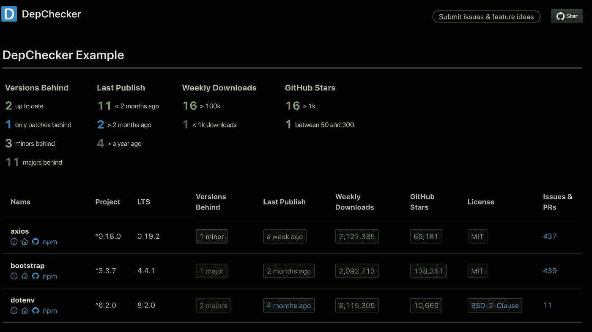
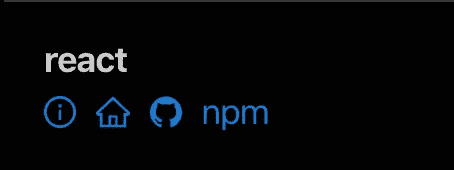
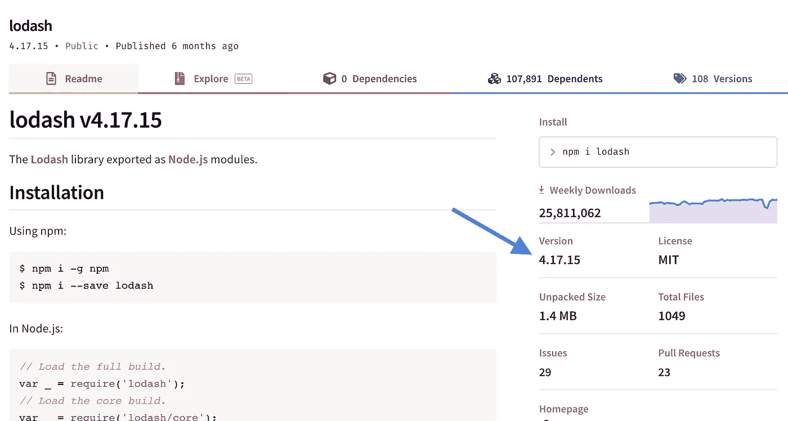
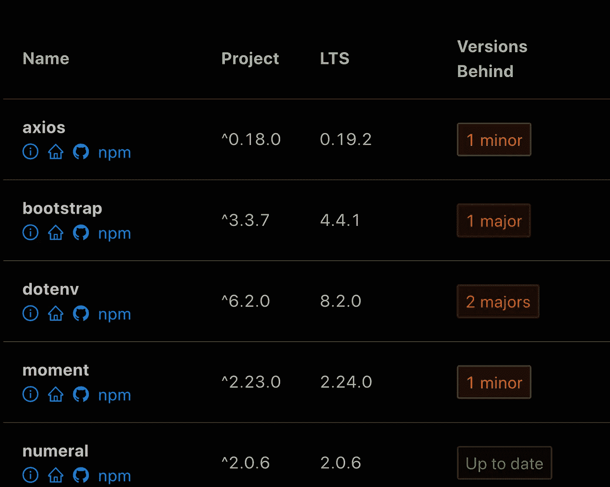
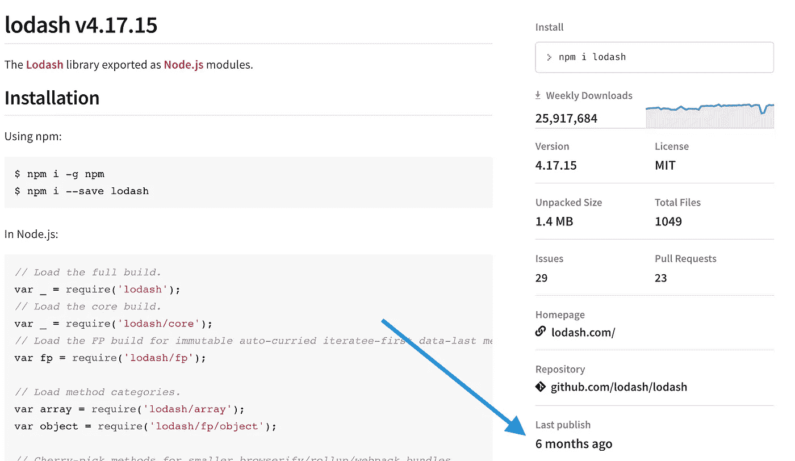

# 如何分析您的 NPM 依赖关系以获得更好、更易维护的代码

> 原文：<https://betterprogramming.pub/how-to-analyze-your-npm-dependencies-for-better-more-maintainable-code-f6867f8c39ac>

## 一个完整的，初学者友好的指南，以了解您的 npm 依赖关系的状态


图片来自[维基百科](https://en.wikipedia.org/wiki/Npm_(software))

在本指南中，我将带您了解我在评估我的 [npm](https://npmjs.org) 依赖项的状态时所考虑的事情——目的是改进我的软件，使其更易于维护。

# 为什么要看这个？

随着 JavaScript 生态系统的日益完善和复杂，对第三方 npm 依赖性的依赖也在增加。

过去，您可以依靠普通的 JS 或 jQuery 来处理应用程序的交互性。但是现在，像[这样强大的框架反应](https://reactjs.org/)、 [Vue](https://vuejs.org/) 等。以及与它们一起工作的无数惊人的库，使得利用开源解决方案来解决我们的技术问题变得非常有益。

npm 使得将这些第三方解决方案合并到我们的代码中变得很容易——如此容易以至于我们可以认为我们的 dep 是理所当然的，并且忘记它们不仅仅是我们一旦实现就可以停止担心的神奇的黑盒。

关于你的依赖，很多事情会发展——和转移——如果你不注意的话，这些依赖会回来咬你。

# 我为什么写这个

在许多情况下，我继承了一个遗留的代码库和/或被分配了更新代码库的依赖项的任务。除了检查 dep 后面有多少版本之外，我还深入挖掘以发现变化或潜在的问题，这需要大量的人工互联网研究。

为了在评估我的依赖项的当前健康状况时节省时间，我构建了一个名为 [DepChecker](https://depchecker.com/) 的简单工具，它可以自动收集关于`package.json`文件中的依赖项的信息并进行分析。它基本上完成了这个片段走过的部分。



# 好，我们来分析一些依赖关系

审计依赖关系的过程基本上就像一个嵌套的`for`循环。

```
for (let dependency of dependencies) { 
  const infoAboutDependency = [] for (let factor of factors) { 
    const info = gatherInfo(dependency, factor)
    infoAboutDependency.push(info) 
  }  makeAssessment(infoAboutDependency) 
}
```

有各种有用的因素可以揭示您的依赖关系的状态。我们将浏览的列表并不详尽，但它是我使用的一个列表，而且非常详尽。

## 要考虑的因素有:

1.  依赖是做什么的？
2.  您的项目中仍在使用依赖关系吗？
3.  你比当前版本落后多少个版本？
4.  上次更新依赖关系是什么时候？
5.  这个包每周下载多少次？
6.  它有多少颗 GitHub 星？
7.  有多少未解决的问题和拉式请求？
8.  项目的许可是什么？

## **对于每个因素，我将分解如下:**

*   到底**是什么**
*   **哪里**可以找到关于它的信息
*   如何评估和理解你找到的信息
*   **为什么**你应该关心

# 因素 1:依赖是做什么的？

首先，您需要理解您的依赖项是做什么的，以及它们在项目中的角色。在我的`package.json`中看到一个我不认识的依赖名，我肯定是有罪的。

## 在哪里可以找到相关信息

这是以下因素的组合:

*   npmjs.org 上的包页面(例如，[反应](https://www.npmjs.com/package/react)
*   GitHub 资源库(例如 [Express](https://github.com/expressjs/express) )
*   以及项目的网站/文档(如果有)(例如 [Vue.js](https://vuejs.org/) )

这应该足以理解它的目的。

手动搜索每个依赖项可能会很烦人，因此您可以使用像 [DepChecker](https://www.depchecker.com) 这样的工具，它可以为您快速收集描述和所有重要的链接。



## 如何评估信息

当开始依赖项审计时，阅读描述和要点可能就足够了。稍后，如果其他因素允许，您可以更深入地研究文档以更好地理解它，并帮助确定它在项目中的位置。

## 为什么你应该关心

即使不是为了依赖项管理/分析的目的，理解项目中的依赖项是什么，它们做什么，以及为什么项目使用它们总是最好的。否则，您可能会忽略旧的、未使用的或潜在危险的依赖项，这些依赖项只会给您的团队带来混乱和头痛。

# 因素 2:你的项目还在使用依赖吗？

在一个项目中安装并使用一个依赖项，然后由于各种原因移除它的所有使用，但仍然保留该依赖项，这是很常见的。这就是依赖管理的低挂果实。

## 在哪里可以找到相关信息

1.  具有讽刺意味的是，发现潜在未使用依赖的最简单方法是另一个开源 npm 工具，叫做 [depcheck](https://www.npmjs.com/package/depcheck) 。安装完成后，您可以运行一个简单的命令来获取它在您的项目中找不到的依赖项列表。
2.  对依赖项名称执行全局文本搜索，并查看它是否在任何地方被使用。
3.  有时候，像 Babel 插件这样奇怪的依赖项不会在你的项目中出现，但是它们仍然会被使用。因此，检查是否需要它的一种方法是移除它，并运行您的应用程序以及任何测试。

## 如何评估信息

对应于上面的编号点:

1.  小心点！depcheck 很牛逼，但不是 100%准确。在将其从您的`package.json`中删除之前，您应该验证一些其他内容。
2.  如果是导入的，代码中实际使用的是模块吗？如果没有，那么可能就不再需要了。
3.  如果测试通过，一切看起来都很好，那么可以合理地假设不再需要依赖了。

## 为什么你应该关心

*   未使用的依赖项只会给你的包增加死千字节，增加你的项目，增加加载时间
*   如果已经安装了依赖项，您的代码库的未来贡献者可能会认为使用依赖项是可以的，甚至是被鼓励的，这对于您的团队和您试图实现的代码实践来说可能不是理想的
*   一个未使用的依赖项仅仅存在于你的项目中，可能会引入编译/传输错误或安全漏洞

# 因素三:你落后最新发布多少版本？

所有 npm 包都有一个最新的稳定发布版本，而您的`package.json`指定了它当前使用的包的版本。因此，您的项目版本可以与最新版本相匹配，或者是它之前的某个版本。

## 在哪里可以找到相关信息

要找到 npm 包的最新发布版本，你可以去官方的[npmjs.org](https://depchecker.com/blog/analyze-project-deps/npmjs.org)页面，在右侧的细节中找到。



要找到你的项目版本，进入你的`package.json`，在`dependencies`或`devDependencies`的对象中找到包名键。项目版本将是该项的值。


使用像 [npm-check](https://www.npmjs.com/package/npm-check) 和 [DepChecker](https://www.depchecker.com) 这样的工具，你可以得到一个漂亮的、彩色编码的最新版本、你的版本以及你的版本落后多少的打印输出。



## 如何评估信息

绝大多数 npm 包版本控制将使用[SEM ver](https://semver.org/)格式，这使得很容易计算出你的项目版本落后多少，以及升级的潜在风险有多大。

*   **补丁(x . x . 0)**——这表示[“向后兼容的错误修复”](https://semver.org/)因此，如果你的版本只是补丁落后(就像上面截图中的 [Lodash](https://lodash.com/) 例子)，你可以非常安全地修改版本。
*   **MINOR (x.0.x)** —这表示“以向后兼容的方式”添加的新功能同样，只要测试全部通过，升级可能是安全的。
*   **MAJOR (0.x.x)** —这表示[“不兼容的 API 变更”](https://semver.org/)，需要深入研究变更日志、发行说明和其他文档，以便弄清楚进行`MAJOR`版本升级的含义。您可能需要通过`MAJOR`版本升级来做一些手工重构。

一般来说，升级你的项目的依赖版本是最安全的，有足够的测试覆盖率和 CI/CD 管道。像 Dependabot 这样的免费工具可以帮助你实现自动化。

## 为什么你应该关心

当谈到依赖管理时，这是最常想到的因素——这是有充分理由的。保持更新可以让您获得最新和最好的版本，并有助于避免与当前版本相差太远，以至于出现重大错误或升级成为一场噩梦。

# 因素 4:依赖关系最后一次更新是什么时候？

每当 npm 软件包有新版本时，都需要上传并发布到 npm 存储库。这种情况发生的最近时间称为*最后发布*。所以你可以说“React 的最后一次发布是在两周前。”

## 在哪里可以找到相关信息

您可以在软件包的 npm 页面上快速找到自上次发布以来已经过去了多长时间。



关于版本发布的确切日期的更多细节，您必须查看 GitHub 上的任何发布或者使用 npm repository API。

## 如何评估信息

一般来说，如果一个 npm 包不断被更新，并且有最近的最后发布日期，这是一个很好的迹象——它表明贡献者正在积极地参与并关心依赖关系。

另一方面，如果一个包已经有一年或更长时间没有更新了，这可能意味着这个包不再被维护和忽略了。

如何解释自上次发布以来的确切时间可能因包而异，这取决于其性质。例如，一个基本统计库可能不需要经常更新。尽管在 JavaScript 的现代时代，一段时间不更新可能会导致编译问题，或者容易受到其他依赖项的不兼容版本的攻击。

自从上一次发表以来，我脑海中有一些通用的主观经验法则:

*   不到两个月——很好
*   不到六个月——好吧
*   不到一年前—警告
*   一年多前—危险

## 为什么你应该关心

自上一次发布以来的时间是开源 npm 包受到关注的一个非常强有力的指标。

如果您的依赖项经常更新，这通常意味着您可以放心地继续使用它，并从未来的改进中受益。另一方面，一个被忽视的包威胁着你的代码库，在它给你的团队带来 bug 和问题之前，很可能需要被一个类似的依赖所取代。

# 因素五:包有多少周下载量？

每当有人安装了一个 npm 软件包，它就被算作一个下载。npm 跟踪这些下载，并提供所有软件包的每周下载量指标。

## 在哪里可以找到相关信息

在一个包的 npm 页面上很容易找到。你还可以看到一条趋势线。

## 如何评估信息

这个每周下载量指标显示了其他开发者使用依赖的程度。当然，下载并不 100%意味着开发者最终保持了依赖关系，但这仍然是一个有用的指标。

以下是我对每周下载量的主观经验:

*   超过 10 万——很好
*   低于 100，000 —罚款
*   小于 10，000 —小心
*   少于 1，000 —格外小心！做一些挖掘，为什么这个数字很低。是全新的吗？解决了一个超级小众的问题？

## 下载趋势也很有帮助

*   如果上升，这可能意味着低下载量是由于软件包年轻，但仍然有价值
*   如果下降，这可能意味着这个包有更好的选择，它被忽略，它不再被需要，等等。

除了 npmjs.org 网站上的微小趋势线，还有一个很酷的网站叫做 [npm 趋势](https://www.npmtrends.com/)，在那里你可以深入了解 npm 下载趋势。

## 为什么你应该关心

*   am npm 包的受欢迎程度对它的未来有很大的影响，因此也关系到你的软件的未来
*   当决定在您的项目中使用哪种 npm 包替代方案(例如 Angular vs. React vs. Vue)时，下载趋势可以告诉您社区认为什么是优/劣的
*   下降的趋势可以警告您一个垂死的依赖，并允许您在它对您的项目产生负面影响之前先发制人地移除或替换它

# 因素六:它有多少颗 GitHub 星？

绝大多数 npm 包仓库所在的 GitHub 上的项目都有一个星型系统，基本上就是人们可以如何喜欢一个项目。

## 在哪里可以找到相关信息

非常简单——只需到 GitHub 存储库中查找 npm 包，星号就在页面顶部。

## 如何评估信息

显然，一个回购的明星越多，就越受开发商的欢迎和喜爱。高星级通常表明项目运行良好，并以开发人员喜欢的方式服务于其声称的目的。

但是要小心！高星级数不足以表示同意使用/保持依赖，因为星级是随着时间积累的。这个项目可能有 20k 颗星，但是最后一颗星是一年前的，或者它已经被废弃了。

与每周下载量一样，趋势与当前的明星总数一样重要。有几个很酷的网站，像[明星历史](https://star-history.t9t.io/)和[这个](https://stars.przemeknowak.com/)，显示 GitHub-明星趋势线。

以下是我对 GitHub 明星的主观经验:

*   超过 1000—很好
*   少于 1000—罚款
*   小于 300 —小心
*   小于 50——格外小心！你应该在这方面做更多的尽职调查。

> 感谢 [npm 项目依赖关系](https://medium.com/u/91088a7bbe71#dependencies)
> 
> *   [npm 包版本](https://docs.npmjs.com/files/package.json#version)*   [官方版本控制文档](https://semver.org/)*   [国家预防机制对永远的挑战](https://docs.npmjs.com/about-semantic-versioning)