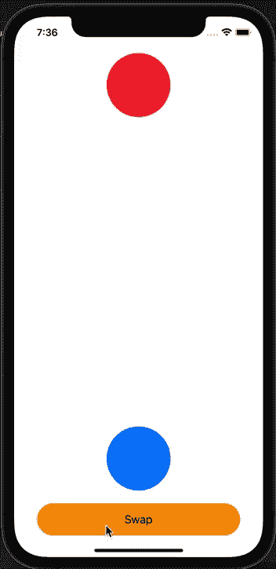

# 如何使用联合收割机在 MVVM 设置自动布局约束的动画

> 原文：<https://betterprogramming.pub/how-to-animate-autolayout-constraints-in-mvvm-with-combine-c78519d73e3b>

## 在您的 iOS 应用程序中轻松制作视图动画

[Raagesh C](https://unsplash.com/@raagesh?utm_source=medium&utm_medium=referral) 在 [Unsplash](https://unsplash.com?utm_source=medium&utm_medium=referral) 上拍摄的照片

在我上周的文章中，我们探索了如何使用 AutoLayout 编写应用程序的布局。

这项技术比操纵框架更具声明性。虽然比较冗长，但是我们可以很容易地创建一个小的[域特定语言(DSL)](https://www.jetbrains.com/mps/concepts/domain-specific-languages/) 来简化它。它还会自动为我们处理许多事情，这是一个非常好的优势。

本周，我把探索推进了一点。我想学习如何在 MVVM 应用程序中设置布局变化的动画。在与这项技术斗争了一段时间后，我达到了我的目标，我对它的优雅感到惊讶。

今天我想和大家分享我学到的东西。

# 目标

作为一个实际例子，我决定实现一个简单的屏幕，有两个圆形视图和一个按钮。这两个视图代表两个球:一个红色的球和一个蓝色的球。这个动作的按钮允许我们交换他们的位置。

目标是使动作动画化，以便两个球在屏幕上移动。

# 如何做

做这件事的理论很简单。首先，让我们定义我们需要的成分，并设置初始状态:

1.  定义**状态 A** 的布局(红色球在屏幕顶部，蓝色球在底部)。
2.  定义**状态 B** 的布局(蓝色球在屏幕顶部，红色球在底部)。
3.  设置**状态 A** 为初始状态。

然后，我们就可以实施行动了。点击按钮后，我们只需要:

1.  取消两个球的所有约束(我们可以保留不变量:宽度和高度约束)。
2.  激活最终布局(如果我们处于**状态 A** ，我们想激活**状态 B** ，反之亦然)。
3.  在`UIView.animate()`块内调用`self.layoutIfNeeded()`函数。

通过这些简单的步骤，我们将看到视图在你的眼睛下面活动。现在，让我们把理论转化为代码！

# ViewModel

我们小屏幕的视图模型如下:

如您所见，我们只有一个`Bool`来跟踪当前状态:无论`redBall`是否在屏幕的顶部。`Bool`是`@Published`，所以我们可以对它的变化做出反应。然后我们有一个小函数在`Bool`的两种状态之间移动。

**注意**:在一个复杂的应用程序中，bool 可以用一个代表应用程序状态的 enum 来代替。这种方法可以使基于当前状态激活正确的布局变得非常容易。

# 视角

这个视图与我的另一篇文章中的模式相同，所以我不会说太多细节。为了总结这种方法，我们必须:

1.  定义子视图。
2.  用`setup()`方法将它们添加到超级视图中。
3.  用一种`style()`方法来设计它们。
4.  用一种`setupConstraints()`的方法来布局它们。这里我们将定义视图初始状态的约束。
5.  用`setupBindings()`方法观察视图模型的变化。

动画逻辑由`setupBindings()`方法启动。当视图模型改变时，我们必须更新我们的布局，我们必须动画它。完成此任务的代码如下:

所有的逻辑都发生在`sink`方法的`receiveValue`闭包内:

1.  我们使当前的约束无效。
2.  我们激活最终状态的约束。
3.  我们将变化动画化。

# 使约束无效

要使约束无效，我们首先需要检索当前活动的约束。

经过一番调查，我发现:

*   绑定两个视图的约束由超级视图持有。
*   与单个视图相关的约束由视图本身持有。

因此，我们有以下内容:

*   约束`self.redBall.topAnchor.constraint(equalTo: self.safeAreaLayoutGuide.topAnchor`由`redBall`的主管持有；它连接`redBall`和超级视图。
*   约束`self.redBall.widthAnchor.constraint(equalToConstant: 100)`由`redBall`自身持有；它仅引用当前视图。

我创建了这个小函数来从`superview.constraints`属性中提取给定视图的所有约束:

**注意:**`constraints`属性只包含`active`约束。一旦我们将`isActive`属性设置为`false`，约束就会被数组清除。

# 激活最终状态

在这一步中，我们实现逻辑来决定最终状态。然后，我们必须激活与之相关的约束。在我们的例子中有两种状态:`redBall`可以在屏幕的顶部或底部。下面是展示视图的代码:

代码片段显示了两个函数，它们根据我们想要表示的状态激活正确的约束集。

没有复杂的决策逻辑，我们可以只在视图模型上写逻辑。

# 将变化制成动画

最后，我们使用标准的`UIView.animate`函数将这些变化制作成动画，如下所示:

看到动画闭包的主体是单个系统调用，我惊呆了！

**注:**我陷入的一个陷阱就是用`self.updateConstraints()`而不是用`self.layoutIfNeeded()`。前一个函数使用最终状态强制立即渲染。系统忽略了`animate`功能，导致从一种状态突然切换到另一种状态。

# 结论

在今天的文章中，我们在之前所学的[的基础上进行了构建。我们学习了如何使用](https://medium.com/nerd-for-tech/programmatic-autolayout-in-mvvm-a06cc9e52890)[有限状态机(FSM)](https://en.wikipedia.org/wiki/Finite-state_machine) 模型在 MVVM 架构中制作布局动画，其中机器的每个状态都可以映射到视图的特定布局。

你可以在[这个链接](https://gist.github.com/cipolleschi/a1251fbbfb82b7970bd4f1e3893b8b11)找到视图的完整代码。

总而言之，实现动画的步骤如下:

1.  取消激活当前约束。
2.  激活最后几个。
3.  调用`UIView.animate`动画块中的`self.layoutIfNeeded()`函数。

要取消激活当前的约束，我们必须知道约束存储在哪里。在本例中，我们必须在父节点的`constraints`属性中搜索它们。

另一种选择是为约束保留局部变量，这样我们可以很容易地激活和停用它们。在一个非常复杂的视图中，这可能比过滤所有可用的约束更容易和更有效。这种方法的缺点是它引入了一些需要维护的状态变量。

这是一个优化决策，需要具体情况具体分析。留意你的选择，选择能带来最好结果的那一个。