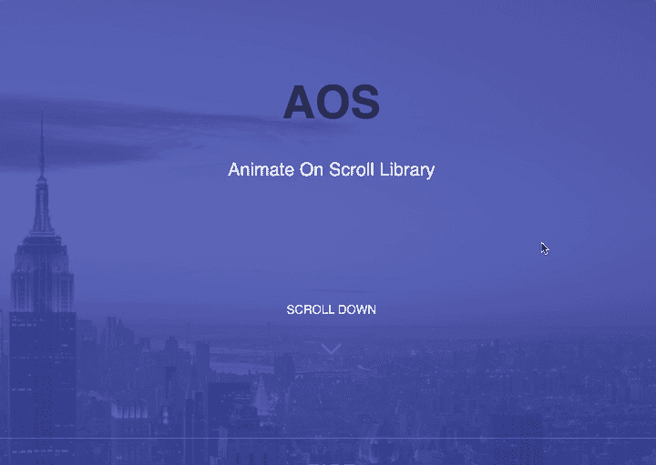
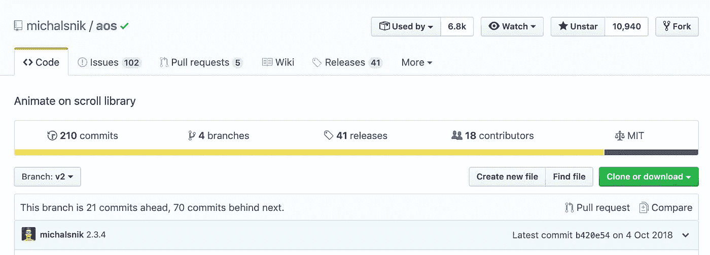

# 如何在滚动时使页面上的元素具有动画效果

> 原文：<https://betterprogramming.pub/how-to-animate-elements-on-your-page-as-you-scroll-22941134591d>

## AOS 是一个可以提供帮助的图书馆



滚动动画

[AOS](https://michalsnik.github.io/aos/) (滚动动画)允许你上下滚动时动画元素。如果您滚动回顶部，元素将动画显示到它们以前的状态，并且如果您向下滚动，元素将再次动画显示。



https://github.com/michalsnik/aos AOS Github 页面—

# 第一步:使用包管理器安装 AOS

您可以通过 [npm](https://www.npmjs.com/) 或 [Yarn](https://yarnpkg.com/lang/en/) 安装 AOS:

*   `yarn add aos@next`
*   或者`npm install --save aos@next`

接下来，导入脚本和样式并初始化 AOS:

```
import AOS from 'aos';
import 'aos/dist/aos.css'; // You can also use <link> for styles
// ..
AOS.init(); // init the library
```

`AOS`对象被公开为一个全局变量；目前，有三种方法可用:

*   `init` -初始化 AOS
*   `refresh` -重新计算所有元素的偏移量和位置(在调整窗口大小时称为
*   *`refreshHard` -用 AOS 元素重新初始化数组并触发`refresh`(调用与`aos`元素相关的 DOM 变化)*

*默认情况下，AOS 会观察 DOM 的变化，如果有任何新元素被异步加载，或者有东西从 DOM 中移除，它会自动调用`refreshHard`。*

*在不支持`MutationObserver`的浏览器中，比如 Internet Explorer，你可能需要自己调用`AOS.refreshHard()`。*

*为了开始使用 AOS，下面是我们需要采取的步骤。*

# *第二步:初始化 AOS*

*以下是您可以使用的所有配置选项:*

*使用`data-aos`属性设置动画:*

```
*<div data-aos="fade-in"></div>*
```

*并通过使用`data-aos-*`属性调整行为:*

```
*<div
    data-aos="fade-up"
    data-aos-offset="200"
    data-aos-delay="50"
    data-aos-duration="1000"
    data-aos-easing="ease-in-out"
    data-aos-mirror="true"
    data-aos-once="false"
    data-aos-anchor-placement="top-center"
  >
  </div>*
```

# *动画的类型*

*您可以选择将不同的动画和季节应用到您的元素中。以下是一些您可以使用的示例:*

*淡化动画:*

*   *乏味的*
*   *渐强*
*   *渐弱*

*翻转动画:*

*   *翻起*
*   *向下翻转*

*幻灯片动画:*

*   *滑升*
*   *滑下*

*缓解功能:*

*   *线性的*
*   *缓解*
*   *轻松进入*
*   *放松*

*[查看所有动画、广告和主播位置的完整列表](https://github.com/michalsnik/aos#animations):*

 *[## michalsnik/aos

### 对于最新稳定版本(v2 ),请点击此处👉为了更好地理解这实际上是如何工作的，我鼓励您查看…

github.com](https://github.com/michalsnik/aos#animations)* 

# *添加自定义动画*

*有时候内置动画是不够的。比方说，你需要一个盒子，根据不同的分辨率有不同的动画。你可以这样做:*

```
*[data-aos="new-animation"] {
  opacity: 0;
  transition-property: transform, opacity; &.aos-animate {
    opacity: 1;
  } @media screen and (min-width: 768px) {
    transform: translateX(100px); &.aos-animate {
      transform: translateX(0);
    }
  }
}*
```

*然后在 HTML 中使用它:*

```
*<div data-aos="new-animation"></div>*
```

*该元素将只在移动设备上显示不透明度，但从 768 像素宽度开始，它也将从右向左滑动。*

*也可以集成外部 CSS 动画库，比如 [Animate.css](https://daneden.github.io/animate.css/) :*

*使用`animatedClassName`来改变 AOS 的默认行为，以应用放置在 scroll 上`data-aos`内的类名。*

```
*<div data-aos="fadeInUp"></div>AOS.init({
  useClassNames: true,
  initClassName: false,
  animatedClassName: 'animated',
});*
```

# *资源*

*为了更好地理解滚动动画是如何工作的——[看看这篇文章](https://css-tricks.com/aos-css-driven-scroll-animation-library/)。*

*[](https://css-tricks.com/aos-css-driven-scroll-animation-library/) [## AOS: CSS 驱动的“滚动”动画库

### 以下是 Netguru 前端开发人员 michas ajnóg 的客座博文。Micha 创造了一个“当……

css-tricks.com](https://css-tricks.com/aos-css-driven-scroll-animation-library/) 

感谢您的阅读，祝您编码愉快！*