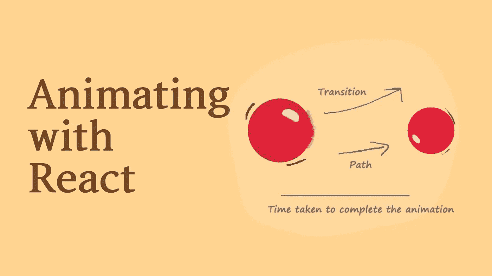
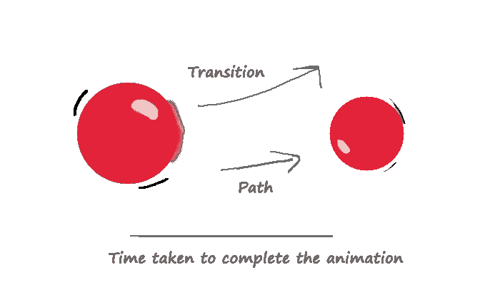

# 如何使用 React 制作 Web 应用程序动画

> 原文：<https://betterprogramming.pub/how-to-animate-web-apps-using-react-6323ddf1004f>

## 像 Flash 一样制作动画，但方式很酷



作者照片。

在今天的标准下，web 应用程序不仅需要速度快，看起来酷，还需要给人活着的感觉。后者很难管理好。随着 CSS 变得超级强大，新的想法和概念已经被引入(例如动画)，如果做得好，可以为用户提供难忘的体验。

CSS 中的动画是一种野兽，人们正在用它们做着惊人的事情。不相信我？看看这个由 [CSS 忍者安妮](https://twitter.com/anniebombanie_)建造的羊驼:

也许你的 web 应用程序不需要那么复杂，但是对 CSS 和动画有很好的理解对构建未来的 web 体验是至关重要的。

今天，我们将介绍一些顶级的 React 动画库。这将作为一系列文章的介绍，这些文章将集中在制作漂亮的网络产品上。

# 理解动画

CSS 中的动画是一段时间内属性的逐渐变化。



理解动画。作者照片。

CSS 带有内置动画，但是你可以用关键帧做更多的事情。当 CSS 属性被赋予不同的值时，关键帧允许您在过渡过程中设置时间点，使您可以自定义元素如何随时间演变。

# 传统 CSS 动画

动画的核心是 CSS，因此构建动画 React 应用程序的一种方式不是使用 JS 框架而是使用 CSS 就不足为奇了。

就像我们之前解释的那样，我们可以使用关键帧来定义 CSS 动画。让我们来看一个例子:

```
@keyframes ball-bounce {
    0%   { transform: translateY(0); }
    50%  { transform: translateY(-200px); }
    100% { transform: translateY(0); }
}
```

在此示例中，我们通过从-200px 的给定位置平移元素，然后返回到原始位置来创建反弹效果。

百分比表示值将在动画的哪个时刻达到期望值。你可能想知道为什么我们用百分比而不是秒或其他时间单位来定义它们。此时，我们只创建了一个动画，但是它仍然需要被应用——当我们将动画应用到一个元素时，我们提供它的持续时间，以及其他属性。这为您提供了更多的控制，因为您可以在不同的元素中以不同的持续时间重用动画。很酷，对吧？

说够了，让我们把这个动画应用到一个元素上。为此，我们利用了一些 CSS 属性:

*   `animation-name`:指我们的动画，必须与关键帧的名称相匹配。
*   `animation-duration`:定义动画持续的时间。
*   `animation-delay`:将动画的开始延迟一段指定的时间。
*   `animation-iteration-count`:指定动画发生的次数。指定 infinite 意味着动画永远不会结束。

你可以在 [W3Schools](https://www.w3schools.com/css/css3_animations.asp) 上阅读更多关于这些资产的信息。

让我们看看如何将我们的示例应用到一个元素:

很简单，对吧？让我们一起来看看它的实际效果:

# 反作用弹簧

虽然使用 CSS 的动画非常常见，但我们可以使用像 [React Spring](https://www.react-spring.io/) 这样的库来创建复杂的动画。React Spring 附带了非常强大的 transitions、Spring、trails，并支持 React Hooks 和 React JS 类组件。

当使用 JavaScript 构建动画时，框架和库通常会将动画的控制流委托给 JavaScript，同时使用 CSS 进行转换。

这有很大的优势，因为动画可以是动态的，通过简单地改变代码或用 JavaScript 的全部力量控制它就可以进化。然而，它也有一些缺点。

React Spring 是这种实现的完美例子，还有什么比用例子来解释它更好的方式呢？

该示例是我们使用 CSS 和关键帧构建的同一个动画，但这一次，我们使用 React Spring 和 JavaScript 来控制动画的流程。

我们首先用初始状态的 CSS 提供一个`from`属性，然后用最终值提供一个`to`属性。非常有趣的是，`to`状态可以是一个函数，在这样的函数中，我们可以构建多个步骤，或者有一个无限循环的动画(就像我们的例子)。

这种方法允许我们使用关键帧构建任何可能的动画，并利用 JavaScript 的强大功能来实现。

现在让我们看看完整的示例是什么样子的:

要在项目中使用 React Spring，只需运行:

```
npm i react-spring
```

并查看[正式文档](https://github.com/pmndrs/react-spring)。

# 框架运动

[成帧器动作](https://github.com/framer/motion)以非常相似的方式反作用于弹簧。事实上，React Spring 是基于帧运动的设计。但是，也有一些不同之处。Framer Motion 更喜欢使用声明性更强的方法来定义转场。一切都可以简单地通过调整动画对象的属性来完成。

让我们看看我们的例子，现在使用帧运动:

我们的动画对象需要两个属性:定义属性变化的动画和定义这些属性如何变化的转换对象。

真的就这么简单。让我们看看完整的示例是什么样子的:

要在项目中使用成帧器动作，只需运行:

```
npm i framer-motion
```

并检查[正式文件](https://github.com/framer/motion)。

# 结论

网络曾经很无聊，但现在网络应用程序是一种乐趣——而动画在其中扮演着至关重要的角色。如果做得好，它们可以增强用户体验。然而，不要滥用它们，因为这实际上会伤害 UX。

由于动画的重要性，React 需要可靠的解决方案来使 web 应用程序保持在趋势的顶端。在这篇文章中，我们列出了一些方法，可以让你的应用程序通过动画组件脱颖而出。

我今天唯一的目的是介绍这个主题和一些方法，希望能点燃你的好奇心，了解更多，并建立你自己的动画。

感谢阅读！