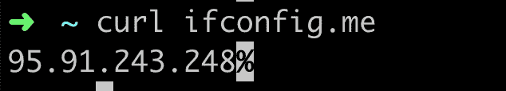
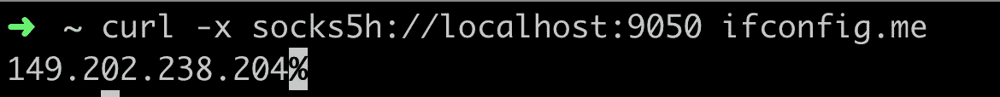

# 如何使用 Tor 匿名化 Node.js 应用程序

> 原文：<https://betterprogramming.pub/how-to-anonymize-node-js-applications-using-tor-bc233356b163>

## 屏蔽 Node.js 代码中的 HTTP 请求


由[卡洛斯](https://unsplash.com/@folkcarlos)在 [Unsplash](https://unsplash.com/photos/q0_WOuphEKM) 上拍摄的照片

像每个开发人员一样，我发现自己编写了许多脚本、机器人和 cron 作业，它们经常攻击某些服务器。有时候，我需要这些脚本出现在随机的远程位置。有时我想测试我的新 bot 保护的行为，或者从国外查看我的网站或应用程序，或者访问从我所在的国家无法访问的网站(我以前住在土耳其)，或者只是掩盖我在网上的身份。为了无缝可靠地实现这一点，我需要一个值得信赖的匿名 VPN 或代理。

我建立了自己的 VPN，对于我的一些用例来说，这是一个很好的解决方案。但是改变 VPN 的位置很复杂，它不是匿名的，并且当我不积极使用它时，它很昂贵。经过一些思考和研究，我意识到 Tor 对我的大多数用例来说是完美的。可靠，匿名，免费！

在本文中，我将解释如何建立自己的代码来运行 Tor 并免费使用它的优势。我们先来了解一下 Tor 是什么。

# Tor 是什么？

Tor，或以前被称为“洋葱路由器”，是一种在互联网上实现免费匿名通信的服务。它通过免费的、世界范围的、志愿者操作的中继来引导互联网流量，以掩盖请求的来源。Tor 项目旨在帮助人们保护自己免受进行流量分析或网络监控的公司、政府或个人的攻击。

他们还开发了 [Tor 浏览器](https://www.torproject.org/download/)来代替你日常使用的常用浏览器。例如，如果你担心像脸书和谷歌这样的公司如何监控你的一举一动，向你展示相关的广告，你可能想看看 tor 浏览器。它像任何其他互联网浏览器一样工作，增加了一些功能和选项来增加匿名性。它使用 Tor 的网络来隐藏你是谁以及你在网上做什么。这就是为什么它也是最受欢迎的访问互联网隐藏部分的方式，通常被称为[深层网络](https://en.wikipedia.org/wiki/Deep_web)。根据 [Tor Metrics](https://metrics.torproject.org/userstats-relay-country.html) ，每天大约有两百万人使用 Tor 浏览器。

关于 Tor 特别有趣的是，建立一个本地 Tor 代理，并通过它来引导我们所有的流量是多么容易。也是完全免费的。

# 设置 Tor 代理

最稳定的方法是自己运行 Tor 代理，并通过它重定向 Node.js 请求。建立自己的代理听起来很复杂，但很容易。我将解释一种简单的方法和一种不那么简单的方法。两者都相对简单，所以请多包涵。

通常，当你像安装代理一样安装软件时，根据你运行的操作系统的不同，过程会有所不同。在 Mac 服务器上安装和配置与在 Linux 服务器上不同，所以两者都需要重复的工作。这就是我所说的*不那么容易的方式*，稍后会解释。现在，我们来解释一下跨平台的方式。

## 休闲小站

如上所述，简单的方法是使用 [Docker](https://www.docker.com/get-started) 跨平台安装和配置 Tor。Docker 是一个容器化的解决方案，可以让你在一个类似虚拟机的环境中运行你的软件，使其免受外部干扰。它还允许您在托管环境中运行您的软件，这样您就可以可靠而轻松地跨平台运行它。

如果您还没有 Docker，请在此为您的操作系统[安装正确的社区版。安装并启动之后，我们将在机器上运行 Docker 版本的 Tor 代理。幸运的是，有人花时间在 Docker 容器中设置了它，并对它进行了开源。我们只需要运行他们发布的图像。在您喜欢的 shell/终端上运行以下命令:](https://docs.docker.com/v17.09/engine/installation/)

```
docker run -it -p 9050:9050 -d dperson/torproxy
```

这个命令从公共 Docker Hub 下载`dperson/torproxy`映像，并在您的 Docker 设置上本地运行它。它还在端口`9050`上公开了这个代理，因此您可以通过这个端口将您的脚本连接到代理。

## 没那么容易

如果您已经在上一步中设置了 Tor，您可以跳过这一步。我将解释如何在不使用 Docker 的情况下实现它。

要在不使用 Docker 的情况下设置 Tor，我们需要手动安装。

## 对于 Ubuntu/Debian

要在 Ubuntu/Debian 上安装 Tor，我们需要更新`apt`的源码列表，然后用`apt`安装 Tor。根据您使用的操作系统版本的不同，会有细微的差别。Tor Project 已经有了一个文档，其中包含了基于您的操作系统运行所需的步骤和确切代码。与其在这里重复这些信息，我建议你在这里看一下[他们的文档。](https://2019.www.torproject.org/docs/debian.html.en)

## 为了麦克·OSX

与 Linux 发行版相比，这对于 OSX 来说更容易。Mac 有两个流行的包管理器，Homebrew 和 Macports。如果你还没有安装它们中的一个。如果你不知道该选哪个，我可以推荐家酿啤酒，因为我对它很满意:

*   [自制](https://brew.sh/)
*   [Macports](https://www.macports.org/install.php)

根据您选择安装的软件包管理器，运行:

```
brew install tor
```

或者

```
sudo port install tor
```

## 无停靠站运行 Tor

幸运的是，这部分非常简单。只需运行:

```
tor
```

或者，在后台运行它:

```
tor &
```

这个命令启动 Tor 代理，并通过端口`9050`公开它。

# 测试我们的 Tor 连接

现在我们已经有了自己的 Tor 入口点，让我们测试一下它是否做了我们想要它做的事情。一个简单的方法是通过 Tor 向一个网站发出 HTTP 请求，看看他们认为我们的 IP 地址是什么。您可以使用任何 HTTP 客户端，例如`curl`、`httpie`或`wget`，并向任何“我的 IP 地址解决方案是什么”发出请求下面是我调用的一个示例命令和结果:



(德国柏林)

现在让我们使用本地 Tor Socks5 代理来处理相同的请求:



(法国鲁贝)

ifconfig.me(或任何我通过 Tor 访问的网站)现在认为我在法国，即使我在德国。

也可以选择你想出现的国家。只需向 Docker 命令提供带有 ISO 国家代码的`-l`选项，Tor 就应该使用该国家的出口节点。示例:

```
docker run -it -p 9050:9050 -d dperson/torproxy -l "US"
```

请记住，由于其复杂的性质，Tor 对于可靠的网飞或类似的流媒体体验来说可能太慢了。不鼓励将它用于这些目的。

# 将 Node.js 脚本连接到 Tor

下一步是配置我们的代码，这样从 Node.js 代码生成的所有请求都将通过这个代理。大多数 HTTP 客户端允许您指定要使用的代理或 HTTP 代理。您可以在脚本中使用的一个流行的 Socks 代理是 [socks-proxy-agent](https://www.npmjs.com/package/socks-proxy-agent) 。下面是一个使用 Node 内置 HTTP 客户端`https`的实现:

下面是另一个示例实现，这次使用流行的 JavaScript HTTP 客户端库， [Axios](https://github.com/axios/axios) :

# 最后的话

恭喜——你的脚本变得更加难以追踪和识别了。明智地使用这种能力！

请告诉我您对本文的看法，以及您的哪些应用程序可以从这种方法中受益。

# 资源

*   Tor Proxy Docker Image(T1)
*   Tor 安装手册(T3)

[奥赞·通卡(Ozan Tunca)](https://ozantunca.org)