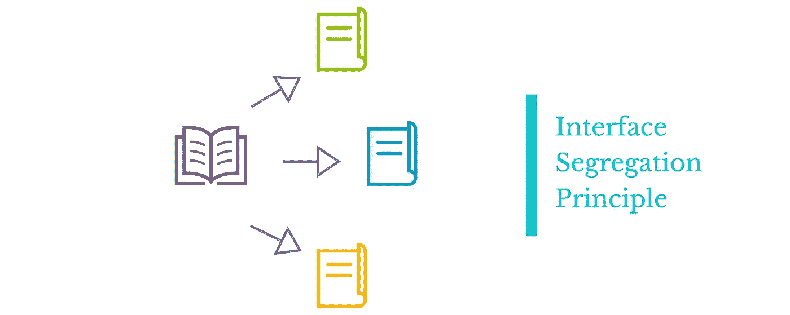

# 如何在反应堆中应用界面分离原理

> 原文：<https://betterprogramming.pub/how-to-apply-interface-segregation-principle-in-reactjs-fadf77113c5d>

## 行动中的坚实原则

照片由来自 [Pexels](https://www.pexels.com/photo/black-and-white-classic-camera-2686903/?utm_content=attributionCopyText&utm_medium=referral&utm_source=pexels) 的[布鲁诺·塞尔韦拉](https://www.pexels.com/@bruzewalker?utm_content=attributionCopyText&utm_medium=referral&utm_source=pexels)拍摄

SOLID 是一组不特定于任何框架或语言的原则。这些原则帮助我们理解如何为客户编写漂亮的应用程序。

今天我们将讨论固体的第四个原理:

> **I:** *界面偏析原理*

我们将尝试理解这个原则的基本概念，并在 **ReactJS** 的上下文中实现它。

## 本系列的前几篇文章

1.  [单一责任原则](/how-to-apply-solid-principles-to-clean-your-code-in-react-cdfd5e0a9cea)
2.  [开启关闭原理](/applying-the-open-closed-principle-to-write-clean-react-components-4e4514963e40)
3.  [利斯科夫替代原理](/applying-the-liskov-substitution-principle-in-react-3a0614a42a08)
4.  [依存倒置原则](/apply-the-dependency-inversion-principle-in-react-c20a0afc3d64)

# 这个原理是什么？

根据[叠加](https://stackify.com/interface-segregation-principle/)中的**界面偏析原理**所述

> 不应该强迫客户端依赖他们不使用的接口

在 ReactJS **中我们不使用任何接口**，至少不是在面向对象编程的意义上。因此，这个场景的主要要点是:

> 组件不应该依赖于它们不需要的东西。

现在，让我们看看这个原则如何帮助我们编写干净漂亮的 ReactJS 组件。

# 实用的方法

假设我们有一个负责显示用户详细信息的`**User**`组件。我们的用户对象看起来像这样:

user.ts

然而，它使用了两个子组件，名为`PersonalDetails`和`BankingDetails`来显示细节。

我们的`User`组件看起来像这样:

同样我们的`PersonalDetails`看起来是这样的:

个人详细信息

我们的 BankingDetails.js 是这样的:

BankingDetails.js

那么，这种方法有什么问题呢？嗯，两件事。

首先，我们的`PersonalDetails`组件不需要银行信息，我们的`BankingDetails`组件也不需要个人信息来运行，所以这显然违反了接口分离原则。

其次，在将来，如果我们想在我们的项目中添加 typescript(你应该这样做)，然后测试`PersonalDetails`，你将被要求模拟整个用户对象，尽管银行信息与`PersonalDetails`无关。

所以，我们需要解决这个问题。但是怎么做呢？

# 让我们解决这个问题

有几种方法可以解决这个问题，但基本原理是相同的。

> 我们只需要将相关信息传递给子组件。

因此，我们将分解我们的数据对象，并将适当的部分仅传递给相应的组件。

图片鸣谢:[https://medium . com/@ learn stuf . io/interface-segregation-principle-DD 885 e 59 AEC 9](https://medium.com/@learnstuff.io/interface-segregation-principle-dd885e59aec9)

大概是这样的:

User.js

我们用新的键`personalDetails`和`bankingDetails`将用户数据分成两部分，并将这部分特定的数据传递给我们的子组件。

# 第二种方法

前面的解决方案很完美，但是如果你对数据没有控制权呢？也许是从一个遥远的地方拿来的。或者因为某种原因不想修改数据结构怎么办？

别担心。我们可以应用另一种技术来解决这个问题:

User.js

在我们的子组件中，我们可以如下使用它:

个人详细信息

并且:

BankingDetails.js

现在我们的子组件只得到它们需要的东西。它们更干净，更容易理解。

现在我们的组件不依赖于任何他们不需要的东西。

# 棺材上的最后一颗钉子

至此，我们引入了**接口分离原则**的概念，以使我们的组件紧密。但是在我们之前的[文章](/applying-the-liskov-substitution-principle-in-react-3a0614a42a08)中，关于 **Liskov 替换原则，**我们发现我们当前的解决方案有一个问题，那就是任何东西都可以传递给子组件。

让我们在项目中引入 typescript 并解决这个问题。

同样，我们可以对`BankingDetails`组件做同样的事情。

现在我们被迫只将相关数据传递给子组件。不再有你不想要的 bug！

多棒啊。:D

# 最后的想法

这些只是指导你思考方式的原则，而不是构建你的应用的硬性规则。

这些概念的知识会让你领先于他人。这些概念一定会帮助你理解编程的核心原则。

> 因为框架是暂时的，但概念是永久的

我希望你喜欢这篇文章，就像我喜欢写它一样。祝您愉快！

**有话要说？通过**[**LinkedIn**与我联系](https://www.linkedin.com/in/56faisal/)

## 资源

*   stackify:**[https://stackify.com/interface-segregation-principle/](https://stackify.com/interface-segregation-principle/)**