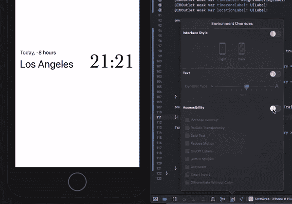
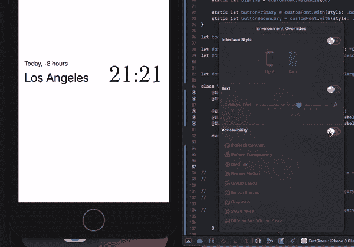

# 如何在 iOS 中对自定字体应用适当的字体缩放

> 原文：<https://betterprogramming.pub/how-to-apply-proper-font-scaling-to-custom-fonts-in-ios-136e11fe2f7c>

## 确保你的字体风格不会出现在你应用程序的代码库中


照片由 [Natalia Y](https://unsplash.com/@foxfox?utm_source=medium&utm_medium=referral) 在 [Unsplash](https://unsplash.com?utm_source=medium&utm_medium=referral) 上拍摄。

*注意:关于 iOS 中文本内容大小分类的背景信息和基础知识，* [*查看本文*](https://medium.com/better-programming/proper-font-scaling-matters-for-your-users-515b1b878606) *。*

iOS APIs 在帮助您缩放文本方面做得很好，确保了用户更好的可访问性。使用`UIFont.TextStyle`和`UITraitCollection`可以帮助你创造一个灵活和可扩展的体验。但是，如果您想使用自定义字体而不是默认字体，同时又保持灵活性，该怎么办呢？

将字体和文本风格结合在一起的魔力可以在`UIFontMetrics`中找到。给定一种字体，它可以告诉我们更多关于字体对于某种文本样式应该具有的磅值。这将有助于我们根据自定义字体在布局中的作用来适当地缩放它:

这基本上就是在保持适当缩放的同时使用你自己的字体的全部内容。只要确保使用合适的文本样式。

当然，要做到这一点还有更多的事情要做。首先，你可能不想让字体配置像那样分散在你的应用程序中。
此外，iOS 提供的辅助功能之一是强制字体加粗，以提高可读性。如果你使用系统字体，你不需要做任何额外的工作。不幸的是，即使您使用的自定义字体系列包含粗体版本，这些信息也不会自动使用。

# 收集您的字体样式

把你用过的字体风格集中在一个地方是一个好主意，这样可以保持你的代码库整洁，并使以后改变风格更加简单。
为了实现这一点，让我们更容易地将我们的字体转换成符合所需测试风格的字体:

这使我们能够获取我们的自定义字体，并确保它的规模适当。`basePointSize`是当`preferredContentSizeCategory`设置为`.medium`时字体应该具有的大小。有一些方便的常数可用。可选地，您可以设置`maxPointSize`来限制我们的界面还没有完全准备好的地方的缩放。

接下来，我们将定义应用程序中使用的字体样式列表，如下所示:

如果我们想使用这种字体，我们可以简单地调用其中的任何一种，这取决于我们的具体愿望:

# 修复粗体文本系统首选项

只要你使用`UIFont.preferredFont(forTextStyle: <style>)`或者类似于`UIFont.systemFont(ofSize: 15)`的东西，系统在大多数时候都会正确地将字体变为粗体——大多数时候是因为默认行为似乎也不完全正确。反复启用和禁用粗体文本功能会导致一些非常奇怪的行为:



请注意，每次开关一按，“洛杉矶”就会变得越来越粗。它上面的整个标签看起来像预期的那样工作。顶部标签的文本样式为“body”，而底部标签的文本样式为“largeTitle”。此外，我们的自定义字体根本不响应这些变化。

根据文本样式，标签可能不会按预期方式运行。似乎当更改粗体文本属性时，字体粗细会增加而不是减少。

我们可以同时解决这两个问题。这不是很好，但是通过子类化`UILabel`类，我们可以跟踪原始字体并监听配置的`legibilityWeight`中的变化:

现在，以编程方式设置字体后，切换配置对默认字体和自定义字体都起作用，如预期的那样:



# 额外小费

如果您想以编程方式处理设置特性，您可以为一个`childViewController`覆盖它们:

```
let trait = UITraitCollection(legibilityWeight: .bold)
setOverrideTraitCollection(trait, forChild: childVC)
```

注意，这对当前的`UIViewController`或`UIView`实例不起作用。只能给孩子设置。

就是这样。感谢大家的阅读和快乐编码！