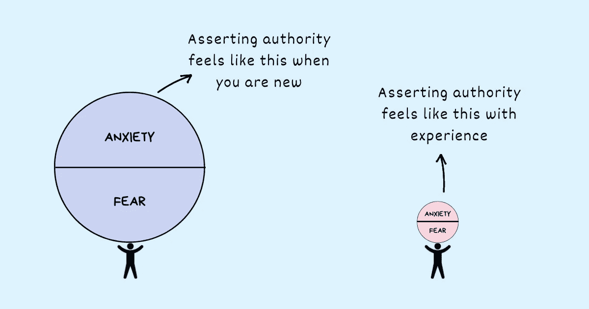

# 作为一名年轻经理，如何树立权威

> 原文：<https://betterprogramming.pub/how-to-assert-authority-as-a-young-manager-617b167be0>

## 这不是在坦率和善良之间的选择

鸣谢:作者

如果你最近刚从个人贡献者转变为经理，有些不舒服是正常的。如果你有更年长的人或更有经验的人向你汇报，会进一步加剧这种不适。

你关心的问题——我如何给我的团队分配任务，我如何提出问题，我如何提出建议，我如何指出错误，我如何让我的团队做出承诺并遵守期限——都是有效的。你想把事情做好，不想被误判或被认为是不必要地行使管理者权力的人。

你的两个目标——讨人喜欢和实现商业目标——可能经常会发生冲突。

*   你想给人留下对他们很好的印象，但当他们不断犯错时，你怎么能做到呢？
*   你想掌握信息，但又害怕做得太多，给人留下微观管理者的印象。
*   你想让人们负起责任，但又担心他们可能会感到被冒犯，并产生误解。

让你的不舒服阻碍你的决定，阻止你给出你的想法和建议，犹豫设定方向和指导你的团队，或者担心它可能如何到达其他人那里而推迟反馈，这不仅会让你作为管理者变得无效，还会伤害你的团队的生产力和表现。

你最大的问题是——你认为你必须在坦诚和善良之间做出选择，或者像凯瑞·帕特森在他的书《关键对话》中所说的那样，“在说真话和保持友谊之间做出选择。”

更倾向于仁慈会阻止你说出你的真相，而没有一丝关心的直接和直率会变成傲慢。作为一名年轻的经理，要维护自己的权威，关键在于魔力。

# 年轻经理维护权威的做法

## 亲自关心，直接挑战

《激进的坦诚》一书的作者金·斯科特指出了两个维度，当这两个维度结合在一起时，会给年轻经理带来巨大的帮助。

第一个维度是个人关怀——这是对你的人作为人的真诚关怀。

第二个维度是直接挑战——它包括告诉人们他们的工作不够好，高标准，除了优秀别无所求。

挑战似乎与个人关怀直接冲突。事实并非如此。相反，直接挑战通常是表明你作为一名经理在乎的最好方式。表现出你的关心会让他们更容易接受你的批评——这变成了改进的路线图。

直接挑战，而不是绩效目标——这是针对一个特定的结果，并要求他们证明自己的能力——设定学习目标——这使他们更关心他们正在学习什么以及他们如何改进。

将他们的时间和精力从证明自己的能力转移到培养技能和能力上会自动激励他们做得更好。他们会被激励着全力以赴。如果他们真的失败了，做得不好的失望只会激发他们更加努力工作、尝试不同的策略或寻求帮助的动力。学习目标将导致[成长心态](https://www.techtello.com/fixed-mindset-vs-growth-mindset/)——从有限的智力到无限的潜力的思维转变。

作为一个年轻的管理者，不要在亲自关心和直接挑战之间选择。双管齐下。

## 不要命令和控制，要激励

年轻的经理经常误解权威。他们假定自己的角色是发号施令、做决定、避免错误，并利用自己的权力去做任何能取得结果的事情。

结果是重要的，但是没有命令和控制的方式也能实现。不要指定某件事必须如何做，而是给你的团队必要的背景和清晰，让他们自己掌握如何做。

> "最好的结果来自激励人们去行动，而不是告诉他们该做什么."—朱莉·卓

不要干涉每一个小决定。这显示了不安全感和缺乏信任。蔻驰，指导、激励和教育你的团队做出自己的决定。以这种方式授权给你的团队不仅会让你得到更多的尊重，而且从长远来看也会带来更好的结果。

错误不可避免。不要试图回避他们。相反，把它们作为学习的课程来激励你的团队在未来做得更好。

不管你多么想做团队的工作，都不要做。仅仅因为你害怕沟通和设定正确的期望而自己去做工作，会限制你的团队的成长和你能实现的集体成果。走出你的舒适区，面对你的恐惧，找出团队中最适合做这份工作或者在职业生涯中需要这个机会的人。[给他们你的信任](https://www.techtello.com/leading-with-trust/)和支持。你会惊奇地发现一点信任和支持对他们迎接这些挑战大有帮助。

正如玛娅·安杰洛的一句流行谚语所说的那样—

> “人们会忘记你说过的话，会忘记你做过的事，但人们永远不会忘记你带给他们的感受。”

让你的员工感受到鼓舞，而不是被控制和削弱。

## 多练习好奇心，少做判断

当事情没有进展或者别人没有达到你的期望时，不要传递判断，而是表达好奇。

例如:

你怎么能错过截止日期呢？

**提问:**您对交付该产品的时间表的理解是否有差距？你遇到了什么困难？

**而不是:**你的代码质量真的很差。

**提问:**你知道我们团队遵循的代码质量标准吗？你需要帮助学习如何写更好的代码吗？

**而不是:**你开会迟到了。你为什么不能准时来？

**问:**你开会迟到了。一切都好吗？

判断让对方处于守势。他们感觉受到了攻击，并以同样的方式回应。表达好奇心可以让他们参与和讨论。这将他们的注意力从问题转移到解决方案上。不再去想这件事会如何影响他们，会让他们更容易继续前进。

> “只有当对方觉得自己被倾听和理解时，你才能让谈话朝着更积极的方向发展。除非你已经听了，否则他们不会感到被倾听和理解。当对方变得高度情绪化时，倾听并承认。当他们说他们的故事版本是唯一有意义的版本时，解释你所听到的，并问他们一些问题，为什么他们会这样想。如果他们指责你，在为自己辩护之前，试着理解他们的观点。每当你感到不知所措或不确定如何继续时，记住这永远是倾听的好时机。”道格拉斯·斯通

作为一名年轻的经理，表现出好奇心、[专心倾听](https://www.techtello.com/effective-listening-makes-better-leaders/)以及以表明你站在他们一边的方式一起工作的能力会建立信任——这是完成任何事情的关键基础。

## 请求支持

当你刚开始担任新经理时，很难不犯错误。你还没有掌握做好你的角色所需的技能。你还没有机会区分好的和坏的决定。你不知道什么样的沟通方式适合你的团队。你还没有完全理解你的团队的优势和抱负。你没有经历过重大冲突。你没有经历过利益相关者会议的激烈程度。

我可以滔滔不绝地讲述那些尚未完成的事情。但我们不要把注意力放在那上面。因为关键在于:随着经验的积累，一切都会变得更好。试图隐藏你的错误或者努力避免错误只会导致焦虑和沮丧。它还会让你从“做好并取得成功”的目标脱轨到“掩盖并限制曝光”。

不要试图变得完美，要承认你还不知道所有的事情。表现出脆弱性，以掌握做好你的角色所需的行为和态度。

> “脆弱不是弱点，我们每天面临的不确定性、风险和情感暴露都不是可有可无的。我们唯一的选择是订婚的问题。我们愿意承认和面对自己的弱点，这决定了我们勇气的深度和目标的明确性；我们保护自己免受伤害的程度是衡量我们恐惧和孤立的标准。”—布伦·布朗

最重要的是，当你踏上旅程时，要记住这一点:你不能独自完成。和你的团队谈谈你面临的挑战，征求他们对你的反馈，并表明你想学习和做得更好的意愿。你的团队会欣赏你的真实性。他们会看到你在努力。

作为一名年轻经理，树立权威并不是让人们按照你想要的方式做事。这是关于与共同的目标保持一致，定义成功，提供背景和清晰度，授权他们做出决定，并给他们需要的空间来发光。

# 摘要

1.  当你刚开始做经理时，担心别人如何看待你的沟通可能是你有效完成工作的最大障碍。
2.  你可能试图避免冲突，发现很难分享建设性的批评或阻止自己设定期望。
3.  有些不适是你工作的一部分。它伴随着作为管理者的角色和责任。然而，你需要学会不要让它妨碍你的决定或者你如何与你的团队沟通。
4.  对你的员工表现出真诚的关心，但是不要让这种关心妨碍了对他们的高标准要求。你可以善良，但仍期待卓越。
5.  当你不在的时候，不要做把团队团结在一起并把事情做好的人，而要做让团队做得同样好的人。
6.  不要让你的团队受制于你的观点、假设和判断。他们很容易传球，破坏你球队的士气。取而代之的是，通过提问和认真倾听来表现出理解的好奇心。
7.  承认你还有很长的路要走。向周围的人寻求支持。

关注我这里和 Twitter 上的更多故事。

*这个故事最初发表于*[*【https://www.techtello.com】*](https://www.techtello.com/how-to-assert-authority-as-a-manager/)*。*