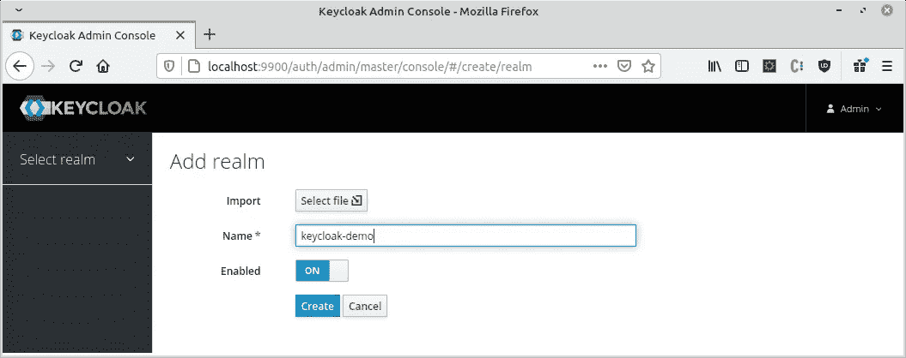
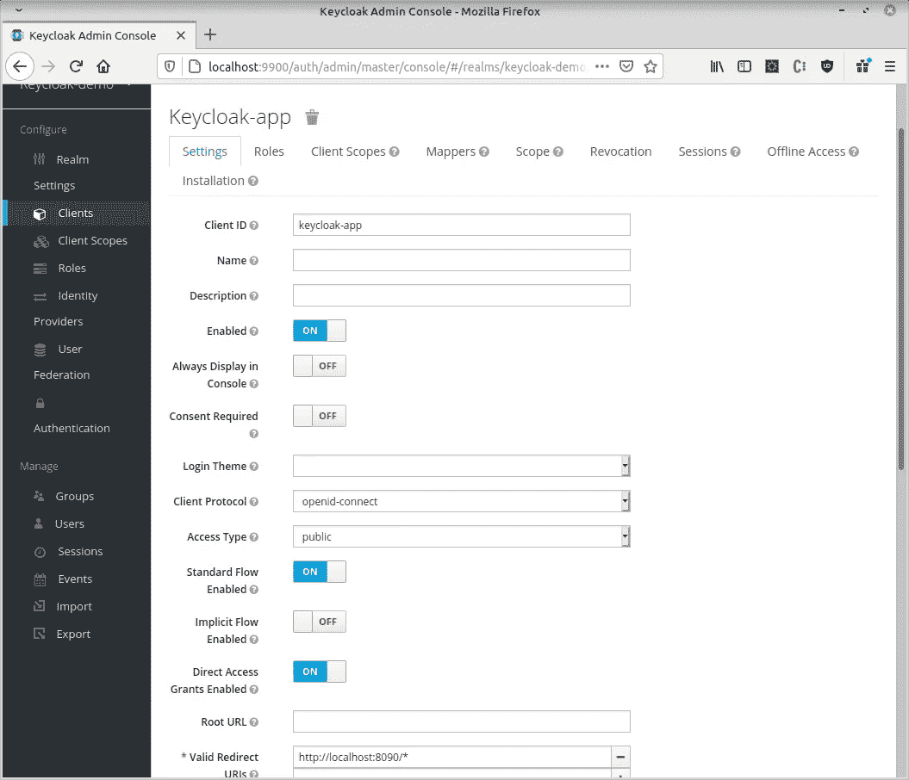
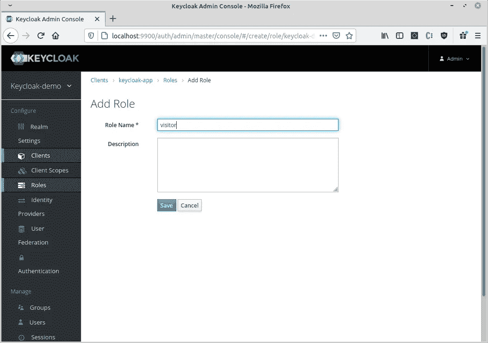
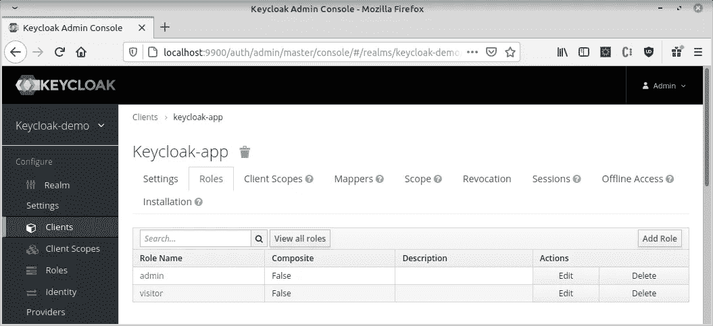
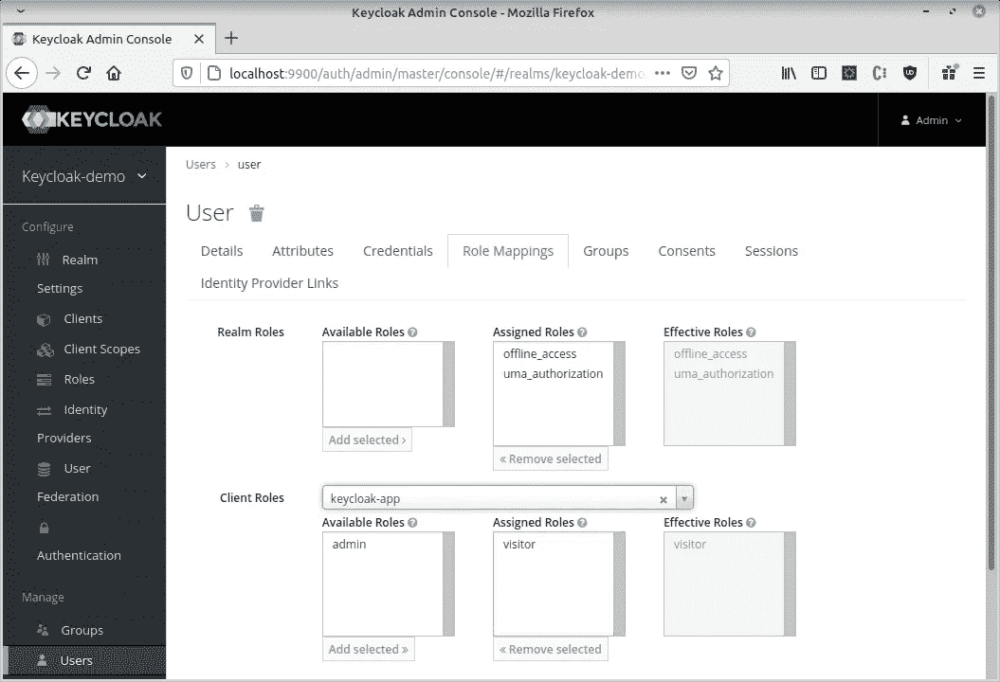
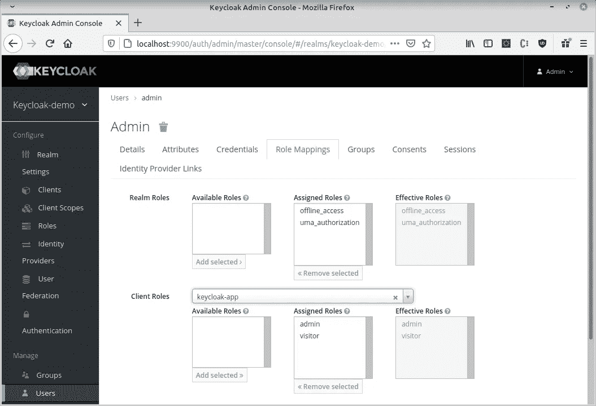
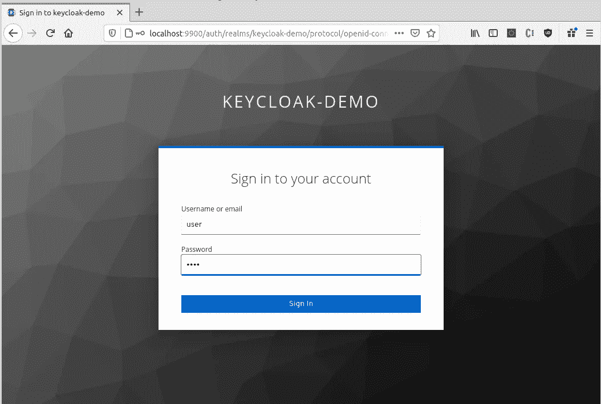
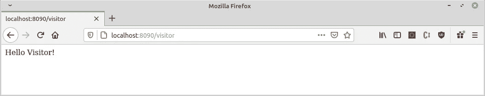
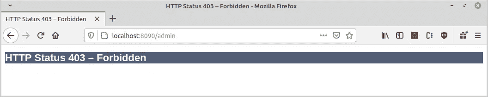
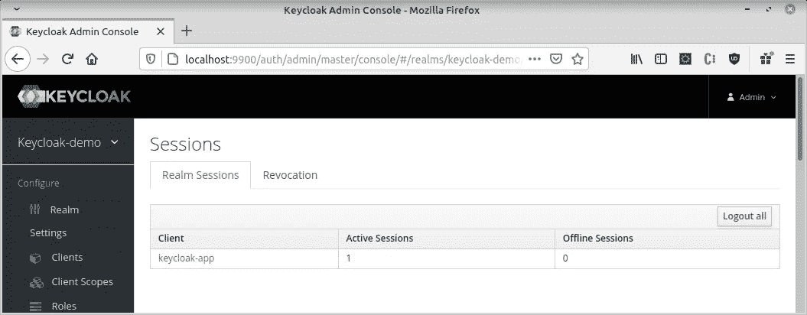

# 如何使用 Keycloak 验证您的 Spring Boot 应用程序

> 原文：<https://betterprogramming.pub/how-to-authenticate-your-spring-boot-application-with-keycloak-1e9ccb5f2478>

## 关于设置 Keycloak 以保护 Spring Boot 应用程序的详细演练


[亚历杭德罗·埃斯卡米拉](https://unsplash.com/@alejandroescamilla?utm_source=medium&utm_medium=referral)在 [Unsplash](https://unsplash.com?utm_source=medium&utm_medium=referral) 拍摄的照片

[Keycloak](https://www.keycloak.org/about) 是由 RedHat 社区开发的开源产品，为现代应用程序提供身份和访问管理解决方案。它几乎不需要任何代码来保护您的应用程序和服务。

您将从本教程中学到什么:

*   Keycloak 的主要概念和优势
*   如何使用 Keycloak 保护 Spring Boot 应用程序

我计划创建本教程的第二部分，其中我们将介绍 Spring Security 和第三方社交媒体身份提供商，如 Google、GitHub 等。

我们开始吧！

# 钥匙锁概述

Keycloak 的主要好处是它提供了一个**单点登录** ( **SSO** )，这使得用户更容易访问不同的应用程序。对于用户和开发人员来说，这都是一种友好的方法。

作为开发人员，您不必担心实现登录表单或在数据库中存储凭据。作为用户，您不必记住登录每个应用程序的各种密码。

同样的方法也适用于**单点登录**。如果您注销 Keycloak，您将注销所有正在使用它的应用程序。

另一个很好的功能是，你可以添加一个身份提供商，如脸书，谷歌，GitHub 等。无需任何代码更改。

您还可以使用现有的 OpenID Connect 或 SAML 2.0 身份提供者进行身份验证。

用户管理是通过管理控制台进行的。您可以管理各种东西，如角色、会话、cookies 等。

用户可以通过帐户管理控制台管理自己的帐户设置。

# 设置键盘锁

现在您已经熟悉了 Keycloak 的优点，让我们来设置服务器。

有不同的开始方式。最快的方法是拉一个 Docker 图像。

我们需要通过提供一个端口号来启动服务器。我们还需要用户名和密码才能登录到管理控制台。

我更喜欢创建一个`docker-compose.yaml`文件，因为将来启动服务器会更容易。流程如下:

```
version: "3.2"
services:
  keycloak:
    image: jboss/keycloak:12.0.2
    ports:
      - "9900:8080"
    environment:
    - KEYCLOAK_USER=admin
    - KEYCLOAK_PASSWORD=admin123
```

通过在终端中执行以下 docker 命令来启动服务器:

```
docker-compose up
```

一旦容器启动，在`[http://localhost:9900/auth/](http://localhost:8080/auth/)`上打开浏览器并选择管理控制台。在`environment` 部分输入您刚刚提供的凭证。

## 创建一个领域

一个领域管理一组用户、凭据、角色和组。您在领域中创建的用户属于该领域。因此，当他们登录到 Keycloak 时，他们登录到指定的领域。

默认情况下，你现在应该看到默认的**主**领域。

1.  点击左上角并选择**添加领域**。
2.  将其命名为`keycloak-demo` ，点击**创建**。



创造一个新领域

## 创建客户端

通常，客户端是希望使用 Keycloak 进行身份验证的应用程序和服务。在我们的例子中，它将是我们即将创建的 Spring Boot 应用程序。

让我们为我们的新领域添加一个客户端。

1.  点击**客户端**菜单项。
2.  从右上角选择**创建**。
3.  称之为`keycloak-app` *。*
4.  拯救客户。
5.  点击**设置**选项卡。填写**有效重定向 URL** 的字段。我们的 Spring Boot 应用将在`[http://localhost:8090](http://localhost:8090.)` [上运行。](http://localhost:8090.)那么，我们进入`[http://localhost:8090](http://localhost:8090.)/*`。



创建新的客户端设置

## 创建一个角色

目前，Keycloak 中有三种类型的角色:

*   领域角色—它们更像是特定于该领域的全局角色。
*   客户角色——每个客户都有特定的角色。
*   复合角色——顾名思义，它们是与多个角色相关联的角色。

在我们的示例中，让我们创建一个专用于 Spring Boot 应用程序的客户端角色:

1.  从**客户端**菜单项中选择`keycloack-app`客户端。
2.  点击**角色**标签。
3.  点击**添加角色。**
4.  创建一个名为`visitor` 的新角色并保存。
5.  创建另一个名为`admin` 的文件并保存。



为访问者添加新角色

要验证角色是否已成功创建，请单击`keycloak-app`客户端，然后单击**角色**选项卡，并选择**查看所有角色**:



客户角色

## 创建用户

现在，我们需要为用户分配我们刚刚创建的角色。

1.  点击**用户**菜单项。
2.  选择**添加用户**。
3.  创建一个名为`user` 的用户并保存。


添加新用户

4.添加另一个名为`admin` *的用户。*

5.为了演示权限是如何工作的，让我们为用户分配不同的角色。对于`user`，请转到`Role Mappings`选项卡。从**客户角色**下拉菜单中，选择`keycloak-app`并分配`visitor`。



用户客户端角色

对于`admin`，同时选择`visitor` 和`admin` 角色。



管理客户端角色

6.要登录该应用程序，用户需要密码。转到**凭证**选项卡并设置密码。为避免用户在首次登录后更改密码，关闭**临时**选项。

# 创建 Spring Boot 应用程序

我们将创建一个非常简单的应用程序，根据用户的角色向用户显示自定义文本。在我们的例子中，我们将区分`visitors` 和`admins`。

我在利用格雷尔来建立这个项目。在您喜欢的 IDE 中创建一个新的 Gradle 项目。

## 获取依赖关系

打开`build.gradle`文件并添加以下依赖项:

请注意，Keycloak 的依赖项包括必要的 Keycloak 客户端适配器。

## 创建控制器

1.  创建一个新的包，例如`boot`。
2.  创建一个名为`Controller`的新 Java 类，如下所示:

Spring Boot 属地

这是一个非常简单的控制器，它定义了当你调用选择的 URL 路径时显示什么消息。

## 创建主应用程序

创建一个名为`App.java`的新类，如下所示:

主应用程序类

这个类将启动我们的应用程序。

## 配置键盘锁

为了集成 Keycloak 身份验证，我们需要定义一些设置。

1.  在`resources`文件夹下创建一个`application.properties`文件。
2.  请记住，我们已经在 Keycloak 的管理控制台中将 **8090** 定义为有效的重定向 URL 的端口。Spring Boot 默认运行在 **8080** 。要覆盖此行为，请如下定义`server.port`属性:

```
server.port=8090
```

3.通过定义以下属性来添加钥匙锁的设置:

您会看到 ream 属性与我们领域的名称相匹配，而资源与我们客户端的名称相同。通过将`keycloak.use-resource-role-mapping`设置为 true，我们告诉我们的应用程序使用客户端角色进行操作。

4.添加安全约束，如下所示:

认证配置

这意味着只有角色为`admin` 的用户才能访问`visitor` 和`admin` 路径。具有`visitor` 角色的用户将仅被允许查看`visitor` 路径。

# 测试应用程序

通过在终端中执行以下命令来启动应用程序:

```
gradle bootRun
```

或者，在 IDE 中右键单击`App.java`并选择**运行 App.main()** 。

在浏览器中输入`localhost:8090/visitor`。

系统会提示您输入凭据。输入`user`的用户名和密码。



以用户身份登录

您应该会看到以下消息:



作为访问者成功登录

尝试访问`localhost:8090/admin`:



禁止作为访问者的管理路径

要管理当前用户的会话，请返回到 Keycloak 的管理控制台，然后单击**会话**选项卡。



登录的用户会话

点击**全部注销**可以强制注销。

请注意，您可能需要重新启动 Spring Boot 应用程序，因为浏览器会存储当前会话。否则，您可以使用新的浏览器窗口。

现在，让我们以`admin`的身份登录。加载`localhost:8090/admin` URL 并输入`admin` 用户的凭证。

您应该会看到这个页面:


以管理员身份成功登录

现在让我们尝试访问`visitor` 路径:


以管理员身份成功访问访问者路径

完美！该应用程序运行正常。

# 结论

恭喜你，你已经完成了本教程的学习！现在，你应该能够理解基本的 Keycloak 的概念，并知道如何认证一个 Spring Boot 应用程序。

在本教程的第二部分，您将看到如何将 Keycloack 与 Spring Security 集成，并添加 GitHub 作为社交媒体身份提供者。

我希望这篇文章对你有用。

感谢阅读，敬请期待下一部分！

# 参考

*   [https://www.keycloak.org/about](https://www.keycloak.org/about)
*   [https://hub.docker.com/r/jboss/keycloak/](https://hub.docker.com/r/jboss/keycloak/)