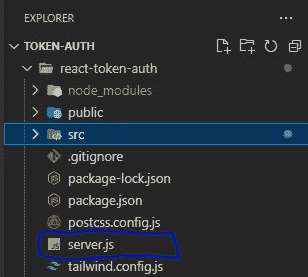

# 如何在 React 应用程序中使用令牌认证用户

> 原文：<https://betterprogramming.pub/how-to-authentication-users-with-token-in-a-react-application-f99997c2ee9d>

## 保护用户数据的深入指南


作者照片

身份验证是每个涉及公共和私有页面的优秀应用程序的重要组成部分，因此了解如何实现身份验证及其执行流程非常重要。

在本文中，我将解释什么是基于令牌的身份验证，身份验证流程如何工作，然后向您展示如何在 React.js 应用程序中设置基于令牌的身份验证。

本文要求您对 React.js 中使用的重要术语有一些基本的了解，因此为了顺利理解，您应该对什么是自定义钩子、如何在 React.js 中使用条件操作以及如何使用内置的 React.js 钩子(如 useState 钩子)有所了解，或者至少有一些基本的了解。

如果你想看看完整的项目，看看是什么感觉，你可以在这里克隆库[，然后使用`npm start`在你的机器上运行它。请注意，您的服务器必须正在运行，因此您必须打开一个新的终端并运行一个节点`server.js`来运行您的服务器并对其进行测试。](https://github.com/Bishopukpai/react-auth)

本文将分为以下几个部分:

```
What Is Token-Based Authentication
[How To Setup React.js Projects and Pages](#f1a0)
[Setting Up Application’s Server for Generating Token](#6433)
[How To Store User’s Token](#b418)
[Conclusion](#1208)
```

# 什么是基于令牌的身份验证

基于令牌的身份验证是使用身份验证令牌在应用程序和网站之间安全地传输用户身份。该流程使组织能够提高其身份认证流程的效率。

它只是一个生成加密且安全的安全令牌的过程，并允许用户在成功提交这些令牌后提出验证请求，这些令牌将被存储以供进一步的身份验证。

经过一段指定的时间后，一个好的身份验证令牌将到期。让身份验证令牌保持活动状态太久会使应用程序容易受到攻击，因为劫持程序可以利用这个缺陷劫持用户会话。

根据上面的简单定义，您应该理解基于令牌的身份验证有五个执行步骤，它们是:

1.  用户通过提供必要的登录凭证来发出请求
2.  通过向用户授予访问令牌来处理和验证该请求
3.  然后将访问令牌提交给浏览器，以授权用户访问会话。
4.  将这些身份验证令牌存储在应用程序中以便进一步进行身份验证是很重要的，有许多方法可以做到这一点。我们将在本文后面的令牌存储部分讨论这一点。
5.  最后，为了保护应用程序的用户免受网络攻击，有必要为生成的令牌设置一个超时期限。

有五种主要类型的令牌可用于识别和授予用户对设备或应用程序的访问权限。

这些令牌可用于物理设备和软件应用程序，包括:

1.  软件令牌
2.  断开令牌
3.  JSON Web 令牌(JWT)
4.  连接令牌
5.  无接触代币

上面提到的每个令牌都有特定的用例。

至此，我相信您已经很好地理解了什么是基于令牌的身份验证。在接下来的几节中，您将学习如何在 React.js 应用程序中设置基于令牌的身份验证，以及如何保护应用程序中的私有页面。

# 如何设置 React.js 项目和页面

为了开始这一部分，我将设置我的`React.js`项目，并在我的项目中创建两个组件(`HomePage`和`Dashboard`)，然后在不同的页面上呈现这些组件，也称为路线。

在您希望 React.js 项目所在的项目目录中，运行以下命令:

这将建立一个`React.js`项目文件夹，包含运行它所需的所有必要文件和文件夹。

在您想要使用的任何代码编辑器中打开您的`React.js`项目。我用的是 VS 代码。

在`App.js`文件中，在 src 文件夹 edit 内，删除 header 标签，使您的`App.js`文件看起来像这样:

您将在您的应用程序中安装一些包。首先，我使用 tailwindcss 来设计我的应用程序的样式。如果您想使用它，您可以通过以下过程快速安装它并为您的应用程序设置它:

在终端中运行下面的命令。导航到刚刚创建的 React.js 项目后，在应用程序的依赖项中安装 tailwindcss、postcss 和 autoprefixer，如下所示:

然后运行下面的命令生成一个`tailwind.config.js`文件和一个`postcss.config.js`文件:

通过将下面的代码添加到`module.exports`对象的内容数组来配置`tailwind.config.js`文件。代码如下:

上面的代码将为你的模板文件配置一个路径。从上面的代码中，注意到您要求 tailwindcss 在所有具有。js，。jsx，。ts，还有。`src`文件夹内的 tsx 扩展名。

通过这条指令，您的 tailwindcss 样式将被添加到这些文件中，您可以在那里使用它们。

最后，用下面的代码在您的`React.js` 项目的`index.css`文件中为您的应用程序的每一层添加`@tailwind`指令:

就是这样。这就是在您的应用程序中设置 tailwindcss 所需的全部内容。让我们继续添加其他依赖项。

您将向我们的应用程序添加一个路由机制，因此您需要 react-router-dom。您还需要 cors 在应用程序页面之间共享信息，还需要 express 为您的应用程序设置后端服务器应用程序。

运行下面的命令来安装 react-router-dom:

`cors`和`express`将作为开发依赖项安装，所以运行下面的命令来安装它们:

您已经拥有了启动应用程序所需的一切，但是在运行启动脚本之前，让我们为应用程序添加一点样式。

通过修改`index.css`文件中的代码，将应用程序的背景颜色改为黑色:

现在，运行启动脚本在`localhost:3000`上查看您的应用程序。现在，您应该看到您的应用程序有一个完全黑色的背景。

在`src`文件夹中，创建另一个名为`Components`的文件夹。在`Components`文件夹中，创建`Homepage.jsx`和`Dashboard.jsx`文件。

这些文件将分别存放我们的`Homepage`和`Dashboard`组件。

下面显示了`Homepage.jsx`的所有代码，因此您可以创建一个`Homepage`组件来在浏览器中显示一条简单的`Homepage`消息:

在`Dashboard.jsx`文件中，添加以下代码以创建`Dashboard`组件:

最后，将这些组件导入到`App.js`文件中，并放置在不同的页面上。

从 react-router-dom 导入`BrowserRouter`、`Routes`和`Route` 。使用它们在单独的页面上设置这些组件，代码如下:

如果你参观`localhost:3000`，你应该会看到`Homepage`的成分。

如果你访问`localhost:3000/Dashboard`，你也应该看到`Dashboard`组件。

但是，现在，你的`Dashboard`组件不是私有的，每个人都可以访问它。它需要保密。

对于访问`Dashboard`页面的用户，他们需要在登录表单中提供用户名和密码，以请求获取身份验证令牌。因此，您也将使用这个表单创建一个`Login`组件。

在应用程序的`src`文件夹中再次创建一个文件夹，并将其命名为 Login。

嗯，并不是一定要创建一个新的文件夹来包装一个组件，但是作为一个好的习惯，最好将`Components`分组到不同的文件夹中。因此，由于我们有功能相同的`Homepage`和`Dashboard`组件，我们将它们保存在同一个文件夹中。

在`Login`组件中，创建一个`Login.jsx`文件，在这个文件中，创建一个`Login`组件，并用下面的代码设置登录表单的样式:

在`Dashboard`组件中设置一个逻辑，当用户试图访问`Dashboard`页面而没有正确的身份验证(生成一个令牌)时，这个逻辑将向用户显示这个登录表单。

在`Dashboard.jsx`文件中，从 React 导入`useState`钩子。这将用于存储生成的令牌，以便向用户授予访问权限。

在此之后，如果用户没有令牌，则使用一个条件语句来呈现`Login`表单。

因此，修改您的`Dashboard`组件，如下所示:

保存`Login.jsx`和`Dashboard.jsx`文件，在应用程序仍在运行的情况下打开浏览器，并导航至`localhoast:3000/Dashboard`。您将看到登录表单，而不是`Dashboard`页面。

太好了！现在，您有一个受登录表单保护的私人页面，但现在的问题是您的登录表单不起作用。这是因为您没有为经过身份验证的用户生成令牌。

但是您已经成功地完成了使用令牌进行身份验证的第一步，即给用户一个在登录表单上发出请求的平台。

在下一节中，您将创建一个后端服务器，该服务器将创建一个生成的令牌并将其发送给经过身份验证的用户。

# 设置用于生成令牌的应用服务器

在上一节中，您在应用程序中创建了一个受登录页面保护的私有页面。

在本节中，您将在项目目录的根目录下创建一个`server.js`文件。

在这个文件中，您将使用 express 和 cors 创建一个服务器应用程序，该应用程序将向您的前端应用程序发送一个令牌，并在用户使用登录表单发出请求时授予用户访问权限。

因此，在项目目录的根目录下创建一个`server.js`文件。也就是说，在您创建了`server.js`文件之后，您的项目文件夹结构应该是这样的:



在这个`server.js`文件中，添加下面的代码来创建服务器应用程序:

根据上面的代码，您执行了以下操作:

*   导入了`express`或必需的`express`，并将其传递给第 1 行中一个名为`express`的变量。
*   在第 2 行中，您需要`cors`，并将其传递给一个`cors`变量。
*   在第 4 行，您创建了一个`app`变量，并将`express`变量传递给它。
*   在第 5 行，您通过将`cors`作为参数传递给`app.use( )`方法，要求您的服务器应用程序使用`cors`包。
*   从第 7 行到第 11 行，您请求服务器应用程序向您的应用程序的登录路由发送一个令牌对象
*   在第 13 行，当您运行您的服务器应用程序时，您要求应用程序监听`port 8080`并向控制台发送“API 正在`localhost:8080/login`上运行”消息。

要查看这是否真的有效，在 VS 代码中打开另一个终端，并运行节点`server.js`您应该会直接在终端中看到“API 正在`localhost:8080/login`上运行”。

太好了，你有一个正在运行的服务器。

您需要让您的`Login`组件请求从您刚刚创建的后端服务器应用程序获取这个令牌。

为此，通过添加`PropType`来破坏从`Login`组件中的`Dashboard`组件传递的`setToken`支柱，然后拉出`setToken`支柱。因此，修改您的`Login.jsx`文件，如下所示:

创建一个向您创建的服务器应用程序发出`POST`请求的函数。

这将是一个`async`函数，它将凭证作为它的参数，然后使用 POST 请求调用一个 fetch 方法。

因此，就在`Login`组件之前，在所有导入之后，添加下面的代码来创建`async`函数:

最后，您将创建两个状态:一个保存用户名值，另一个保存密码值。此外，您需要添加一个 handle submit 函数，该函数将调用您刚刚创建的`LoginUser`函数，设置用户令牌，并在登录表单的每个字段上添加`onChange`事件。在此之后，您的应用程序将能够接受用户的输入。

修改您的登录表单，如下所示:

整个登录组件的代码应该如下所示:

保存文件，返回浏览器，服务器应用程序仍在运行。输入一些登录凭证，您应该会被导航到`Dashboard`组件。

我们将令牌存储在应用程序的局部状态变量中，但这给我们带来了一个问题。现在，我们的应用程序将在用户每次刷新页面或打开新标签页时向他们显示登录表单。

根据应用程序的需求，这可能不是一个很好的解决方案。为了解决这个问题，我们可以将令牌存储在一个`localStorage`或`sessionStorage`中。这样，即使用户刷新页面或打开新的选项卡，他们仍将保持登录状态。

尽管在本地和会话存储中存储令牌有它们自己不同的安全含义，但我仍将向您展示如何在其中存储令牌，并在下一节解释它们的安全风险。

# 如何存储用户令牌

您创建了一个可以工作的登录表单，但是现在，您的应用程序不能长时间保持用户的会话。

因此，如果用户应该刷新页面或在会话中打开一个新的选项卡，它将结束会话，用户将不得不再次提供他们的凭据。

虽然您现在将用户的令牌存储在本地状态变量中，但是您也可以将令牌存储在会话存储中，以便用户能够根据需要保持登录状态。或者您可以决定将其存储在本地存储中。

但是存储在本地存储器中也有其缺陷，因为它使用户永远保持登录——直到令牌从本地存储器中被取走。

因此，让我向您展示如何在会话和本地存储中存储用户令牌

# 会话存储

要使用会话存储，请删除仪表板页面中的令牌状态，并创建`setToken`和`getToken`函数。然后，将`getToken`函数赋给一个令牌变量。

因此，您的仪表板组件的代码应该如下所示:

您将使用`setToken`函数将用户生成的令牌保存到会话中。为此，您将使用`setItem`方法。`setItem`方法接受两个参数:一个键和一个字符串值。

因此，如果您打算用`setItem`方法设置用户令牌，那么您必须使用`JSON.stringify`方法将令牌从 JSON 对象转换成字符串。

用下面的代码调用`setItem`方法并在会话中保存令牌:

这样，您就成功地将用户令牌保存到了应用程序的会话存储中。但是您仍然需要从会话存储中检索这个令牌，并将其存储在您的应用程序中，以便您的应用程序可以使用它向用户呈现所需的页面。

您可以使用`getItem`方法从会话存储中获取令牌。`getItem`方法将一个键值作为唯一的参数，然后返回一个字符串值。

因此，在`getToken`函数中，添加`getItem`方法，并使用下面的代码从会话存储中检索用户令牌:

但是现在，当令牌检索成功时，您需要提醒您的应用程序。这使得用户即使提供了凭据也无法登录。

为此，创建一个带有令牌状态和`setToken`函数的定制钩子，当成功检索到令牌时，它将触发应用程序的重新呈现。

创建一个新文件夹，命名为`App`。在`App`文件夹中，创建一个名为`useToken`的新文件。

要创建一个定制的钩子，你必须使用前缀`*use`，这就是为什么我们要使用`useToken`。

在`useToken`文件中，导入`useState`并创建一个令牌状态和`setToken`函数。接下来，将`getToken`函数复制粘贴到`useToken`文件中，并将其更改为箭头函数。

另外，从`Dashboard`组件中复制`setToken`函数，并将名称改为`saveToken`，因为您已经有了一个名为`setToken`的函数，它负责设置应用程序的令牌值。

因此，您的`useToken`代码应该如下所示:

最后在`Dashboard`组件中，导入，并使用`useToken`钩子。

您不再需要`useState`钩子，因为您不再将令牌存储在本地状态变量中。你也不需要`setToken`和`getToken`函数，因为你的`useToken`钩子中已经有了它们。

因此，将它们清除掉，并用下面的代码在`Dashboard`组件中添加`useToken`挂钩:

保存文件，并在服务器应用程序仍在运行的情况下再次打开浏览器。您应该看到登录表单，这次应该可以正常工作了。

如果您打开一个新的选项卡或刷新页面，您仍将登录到应用程序，并停留在`Dashboard`页面上。

将会话令牌存储在应用程序的本地内存之外的安全风险在于，如果对应用程序的攻击成功，会将这些令牌暴露给恶意用户。此外，您需要实现一种在空闲一段时间后自动结束用户会话的方法，以避免会话劫持。

下一种存储方法是使用本地存储。此方法遵循与会话存储相同的方法。

您只需将自定义钩子中的每个会话存储实例都改为`localStorage`。

如果您正在使用`localStorage`，要知道用户将永远登录到应用程序中，即使您结束了应用程序，您仍将登录，直到您直接从`localStorage`中清除令牌。

这些是存储用户生成的令牌的方法，也是在应用程序中实现基于令牌的身份验证的步骤

# 结论

身份验证在保护 web 应用程序用户免受攻击方面起着非常重要的作用。实现正确的身份验证对于防止公开私有页面非常重要。

在本文中，我介绍了如何在 React 应用程序中使用令牌，在正确识别之后授予用户访问权限。我还向您展示了如何设置私有页面，并仅在进行了适当的身份验证和令牌发布之后才显示它们。

最后，我向您展示了在应用程序中存储用户令牌的不同方法。有优点也有缺点，所以需要说明使用每种储存方法的风险和重要性。

感谢阅读。