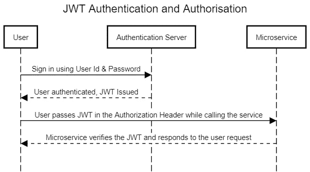

# 如何在 K8s 集群上使用 Istio 授权非 Kubernetes 客户端

> 原文：<https://betterprogramming.pub/how-to-authorize-non-kubernetes-clients-with-istio-on-your-k8s-cluster-8a90fe95b137>

## 使用 JSON web 令牌授权客户端使用 Istio 与您的 Kubernetes 微服务进行交互


由[墨西哥妇女](https://unsplash.com/@mujeres_de_mexico?utm_source=unsplash&utm_medium=referral&utm_content=creditCopyText)在 [Unsplash](https://unsplash.com/?utm_source=unsplash&utm_medium=referral&utm_content=creditCopyText) 上拍摄的照片

Istio 是最受欢迎的 Kubernetes 感知服务网格技术之一，如果您在 Kubernetes 上托管微服务，它将赋予您巨大的能力。

在我的上一篇文章“使用 Istio 实现 Kubernetes 工作负载之间的访问控制”中，我们讨论了如何使用 Istio 来管理 Kubernetes 微服务之间的访问。

这对于内部交流很有效。然而，大多数用例要求您授权非 Kubernetes 客户端连接到您的 Kubernetes 工作负载——例如，如果您公开 API 供第三方集成。

Istio 通过其第 7 层特使代理提供这种能力，并利用 [JSON Web 令牌](https://jwt.io) (JWT)进行授权。在本文中，我们将通过实际操作演示来探索如何利用 Istio 来实现这一点。

# 什么是 JSON Web 令牌？

JSON Web 令牌(JWT)是基于 [RFC 7519](https://tools.ietf.org/html/rfc7519) 的令牌，代表双方之间的声明。您可以使用它们来保存身份信息和其他元数据。

web 令牌是由可信身份提供者使用 JSON Web 密钥(JWK)对 JSON 字符串进行数字签名而生成的。签名过程构造一个 MAC，它成为 JWT 签名。

服务器需要确认 JWK 在授权过程中是否已经签署了 JWT。


JSON web 令牌

下面是一个 JWT 的例子:

```
**eyJhbGciOiJIUzI1NiIsInR5cCI6IkpXVCJ9**.eyJzdWIiOiIxMjM0NTY3ODkwIiwibmFtZSI6IkdhdXJhdiBBZ2Fyd2FsIiwiaWF0IjoxNTE2MjM5MDIyLCJleHAiOjE1ODk0MDc5Mjh9.***KJzt_O-Xwtd1DF_Ie0yi5lVpEiH4spoyZBr3rATTHqw***
```

粗体部分是包含有效负载类型和密钥算法的报头。

```
{
  "alg": "HS256",
  "typ": "JWT"
}
```

未格式化的字符串是有效负载。该有效载荷包括声明、发布时间(`iat`)和到期时间(`exp`)。

```
{
  "sub": "1234567890",
  "name": "Gaurav Agarwal",
  "iat": 1516239022,
  "exp": 1589407928
}
```

斜体部分是用 JWK 签署 JWT 后生成的签名。如果有人篡改有效载荷，JWT 将被视为无效，因为在验证过程中会生成不同的 MAC。

请求者使用他们的凭证登录身份提供者，身份提供者网站发布 JWT 令牌，用户使用 JWT 令牌与微服务进一步交互。

JWT 通常作为 HTTP 请求`Authorization`报头中的`Bearer`令牌发送。



# 先决条件

确保您运行的是 Kubernetes 集群，并且了解 Istio 是如何工作的。介绍 Istio 的一个很好的起点是“[如何使用 Istio](https://medium.com/better-programming/how-to-manage-microservices-on-kubernetes-with-istio-c25e97a60a59) 管理 Kubernetes 上的微服务。”

按照“[Kubernetes 上的 Istio 入门](https://medium.com/better-programming/getting-started-with-istio-on-kubernetes-e582800121ea)”指南，在 Kubernetes 集群上安装 Istio。您不需要为演示部署图书信息应用程序。

# 安装示例应用程序

创建一个名称空间，`foo`，并标记名称空间，以便 Istio 可以自动注入 sidecars。部署`httpbin`和`sleep`微服务，如下图:

```
$ kubectl create ns foo
$ kubectl label namespace foo istio-injection=enabled
$ kubectl apply -f samples/httpbin/httpbin.yaml -n foo
$ kubectl apply -f samples/sleep/sleep.yaml -n foo
```

现在让我们测试一下是否可以从`sleep`微服务中调用`httpbin`微服务。

```
$ kubectl exec $(kubectl get pod -l app=sleep -n foo -o jsonpath={.items..metadata.name}) -c sleep -n foo -- curl [http://httpbin.foo:8000/ip](http://httpbin.foo:8000/ip) -s -o /dev/null -w "%{http_code}\n"200
```

# 在 httpbin 微服务上应用请求身份验证

创建一个认证策略来接受由`testing@secure.istio.io`发布的 JWT。

YAML 选择`httpbin`微服务，并应用 JWT 规则来检查发布者是否为`testing@secure.istio.io`。此外，它还有一个`jwksUri`链接到 JWK 来验证 JWT。

为了演示，JWK 是公开的。但是，您应该使用凭证管理系统来保护 JWK，并将其作为密码来保护。如果您的 JWK 受到威胁，那么任何人都可以通过生成新的 jwt 来访问您的微服务。

经常轮换 jwk 并与身份提供者同步是一个很好的练习。

# 测试身份验证策略

现在让我们用一个无效令牌触发一个请求，以验证 Istio 是否拒绝它。

```
$ kubectl exec $(kubectl get pod -l app=sleep -n foo -o jsonpath={.items..metadata.name}) -c sleep -n foo -- curl "[http://httpbin.foo:8000/headers](http://httpbin.foo:8000/headers)" -s -o /dev/null -H "Authorization: Bearer invalidToken" -w "%{http_code}\n"401
```

我们得到了`401 Unauthorised`。让我们不要 JWT 代币试试。

```
$ kubectl exec $(kubectl get pod -l app=sleep -n foo -o jsonpath={.items..metadata.name}) -c sleep -n foo -- curl "[http://httpbin.foo:8000/headers](http://httpbin.foo:8000/headers)" -s -o /dev/null -w "%{http_code}\n"200
```

发生了什么事？嗯，我们考虑过，由于我们还没有应用授权政策，为了与遗留系统兼容，Istio 允许所有没有 JWT 令牌的请求。

身份验证策略保证，如果您的请求包含 JWT，那么它应该是有效的。如果它不持有 JWT，请求仍然被允许，并且授权策略应该执行附加规则。

# 创建授权策略

现在让我们创建一个授权策略，它需要一个有效的 JWT。

上述 YAML 将所有请求授权给具有请求主体`testing@secure.istio.io/testing@secure.istio.io`的`httpbin`微服务。

请求主体有两个部分— `issuer`和`subject`。有效的 JWT 必须包括与`testing@secure.istio.io`相等的`issuer`和`subject`索赔。

让我们用上面的细节获得一个 JWT 令牌。

```
$ TOKEN=$(curl https://raw.githubusercontent.com/istio/istio/release-1.6/security/tools/jwt/samples/demo.jwt -s) && echo $TOKEN | cut -d '.' -f2 - | base64 --decode -{"exp":4685989700,"foo":"bar","iat":1532389700,"iss":"[testing@secure.istio.io](mailto:testing@secure.istio.io)","sub":"[testing@secure.istio.io](mailto:testing@secure.istio.io)"}
```

# 测试授权策略

现在用有效的 JWT 令牌传输一个请求。

```
$ kubectl exec $(kubectl get pod -l app=sleep -n foo -o jsonpath={.items..metadata.name}) -c sleep -n foo -- curl "[http://httpbin.foo:8000/headers](http://httpbin.foo:8000/headers)" -s -o /dev/null -H "Authorization: Bearer $TOKEN" -w "%{http_code}\n"200
```

缺少 JWT 令牌的请求怎么办？

```
$ kubectl exec $(kubectl get pod -l app=sleep -n foo -o jsonpath={.items..metadata.name}) -c sleep -n foo -- curl "[http://httpbin.foo:8000/headers](http://httpbin.foo:8000/headers)" -s -o /dev/null -w "%{http_code}\n"403
```

并且该请求被拒绝。JWT 授权在这一点上是有效的。

# 验证自定义声明

除了`subject`和`issuer`之外，我们还可以验证自定义声明。让我们实现一个规则，JWT 应该包含一个值为`group1`的`group`声明。

上面的 YAML 包括一个`when`指令，仅当`groups`声明包含值`group1`时才允许请求。

# 测试自定义声明

现在我们来测试一下配置。创建一个 JWT，其中包含一个名为`groups`的索赔，值为`group1`和`group2`。

```
$ TOKEN_GROUP=$(curl https://raw.githubusercontent.com/istio/istio/release-1.6/security/tools/jwt/samples/groups-scope.jwt -s) && echo $TOKEN_GROUP | cut -d '.' -f2 - | base64 --decode -{"exp":3537391104,"groups":["group1","group2"],"iat":1537391104,"iss":"[testing@secure.istio.io](mailto:testing@secure.istio.io)","scope":["scope1","scope2"],"sub":"[testing@secure.istio.io](mailto:testing@secure.istio.io)"}
```

用上面的 JWT 调用`httpbin`微服务。

```
$ kubectl exec $(kubectl get pod -l app=sleep -n foo -o jsonpath={.items..metadata.name}) -c sleep -n foo -- curl "[http://httpbin.foo:8000/headers](http://httpbin.foo:8000/headers)" -s -o /dev/null -H "Authorization: Bearer $TOKEN_GROUP" -w "%{http_code}\n"200
```

你会得到一个成功的回应。

不包含`groups`声明的 JWT 怎么样？

```
$ kubectl exec $(kubectl get pod -l app=sleep -n foo -o jsonpath={.items..metadata.name}) -c sleep -n foo -- curl "[http://httpbin.foo:8000/headers](http://httpbin.foo:8000/headers)" -s -o /dev/null -H "Authorization: Bearer $TOKEN" -w "%{http_code}\n"403
```

这个被否决了。干得好！您已经成功实施了定制索赔授权。

# 结论

感谢阅读！我希望你喜欢这篇文章。

在下一篇文章"[多集群 Kubernetes 环境上的 Istio 服务网格](https://medium.com/better-programming/istio-service-mesh-on-multi-cluster-kubernetes-environment-518094cdcdc4)"中，我将讨论如何在多集群 Kubernetes 环境上管理 Istio 服务网格，到时见！