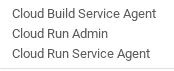

# 如何将应用程序自动部署到 Google Cloud Run

> 原文：<https://betterprogramming.pub/how-to-auto-deploy-an-app-to-google-cloud-run-9a20a183088d>

## 通过这个简短的教程，让您的 Dockerized 应用程序自动构建和部署


很容易让您的 Dockerized 应用程序自动构建并部署到 [Google Cloud Run](https://cloud.google.com/run/) ，当您不想考虑基础设施时，这是一个非常棒的部署应用程序的服务。

首先，[在 Google Cloud 控制台上创建一个新项目](https://console.cloud.google.com/projectcreate)，并复制您的项目 ID 以在本文中使用。我们开始吧！

# 手动部署，做好一切准备

在命令行上设置您的项目 ID:

```
gcloud config set project $PROJECT_ID
```

现在，让我们将应用程序的 Docker 图像推送到项目的 Google 容器注册表中。转到控制台中的`Container Registry`并启用 API，然后:

```
docker build -t gcr.io/$PROJECT_ID/hello .
docker push gcr.io/$PROJECT_ID/hello
```

接下来，我们需要通过云运行让它运行起来。你只需要这样做一次，只是为了确保一切工作正常。

```
gcloud beta run deploy --image gcr.io/$PROJECT_ID/hello --platform managed
```

运行后，您将获得一个全新的网址来查看您的应用程序:


好了，现在我们的应用已经在 Cloud Run 上运行了！下一步是自动化上述所有工作。

# 现在自动化吧！

在控制台中，为您的项目启用`Cloud Build`，参见[本快速入门](https://cloud.google.com/cloud-build/docs/quickstart-docker)获取说明。然后添加一个[触发器](https://console.cloud.google.com/cloud-build/triggers)到云构建中。每当您推送到 GitHub 存储库时，这个触发器都会运行构建。对于`Trigger Type`，选择“分支”，并在“分支(正则表达式)”字段中输入“主”。另外，选择“云构建配置文件”。设置好之后，它应该是这样的:


我们需要授予我们的云构建服务帐户访问云运行的权限，方法是转到 [IAM](https://console.cloud.google.com/iam-admin/iam) 并授予`*PROJECT_ID@cloudbuild.gserviceaccount.com*`“云运行管理员”角色和“云运行服务代理”，以便允许部署到云运行。



云构建服务客户的角色。

最后，在您的 git 存储库中，将以下内容复制到一个名为`cloudbuild.yaml`的文件中，并将其推送到 GitHub。

第 15 行的最后一个参数是云运行服务的名称，如果您继续下去，应该是`hello`。

嘣！您的构建将在每次推送至 master 时运行和部署。尝试更新您的应用程序并推动它以查看它的运行情况。

你可以在这里找到这篇文章中用到的所有代码:

 [## tree der/cloud-run-示例

### 此时您不能执行该操作。您已使用另一个标签页或窗口登录。您已在另一个选项卡中注销，或者…

github.com](https://github.com/treeder/cloud-run-example)