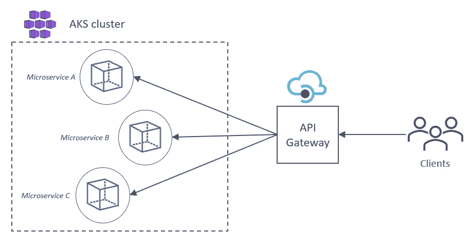

# 如何为 Azure Kubernetes 服务自动生成 API 网关

> 原文：<https://betterprogramming.pub/how-to-auto-generate-an-api-gateway-for-azure-kubernetes-services-f20149253ed3>

## 让我们探索一种简洁的方式，用 Azure 管道和 API 管理来自动化部署过程


[Kubernetes](https://kubernetes.io/) 和 [Azure API 管理](https://azure.microsoft.com/en-us/services/api-management/#overview)徽标(由作者组合)。

假设我们正在使用 Azure Kubernetes Service (AKS)向 Kubernetes 集群部署一组微服务。让我们进一步假设每个微服务都有自己的 API，它有一个 OpenAPI 规范。

问题是我们不知道我们将部署多少这样的微服务。我们希望将每个 API 连接到同一个 API 网关。

这些 Kubernetes 部署可能会变得非常复杂，但是基本思想非常简单。我们希望我们的微服务可以通过一个公共接口被下游消费者发现。



基本思想。

同时，我们希望尽可能多地自动化部署流程，以避免繁琐且容易出错的手动部署。

这就是 Azure DevOps 和 API 管理的用武之地。在本文中，我们将展示指定 Azure 管道的 YAML 文件的代码片段，而您的工作将是填充空白以满足您的特定需求。

## 先决条件

*   具有 Dockerfile 和 OpenAPI 规范的可部署服务
*   Azure 容器注册实例
*   具有正在运行的集群的 AKS 实例
*   Docker 注册服务连接
*   Kubernetes 服务连接
*   API 管理服务
*   Azure DevOps 组织

您可以从 Azure 门户或通过 Azure 资源管理器(ARM)模板部署这些资源。我不会在这里讨论如何做到这一点。

## 设置管道

说够了。让我们展示一些代码。

Azure DevOps 管道依赖于上述所有先决条件，我们需要设置一些变量来确保不同的 Azure 服务可以安全地通信。

```
variables:  
  environment: 'dev'
  imagePullSecret: '{name your pull secret here}'
  kubernetesManifestDirectory: '{directory with K8s manifest file}'
  tag: '$(Build.SourceVersion)'
  imageRepository: '{name of your docker image}'
  serviceName: $(imageRepository)
  dnsLabel: $(imageRepository)
  dockerfilePath: '{path to dockerfile}'
  resourceGroup: '{name of resource group to deploy to}'
  location: '{azure region to deploy to}'
  containerRegistryName: '{name of Azure container registry}'
  dockerRegistryServiceConnection: '{name of connection}'
  kubernetesServiceConnection: '{name of connection}'
  apimWorkspace: '{name of APIM workspace}'
```

这里，我们将部署到一个名为“dev”的环境中，但是使用环境并不是绝对必要的。

`tag`变量是 git 提交散列，将用于标记我们的容器图像。您可以使用任何您想要的标签，但是强烈建议为每个构建使用一个唯一的标签，以清楚地表明运行的是哪个版本的映像。

## 建立码头工人形象

```
- stage: Build
  displayName: Build
  jobs:
  - job: Build
    displayName: Build and push image
    pool:
      vmImage: 'ubuntu-latest'
    steps:   

    - task: Docker@2
      inputs:
        command: 'buildAndPush'
        repository: $(imageRepository)
        Dockerfile: $(dockerfilePath)
        containerRegistry: $(containerRegistryName)
        tags: $(tag)
```

在管道的构建阶段，我们构建 Docker 映像并将其推送到 Azure 容器注册中心。

> **注意**:`buildAndPush`命令是一个方便的任务，在一个步骤中结合了“构建”和“推送”。然而，如果你想用参数构建你的图像，你必须分开使用这两个任务，因为`buildAndPush`不支持它。

一旦容器映像在注册表中可用，我们就可以部署它了。

## 配置 Kubernetes 清单

Kubernetes 清单文件相对简单。它有一个部署和一个服务。我们重用 Docker 注册中心的名称作为服务和应用程序标签的名称，并通过标准的`port 80`使用负载均衡器公开服务。

```
apiVersion: apps/v1
kind: Deployment
metadata:
  name: #{serviceName}#
spec:
  replicas: 1
  selector:
    matchLabels:
      app: #{serviceName}#
  template:
    metadata:
      labels:
        app: #{serviceName}#
    spec:
      nodeSelector:
        "kubernetes.io/os": linux
      containers:
      - name: speech2text
        image: #{containerRegistryName}#.azurecr.io/#{imageRepository}#:#{tag}#
        imagePullPolicy: Always
        ports:
        - containerPort: 80
---
apiVersion: v1
kind: Service
metadata:
  name: #{serviceName}#
  annotations:
    service.beta.kubernetes.io/azure-dns-label-name: #{dnsLabel}#
spec:
  ports:
  - port: 80
    targetPort: 80
  type: LoadBalancer
  selector:
    app: #{serviceName}#
```

需要注意的一点是，我们在第 29 行指定了一个 DNS 标签。这为服务提供了一个公共 IP 地址和一个 DNS 地址，[，如这里所描述的](https://docs.microsoft.com/en-us/azure/aks/static-ip)。稍后请记住这一点，因为这在我们部署 API 时非常重要。

您还会注意到清单中的许多属性是应该由变量替换的标记。为此，我们将使用一个名为`Replace Tokens`的自定义任务，它在 Azure Marketplace 中可用[。你当然可以使用一个更高级的工具，比如](https://marketplace.visualstudio.com/items?itemName=qetza.replacetokens)[舵图模板](https://v2.helm.sh/docs/chart_template_guide/#the-chart-template-developer-s-guide)，来实现同样的事情，但是我们现在保持简单。

该任务中的默认令牌模式是`#{…}#`。以下代码片段将用相应的管道变量替换清单文件中的所有标记:

```
- task: replacetokens@5
  displayName: Replace tokens in manifest
  inputs:
    targetFiles: '$(kubernetesManifestDirectory)/*.yml'
    encoding: 'auto'
    tokenPattern: 'default'
    writeBOM: true
    actionOnMissing: 'warn'
    keepToken: false
    actionOnNoFiles: 'continue'
    enableTransforms: false
    enableRecursion: false
    useLegacyPattern: false
    enableTelemetry: true

- publish: $(kubernetesManifestDirectory)
  displayName: Publish manifest artifact
  artifact: $(kubernetesManifestDirectory)
```

# 部署 Kubernetes 服务

```
jobs:
  - deployment: DeployKubernetes
    displayName: Deploy to Kubernetes
    pool:
      vmImage: 'ubuntu-latest'
    environment: $(environment)
    strategy:
      runOnce:
        deploy:
          steps:
          - task: KubernetesManifest@0
            displayName: Create image pull secret
            inputs:
              action: createSecret
              kubernetesServiceConnection: $(kubernetesServiceConnection)
              secretName: '$(imagePullSecret)'
              dockerRegistryEndpoint: $(dockerRegistryServiceConnection)

          - task: KubernetesManifest@0
            displayName: Deploy to Kubernetes
            inputs:
              action: 'deploy'
              kubernetesServiceConnection: $(kubernetesServiceConnection)
              manifests: '$(Agent.BuildDirectory)/$(kubernetesManifestDirectory)/$(kubernetesManifestFile)'
              containers: '$(containerRegistry)/$(imageRepository):$(tag)'
              imagePullSecrets: '$(imagePullSecret)'
```

AKS 需要一个 pull secret 来向容器注册表进行身份验证。使用服务连接，我们可以通过`KubernetesManifest`任务的`createSecret`动作动态地创建它。

有了 pull secret 和我们的 Kubernetes 清单，我们可以使用同一个任务的`deploy`动作将新创建的映像部署到 AKS 集群。这在引擎盖下运行`kubectl apply`命令。

> **注**:在写的时候，‘Ubuntu-latest’指向的是’*Ubuntu-20.04*的镜像。

使用`KubernetesManifest`任务的好处是它检查部署对象的卷展状态，直到卷展完成才返回。通过让管道中的下一个作业依赖于 Kubernetes 部署，我们知道服务已经可供消费。

# 将 API 导入 API 管理

```
- job: CreateAPI
  displayName: Create API
  dependsOn: DeployKubernetes
  pool:
    vmImage: 'windows-2019'
  steps:

  - task: AzureCLI@2
    displayName: Create API
    inputs:
      azureSubscription: '$(azureSubscription)'
      scriptType: 'batch'
      scriptLocation: 'inlineScript'
      inlineScript: 'az apim api import -g $(resourceGroup) --service-name $(apimWorkspace) --api-id $(serviceName) --path $(serviceName) --specification-format OpenApiJson --specification-url http://$(dnsLabel).$(location).cloudapp.azure.com/openapi.json --service-url http://$(dnsLabel).$(location).cloudapp.azure.com/ --display-name $(serviceName)'      

  - task: AzureCLI@2
    displayName: Add API to Starter product
    inputs:
      azureSubscription: '$(azureSubscription)'
      scriptType: 'batch'
      scriptLocation: 'inlineScript'
      inlineScript: 'az apim product api add --api-id $(serviceName) --product-id Starter --resource-group $(resourceGroup) --service-name $(apimWorkspace)'
```

在这里，我们来了解一下这条管道的本质。还记得我们之前设置的 DNS 标签吗？我们现在可以使用该地址来查找 OpenAPI 规范文件，并使用一行代码将 API 导入 API 管理服务。

为此，我们运行以下命令:

```
az apim api import -g $(resourceGroup) --service-name $(apimWorkspace) --api-id $(serviceName) --path $(serviceName) --specification-format OpenApiJson --specification-url http://$(dnsLabel).$(location).cloudapp.azure.com/openapi.json --service-url http://$(dnsLabel).$(location).cloudapp.azure.com/ --display-name $(serviceName)
```

那是一长行代码，所以让我们把它拆开。通过将`OpenApiJson`设置为规范格式并将`specification-url` 指向`openapi.json`文件的位置，API 将自动生成。`service-url`参数是 API 的基本 URL。我们还为 API 重用了 Docker 注册名，就像我们对 Kubernetes 服务所做的那样。

下一个任务不是绝对必要的，但是它将新创建的 API 添加到默认的`Starter`产品中，这允许 API 管理中该产品的订户开始使用该 API。

> **注意**:‘windows-2019’映像用于运行此作业，但它也应该与其他构建代理一起工作。

如果您已经正确地设置了所有的东西，那么您现在应该有一个正在运行的 API，准备好供您的 API 管理订阅者使用！

关于管道的最后一部分，要提到的一点是，如果已经存在同名的 API，导入脚本将会失败。为了避免这种情况，您可以先用下面的命令删除 API，然后再重新创建它(这会导致几秒钟的停机时间):

```
az apim api delete --api-id $(serviceName) --resource-group $(resourceGroup) --service-name $(apimWorkspace) -y
```

# 总结

我们用包含 OpenAPI 规范的微服务构建了一个 Docker 映像，并将其推送到 Azure Container Registry。我们将图像拉至 Azure Kubernetes 服务，并使用静态 DNS 标签对其进行部署。使用 DNS 标签，我们可以获取 OpenAPI 规范并自动生成 API，作为我们 API 管理产品的一部分。

这种设置的好处之一是可以重用它来部署不同的服务。如果您愿意，您甚至可以从多个代码库中同时触发同一个管道。

## 放弃

本文不涉及部署的安全方面。为了保护您的服务，您应该将 Kubernetes 集群，最好是 API 管理实例，部署到虚拟网络(VNet)中。这超出了本文的范围，但是微软有一个很好的概念教程[来教你怎么做。](https://docs.microsoft.com/en-us/azure/api-management/api-management-kubernetes)