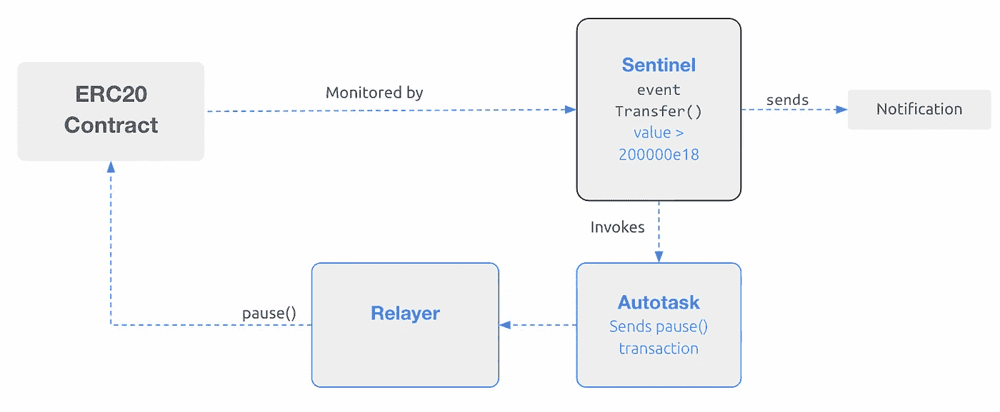
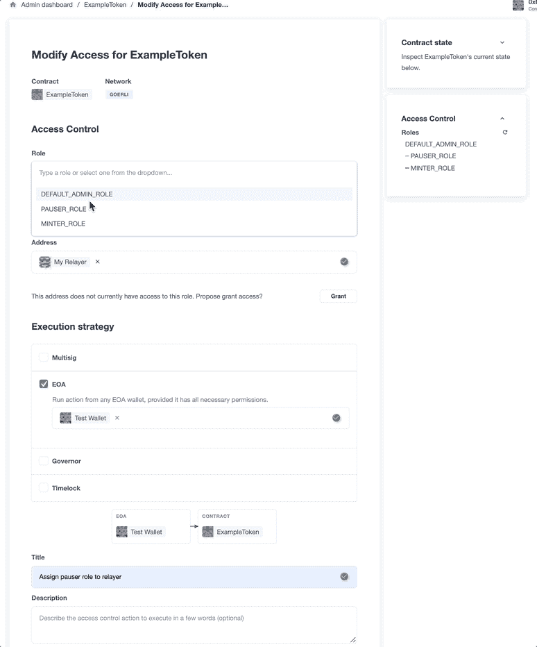

# 如何自动暂停智能合同

> 原文：<https://betterprogramming.pub/how-to-auto-pause-a-smart-contract-a4cd4e93667a>

## 使用 OpenZeppelin Defender


照片由[伊万·班杜拉](https://unsplash.com/@unstable_affliction?utm_source=medium&utm_medium=referral)在 [Unsplash](https://unsplash.com?utm_source=medium&utm_medium=referral) 上拍摄

open zeppelin Defender[的一个关键功能是它对于安全监控和通用自动化的有用性。本指南利用几个 Defender 组件，针对 ERC20 合同上的一组给定条件，自动执行事件响应。](http://defender.openzeppelin.com)

# 概观

OpenZeppelin Defender 有几个主要的功能组件:Sentinel、Autotasks、Admin 和 Relayer。每个组件都是为您的 dapp 或协议定制自动化设置的重要组成部分。

在这个系统设计中，一个[哨兵](https://docs.openzeppelin.com/defender/sentinel)监控合同上的交易，并被设置为在大量令牌转移的情况下自动触发一个[自动任务](https://docs.openzeppelin.com/defender/autotasks)。自动任务脚本通过[中继器](https://docs.openzeppelin.com/defender/relay)向 ERC20 合同发送暂停交易。



# 设置

首先，与 [Defender](https://defender.openzeppelin.com) 签约，并确保用于合同部署的 EOA 由 Goerli ETH 资助([通过水龙头](https://forum.openzeppelin.com/t/goerli-testnet-faucets/26710))。

叉了叉[演示回购](https://github.com/offgridauthor/pause-guardian)。

克隆您的分支并安装依赖项:

```
$ git clone https://github.com/[GitHub username]/pause-guardian.git
$ cd pause-guardian
$ npm install
```

在本地`.env`文件中提供必要的 api 密钥。预期值如下:

`PRIVATE_KEY`:用于 Goerli 网络上的合同部署

`API_KEY`:防守队员 API 键

`API_SECRET`:防御者团队 API 秘笈

# 部署 ERC20 合同

OpenZeppelin [合同向导](https://wizard.openzeppelin.com)具有一个 API，可以轻松智能地创建合同。生成一个 ERC20 契约，该契约可铸造、可暂停，并实施[基于角色的访问控制](https://docs.openzeppelin.com/contracts/3.x/access-control#role-based-access-control)，预先铸造了 100 万个令牌。预先提供的脚本可以自动完成这一任务:

```
import { erc20 } from '@openzeppelin/wizard'const params = {
  name: 'ExampleToken',
  symbol: 'ETK',
  mintable: true,
  premint: '1000000',
  access: 'roles',
  pausable: true,
}const contract = erc20.print(params)
```

使用`$ npm run generate`运行

接下来，运行`$ npm run deploy`来编译和部署契约。

```
const adminClient = new AdminClient({
    apiKey: process.env.API_KEY,
    apiSecret: process.env.API_SECRET,
  }) const contractDetails = {
    network: 'goerli',
    address: contract.address,
    name: NAME,
    abi: contractABI,
  } const newAdminContract = await adminClient.addContract(contractDetails) 
```

该脚本利用 Defender 的`admin-client`，并在部署后立即将合同加载到管理仪表板中。

# 创建继电器并分配暂停者角色

创建中继器以通过 API 运行区块链事务:

```
$ npm run relay
```

现在您已经有了中继器，您需要授予它适当的角色。

Defender web 界面使管理访问控制变得容易。通过管理仪表板，选择新创建的 ERC20 合同，然后选择新提案-→修改访问权限。在下一个屏幕上，从下拉列表中选择 PAUSER 角色，并提供刚刚创建的继电器的地址。选择“EOA”作为执行策略，并选择用于部署合同的帐户地址。给访问提议一个标题并执行它。



# 创建自动任务以发送暂停事务

现在，您已经有了一个具有暂停合同的适当权限的中继器，是时候构建这个自动化功能了。

创建一个 Autotask，它将使用 Relayer 向已部署的 ERC20 契约发送一个`pause`事务。

```
$ npm run autotask
```

该脚本在 Defender 中创建新的自动任务，并上传自动任务代码，提供刚刚创建的中继器的 ID，以使用中继器运行事务。

```
async function handler(event) {
  const provider = new DefenderRelayProvider(event)
  const signer = new DefenderRelaySigner(event, provider, { speed: 'fast' }) const erc20 = new ethers.Contract(ADDRESS, ABI, signer) const isPaused = await erc20.paused()
  if (!isPaused) {
    const tx = await erc20.pause()
    console.log(tx)
  } else if (isPaused) {
    console.log('Contract is paused; doing nothing')
  }
}
```

创建自动任务后，最后一个构建块是设置一个哨兵来监视链上事件并触发自动任务。

# 创建 Sentinel 以触发自动任务

哨兵可以监视各种各样的合同条件，并在被触发时发送通知或启动自动任务。

运行`$ npm run sentinel`创建一个哨兵，如果检测到大量令牌传输，该哨兵将触发自动任务:

```
eventConditions: [
      {
        eventSignature: 'Transfer(address,address,uint256)',
        expression: 'value > 200000e18',
      },
    ],
```

# 测试自动暂停自动化

既然所有的构件都已经铺设好了，系统就可以测试了。尝试从合同中转移超过 200000 英镑的代币到另一个帐户。Sentinel 将检测到高交易量`Transfer`事件并触发自动任务，自动任务将通过继电器发送暂停交易，ERC20 合约将暂停。因此，尝试任何后续的大容量传输都会失败。

# 资源

*   [视频演练](https://www.youtube.com/watch?v=11erJye56jQ)
*   [演示回购](https://github.com/offgridauthor/pause-guardian)
*   [OpenZeppelin Defender Sentinel 文档](https://docs.openzeppelin.com/defender/sentinel)
*   [OpenZeppelin Defender Sentinel 客户端 API](https://www.npmjs.com/package/defender-sentinel-client)
*   [OpenZeppelin 合同向导 API](https://www.npmjs.com/package/@openzeppelin/wizard)