# 如何在您的 iOS 应用中自动化资产管理

> 原文：<https://betterprogramming.pub/how-to-automate-asset-management-in-your-ios-apps-1f465bcaa4ef>

## 使用 R.swift 简化颜色、图像和本地化


奥马尔·普雷斯特维奇在 [Unsplash](https://unsplash.com?utm_source=medium&utm_medium=referral) 上拍摄的照片

在本教程中，我们将了解如何以及为什么我们应该在我们的 iOS 应用程序中使用资产自动化。我们将通过使用一个流行的开源库来实现。当您完成这篇文章时，您将已经学会如何自动化:

*   形象
*   颜色；色彩；色调
*   局限

事不宜迟，我们开始吧。

# 我们开始吧

我们从一个空项目开始，如下所示:

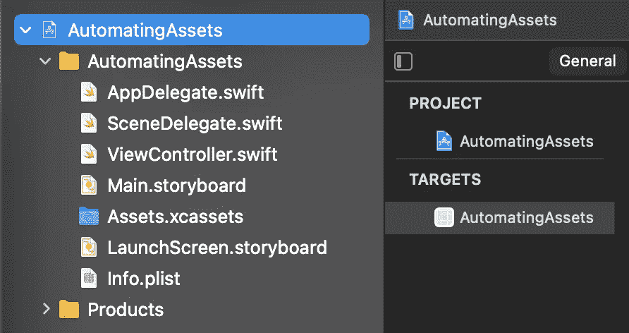

我们的第一步是将 R.swift 添加到项目中。在将这一行添加到 Podfile 之后，我们将通过运行`pod install`来通过 CocoaPods 安装它:

`pod ‘R.swift’`

很好，现在已经安装了 R.swift，我们需要调整目标的构建阶段。从添加新的运行脚本阶段开始，如下所示:

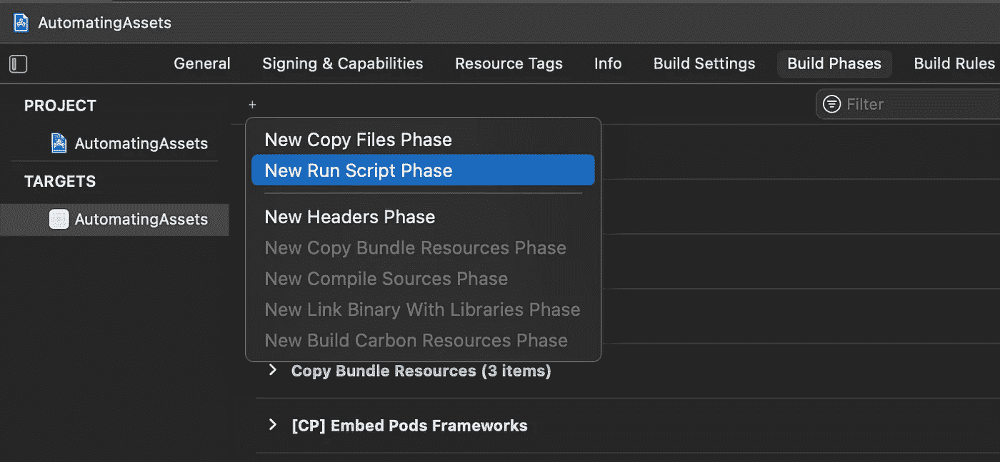

创建新的“运行脚本”后，我们将它移到“编译源代码”上方，如下所示:

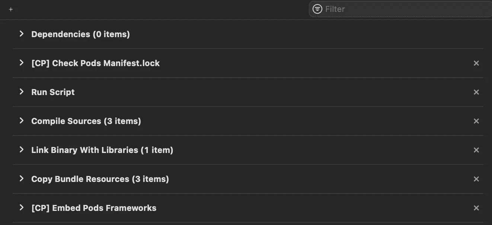

原因是库将生成一个`R.generated.swift`文件，该文件将包含引用我们的应用程序中使用的资产的所有属性。我们希望它在应用程序编译所有文件之前生成。

下一步是定义实际的脚本。增加`“$PODS_ROOT/R.swift/rswift” generate “$SRCROOT/R.generated.swift”`如下:


此外，取消选中“基于依赖关系分析”以使脚本运行每个构建:

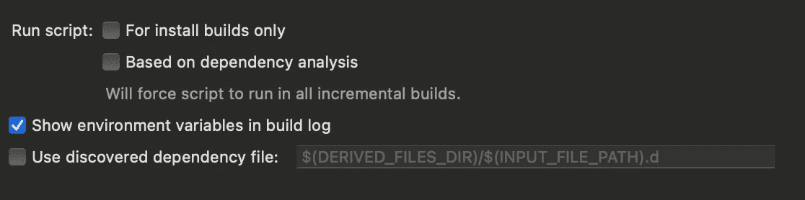

配置 R.swift 的最后一步是更新脚本的`Output`文件。像这样将`$SRCROOT/R.generated.swift`添加到`Output Files`:

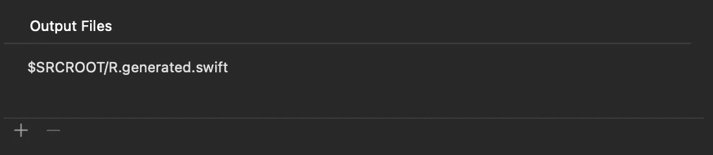

现在，如果我们构建应用程序并打开项目文件夹，我们将看到`R.generated.swift`文件:

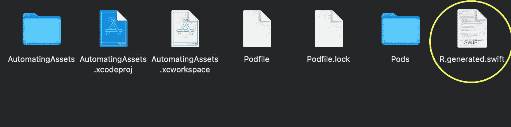

将文件拖放到 Xcode 项目中，并取消选中“如果需要，拷贝项目”*:*

*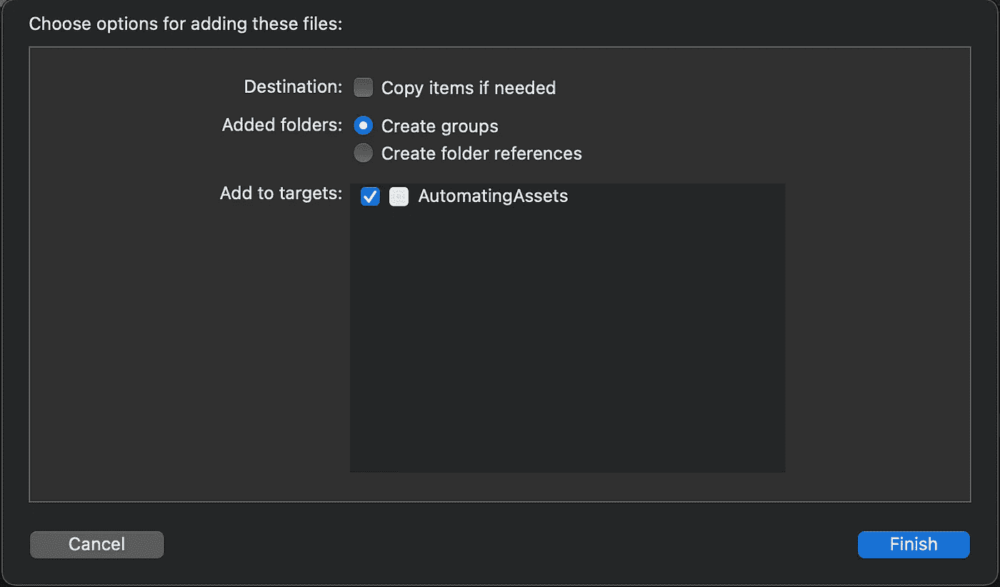**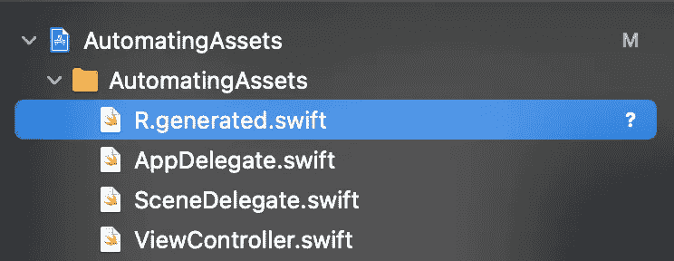*

*太好了！现在是时候了解我们如何自动化映像管理了。*

# *管理图像*

*首先，让我们给`Assets.xcassets`目录添加一个图像，如下所示:*

*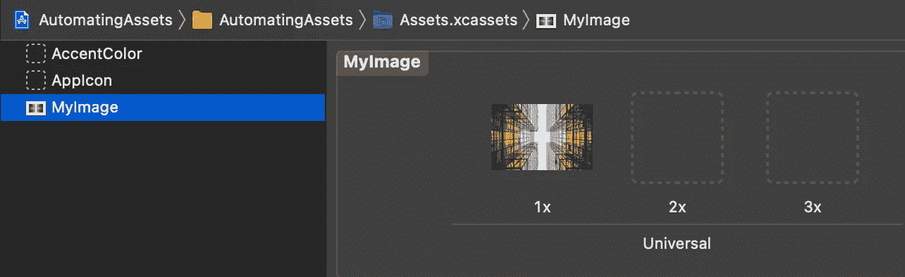*

*构建应用程序后，我们可以像这样轻松引用`ViewController`中的图像:*

*正如我们所看到的，我们不需要使用标准的容易出错的方法来获取图像，这种方法要求我们使用字符串。*

*接下来，让我们看看如何使用颜色。*

# *管理颜色*

*让我们给`Assets.xcassets`添加一个颜色集，如下所示:*

*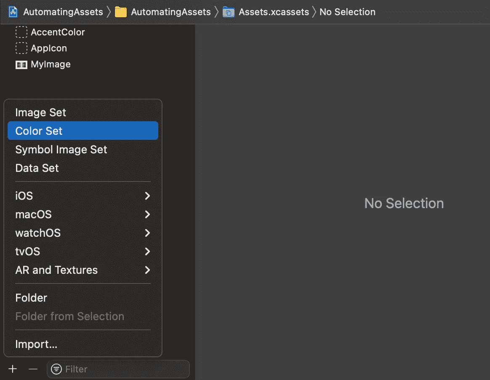*

*在将其命名为“Primary”并设置其值后，我们得到了:*

*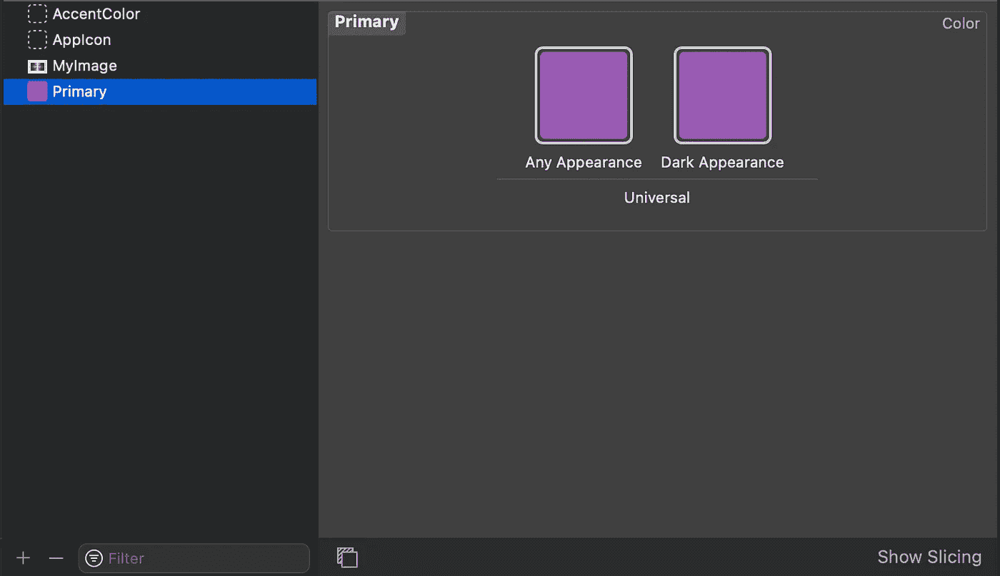*

*现在，就像我们之前做的一样，我们构建应用程序并在`ViewController`中获得新创建的`UIColor`:*

*完成颜色后，现在让我们处理可本地化的字符串。*

# *管理本地化*

*假设我们有两个可本地化的字符串文件，如下所示:*

*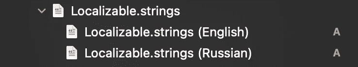*

*我们希望在我们的项目中使用这个简单的字符串:*

```
*"hello" = "Hello";//or"hello" = "Привет";*
```

*构建完应用程序后，我们在`ViewController`中轻松引用字符串，代码如下:*

*此外，使用如下参数引用字符串也非常容易:*

```
*"hello" = "Hello, %@!";*
```

*R.swift 更新了`R.generated.swift`文件，这样我们可以在获取字符串时提供一个参数:*

```
*let message = R.string.localizable.hello("James")
print(message)*
```

*太好了！我们已经成功利用 R.swift 库更高效地管理图像、颜色和本地化文件。*

*当使用 Git 时，将`R.generated.swift`文件添加到`.gitignore`是有意义的，因为它总是在构建项目时重新生成。它还有助于我们避免合并冲突:*

```
**.generated.swift*
```

# *资源*

*示例项目可以在 [GitHub](https://github.com/zafarivaev/rswift-images-colors-localization) 上获得。*

# *包扎*

*R.swift 支持的不仅仅是图像、颜色和字符串。要了解更多信息，请访问框架的 [GitHub 页面](https://github.com/mac-cain13/R.swift)。*

*我希望这篇教程对你有用。感谢阅读！*