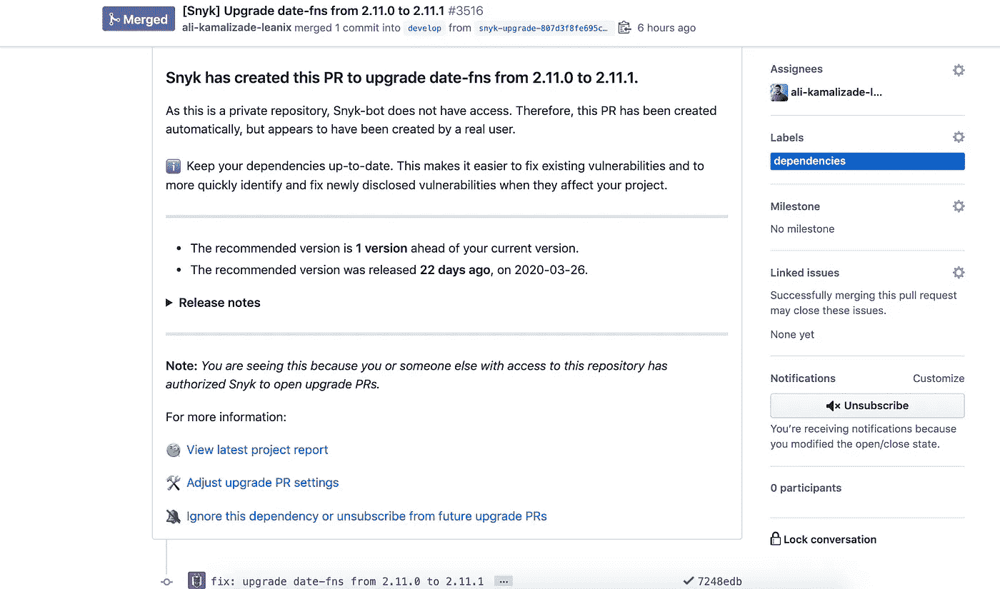

# 如何在您的软件项目中自动化依赖项更新

> 原文：<https://betterprogramming.pub/how-to-automate-dependency-updates-in-your-software-projects-8cf609e092b>

## 保持您的依赖关系安全并自动更新


卢卡·布拉沃在 [Unsplash](https://unsplash.com?utm_source=medium&utm_medium=referral) 上的照片。

对于许多开发人员来说，依赖项更新相当无聊。然而，这个话题往往被忽视和搁置。更新的范围可能从小的错误修复到安全漏洞修复，甚至是新功能。

有多种工具可用，我们将研究以下工具:

*   [dependent bot](https://dependabot.com/):仅适用于 GitHub 项目。2019 年被 GitHub 收购。
*   [Snyk](https://snyk.io/) :可用于 GitHub、GitLab、Bitbucket 和 Azure Repos。

# 易用性

所有这些产品都以相似的方式工作。通常，您有一个文件(在 JavaScript 项目中，您有一个 [package.json](https://docs.npmjs.com/files/package.json) )，您在其中声明了项目使用的依赖项。一旦有了新版本的依赖项，该工具就会检测到并创建一个简单的拉请求。pull 请求包含一些关于更新的依赖项的信息，比如 changelog。



将 date-fns 库更新到 Snyk 创建的最新版本的拉请求

您可能正在使用持续集成来构建、测试和发布您的软件。理想情况下，自动拉取请求是自动构建和测试的，因此您可以验证更新没有破坏任何东西。

# 有效期

当谈到有效性时，我的意思是，工具是否正确地更新了依赖关系？这包括几件事:

*   如果有 [package-lock.json](https://docs.npmjs.com/configuring-npm/package-lock-json.html) ，那么它应该作为依赖项更新的一部分进行更新，以确保其他开发人员和持续集成平台(如 GitLab 或 Jenkins)在安装依赖项时使用正确的依赖项版本。
*   您的工具应该支持[对等依赖性](https://flaviocopes.com/npm-peer-dependencies/)以防止依赖性更新中断。翻新目前不支持此功能。

让我们看一个例子:假设你有一个使用 Angular 8 的 Angular 项目，其中包括一些特定于 Angular 的第三方库，如 [ngx-translate](https://github.com/ngx-translate/core) 。这个库的新版本已经发布，它只能在最新的 Angular 版本上工作。您的工具创建了一个拉取请求，您合并了它，因为它看起来不错。构建甚至测试可能不会检测到新引入的问题。

# 定价

上面提到的所有工具都至少有一个有限的免费版本，使您能够很好地了解产品。对于开源项目，它们甚至大部分是免费的。

# 平台支持

Dependabot 只适用于 GitHub，而 Snyk 也支持 GitLab 和 Bitbucket。因为有些项目可能不是开源的，所以您选择的工具也应该支持私有存储库。

# 语言支持

所有这些流行的工具都支持最常用的编程语言。这包括 JavaScript、C#、Python、Java 和 PHP 等语言。一些不太常用的语言，比如 Erlang，可能并不是所有的工具都支持。

# 配置和可扩展性

配置允许您根据需要定制行为。让我们来看看一些有趣的配置选项:

*   自动合并拉取请求，从而减少所需的人工干预。
*   Git 选项:分支名称、提交消息、拉请求模板等。长什么样？
*   分配审阅者以自动提取请求。
*   更新策略:依赖关系应该如何更新？当前版本为 1.0.1 的依赖项是否应该更新到 2.0.0？
*   安排在一周或一月的某个时间进行相关性更新。您可能希望限制持续集成平台不要消耗太多时间(例如，对于私有存储库， [GitHub Actions](https://github.com/features/actions) 为免费用户提供 2000 分钟)。

下面是一个配置示例:

```
{
 "extends": [
  "config:base"
 ],
 "packageRules": [
  {
   "packageNames": [
    "angular"
   ],
   "rangeStrategy": "bump"
  }
 ],
 "rangeStrategy": "replace"
}
```

# npm 审计

我想提一下另一种替代方案，它不需要更多的工具或软件。在 NPM 版本 6 中引入，`npm audit`是一个命令，用于扫描你的项目的漏洞，并自动安装任何兼容的更新到易受攻击的依赖项。这就提出了一个问题，你是否还需要一个像 Snyk 这样的基于 SaaS 的专用解决方案。

一方面，如果你使用的是 NPM v6 或更高版本，`npm audit`是免费的。除了 Snyk 这样的 SaaS，你还可以使用`npm audit`。

另一方面，上面提到的工具对自动化这个繁琐的过程帮助很大。

# 结论

感谢阅读。如您所见，有几个选项可供选择。所有这些都是有效的选择，因为它们通过自动化繁琐的步骤使更新依赖关系变得更容易并且更不容易出错。

你如何更新你的依赖关系？请在评论中告诉我。