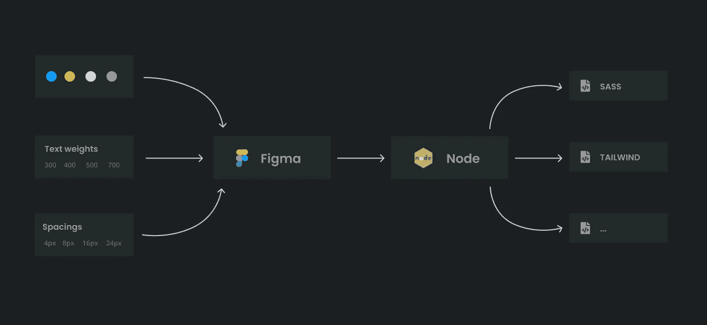
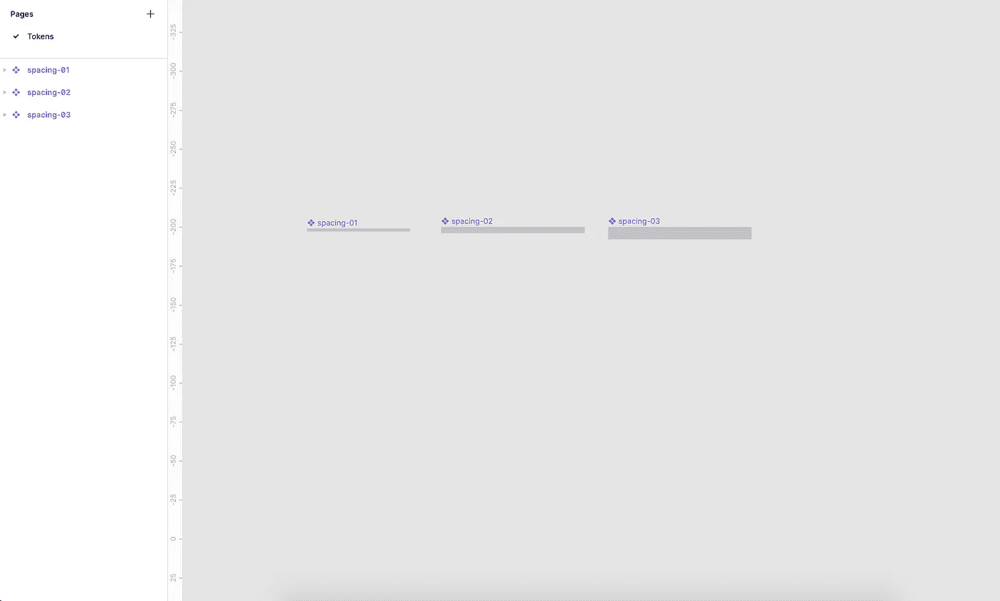
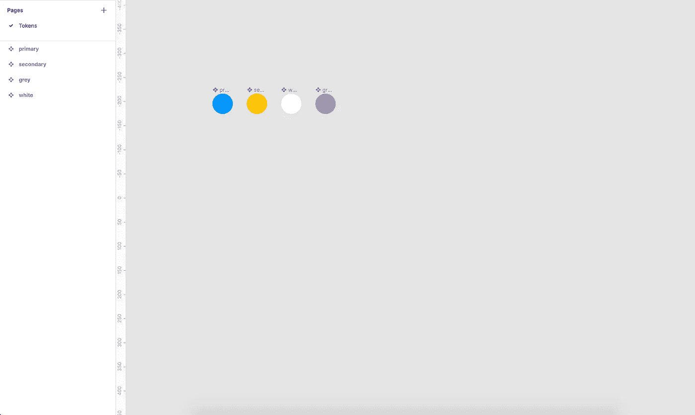
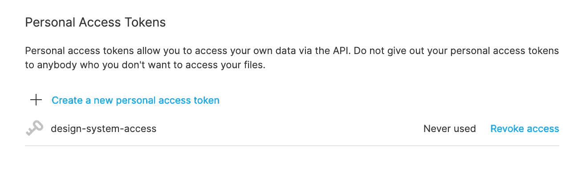

# 如何在设计系统中自动化设计令牌

> 原文：<https://betterprogramming.pub/how-to-automate-design-tokens-in-a-design-system-189d3e6fd103>

## 颜色、间距、字体粗细和字体大小都是设计的标志

诺德伍德主题公司在 [Unsplash](https://unsplash.com?utm_source=medium&utm_medium=referral) 上拍摄的照片。

在设计系统中，传统上设计和代码是有区别的。我们有设计组件外观的设计师和实现这些组件的开发人员。然而，需要一些努力来保持两者同步。

所以当我开始一个新的设计系统时，我想知道是否有可能消除一些这种摩擦。这个想法变成了创建一个自动化的过程，这个过程将保持设计工具的设计符号与其背后的代码同步。

设计记号是保持我们设计系统一致性的东西:颜色、间距、字体粗细和字体大小都是记号的例子。在理想世界中，它们遵循一个序列(4px，8px，等等。)并且总是从这个序列中选择。

这种自动化流程的好处是什么？好吧，让我们说，我们没有任何自动化到位，一个设计师改变了蓝色。他们必须与开发人员沟通，才能在代码中做出相同的更改。您能看出这会如何导致不同步的问题吗？相比之下，在自动化过程的工作流程中，设计者做出了一个改变，它会自动反映在代码中。

在本文中，我将带您了解如何建立一个自动化的过程来保持设计和代码之间的设计标记同步。

# 概观

我知道到目前为止这有点抽象。因此，下面是一个概述，让您直观地了解我们正在努力实现的目标:

自动化流程概述。

简而言之，我们选择的设计工具是 Figma。它们提供了一个很好的 API 来进行交互，这使得访问设计令牌变得更加容易。

我们将创建一个 Node.js 服务器，它将与 Figma 连接以检索标记(文本权重、间距、颜色等)。).之后，节点实例将生成主题文件供开发人员使用。

我们将生成一个包含所有变量的 Sass 和 [Tailwind](https://tailwindcss.com/) 文件，但是创建另一个主题文件(可能是一个样式化组件主题)也很容易。

# 设置 Figma 设计标志

为了让 Node.js 服务器知道如何获取设计令牌，我们需要以某种方式在 Figma 中构造它们。这就是为什么现在创建一个抽象实现很复杂的原因。一切都需要以同样的方式设置。然而，当它被设置时，该过程将顺利运行。

最好在 Figma 中为每个设计标记创建一个文件。因此，一个文件的间距，颜色，字体大小等。

在这些文件中，我们可以创建一个名为令牌的页面。我们可以用所有的值来填充这一页。对于间距，我们可以为每个值创建组件:

在 Figma 中声明间距。

在 Figma 中，我们遵循相同的过程来定义颜色:在一个名为 Tokens 的页面中创建一个新文件，其中包含颜色。命名很重要，因为这些名称将由 Node.js 服务器获取，并可供开发人员使用。

在 Figma 中声明颜色。

这是设计令牌的简化声明。我们可能想提供一些额外的结构。然而，演示这个过程如何工作就足够了。

# 创建 Node.js 服务器

为了访问 Figma API，我们需要首先生成一个个人访问令牌，Node.js 将使用这个令牌进行身份验证。

在 Figma 中创建一个是相当容易的。您可以在“个人资料”>“设置”>“个人访问令牌”中找到它。单击“创建新的个人访问令牌”并复制粘贴值。将它保存在安全的地方很重要，因为我们在下一步会用到它。

在 Figma 中生成个人访问令牌。

现在我们可以从创建 Node.js 服务器开始，它将从 Figma 获取设计令牌。为了让文章不跑题，我就不详细介绍如何设置 Node 了。参见[官方文件](https://nodejs.org/en/docs/guides/getting-started-guide/)获取说明。

我们的 Node.js 服务器需要几个依赖项:

接下来，我们可以将 Figma 个人访问令牌保存在一个. env 文件中。这样，我们可以在 JavaScript 代码中使用它:

我们首先用以下内容创建 Node.js 入口点`application.js`:

现在我们可以连接 Figma 并获取间距和颜色标记。第一步是创建一个通过我们的 PAT 连接到 Figma 的函数:

该函数可用于从 Figma 中获取所有间距值。在使用下面的代码片段之前，我们需要定义`spacingFileId`。这可以通过获取 Figma URL 来查找。这些总是以相同的方式构成:[https://www.figma.com/file/xxxx/](https://www.figma.com/file/0vZ6G51n9R7uEsj8H873WE/)。从您的 URL 中获取“xxxx”值，并将其放入`spacingFileId`变量中:

获取颜色非常相似。唯一的区别是颜色值需要转换成 RGB 值，然后我们将转换成十六进制:

这就是获取设计令牌所需的全部代码。现在我们将继续基于这些令牌生成主题文件。

# 生成主题文件

既然我们已经学习了如何从 Figma 获取设计令牌，我们可以继续生成主题文件。开发人员将使用这些主题文件来创建一致的用户界面。

## Sass 文件

让我们首先基于设计令牌生成 Sass 变量。我们可以从创建`convertToSassFile`函数开始:

这里到底发生了什么？

*   `reduce`函数将把每个设计令牌值转换成一个 Sass 变量，并组合输出。
*   我们将给每个变量一个设计系统前缀。我选择了`$tb`。
*   内容将被写入输出文件(`theme.scss`)。

这将产生以下输出:

## 顺风文件

生成顺风文件遵循相同的结构。唯一的区别是配置文件是如何构建的:

这会产生以下输出:

这些主题文件的下一步会是什么？你可以通过 NPM 发布它们，分发给每一个使用这个设计系统的项目。

将来，通过创建一个新的`convertTo`函数来支持一个新的样式机制也很容易。

# 结论

看看是否可以为设计令牌建立一个自动化的过程是非常有趣的。我认为它有很大的潜力来消除设计者和开发者之间的不同步问题。

仍然有一些可以改进的地方，比如弄清楚是否可以在每次 Figma 文件发生变化时调用 webhook 来重新生成主题文件，或者甚至可以有一个更大胆的想法，比如自动将组件变化转换为代码。