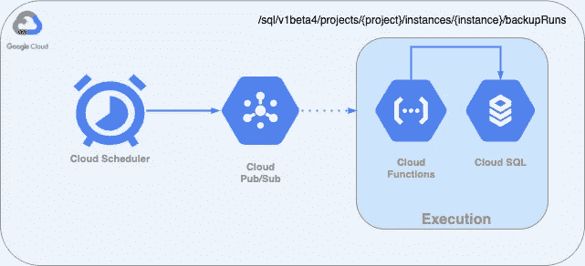

# 如何自动化谷歌云 SQL 备份

> 原文：<https://betterprogramming.pub/how-to-automate-google-cloud-sql-backups-2de6d3cc7d01>

## 使用 Google 云调度器、云功能、发布/订阅、云存储和云 IAM


肯里克·米尔斯在 [Unsplash](https://unsplash.com?utm_source=medium&utm_medium=referral) 上的照片

许多(如果不是大多数的话)企业存储了关键客户信息的异地备份，如果出现问题，这些备份确实可以挽救他们。简单地备份数据并制定有效的备份和灾难恢复计划有助于缓解各种类型的威胁。

亚马逊或谷歌等云提供商分别为 AWS RDS 和云 SQL 提供自动备份功能。

*   Amazon RDS 支持自动备份保留期，可配置为[35 天](https://aws.amazon.com/rds/features/#ha)。
*   Google Cloud SQL 为一个实例保留了[多达七个自动备份](https://cloud.google.com/sql/docs/postgres/backup-recovery/backups#what_backups_cost)，外加所有按需备份。

假设我们需要确保 Google Cloud SQL 实例最多 35 天的备份。

# **我们如何为 Google Cloud SQL 实现这一点？**

从 Cloud SQL 提供 REST API 以编程方式管理其实例这一事实出发，我们可以在该 API 的基础上构建我们的解决方案。正如[谷歌官方文档](https://cloud.google.com/sql/docs/mysql/admin-api)所述:

> REST API 由备份运行、数据库、实例、标志、操作、SSL 证书、层和用户资源定义。每个资源都支持访问和使用它的方法。例如，实例资源支持 get、insert 和 list 等方法。有关所有资源及其方法的详细信息，请参见[云 SQL 管理 API](https://cloud.google.com/sql/docs/mysql/admin-api) 。”

我们可以通过使用云调度器来调度这些 API 调用，云调度器将每天运行。它将向发布/订阅主题发布一条空消息，云函数将接收该消息并触发云 SQL 管理 API:



让我们深入了解这些组件。

根据[谷歌的文档](https://cloud.google.com/functions/docs/writing):

> “云函数可以用 [Node.js](https://nodejs.org/) 、 [Python](https://python.org/) 、 [Go](https://golang.org/) 、 [Java](https://www.java.com/) 编写，在语言特定的运行时执行。云函数的执行环境因我们选择的运行时而异(我们的解决方案将使用 [Node.js 8 运行时](https://cloud.google.com/functions/docs/concepts/nodejs-8-runtime))。
> 
> 为了让云函数找到函数的定义，每个运行时都有对源代码的结构化要求。
> 
> 对于 Node.js 运行时，函数的源代码必须从 Node.js 模块导出，云函数使用`require()`调用加载该模块。云函数使用`package.json`文件中的`main`字段来决定加载哪个模块。如果未指定`main`字段，云函数从`index.js`加载代码

`package.json` 文件内容 **:**

`index.js` 文件内容 **:**

Cloud 函数从 Pub/Sub 主题接收数据(一个空的 JSON ),对消息进行解码，并记录下来以供调试之用。

我们将注意到两个环境变量的存在，它们分别代表 Google Cloud 项目 ID 和 Cloud SQL 实例名。

值得一提的是，当一个请求被发送到 Cloud SQL REST API 时，它必须被授权。

请记住，我们只想保留 35 天的备份，因此我们需要删除较旧的备份。在这里，我们列出备份(`sqlAdmin.backupRuns.list`)并删除不符合条件的备份(`sqlAdmin.backupRuns.delete`)。

然后我们调用`sqlAdmin.backupRuns.insert` 来为任何实例创建按需备份，无论该实例是否启用了自动备份。

# 使用 Terraform 自动化云功能部署和运行时环境

这里，我们有 Terraform 模块将使用的输入变量:

模块定义:

## **步骤**

1.  我们当前的项目需要启用以下服务:

```
services_to_enable = [    "cloudscheduler.googleapis.com",    "sqladmin.googleapis.com",    "cloudfunctions.googleapis.com"  ]
```

2.云函数在`backup-trigger`文件夹中有两个文件，下面的数据源从其名为`backup_trigger.zip`的内容中生成一个归档文件:

```
data "archive_file" "backup_trigger_zip"
```

3.然后，以下资源将创建名为`cloud-function-bucket`的云存储桶:

```
resource "google_storage_bucket" "cloud_function_bucket"
```

4.它创建一个新的对象，并上传 Google 云存储中现有存储桶(cloud-function-bucket)内的云函数:

```
resource "google_storage_bucket_object" "backup_trigger_zip"
```

5.这创建了一个主题(`my-database-backup-topic`)，发布者将消息发送到该主题。我们的云功能将在每次收到关于此主题的消息时触发:

```
resource "google_pubsub_topic" "function_pub_sub"
```

6.有趣的部分来了。云函数将调用云 SQL Admin API，它需要以下权限:

```
cloudsql.backupRuns.create
cloudsql.backupRuns.get
cloudsql.backupRuns.list
cloudsql.backupRuns.delete
```

所以我们创建了一个 IAM 定制角色`sqlBackupCreator`,包含所有需要的权限。云身份和访问管理提供了预定义的角色，这些角色提供了对特定 Google 云资源的细粒度访问，但它们还提供了创建具有一个或多个权限的自定义云 IAM 角色的能力，然后将该自定义角色授予用户。

我们还需要创建一个名为`backup-trigger-cloud-function-sa`的服务帐户和一个具有自定义角色`sqlBackupCreator`的 IAM 成员。

根据[谷歌的文档](https://cloud.google.com/compute/docs/access/service-accounts):

> “服务帐户是一个特殊的帐户，计算引擎实例上运行的服务和应用程序可以使用它来与其他 Google Cloud APIs 进行交互。应用程序可以使用服务帐户凭据授权给一组 API，并在授予服务帐户和虚拟机实例的权限范围内执行操作。”

这将更新 IAM 策略以向新成员授予角色:

```
resource "google_project_iam_member" "backup_trigger"
```

7.这创建了实际的云函数，它接收触发备份 API 所需的两个环境变量:

```
resource "google_cloudfunctions_function" "backup_trigger_function"
```

8.最后一个资源将创建云调度程序，这将定期(使用 crontab 格式字符串)将空消息推送到发布/订阅主题:

```
resource "google_cloud_scheduler_job" "cloud_function_trigger"
```

[谷歌官方文档](https://cloud.google.com/scheduler/docs)显示，为了“使用云调度程序，当前项目必须包含位于受支持区域之一的 App Engine 应用。如果项目没有 App Engine 应用程序，我们必须创建一个。”

# 包扎

数据库的多云部署需要考虑备份和灾难恢复等问题，以保护我们免受不可预测事件的影响。

如果我们要对数据库执行有风险的操作，或者当我们需要确保满足托管备份和灾难恢复服务的 SLA 时，按需备份是一个可以利用的强大功能。

我们还需要小心使用这种功能，因为按需备份不会像自动备份那样自动删除。它们会一直存在，直到您删除它们或它们的实例被删除。因为按需备份不会自动删除，所以如果您不删除它们，会对您的计费产生长期影响。

继续乌云密布！