# 如何用 Heroku 和 CircleCI 自动化 Nuxt.js 部署

> 原文：<https://betterprogramming.pub/how-to-automate-nuxt-js-deployments-with-heroku-and-circleci-8eaf10aa7b17>

## 为您的 Nuxt 项目设置持续集成和部署


当团队很小的时候，手工部署一个 [Nuxt](https://nuxtjs.org/) 项目是非常容易的。然而，随着项目和团队的成长，他们通常会在他们的 DevOps 中转向持续集成和部署(CI/CD ),以自动化他们的测试和部署。这时部署以及部署的设置会变得复杂。

在本文中，我们将看看如何使用 [Heroku](https://www.heroku.com/) 和 [CircleCI](https://circleci.com/) 为一个 Nuxt 项目轻松建立一个自动化 CI/CD 系统。我们将介绍所有细节，从设置 GitHub 库到自动化测试，再到推动代码变更。然后，我们将看看一些建议的后续步骤。

# Nuxt.js 是什么？

首先，这里有一些关于 [Nuxt](https://nuxtjs.org/) 的背景知识，以及为什么开发人员会选择它作为他们堆栈的一部分。

当 [Vue](https://vuejs.org/) 刚发布的时候，开发者就爱上了。凭借其简单的模板语法和组件结构，Vue 可以轻松创建漂亮的单页面应用程序(spa)。

然而，开发者很快意识到 SEO 是一个问题。由于 SPAs 是作为 shell 部署的，并且直到运行时才插入内容，开发人员了解到搜索引擎很难准确地索引内容。因此，开发人员需要一个解决方案来处理他们的 Vue 应用程序的服务器端渲染(SSR)。

输入 [Nuxt](https://nuxtjs.org/) 。

Nuxt 是一个开源框架，它结合了所有常用的 Vue 库，捆绑了 [Vue 路由器](https://router.vuejs.org/)、 [Vuex](https://vuex.vuejs.org/) 和 [Vue 服务器端渲染(SSR)、](https://ssr.vuejs.org/)，为 Vue.js 开发者提供了一个更流畅的开发体验的架构。有了 Nuxt，开发人员可以在几分钟内启动并运行一个 SEO 友好的 Vue 应用程序(带 SSR)。

# 我们的示例项目

现在让我们看看我们的示例项目和部署设置。对于这个项目，我们将使用 GitHub 作为我们的存储库，Heroku 作为我们的主机，CircleCI 作为我们的 CI/CD 工具。

Heroku 是一个 PaaS 解决方案，可以轻松部署和管理应用程序。CircleCI 提供基于云的 CI/CD，项目代码一推送到 GitHub，就在容器中运行自动化作业。这些作业执行测试，发送成功或失败通知，然后将构建的应用程序部署到云服务环境中。

最后，我们希望我们的结果是:当我们将主分支推送到 GitHub 时，一个自动化的过程将运行我们所有的测试，然后(如果所有测试都通过)将应用程序部署到 Heroku。

为此，我将带您完成以下步骤:

```
1\. [Set up a GitHub repository](#d0dc)
2\. [Create a basic Nuxt application](#22e4)
3\. [Create the tests for our Nuxt application](#6db0)
4\. [Manually deploy the Nuxt application to Heroku](http://db0c)
5\. [Set up automated testing with CircleCI](#03b3)
6\. [Set up atuomated deployment to Heroku](#7952)
```

听起来很简单？会的。我们走吧！

# 1.设置 GitHub 存储库

本教程需要一个 GitHub 帐户。一个基本的 GitHub 免费帐户就足够了。

我们将建立一个 GitHub 存储库来存放我们的项目代码。稍后，我们将把 GitHub 帐户与 CircleCI 帐户连接起来。每当我们向 GitHub 推送代码时，这个动作都会触发一个 webhook 来通知 CircleCI 开始 CI/CD 自动化过程。

在 GitHub 的“你的存储库”页面，点击“新建”存储库按钮。

为这个私有存储库选择您想要的任何名称。对于本教程，我们称我们的存储库为`my-heroku-nuxt-app`。

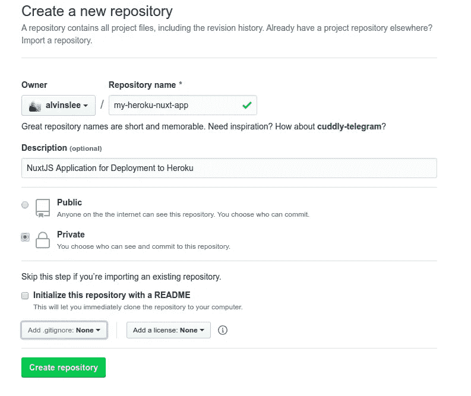

单击“创建存储库”结束操作。然后，将存储库克隆到您的本地机器上。在下面的命令中，确保使用您自己的 GitHub 用户名。注意，我们正在将空的存储库克隆到一个名为`app`的文件夹中。

```
~/$ git clone git@github.com:[GITHUB USERNAME]/my-heroku-nuxt-app.git app 
Cloning into 'my-heroku-nuxt-app'... 
warning: You appear to have cloned an empty repository.
```

非常好。现在我们有了`app`文件夹，让我们用一个闪亮的新的 Nuxt 应用程序填充它。

# 2.创建 Nuxt 应用程序

仅供参考，我们将在整个教程中使用 Node v10.20.0。我们也将使用[纱](https://yarnpkg.com/)作为我们的包装经理。

从您的`app`文件夹中，运行以下命令来创建一个新的 Nuxt 应用程序:

```
~/app$ yarn create nuxt-app
create-nuxt-app v3.0.0
✨ Generating Nuxt.js project in .
? Project name my-heroku-nuxt-app
? Choose programming language JavaScript
? Choose the package manager Yarn
? Choose UI framework None
? Choose Nuxt.js modules None
? Choose linting tools None
? Choose test framework Jest
? Choose rendering mode Universal (SSR / Static)
? Choose development tools None
```

交互式提示将要求您选择一些选项。你可以选择任何你喜欢的“项目名称”，但是重要的是你要选择我上面展示的选项。

顺便说一下，如果你想用 npm 代替 Yarn，你可以用命令`npx create-nuxt-app`代替上面的`yarn create`命令。

通过从命令行运行`yarn dev`来验证您的应用程序是否工作。您的浏览器窗口应该如下所示:


太好了！现在我们的应用程序已经启动并运行，让我们编写一些测试。

# 3.为我们的 Nuxt 应用程序创建测试

我们将只为我们的`index`页面编写测试。请记住，除了这个基本的模板 Nuxt 应用程序之外，我们不打算构建任何东西。我们的目标是学习如何对 Heroku 进行自动化测试和部署。

对于测试，我们将使用 [Jest](https://jestjs.io/) ，这是一个流行的 JavaScript 测试框架。它易于使用，速度快如闪电。当我们创建上面的 Nuxt 应用程序时，我们选择捆绑 Jest。

在`app/pages`文件夹中，创建一个名为`index.test.js`的新测试文件。我们将编写三个测试来验证我们的`index`页面是否包含某些内容。

```
// FILE: ~/app/pages/index.test.jsimport { mount } from '@vue/test-utils'
import index from './index.vue'describe('index page', () => {   
  const wrapper = mount(index)  
  describe('app title', () => {    
    const element = wrapper.find('.title')    
    it('displays app title', () => {      
      expect(element.text()).toEqual('my-heroku-nuxt-app')    
    })  
  })  
  describe('links', () => {    
    const links = wrapper.find('.links')    
    describe('nuxtjs', () => {      
      it('contains link with correct text', () => {        
        const link = links.find('[href="https://nuxtjs.org/"]')        
        expect(link.text()).toEqual('Documentation')      
      })    
    })    
    describe('github', () => {      
      it('contains link with correct text', () => {        
        const link = links.find('[href="https://github.com/nuxt/nuxt.js"]')        
        expect(link.text()).toEqual('GitHub')      
      })    
    })  
  })
})
```

让我们进行测试。我们不会关心测试覆盖率，所以让我们包括`--coverage false`标志。

```
~/app$ yarn test --coverage false
  PASS pages/index.test.js
    index page
       app title
         ✓ displays app title (3 ms)
       links
         nuxtjs
          ✓ contains link with correct text (1 ms)
         github
          ✓ contains link with correct text (1 ms)Test Suites: 1 passed, 1 totalTests: 3 passed, 3 total
Snapshots: 0 total
Time: 1.405 s, estimated 2 s
Ran all test suites.
Done in 2.21s.
```

现在，测试正在进行，让我们签入代码:

```
~/app$ git add .
~/app$ git commit -m "Create nuxt app with tests."
~/app$ git push origin
```

干得好。现在，我们有了一个经过一些测试的 Nuxt 应用程序(正在通过)，并且我们已经将我们的`master`分支推到了 GitHub。

# 4.手动将我们的应用程序部署到 Heroku

在我们构建自动化之前，让我们完成一个基本的、手动的 Heroku 部署。当我们通过 CircleCI 自动化部署时，这将帮助我们理解我们以后在做什么。

如果您还没有帐户，[用 Heroku](https://signup.heroku.com/) 建立一个新帐户。[自由计划](https://www.heroku.com/pricing)在这个例子中可以很好地工作。然后，登录您的帐户。在控制面板中，单击“新建”，然后单击“创建新应用程序”。

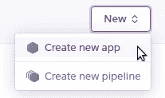

为您的应用程序选择一个名称。在本教程中，我们将使用到目前为止一直使用的名称。请注意，Heroku 上的应用程序名称在整个系统中必须是唯一的。所以有可能`my-heroku-nuxt-app`不可用。如果是这种情况，请选择另一个名称，并在我们学习本教程的过程中注意替换。


创建应用程序后，您将看到应用程序部署设置。我们将使用“Heroku Git(使用 Heroku CLI)”方法进行部署。我们将在从本地机器命令行手动部署时使用它，然后我们也将配置 CircleCI 通过命令行进行部署。

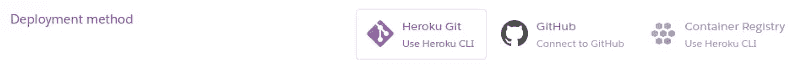

在 Heroku 的 deployment-settings 页面上，您会看到一个链接，其中包含在您的本地机器上安装 Heroku CLI 的说明。安装 Heroku CLI 后，从命令行登录 Heroku:

```
~/app$ heroku login
 heroku: Press any key to open up the browser to login or q to exit:
 Opening browser to https://cli-auth.heroku.com/auth/cli/browser/ ...
 Logging in... done
 Logged in...
```

由于这个项目的 GitHub 存储库已经存在，我们希望添加新的 Heroku remote。如果`my-heroku-nuxt-app`不可用，请确保使用您在上面选择的 Heroku 应用程序名称。

```
~/app$ heroku git:remote -a my-heroku-nuxt-app
```

接下来，我们想要设置一些 Heroku 配置变量来运行我们的生产部署。这些说明来自关于部署到 Heroku 的 [Nuxt 文档。](https://nuxtjs.org/faq/heroku-deployment)

```
~/app$ heroku config:set HOST=0.0.0.0
~/app$ heroku config:set NODE_ENV=production
```

现在，我们可以将 Nuxt 应用程序推送到 Heroku 进行部署。

```
~/app$ git push heroku
 Enumerating objects: 17, done.
 Counting objects: 100% (17/17), done.
 Delta compression using up to 4 threads
 Compressing objects: 100% (14/14), done.
 Writing objects: 100% (17/17), 167.78 KiB | 5.99 MiB/s, done.
 Total 17 (delta 0), reused 0 (delta 0), pack-reused 0
 remote: Compressing source files... done.
 remote: Building source:
 remote: -----> Node.js app detected
 remote: -----> Creating runtime environment
 remote: -----> Installing binaries
 remote: -----> Installing dependencies
 remote: -----> Build
 remote: -----> Pruning devDependencies
 remote: -----> Caching build
 remote: -----> Build succeeded!
 remote: -----> Discovering process types
 remote: -----> Compressing...
 remote: -----> Launching...
 remote: https://my-heroku-nuxt-app.herokuapp.com/ deployed to Heroku
 remote: Verifying deploy... done.
```

上面的命令是所有魔法发生的地方。Heroku 检测到这是一个节点应用程序，然后它创建适当的部署环境并安装所有依赖项。安装完依赖项后，Heroku 还会运行在您的`package.json`中找到的`build`脚本命令——这会捆绑客户端和服务器所需的所有文件。

当我们访问 Heroku 应用程序的 URL 时，我们看到我们的 Nuxt 应用程序已在网上运行:

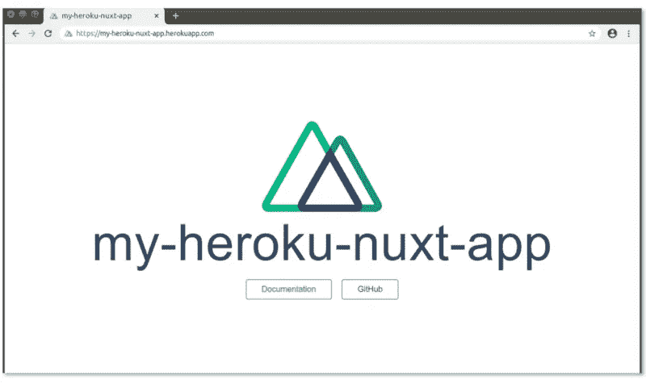

就这样…我们的 Nuxt SSR 应用程序已经被部署到 Heroku 并上线了。剩下要做的就是通过 CircleCI 构建自动化 CI/CD。

# 5.用 CircleCI 设置自动化测试

点击“使用 GitHub 登录”，在 [CircleCI](https://circleci.com/) 创建一个新账户。

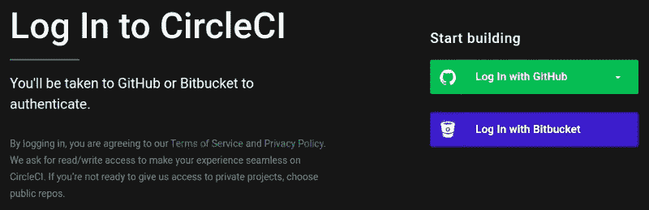

通过使用 GitHub 登录，您授权 CircleCI 访问您的所有存储库。在 CircleCI 的仪表板中，您可以选择希望 CircleCI 监控哪些 GitHub 存储库。

在 CircleCI 项目仪表板上，您会看到名为`my-heroku-nuxt-app`的 GitHub 库——点击它右边的“设置项目”按钮。

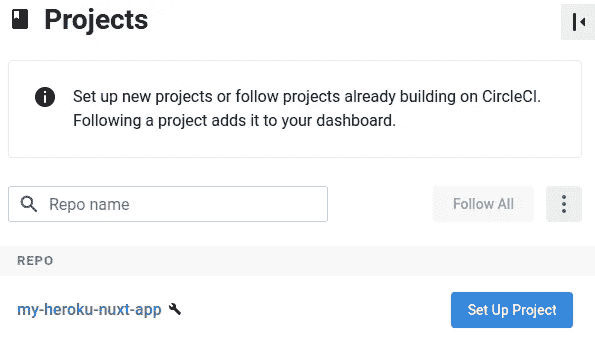

CircleCI 将为您选择一个配置模板(默认情况下，它选择“Hello World”模板)。很快，我们将提供自己的 CircleCI 配置文件。现在，选择“Hello World”，然后点击“开始构建”

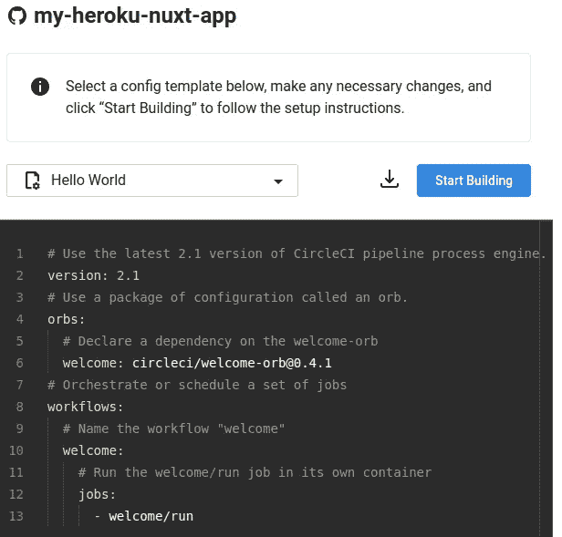

这将弹出一个模态，说明 CircleCI 将创建一个新的分支，并将这个配置模板添加到该分支。但是我们不需要 CircleCI 为我们做这些，所以选择“手动添加”

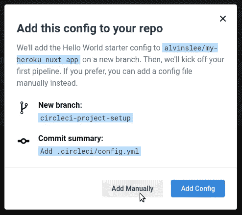

我们被告知需要在我们的存储库根文件夹中创建一个`.circleci`子文件夹，然后向该子文件夹添加一个`config.yml`。这就是我们将要做的。我们不需要下载模板`config.yml`文件，因为我们要自己编写。所以只要点击“开始建设。”

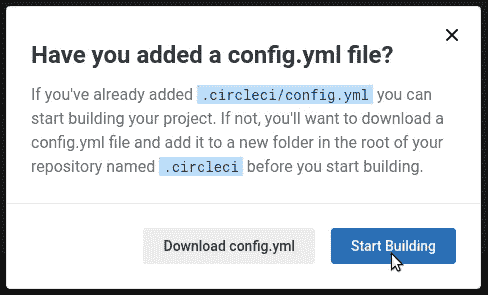

当您将项目设置为由 CircleCI 监控时(因为 CircleCI 已被授权访问您的 GitHub 存储库)，CircleCI 会在您的 GitHub 存储库设置中添加一个新的公钥。

CircleCI 将立即执行该项目的工作流程。您会注意到第一次构建尝试失败了。这是因为 CircleCI 正在项目存储库的`master`分支的`.circleci`子文件夹中寻找`config.yml`文件。该文件尚不存在，所以我们现在创建它。


在您的项目根文件夹中，创建一个名为`.circleci`的新的子文件夹:

```
~/app$ mkdir .circleci
```

在那个文件夹中，创建一个名为`config.yml`的新文件。我们将把教程的这一部分分成两个独立的部分。首先，我们将配置 CircleCI 来运行我们的测试。然后，在我们启动并运行之后，我们将继续配置 Heroku 部署。

`config.yml`的内容应该如下:

```
// FILE: ~/app/.circleci/config.ymlversion: 2.1
 jobs:
 run-test-suite:
 docker:
 - image: circleci/node:10.20.0
 working_directory: ~/project
 steps:
 - checkout
 - run:
 name: Fetch dependencies
  command: yarn install --no-progress --non-interactive --silent --pure-lockfile
 - run:
 name: Run test suite
 command: yarn test_ci
 - persist_to_workspace:
 root: ~/project
 paths:
 - .
 workflows:
 test-and-deploy:
 jobs:
    - run-test-suite
```

让我们看一下上面的配置有什么作用:

1.  我们定义了一个名为`run-test-suite`的新工作。
2.  这项工作设置了一个支持我们想要的版本的节点的环境。
3.  然后，该作业执行四个步骤。它检查存储库代码，安装依赖项，通过运行`yarn test_ci`运行测试套件，然后将当前工作区文件夹保存到机器上，这样其他作业仍然可以访问当前状态的内容。
4.  我们整体的工作流程叫做`test-and-deploy`，里面只有一个作业:`run-test-suite`。

您可能已经注意到 CircleCI 将从我们的项目文件夹中调用`yarn test_ci`来运行测试套件。但是我们还没有在我们的`package.json`脚本命令中定义`test_ci`。

我们将用一个额外的标志[来定义这个命令，这个标志告诉 Jest 以持续集成模式](https://jestjs.io/docs/en/cli)运行。这会影响 Jest 如何处理[快照测试](https://jestjs.io/docs/en/snapshot-testing)。虽然我们现在的项目中没有这些，但是您会希望记住这一点，以防将来为您的项目编写快照测试。

因为我们正在更新我们的`package.json`文件，所以让我们在运行 Jest 时也关闭代码=覆盖测试:

```
// Excerpt from FILE: ~/app/package.json...
  "scripts": {
  "dev": "nuxt",
  "build": "nuxt build",
  "start": "nuxt start",
  "generate": "nuxt generate",
  "test": "jest --coverage false",
      "test_ci": "yarn test --ci"
  },
 ...
```

现在，让我们将新的`.circleci/config.yml`文件和更新的`package.json`文件添加到 git staging，然后提交它们。

```
~/app$ git add .
~/app$ git commit -m "Add CircleCI config for testing, update package.json"
```

我们将我们的新提交推送到`master`:

```
~/app$ git push origin
```

几秒钟后，您应该会在 CircleCI 仪表板上看到这个项目的一个新管道条目。您的项目在`master`分支上的`test-and-deploy`工作流将开始执行。它将执行第一个也是唯一一个任务，即`run-test-suite`。我们的测试应该通过，一切都应该是绿色的。

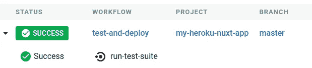

# 6.设置到 Heroku 的自动部署

最后一步，我们希望配置 CircleCI，以便在测试通过后将代码部署到 Heroku。

为此，我们需要用 CircleCI 配置修改我们的`config.yml`文件。我们将使用 CircleCI 的 [Heroku orb](https://circleci.com/orbs/registry/orb/circleci/heroku) 。CircleCI orbs 是用于简化配置的可重用包。CircleCI 有一个巨大的预建 orb 注册表，它简化了与第三方技术(如 Heroku)的集成。

我们更新后的`config.yml`应该如下所示:

```
// FILE: ~/app/.circleci/config.ymlversion: 2.1
orbs:
   heroku: circleci/heroku@1.0.0
jobs:
run-test-suite:
docker:
- image: circleci/node:10.20.0
working_directory: ~/project
steps:
- checkout
- run:
name: Fetch dependencies
command: yarn install --no-progress --non-interactive --silent --pure-lockfile
- run:
name: Run test suite
command: yarn test_ci
- persist_to_workspace:
root: ~/project
paths:
- .
  deploy-to-heroku:
   docker:
    - image: circleci/node:10.20.0
   working_directory: ~/project
   steps:
     - attach_workspace:
        at: ~/project
    - heroku/deploy-via-git
workflows:
test-and-deploy:
jobs:
- run-test-suite
   - deploy-to-heroku:
       requires:
         - run-test-suite
       filters:
         branches:
          only: master
```

以下是我们添加的内容:

1.  除了原来的`run-test-suite`工作，我们现在还有一个`deploy-to-heroku`工作。它也使用相同的节点版本和工作目录。
2.  `deploy-to-heroku`作业有两个步骤:首先，它附加到我们在前一个作业中持久化的工作区。第二，它调用`deploy-via-git`命令，该命令在 CircleCI 的 Heroku orb 中定义。本质上，它运行一个 Heroku CLI 命令，类似于我们在上面手动将应用程序部署到 Heroku 时所做的。
3.  我们已经将这个新的`deploy-to-heroku`作业添加到我们的`test-and-deploy`工作流中，但是我们对这个作业施加了一些约束。首先，它只会在成功运行`run-test-suite`作业后运行。此外，只有 CircleCI 响应 GitHub 库的`master`分支的 webhook 时，它才会运行。这意味着*所有推送到 GitHub 的*分支将导致`run-test-suite`作业的运行。但是*只有*分支`master`会继续`deploy-to-heroku`的工作。这是有意义的，因为我们当然只想将`master`分支部署到生产中。

然而，在这个新的 CircleCI 配置工作之前，我们需要用一些与 Heroku 应用程序部署相关的环境变量来更新我们的 CircleCI 项目设置。在你的 CircleCI 项目设置中，点击“环境变量”

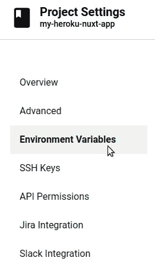

我们需要添加两个环境变量。第一个是`HEROKU_API_KEY`，可以在你的 Heroku 账号设置里找到。


单击“Reveal”，然后在 CircleCI 中复制/粘贴该值作为环境变量`HEROKU_API_KEY`的值。

CircleCI 中我们需要的第二个环境变量是`HEROKU_APP_NAME`，这是您在创建应用程序时建立的 Heroku 应用程序的名称。(对于我们的教程，是`my-heroku-nuxt-app`。)

添加这两个环境变量后，您的 CircleCI 项目设置应该类似于下图:


现在我们都准备好了，我们可以将更新后的`.circleci/config.yml`文件存放并提交到 Git，然后推送到 GitHub:

```
~/app$ git add .
~/app$ git commit -m "Update CircleCI config for Heroku deployment"
~/app$ git push origin
```

当我们向 GitHub 推送时，会发生以下情况:

1.  `master`分支上的新提交被推送到 GitHub。
2.  GitHub 接收到一个新的 push，向 CircleCI 发送一个 webhook，指明刚刚获得新提交的分支的名称。
3.  CircleCI 开始为该项目启动`test-and-deploy`工作流程。
4.  工作流中的第一个作业是`run-test-suite`。所有的测试都运行了，并且都通过了。
5.  由于`run-test-suite`成功*和*刚刚获得新提交的分支是`master`，因此`deploy-to-heroku`作业接着运行。
6.  配备了`HEROKU_API_KEY`环境变量(它授权 CircleCI 访问您的 Heroku 应用程序)和`HEROKU_APP_NAME`环境变量(它让 CircleCI 知道*要部署哪个* Heroku 应用程序)，该作业将代码推送到 Heroku。
7.  收到 CircleCI 推送的代码后，Heroku 构建 Nuxt 应用程序，然后启动服务器。

# 回顾并总结

现在你知道了。您已经为您的 Nuxt SSR 应用程序设置了完整的 CI/CD 自动化。只需将您的项目推送到 GitHub，您的项目测试就会运行，您的项目就会部署到 Heroku。

让我们快速回顾一下我们做了什么:

1.  我们为项目建立了一个 GitHub 存储库。
2.  我们使用`yarn create nuxt-app`创建了一个新的 Nuxt 应用程序。
3.  我们使用 Jest 为我们的 Nuxt 应用程序编写了测试。
4.  我们使用 Heroku CLI 将我们的项目手动部署到 Heroku。
5.  我们设置了 CircleCI，以便在我们将代码推送到 GitHub 时自动运行我们的测试套件。
6.  每当我们将`master`分支推送到 GitHub 并且所有测试都通过时，我们设置 CircleCI 来自动部署到 Heroku。

# 后续步骤

你现在已经有了更上一层楼的基础。从现在开始，你可以采取哪些后续步骤来发展这些新知识？

*   在这个基本的 Nuxt 应用程序上扩展，您可以通过全面的测试构建新的特性。既然您已经自动化了测试运行和到 Heroku 的部署，那么您需要担心的就是编写测试、编写代码和推送至 GitHub。
*   或者，如果您已经有了一个现有的 NuxtJS 应用程序，那么您可以将 Heroku 部署和 CircleCI 自动化步骤应用到您现有的项目中。在不到一个小时的时间内，您可以构建 CI/CD。

因为将 Nuxt SSR 应用程序部署到 Heroku 是如此的快速和简单，所以您减少了上线时遇到的摩擦。随着 CI/CD 融入到您的开发过程中，您将自己和您的团队从交付代码的另一个任务清单中解放出来。

*经同事*[](https://medium.com/@alvinslee)**许可发表。**