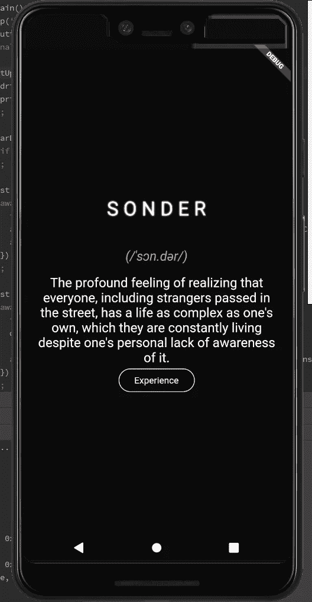
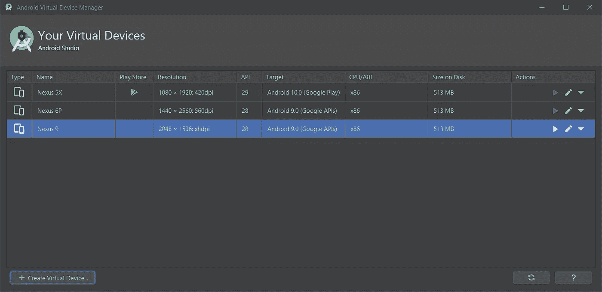
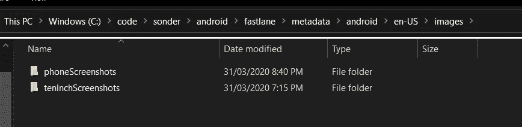
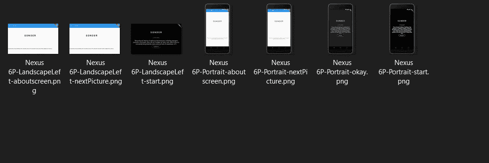

# 如何在你的 Flutter 发布工作流程中自动截图

> 原文：<https://betterprogramming.pub/how-to-automate-screenshots-in-your-flutter-publishing-workflow-d9002206710b>

## 在部署新版本的应用程序时自动截图


图片由[agency followeb](https://unsplash.com/@olloweb?utm_source=medium&utm_medium=referral)在 [Unsplash](https://unsplash.com?utm_source=medium&utm_medium=referral) 上拍摄。

嘿，大家好！在这篇文章中，我们将看看如何用我们的 Flutter 应用程序自动截图。原因很简单:每次我们更新应用程序，我们可能会花几个小时拍摄新的截图等等。如果我们能自动化这个过程，那不是很好吗？

嗯，我们可以！让我们继续读下去，找出答案。

在本文中，我们将了解:

*   编写集成测试。
*   使用截图包来截图。
*   设置不同的模拟器来代表不同的设备，并在这些设备上截取屏幕截图。
*   使用截图运行集成测试。

# 设定期望

在我个人看来，这种特殊的前进方式有点随意，也不像应该的那样容易。说到软件开发，我是“有话直说”的超级粉丝如果有些东西易于阅读，那么在未来很长一段时间内，排除故障/调试/改进将会很容易。反之亦然:如果某样东西很难读懂，那么将来也很难继续努力。人们会回避触摸它，等等。

当然，当谈到核心应用程序时，这非常重要。你希望它易于理解和使用。它在较小程度上适用于您编写的测试，或者在这种情况下，您编写的截屏代码。如果你在你的应用程序中写了可怕的代码，事情会变得很糟糕——你应该预料到这一点。

但是你为你的测试写的代码呢？你应该用同等的标准来衡量自己吗？我不这么认为。你只是告诉电脑如何浏览你的应用程序，按什么按钮，等多长时间。如果你的测试有点乱，也不是特别优雅，只要他们完成了他们设定的目标(即测试应用程序)，那就没问题。

为什么我一直在说这个？嗯，目前在 Flutter 中编写自动化测试需要一些非常奇怪的变通方法。但好处是不用手动获取自己的截图。

所以让我们继续努力。

# 克隆我们的示例应用程序

我知道你想用自己的应用程序来实现这一点，但我鼓励你先克隆我的示例应用程序并让它与它一起工作。如果它确实能做到这一点，那么你就有更好的机会让它与你的应用程序一起工作。

# 开始设置我们的第一个集成测试

我们将要测试的应用程序如下所示:



集成测试在 GitHub 上[。](https://github.com/flutterfromscratch/sonder/blob/master/test_driver/main_test.dart)

第一个测试我们点击体验按钮，然后截图结果。

这大部分是有意义的，但是在上面的函数中有一些奇怪的部分。可能引起您注意的两个参数是`driver.runUnsynchronized`和`screenshot`函数上的`waitUntilNoTransientCallbacks`参数。这个故事的简短版本是，如果我没有在我的测试中包括这些，要么驱动程序无法找到我的部件进行交互，要么截图包将无限期挂起，不会产生结果。

如果你真的想，你可以在`runUnsynchronized`上阅读[文档](https://api.flutter.dev/flutter/flutter_driver/FlutterDriver/runUnsynchronized.html)。是的，我真的不明白为什么会有这种行为。

`waitUntilNoTransientCallbacks`也是类似的故事。在截图包中，当这为真时(默认情况下如此)，它调用`waitUntilNoTransientCallbacks`，最终(总是)超时。理论上来说，[文档](https://api.flutter.dev/flutter/flutter_driver/FlutterDriver/waitUntilNoTransientCallbacks.html)听起来不错，而且它特别指出这些在用截图做事情时很好用。

当然，这有点像查字典对“土豆”的定义，看到的定义只是“土豆”。文档(无益地)说这个函数只是“等待，直到队列中不再有瞬态回调。”你知道什么是短暂回调吗？我真的不知道，但是话说回来，也许我只是一个超级普通的开发人员，你完全知道这意味着什么。

但是我们如何在本地运行呢？

# 正在设置

我们将使用[截图包](https://github.com/mmcc007/screenshots)开始。超快速设置指南是这样的(在 Windows 上)。

1.  安装[巧克力糖](https://chocolatey.org/)。
2.  安装 ImageMagick。

```
choco install imagemagick.app
```

3.激活截图包。您必须直接从 GitHub repo 中激活软件包:

```
flutter pub global activate -sgit [https://github.com/mmcc007/screenshots](https://github.com/mmcc007/screenshots)
```

4.在示例 app 中，看`screenshots.yaml`。它包含在哪些设备上运行截图的配置。

5.接下来，创建您想要创建截图的设备，并将其命名为与`screenshots.yaml`中的设备完全相同的名称。



请注意，模拟器的名称与它们在 screenshots.yaml 文件中的名称完全相同。

6.启动所有仿真器至少一次并保存一个状态。有时，如果设备启动时间过长，测试/截图包会超时并失败。

7.打开命令提示符，键入`screenshots`，然后按回车键。您应该会看到所有的模拟器都启动了，截屏开始了，过程结束了。



截图是按设备拆分的。



截屏遵循设备名称-方向-测试 Name.png 惯例。

## 常见问题

我在运行屏幕截图时出现以下错误:

```
Unhandled exception:
type ‘List<dynamic>’ is not a subtype of type ‘String’
```

出现此错误是因为您激活了已发布的版本的截图，而您本应激活截图的主分支。`configuration.yaml`的用法略有变化。

“但我做到了！而且还是不行。”

你可能需要核选项。

按照 Git 存储库上的说明，我已经在我的机器上设置了到`pub`的本地路径，它位于我的`%APPDATA%`目录中。我不得不删除这些添加的东西，只使用`flutter pub` 而不是直接使用`pub` 命令。然后一切开始运转。

# 感谢阅读

这是一个相当脆弱的过程。所以如果你遇到了困难，请在评论中告诉我，我会尽全力帮助你。

自动截图，呜呜！