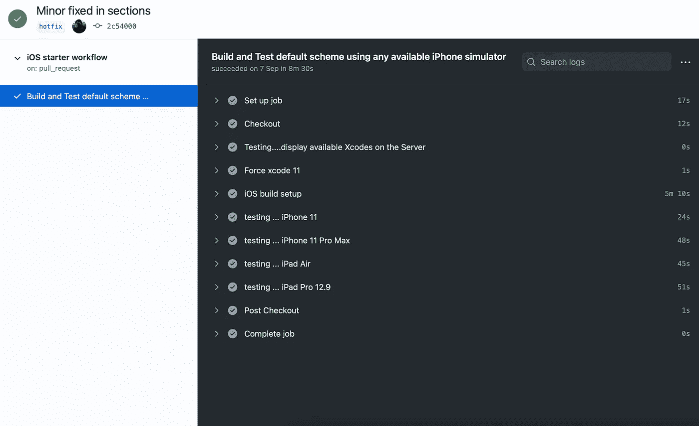

# 如何用 GitHub 动作自动化 XCTests

> 原文：<https://betterprogramming.pub/how-to-automate-xctests-with-github-actions-6570fcd21519>

## 通过 CI/CD 自动化优化您的时间，专注于重要的事情


由[朱莉·莱马尼](https://unsplash.com/@julielaiymani?utm_source=medium&utm_medium=referral)在 [Unsplash](https://unsplash.com?utm_source=medium&utm_medium=referral) 上拍摄的照片。

自从 2018 年 GitHub 推出 GitHub Actions 以来，开发者现在有了一个强大的工具，可以为 CI/CD 创建复杂的管道，而无需依赖第三方软件。

如果你和一个由多人组成的团队一起工作过，你就会知道很多事情可能会出错。许多代码可能会因为一个错误的推送/合并的提交或者一个不太注意其他人代码的用户提交而中断。

克服这一点的最明显的方法是创建一个可靠的测试套件，它会随着时间的推移而增加，并告诉您是否有问题需要修复，或者您的代码是否与以前的代码非常匹配。

测试可以有很大的变化，随着项目的增长，测试套件也会变化。有 UI 和单元测试，每一项都需要在不同的设备上用不同的场景进行测试。谁愿意等 15 分钟来完成你的测试呢？GitHub Actions 是来拯救我们的，并且会完成这项工作。

从现在开始，我将使用我的测试应用程序 test app 中的一些测试。

让我们首先创建一个. yml 文件，它将包含我们的 XCTest 工作流。我将它命名为`xctest-workflow.yml`，它需要放在`.github/workflows`文件夹中，以便 GitHub 识别并执行它。

这是工作流程的样子:

# 工作流定义

在第 1-8 行，我们给工作流本身起了一个名字，并指示它应该在每次有到主分支的 push 或者在主分支上发出 pull 请求时运行。你可以添加更多的分支或定制你想要它运行的时间。

查看 [GH 行动文件](https://docs.github.com/en/free-pro-team@latest/actions/reference/workflow-syntax-for-github-actions#on)中的所有可能事件。

# 工作流作业

在第 9-41 行，我们定义了你的工作流程。在这个代码片段中，我保持内容简单，但是您可以定义更多的作业来运行第 1-5 行指定的事件。在 [GH 行动文档](https://docs.github.com/en/free-pro-team@latest/actions/reference/workflow-syntax-for-github-actions#jobs)中了解更多相关信息。

如您所见，我调用作业`build`并指示它应该在 macOS 操作系统上运行。紧接着，我定义了五个不同的步骤，将在五个不同的 iOS 设备上测试我的代码。

这里的核心命令是:

```
xcodebuild test -workspace TestApp.xcodeproj/project.xcworkspace -scheme TestApp -destination 'platform=iOS Simulator, name=iPad Air (3rd generation),OS=13.7'
```

这个命令将在 iPad Air 模拟器上测试我的测试套件中包含的所有代码。

# 推了就忘了

现在，如果您已经正确地复制了所有步骤，那么当您将请求内容推/拉到您的主分支时，您应该会在 Actions 面板中看到一些内容:



成功运行 GitHub 操作

如果跑步成功，您应该会在所有步骤旁边看到一个勾号。真正有用的是，如果您的运行失败，GitHub Actions 会立即通过电子邮件通知您作业失败。因此，如果你在下班前将数据推送到一个远程服务器，而在上下班途中没有收到电子邮件，你会知道一切都很好。

# 结论

在这篇文章中，我只是触及了 GitHub 动作的皮毛。我肯定会在将来讨论更高级的东西，但是现在，我希望您已经喜欢了对 CI 自动化的介绍。