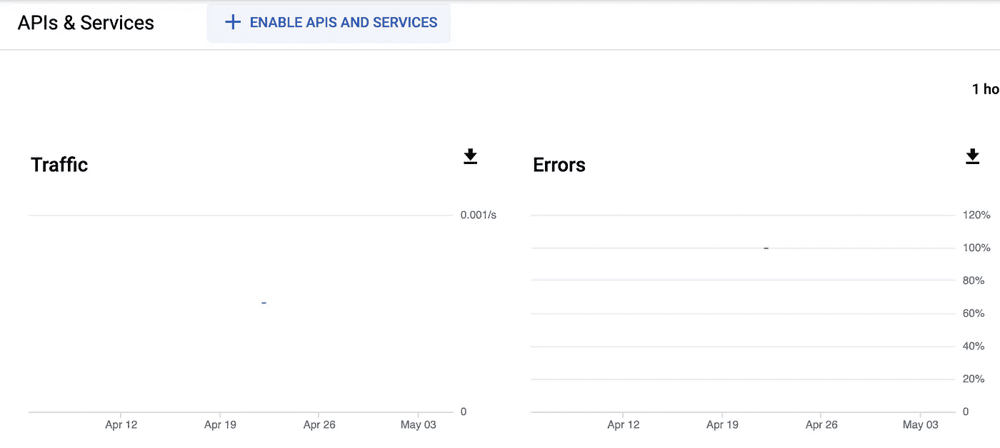
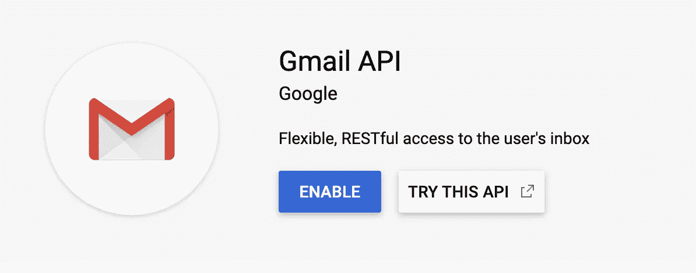

# 如何使用 Python 自动处理电子邮件

> 原文：<https://betterprogramming.pub/how-to-automate-your-emails-with-python-386b4e2d5395>

## 使用 Gmail API 将收集到的数据发送到电子邮件


[webaro](https://unsplash.com/@webaroo?utm_source=unsplash&utm_medium=referral&utm_content=creditCopyText)在 [Unsplash](https://unsplash.com/s/photos/gmail?utm_source=unsplash&utm_medium=referral&utm_content=creditCopyText) 上的照片

使用 Python 自动执行日常任务非常简单。通过结合使用 API 和易于理解的库，您可以轻松地设置系统来清理网站、发送电子邮件以及管理数据和分析。

在企业领域，需要实现自动化的一个非常常见的任务是能够收集公共政府数据。这些信息通常来自 data.gov 等网站和其他终端，目的是获取医疗保健、贸易、交通、法律等方面的信息。

实际上，有很多政府机构网站都处于某种程度的隐蔽状态，但它们仍然能够生成大量有价值的数据，供价值数十亿美元的公司进行数百万美元的决策时使用。

在本文中，我们将概述如何编写 Python 脚本，以便下载一组特定的政府数据，然后将这些数据上载到电子邮件中，并将其发送给任何人。

这将让您在使用 Gmail API 的同时，还能放心地使用 [Python 请求库](https://requests.readthedocs.io/en/master/)。因此，如果您希望使用 Python 自动处理未来的电子邮件，这是一个很好的起点。

# 使用 Python 下载文件

对于第一步，我们实际上需要使用 HTTP 请求下载数据文件。

Python 的伟大之处在于，编写类似 HTTP 请求这样的代码的复杂性已经被消除。相反，您可以导入 Requests 库并使用它来发布和获取请求。

在这种情况下，我们要下载的文件甚至在下面的链接处有一个简单的结束点。因此，您不需要使用像 Selenium 这样的[库来尝试单击下载按钮](https://medium.com/better-programming/4-basic-python-tips-to-automate-your-workflow-befabe140b83)。

即使有一个下载按钮，您也应该考虑检查它是否附有 URL。通常情况下，如果有一个 URL，那么使用一个链接下载要比创建一个寻找要单击的按钮的网络爬虫简单得多。

```
https://data.medicaid.gov/api/views/u72p-j37s/rows.json?accessType=DOWNLOAD
```

此文件提供有关 Medicaid 和个人登记者的信息。这对于医疗保健提供商来说很有价值，他们可以将其与内部数据绑定，以帮助更好地了解自己的市场。

为了下载，我们将使用函数 `requests.get()`。这将允许我们使用 HTTP 请求将数据拉至我们指定的 URL。

例如，您可以查看下面的脚本:

它简短明了，将把 CSV 作为您现在设置为变量的请求的一部分返回。我们将在稍后创建电子邮件时使用它。但是接下来，我们需要为 Gmail API 设置凭证。

# 设置您的 Gmail API

Google 让你设置 API 变得非常容易。你可以去[谷歌 API 控制台](https://console.developers.google.com/)。在那里，您可以选择启用 API 和服务，然后搜索 Gmail API。

API 控制台如下图所示。



单击该按钮后，您将获得一个搜索引擎，允许您搜索各种 API。它将看起来像下面的图像。

你可以在 Gmail 中输入，它应该是唯一显示的。


然后你可以选择 Gmail API，它旁边会有一个启用按钮。



单击 Gmail API 上的启用后，您可以下载您的凭据或使用 API 密钥和密码。

我们的代码将使用 JSON 下载，但是如果您喜欢的话，可以将其转换成 pickle。


设置完成后，我们现在可以开始构建您的函数来设置并自动发送您的电子邮件。

# 使用 Gmail API 发送电子邮件

既然我们已经找到了提取这些数据的方法，我们需要弄清楚如何实际发送电子邮件。

为了做到这一点，我们将使用[电子邮件](https://docs.python.org/3/library/email.examples.html)库。这个库将让我们建立电子邮件的各个部分:发件人、收件人、主题等。

我们在电子邮件中使用`[MIMEBase](https://docs.python.org/2/library/email.mime.html)`类来实现这一点，这使得设置正确的数据点变得容易，并为 Gmail API 提供了一个简单的类，以便在将来解析。

使用`MIMEBase`类非常简单，因为您可以启动一个新类，然后引用许多所需的组件，如:

```
message[‘from’] = test@gmail.com
```

您可以在下面看到我们设置这些参数的整个功能。

你会注意到在最后，我们使用了函数`urlsafe_b64encode`。这将把消息设置为字节。这将用于轻松地将电子邮件数据传输到 Gmail API。所以很容易传递下去。

现在终于到了发送你的第一封自动邮件的时候了。

# 使用 Python 发送您的第一封自动电子邮件

现在，您已经设置了 Gmail API 凭据，我们可以发送第一封电子邮件了。

我们将使用我们为 Gmail API 和凭证设置的服务变量。

这在下面的功能`send_message`中显示。

从这里开始，我们需要做的就是传递消息并执行。

至此，我们发出了第一封电子邮件。

整个脚本看起来像下面的代码。

# 是时候开始自动化了

我们希望这个脚本能帮助你用 Python 自动化未来的电子邮件，以及寻找你可以自动化的其他任务。

在上面的例子中，我们手动安排这个脚本。然而，在未来，如果你想更有效地自动化这个[，你可以使用一个像气流](https://www.theseattledataguy.com/data-engineering-101-writing-your-first-pipeline/)这样的框架。然后，您可以每天运行该脚本，而不是手动运行该脚本。

我们不建议尝试构建您的自动化框架，尤其是当有这么多好的选择时。这就是为什么我们只展示剧本。

就这样，祝你好运和快乐的自动化！