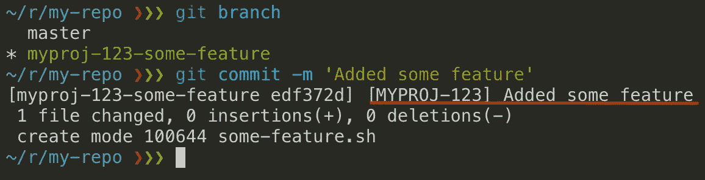

# 如何自动在您的提交消息前添加一个票号

> 原文：<https://betterprogramming.pub/how-to-automatically-add-the-ticket-number-in-git-commit-message-bda5426ded05>

## prepare-commit-msg git 挂钩的实际用例


[波莱特·伍滕](https://unsplash.com/@paullywooten?utm_source=unsplash&utm_medium=referral&utm_content=creditCopyText)在 [Unsplash](https://unsplash.com/s/photos/happy-coder?utm_source=unsplash&utm_medium=referral&utm_content=creditCopyText) 上拍摄的照片

您不必为每次提交手动输入票号！

一旦分支名称包含了那个引用，您就可以设置 git 挂钩来为您做这件事！



Git 允许您使用`prepare-commit-msg` [钩子](https://git-scm.com/book/uz/v2/Customizing-Git-Git-Hooks)拦截提交消息。

这个钩子是 Git 在提交之前调用的一个可执行文件。它接受一个参数—包含提交消息的目标文件名。

```
# GIT executes the prepare-commit-msg hook internally like:$ .git/hooks/prepare-commit-msg .git/COMMIT_EDITMSG
```

任务是准备一个基于分支名称的定制消息，并将其写回到`.git/COMMIT_EDITMSG`文件中。

下面是 bash 中的一个示例实现:

```
#!/bin/bash
FILE=$1
MESSAGE=$(cat $FILE)
TICKET=[$(git rev-parse --abbrev-ref HEAD | grep -Eo '^(\w+/)?(\w+[-_])?[0-9]+' | grep -Eo '(\w+[-])?[0-9]+' | tr "[:lower:]" "[:upper:]")]
if [[ $TICKET == "[]" || "$MESSAGE" == "$TICKET"* ]];then
  exit 0;
fi

echo "$TICKET $MESSAGE" > $FILE
```

`TICKET`变量在括号中包含一个提取的票号，比如:

*   `myproj-123-some-feature` → `[MYPROJ-123]`
*   `feature/myproj-456-some-other-feature` → `[MYPROJ-456]`
*   `bugifx/myproj-789` → `[MYPROJ-789]`
*   `123_some_feature` → `[123]`

好了，现在复制脚本并放在`your-repo/.git/hooks/prepare-commit-msg`中，使用`chmod`命令:`chmod +x your-repo/.git/hooks/prepare-commit-msg`使其成为可执行文件。

观看它的实际应用:


使用内嵌提交自动生成的票据编号。


在文本编辑器中自动生成的票号(不带-m 开关提交)。

你可能已经注意到了这种情况:

```
if [[ $TICKET == "[]" || "$MESSAGE" == "$TICKET"* ]]
```

这是为了防范:

*   当脚本无法提取时，一个空的票号
*   当消息已经包含一个冗余票据编号时(例如，当修改提交时)

仅此而已。感谢您的阅读！