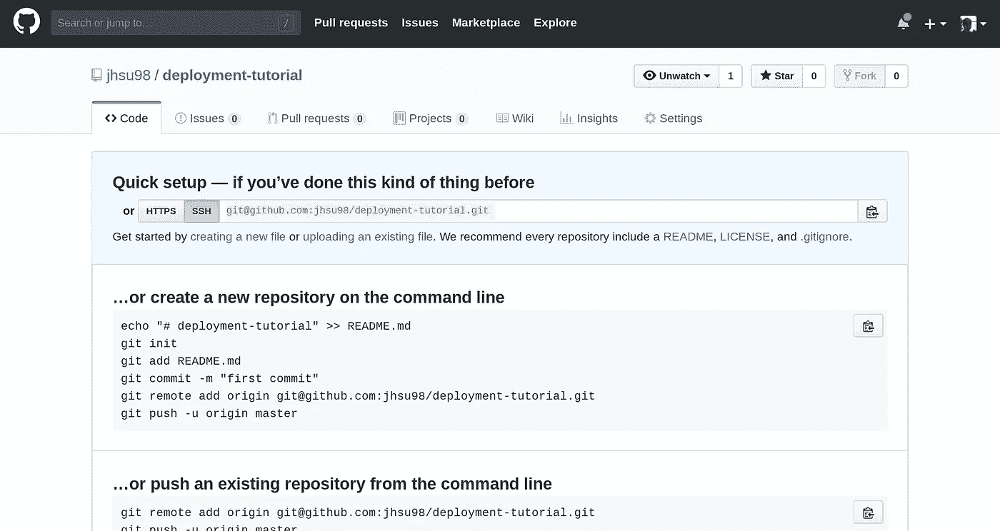
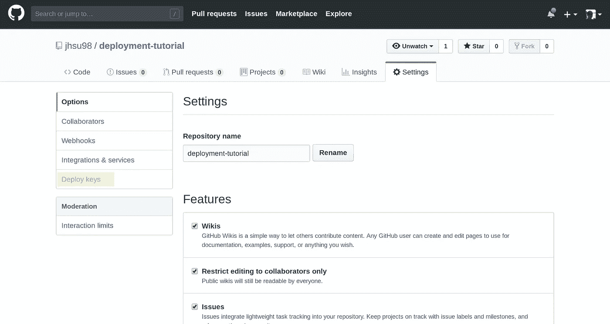
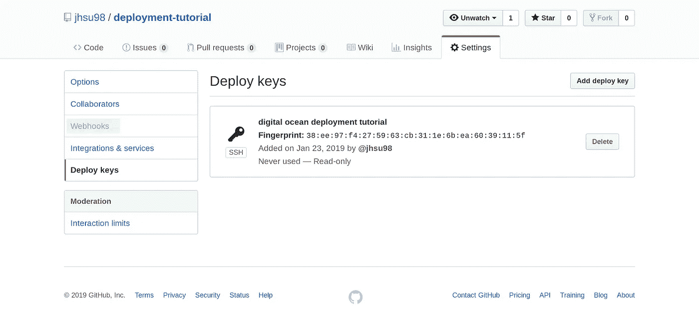
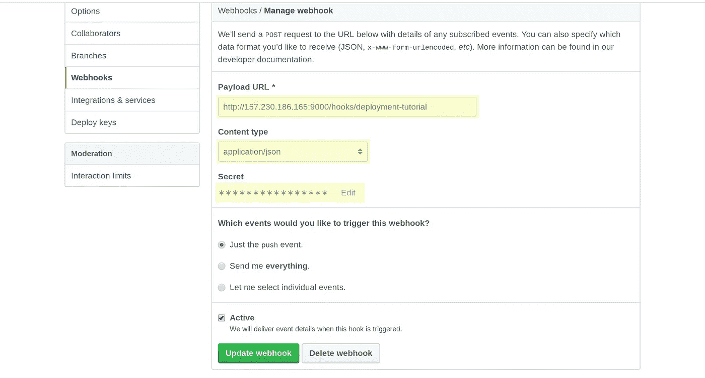

# 如何使用 Webhook 从 GitHub 自动部署到服务器

> 原文：<https://betterprogramming.pub/how-to-automatically-deploy-from-github-to-server-using-webhook-79f837dcc4f4>

## 一种将代码部署到生产服务器的方法


由[李·坎贝尔](https://unsplash.com/photos/6njoEbtarec?utm_source=unsplash&utm_medium=referral&utm_content=creditCopyText)在 [Unsplash](https://unsplash.com/search/photos/computer-code?utm_source=unsplash&utm_medium=referral&utm_content=creditCopyText) 拍摄的照片

我已经养成了在 GitHub 上创建和管理 git 仓库的习惯。这比把所有东西都放在 Google Drive 上，或者更糟糕的是，放在我的硬盘上要好得多。但是这个问题总是困扰着我，

> 如何将我的代码部署到生产服务器上？

我的大部分搜索将我引向 [Jenkins](https://jenkins.io/) 和其他持续集成解决方案，但是我不想要那么多的开销——毕竟，可以说这不是我的日常工作。我寻找的是一个不涉及新客户的解决方案，以及相对较低的技术准入门槛。幸运的是，在我的搜索中，我偶然发现了 SaaS 的产品 [HookDoo](https://hookdoo.com/) ，这让我想到了[web hook](https://github.com/adnanh/webhook)——驻留在服务器上的、免费使用的、前者的底层技术。

> Webhook 允许我在任何时候对回购执行推送时自动检索最新的代码

出于本教程的目的，我们将使用一个新创建的带有 Ubuntu 16.04 的[数字海洋](https://www.digitalocean.com/) droplet 作为我们的生产服务器。为了最大限度地减少实现所需的步骤，我将作为根用户做所有的事情。

# 从 GitHub 开始

如果您想使用现有的回购协议，那太好了！你可以记下宋承宪 URI，你可以走了。如果还没有，创建一个新的存储库并复制 SSH URI。



# 安装 Go 和 Webhook(数字海洋水滴)

在我们开始之前，让我们先做一个快速更新和升级，因为我们有一个全新的 Ubuntu 16.04 安装。

```
sudo apt update -y && sudo apt upgrade -y
```

升级完成后，我们需要安装 [Go 编程语言](https://golang.org/)，这是安装 [Webhook](https://github.com/adnanh/webhook) 的先决条件。在撰写本文时，最新的稳定版本是`1.11.4,`，所以根据需要修改版本号。

```
wget [https://dl.google.com/go/go1.11.4.linux-amd64.tar.gz](https://dl.google.com/go/go1.11.4.linux-amd64.tar.gz) 
sudo tar -C /usr/local -xzf [go1.11.4.linux-amd64.tar.gz](https://dl.google.com/go/go1.11.4.linux-amd64.tar.gz)
export PATH=$PATH:/usr/local/go/bin
```

安装完成后，下载最新版本的 Webhook。

```
go get github.com/adnanh/webhook
```

没有进度条，所以不要惊慌。完成后，您可以通过查找文件`~/go/bin/webhook`进行确认

现在已经安装了 Webhook，我们需要为配置、路由和部署脚本创建目录结构和文件。

```
mkdir ~/webhooks
mkdir ~/webhooks/deployment-tutorial
touch ~/webhooks/hooks.json
touch ~/webhooks/deployment-tutorial/deploy.sh
chmod +x ~/webhooks/deployment-tutorial/deploy.sh
```

文件`hooks.json`将保存我们的配置和路由，而`deploy.sh`将是我们的 bash 脚本，用于执行从 GitHub 更新所需的命令。

首先，通过在您喜欢的命令行文本编辑器中打开文件来设置`hooks.json`。该文件是我们运行 Webhook 时将创建的端点的配置。该文件是一个对象数组，其中每个对象都是唯一的端点。

```
[{
    "id": "deployment-tutorial",
    "execute-command": "/root/webhooks/deployment-tutorial/deploy.sh",
    "command-working-directory": "/root/deployed-site/",
    "response-message": "Executing deploy script...",
    "trigger-rule": {
        "match": {
            "type": "payload-hash-sha1",
            "secret": "The Returners",
            "parameter": {
                "source": "header",
                "name": "X-Hub-Signature"
            }
        }
    }
}]
```

*   **id:** 将在端点 URL 中使用的唯一名称
*   **execute-command:** 调用端点时要执行的脚本
*   **命令工作目录:**运行*执行命令*时所在的目录
*   **触发规则:**一个可选属性，我们将使用它通过秘密密码保护端点

> *关于*执行-命令*和*命令-工作-目录的值的说明:*因为我是作为根用户这样做的，所以路径从* `*/root*` *开始，但是如果我是一个登录的用户，它将是* `*/home/username*` *在那里你替换用户名。不要使用* `*~/*` *来开始路径，它必须是一个绝对路径，否则你会收到一个错误。*

您会注意到我们设置了一个尚不存在的工作目录。我们会回到这个话题，但首先让我们以`deploy.sh`结束

bash 脚本必须总是以 shebang 开头。您可以在打开文件之前通过键入`which bash`来确认这一点。将以下命令添加到脚本中:

```
#!/bin/bash

git fetch --all
git checkout --force "origin/master"
```

就是这样。我们已经安装了 Go 和 Webhook，在`hooks.json`中设置了配置，并编写了部署脚本，该脚本将更改到指定的目录，并从我们即将发布的 GitHub repo 中提取主分支。

最后，在用 Droplet 的实际 IP 地址替换了`000.000.000.000`之后，让我们通过键入以下命令来启动 Webhook。

```
/root/go/bin/webhook -hooks /root/webhooks/hooks.json -ip "000.000.000.000" -verbose
```

您会注意到输出声明 *serving hooks on…* 然后打印一个 URL，结尾是`{id}`。这将是我们在`hooks.json`文件中创建的对象的 id:*部署教程*。

# 设置 Git(数字海洋水滴)

我们还没有完成我们的服务器。打开另一个终端窗口，重新认证进入我们的服务器，因为我们的第一个窗口现在运行 Webhook。还记得一开始的那个 URI 仓库吗？我们现在要用它了。

移至`hooks.json`中定义的工作目录，并在*原点*后输入以下内容，替换您的唯一回购 URI:

```
git init
git remote add origin git@github.com:jhsu98/deployment-tutorial.git
```

我们在服务器上的最后一步是生成一个 SSH 密钥对，在连接到 GitHub 时使用。在终端窗口中键入`ssh-keygen`，并通过按`ENTER`确认提示，直到生成您的密钥。通过键入`cat ~/.ssh/id_rsa.pub`打印出公钥，并复制打印出来的密钥，看起来应该像这样:

```
ssh-rsa AAAAB3NzaC1yc2EAAAADAQABAAABAQCyzJrPVOJqsTqD2R3xirTp3VNMwpmJMyLklzJg4sRQyslTUmbNNmDVO573EbXQQf2PqPQljqKDDlSaELdav4OTi1gPCoDary300yUqC/efLGHflZ6pMNuGsP2zTzerD/TMjzl1FXF1wOGTXqcC4TvGBS1bFyUY5n8wSOJ8ntZ6bBNv0zA2t7X1vH8ahIBJLKCayq9ipobKlHPYqxBt6zAoeh/ILQ0PWhGkmbGqqzqN1jcVWOefLgj4Dl8bZWORS1nkqrVg2wFC2nnibH97kZLsNrdQaeK8jUrkUWkJcUELI02mkkqh2RtBx9EwQEvsm9YuDBD9xF+HyuWoAeqcKerb root@github-webhook-tutorial
```

现在剩下的就是配置我们的 GitHub repo 并测试我们的部署。

# 配置部署密钥和 Webhooks (GitHub)

在浏览器中，点击齿轮图标，进入回购设置。我们将首先设置一个部署密钥，因此单击那里。



当您添加密钥时，给它一个名称，然后粘贴上面打印的密钥。GitHub 只允许你在一个地方使用一个公钥，所以如果你有多个站点要部署到同一个服务器上，你将需要多个密钥。一旦制作了密钥，就进入 Webhooks 部分。



有三个字段需要注意:*有效载荷 URL* 、*内容类型*和*秘密*。有效负载 URL 是 Webhook 监听的端点，内容类型是数据的格式，秘密是来自您的`hooks.json`配置的自定义字符串。本教程的秘诀是`The Returners`



当您创建 webhook 时，您应该会在设置下方看到一个复选标记，这意味着成功到达了服务器。检查您运行 Webhook 的终端——您应该看到回购被提取。

就是这样！为了全面测试工作流，如果还没有将 repo 克隆到您的本地机器上，那么将更改推送到主分支——您也应该在服务器上看到更改。

在练习了几次之后，我现在花了大约 10 分钟来设置——但那是在几个小时的反复试验之后。以下是最让我烦恼的事情:

*   使用`hooks.json`配置值的绝对路径
*   不使`deploy.sh`成为可执行文件
*   GitHub 和服务器第一次交互时接受 SSH 连接
*   在 bash 脚本中使用错误的 shebang