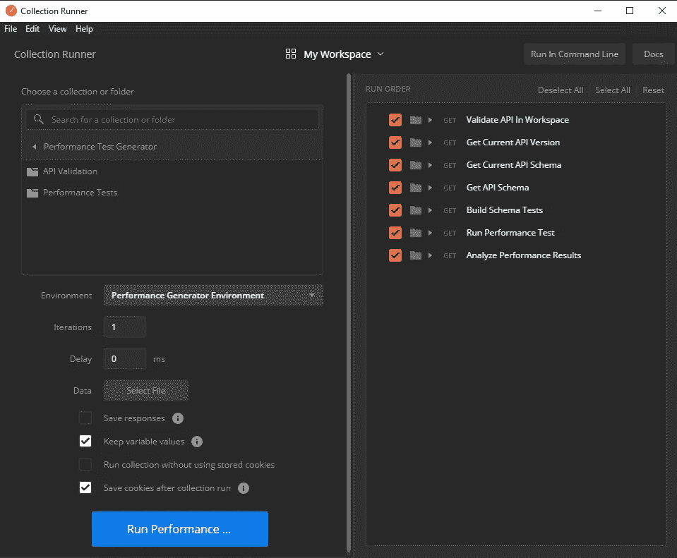
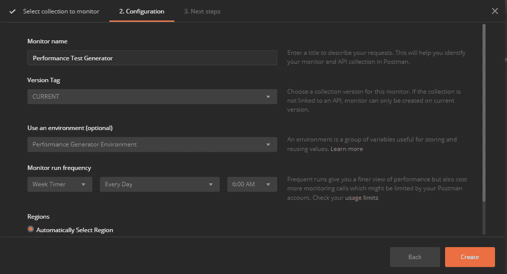

# 如何通过动态测试自动监控 API 性能

> 原文：<https://betterprogramming.pub/how-to-automatically-monitor-api-performance-with-dynamic-testing-c73360257f49>

## 如果我问你“一个强大的 API 的关键指标是什么”，你会怎么回答？

图像由[转换成来自 Pixabay](https://pixabay.com/illustrations/motorcycle-speed-helmet-1690452/) 的图形

你会提到可靠性吗？文档？保安？开发者体验？

听到大多数人不提性能，你可能会感到惊讶。API 运行速度有多快？不管他们知不知道，他们潜意识里是这么想的。

如果你第一次使用一个新的 API，并且花了五秒钟来响应，你可能会得到一个不好的印象。现在是 2020 年:这种反应应该是亚秒级的。它应该已经*刚刚工作过*。

不管我们是否知道，我们对绩效的评价与其他任何指标一样高(如果不是更高的话)。这是推动我们用户体验的因素。我们不希望用户等待一个动作发生。应该是自动的。

那我们该怎么办？

# **建立可接受的参数**

首先，你需要回答“什么是性能”这个问题你的 API 需要达到什么样的准则才能让你认为这个速度是可以接受的？对于性能测试，我们监控的两个最常见的指标是:

*   **平均执行时间**—API 在所有执行中的平均响应速度
*   **P99/最大执行时间** —最慢的执行有多快

P99 的意思是 99%。99%的请求必须在特定的时间内完成。1%的通话速度低于阈值是可以的。异常情况时有发生，这是生活的现实。因此，根据 99%进行测量将产生一致的结果，并排除异常。

当提出您的参数时，请记住您定义的是**可接受的**参数，而不是您的**理想**参数。理想情况下，您的 API 将在一毫秒内响应，但实际上平均在 500 毫秒内响应是可以接受的。

终端用户通常会注意到他们等待的时间是否超过一秒钟。如果他们等待的时间超过五秒，他们就会完全离开你的网站。因此，努力将 p99 保持在 1000-1200 毫秒左右。

照片由 [Dane Deaner](https://unsplash.com/@danedeaner?utm_source=unsplash&utm_medium=referral&utm_content=creditCopyText) 在 [Unsplash](https://unsplash.com/@danedeaner?utm_source=unsplash&utm_medium=referral&utm_content=creditCopyText) 上拍摄

# **设置性能测试**

有了可接受的性能参数，就该实际测试 API 的性能了。

一个性能测试所做的就是测试你的 API 并记录响应时间，所以这应该是很容易自动化的事情，对吗？对！

有了像 [Postman](https://www.getpostman.com) 这样的工具，你就有能力在应用程序中本地定义你的 API 结构，并按需和定期运行自动化测试。

我在 GitHub 上创建了一个 Postman 集合和环境[,它将获取您的 API 定义，将其转化为一系列性能测试，以可配置的次数命中您的 API，并返回每个端点的平均和最慢执行时间。](https://github.com/allenheltondev/postman-performance-test-gen)

最棒的部分？你什么都不用做！嗯，你必须[从 GitHub](https://learning.postman.com/docs/getting-started/importing-and-exporting-data/#importing-via-github-repositories) 导入源代码并配置几个环境变量，但仅此而已！

## 环境变量

在运行性能测试集合之前，必须设置几个环境变量:

*   `env-apiKey` —Postman 的集成 API 密钥(字符串)- [关于 API 密钥的 Postman 文档](https://learning.postman.com/docs/developer/intro-api/#generating-a-postman-api-key)。
*   `env-server` —您要运行的环境的名称。该值与 API 定义(字符串)的`Servers`对象中的`description`属性相匹配。
*   `env-performanceIterations` —定义文档中的每个 API 端点应该执行多少次(整数)。
*   `env-performanceAverageMs` —每个端点的平均响应时间的非包含阈值(毫秒)(整数)。
*   `env-performanceP99Ms` —每个端点允许的最慢执行速度的非包含阈值(毫秒)(整数)。
*   应该定义`env-apiIds`或`env-workspaceId`。
*   如果定义了`env-apiIds`，生成器将用提供的 id(字符串数组)测试所有的 Postman APIs。
*   如果定义了`env-workspaceId`，生成器将测试所提供的 Postman 工作区(string)中的所有 API。

## API 定义

生成器最关键的部分是您的 API 定义文件。它要求你的定义文档用 JSON 或 YAML 的[开放 API 规范 v3](https://openapis.org) 格式编写。

我已经写了一些关于规范的文章，强烈建议熟悉它的结构。它正迅速成为定义 API 的行业标准。

为了让生成器与 API 定义一起正常工作，API 中的所有端点都必须定义请求体的模式(如果适用)。模式必须包括每个属性的示例值。这是生成器用来输入 API 的内容。

为每件事填写示例值似乎有点乏味，但从好的方面来看，您可以获得免费的动态 API 性能测试(甚至是[合同测试](https://github.com/allenheltondev/postman-contract-test-generator)和[安全测试](https://github.com/allenheltondev/postman-security-test-generator)！)加上 Postman 本身为您生成的一些高度描述性的 API 文档。双赢！

要获得 API 定义的完整工作示例，请查看我的 [Gopher Holes Unlimited API](https://github.com/allenheltondev/gopher-holes-unlimited/blob/master/gopher-holes-unlimited-openapi.yaml) 。

# **运行测试**

一旦配置好环境变量，并正确定义了开放 API 规范，就该试一试了。首先，我们将手动运行它。

1.  在 Postman 中，点击 Runner 按钮。
2.  选择性能测试生成器集合。
3.  在环境选择器中选择性能生成器环境。
4.  点击运行性能…按钮开始执行。

这将启动生成器，它将开始构建测试并运行您的 API。

如果您希望自动执行这个任务，您可以设置一个监视器，这样您的测试就可以按计划运行。为此，您可以执行以下任务。

1.  右键单击工作区中的性能测试生成器集合，并选择 Monitor Collection。
2.  在“使用环境(可选)”选取器中选择性能生成器环境。
3.  选择您希望收集运行的频率。
4.  点击创建创建您的显示器。

现在您有了一个性能测试运行的计划时间。最重要的是，因为这可以动态加载 API 定义并从中构建测试，所以您不必维护它。它会随着您构建自己的定义而更新。

## 试验结果

生成器运行后，它将对结果执行一些分析:

*   平均响应时间是否小于环境中配置的平均值？
*   最慢的响应时间是否小于环境中配置的 p99？
*   是否至少有一半的响应是成功的(2XX 状态代码)？

正如你所看到的，我的 Gopher Holes Unlimited API 需要一点点的工作。我有一个 100%失败的端点，另一个太慢了。

你喜欢怎么做就怎么做。此时，失败取决于 API 的实现。如果它们比你的阈值慢，看看你能做些什么来加速这个 API。

如果一半以上的回答是失败的，那么要么是 API 中有错误，要么是定义文档中的示例值是错误的。无论哪种方式，修复这些问题将使您的 API 比以前更强大。

# **结论**

请记住，快速的 API 给人一种非常可靠的印象。对可靠性的强烈印象会让你的消费者满意，并推动业务发展。

这些性能测试是添加到 API 开发过程中的低成本、高价值的组件。由于您不再需要花费时间创建和维护繁重的性能测试，您可以将时间花在更有价值的事情上——比如解决业务问题或投资新功能。

无论你做什么，我希望你喜欢发电机。它的设计意图是节省时间并促进 API 设计中的最佳实践。