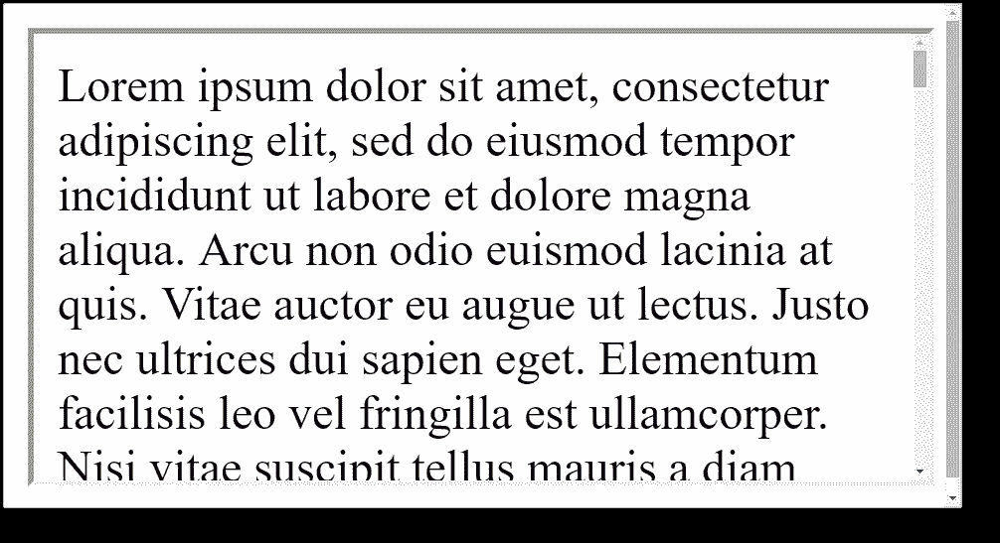

# 如何自动调整 iframe 的大小

> 原文：<https://betterprogramming.pub/how-to-automatically-resize-an-iframe-7be6bfbb1214>

## 使用 HTML 和 JavaScript 创建动态 iframes，就像它们是父窗口的一部分一样


[亚历山大·奈特](https://unsplash.com/@agkdesign?utm_source=unsplash&utm_medium=referral&utm_content=creditCopyText)在 [Unsplash](https://unsplash.com/search/photos/laptop?utm_source=unsplash&utm_medium=referral&utm_content=creditCopyText) 上拍照

`<iframe>`允许 web 开发者将一个 HTML 页面嵌入到另一个页面中。它非常有用，因为它们是 HTML 的一部分，所以你几乎可以在任何地方使用它们——在 Wix 和 Squarespace 这样的网站构建器中，或者在你的下一个全栈项目中。

YouTube 使用 iframesss 来允许嵌入视频，Google 使用 iframe 来进行身份验证，SaaS 的 Mailchimp、Typeform 和 Outgrow 等公司也使用 iframe 来提供嵌入内容。

然而，iframes 也会引起一些问题，我们将在本文中讨论一些最常见的问题。

# 问题是

默认情况下，iframes 具有固定的高度。如果你的内容也有一个固定的高度，这没什么，但是如果你的内容的高度改变了，你很容易就会看到一个像这样的双滚动条怪物:



如果我们希望我们的 iframe 表现得像普通的 HTML 元素一样，内容垂直换行，那该怎么办？

为此，我们需要动态地改变 iframe 的高度，但是安全考虑意味着父窗口不可能访问 iframe 中的元素。

在本文中，我将解释一种实现这种效果的简单方法，使用普通的 JavaScript。

# 解决方案

使用`window.postMessage()`方法，我们可以安全地在 iframe 和父窗口之间通信。这样，我们可以从 iframe 向父窗口发送一个高度值。然后，在父窗口中，我们可以设置一个简单的脚本来动态更新 iframe 的高度。

# 代码

对于本教程，我们需要两个 HTML 文件:一个放 iframe 的父文件，一个包含 iframe 内容的子文件。

## child.html

我们的子文件将包含一个简单的虚拟文本生成器，人们可以单击一个按钮来添加另一段 *lorem ipsum* 文本。

由于本教程是关于 iframe 的，而不是它的功能，请随意复制并粘贴以下内容到`child.html`:

您可以在这个[代码笔](https://codepen.io/)中尝试上面的代码:

## parent.html

我们现在可以将 iframe 插入到`parent.html`中。

添加通常的 HTML5 样板代码，然后在 body 标记之间插入以下内容:

```
<iframe id="iframe" src="child.html" style="width:100%;border:none;"></iframe>
```

但是这里我们遇到了我们的问题。因为我们设置了`overflow: hidden`，按钮和第一段的一半消失了。

如果我们没有设置`overflow: hidden`，我们会看到两个滚动条，如上图所示。为了解决这个问题，我们需要从`child.html`向父窗口发送 post 消息！

## child.html

因此，回到`child.html`，我们需要向脚本部分添加新的事件监听器。

我们需要通知父元素 iframe 的高度:

*   每次加载的时候，
*   每当调整窗口大小时，以及
*   每当按下按钮时。

当这些事件发生时，我们将触发一个名为`sendPostMessage`的函数。

将以下代码放在结束的`<script>`标签之前:

现在让我们创建我们的`sendPostMessage()`函数。

我们想要测量 id 为`container`的元素的高度。如果(且仅当)高度发生变化，我们要向父窗口发送一条名为`frameHeight`的消息，通知它发生了更新。

下面的代码应该在我们刚刚写的代码之上:

`postMessage`方法的第二个参数代表目标原点:父窗口的主机名。

这对于安全性很有用，确保消息只发送到特定的域，但是出于开发目的，我们可以将目标源设置为`'*'`。这意味着任何父窗口都将收到该消息。

总的来说，`child.html`的代码应该是这样的:

## parent.html

让我们在浏览器中加载`parent.html`并打开控制台(在 Google Chrome 中按`CTRL` + `Shift` + `J`)。

每当我们调整窗口大小时，我们现在应该看到值出现在控制台中。最后一步是每当发送这些值中的一个时，使用它们来设置 iframe 高度。

我们需要监听消息事件，每当我们接收到一个消息事件时，我们应该使用它来设置 iframe 的 height 属性(加上一点填充):

总的来说，您的`parent.html`文件应该是这样的:

如果您按照正确的步骤，您的 iframe 现在将自动调整大小，就像它的内容是父窗口的一部分一样！

# 缩小

最后一步，您可以缩减上面的代码，以便非开发人员可以轻松地复制并粘贴到他们的 HTML 中:

```
<iframe id="i" src="child.html" style="width:100%;border:none;"></iframe><script>window.onmessage=e=>{e.data.hasOwnProperty("frameHeight")&&(document.getElementById("i").style.height=`${e.data.frameHeight+30}px`)}</script>
```

如果你在线托管你的`child.html`文件(使用类似 [GitHub](https://github.com/) 或 [Netlify](https://www.netlify.com/) 的服务)，你可以把你的新 URL 插入到上面代码的`src`属性中并发送给任何人。现在，任何人都可以将您的内容作为动态 iframe 嵌入！

我希望你觉得这个教程有用！感谢阅读。