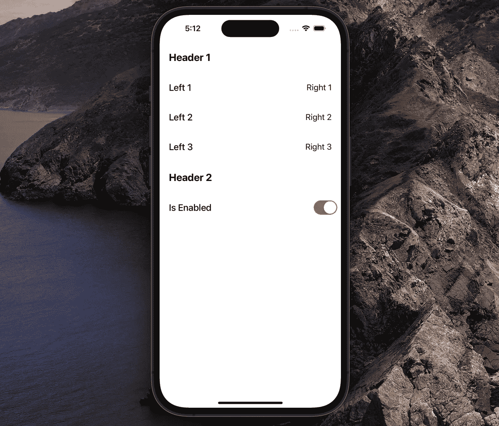

# 如何使用 Swift 软件包避免冗长的 UITableView 协议一致性

> 原文：<https://betterprogramming.pub/how-to-avoid-lengthy-uitableview-protocol-conformances-using-a-swift-package-5553b3c9e3cb>

## Swift 5 中表格视图的开发突飞猛进

照片由[谢尔盖·佐尔金](https://unsplash.com/@szolkin?utm_source=medium&utm_medium=referral)在 [Unsplash](https://unsplash.com?utm_source=medium&utm_medium=referral) 拍摄

在本文中，我们将学习如何更快更容易地创建表格视图及其单元格。我们将通过利用协议、继承和抽象来做到这一点。到本文结束时，您将拥有一个生产就绪的机制，可以自由集成到您的 iOS 应用程序中。

简而言之，当处理一个新的表格视图时，我们将从这个开始:

对此:

我们在文章中的计划如下:

1.  创建一个可重用的库来处理表格视图。
2.  基于它创建一个示例应用程序。

完成的库和示例应用程序的源代码可以在文章的底部找到。事不宜迟，我们开始吧。

# 我们开始吧

首先，让我们定义一个`TableRowModel`协议:

1.  属性将保存一个特定的`UITableViewCell`的重用标识符。
2.  当`UITableView`的`didSelectRowAtIndexPath`方法触发时，将调用`onSelection`闭包。
3.  我们在协议扩展中为闭包提供了一个默认的`nil`值，所以单元只在需要时才实现这个属性。

接下来，让我们通过创建一个`TableHeaderFooterModel`来同样表示一个`UITableViewHeaderFooterView`:

这里我们只指定一个`identifier`作为要求。

完成`UITableViewCell`和`UITableHeaderFooterView`表示后，现在让我们对表格视图的一部分建模:

1.  就像`UITableView`中的任何部分都可以有一个`UITableViewHeaderFooter`一样，这里我们有一个之前创建的`TableHeaderFooterModel`属性。
2.  类似地，我们有一个行数组，每行代表一个`UITableViewCell`。
3.  最后，我们对页脚做同样的事情。
4.  默认情况下，初始化器将为页眉和页脚设置`nil`值。

现在我们已经完成了所有的基本表示，让我们创建一个`UITableViewCell`的基类，我们应用程序中的所有具体单元格都将继承它:

1.  我们实现了一个初始化器，将`selectionStyle`设置为`.none`，并调用方法`setupSubviews()`。
2.  我们定义了一个方法`setupSubviews()`，它需要在子类中被覆盖。当一个子类实现这个方法时，它会在一个初始化器中被自动调用，减少了我们要做的工作量。
3.  我们用`setup(with rowModel: TableRowModel)`方法做同样的事情。当我们想用数据配置一个单元格时，我们将在一个特定的单元格外调用这个方法。

现在让我们通过实现一个`BaseHeaderFooterView`来完成基类的设置:

就像我们在`BaseTableViewCell`中做的一样，这里我们有`setupSubviews()`和`setup(with headerFooterModel)`方法供子类覆盖。

完成这个库只剩下一件事:负责一个`UITableView`—`TableDirector`的实际对象。

# TableDirector 实现

首先，让我们创建一个定义了`UITableView`属性的`TableDirector`类:

1.  我们保留对一个`UITableView`的弱引用，因为不需要强引用来保持它的活动:一个特定的`UIViewController`将保留一个`UITableView`。
2.  我们将`tableview`的`dataSource`和`delegate`属性都设置为`self`。

现在我们需要实现`UITableViewDelegate`和`UITableViewDataSource`，以避免在将来实现它:

在我们将这些方法与内容结合之前，让我们创建几个属性以及一个用于注册单元格的辅助函数:

1.  属性将保存一个`TableSection`模型的数组。一旦设置了属性，我们就使用`TableRowModel`和`TableHeaderFooterModel`的`identifier`属性注册所有的`UITableViewCell`和`UITableViewHeaderFooterView`。
2.  我们添加了`onCellSelection`和`onCellWillDisplay`闭包，以便消费者(尤其是视图控制器)可以在需要时对单元生命周期和事件做出反应。
3.  在`sections`属性的`didSet`中使用了`classFromString`帮助器方法来获得一个`UITableViewCell`或`UITableViewHeaderFooterView`的特定重用标识符。

现在所有的属性都设置好了，让我们用真正的内容填充那些`UITableViewDataSource`和`UITableViewDelegate`方法。

我们首先从数据源方法开始:

1.  很简单，在`numberOfSections`方法中，我们返回`sections`属性的`count`。
2.  同样，在`numberOfRowsInSection`方法中，我们在一个特定的`section`中返回`rowModels`的`count`。
3.  在`cellForRowAt`方法中，我们获得一个与当前`IndexPath`相关的`rowModel`并使一个`BaseTableViewCell`出队。然后，我们在单元格上调用`setup(with rowModel)`方法并返回它。

数据源完成后，现在让我们处理委托方法:

1.  在`didSelectRow`方法中，除了具体的`TableRowModel`的`onSelection`闭包之外，我们还调用了`TableDirector`的`onCellSelection`闭包。出于灵活性，我们有两个版本，因为有时 API 消费者只会对选择的`IndexPath`感兴趣，而不是实际的模型。有了这两个版本，我们有了更多的选择。
2.  在`willDisplayCell`方法中，我们触发`onCellWillDisplay`闭包。
3.  在`viewForHeader`方法中，我们试图为一个特定的`IndexPath`获取一个`headerModel`。如果它存在，我们将一个特定的`BaseTableHeaderView`出队，调用它的`setup(with headerModel)`方法，并返回它。否则，我们返回`nil`。
4.  在`viewForFooter`方法中，我们执行与`viewForHeader`中相同的步骤。
5.  在`willDisplayHeaderView`方法中，我们为标题设置可视配置。
6.  如果对于`IndexPath`存在头部模型，`heightForHeader`方法使用一个`UITableView.automaticDimension`值。否则，它使用一个高度`1`。
7.  类似的逻辑也发生在`heightForFooter`方法中。

我们终于完成了库的实现。现在是时候在真正的 app 中使用了！

# 示例应用程序

我们的应用程序是一个单屏幕应用程序，显示一个`UITableView`填充可用空间:

我们希望用数据填充表格视图，所以让我们首先创建具体的`TableRowModel`。

我们从一个左右两边都有标签的单元格开始:

1.  我们指定模型应该是来自`LeftRightTitlesTableViewCell`的`reuseIdentifier`。
2.  我们定义了`leftTitle`、`rightTitle`属性，分别显示在`leftLabel`和`rightLabel`中。此外，我们添加了`TableRowModel`的`onSelection`属性，因为我们将对这个特定单元格的点击做出反应。
3.  在`LeftRightTitlesTableViewCell`中，我们将模型的值赋给`setup(with rowModel)` 方法中的`leftLabel`和`rightLabel`。
4.  `setupSubviews()`方法只负责布局和约束。

完成一种类型的单元格后，让我们创建另一种:

1.  模型被指示使用`TitleSwitchTableViewCell`的`reuseIdentifier`。
2.  添加了`title`、`isOn`和`onSwitchValueChanged`属性来设置标签的标题和`UISwitch`的初始状态，并对开关值的变化做出反应。
3.  在`setup(with rowModel)`方法中，我们像之前一样配置单元。
4.  当开关的值改变时，触发`stateSwitchHandler`方法，并调用模型的`onSwitchValueChanged`闭包。]
5.  `setupSubviews`方法布置子视图并设置约束。

在我们开始将单元集成到`UITableView`之前，为了完整起见，让我们也实现一个`UITableViewHeaderFooterView`:

1.  该模型将使用`TitleHeaderView`的`reuseIdentifier`。
2.  在`setup(with headerModel)`方法中，我们用文本配置一个标签。
3.  `setupSubviews()`方法布置标签并设置约束。

太好了！单元格和标题都完成了。现在我们要把它们整合成一个`UITableView`:

1.  我们在`ViewController`中初始化一个惰性`TableDirector`属性。
2.  添加`isSwitchOn`属性来保存待实现`TitleSwitchTableViewCell`中开关的当前值。

表格视图工作的唯一一步是进给`TableDirector`部分。让我们这样做:

1.  我们在`viewDidLoad()`中调用`setupSections()`方法(我们现在将创建它)。
2.  `setupSections()`方法为`tableDirector`设置部分。
3.  `createFirstSection()`方法创建一个带有标题和三个`LeftRightTitlesTableViewCell`的部分。
4.  为了使`LeftRightTitlesTableViewCell`的创建更快且可重用，使用了`createLeftRightCellModel(leftTitle:rightTitle:)`方法。它实现了基本的`onSelection`闭包，每次选择一个单元格时都会打印`leftTitle`和`rightTitle`。
5.  `createSecondSection()`方法创建了另一个带有标题和一个`TitleSwitchTableViewCell`的部分。它还实现了更新`ViewController`的`isSwitchOn`属性的`onSwitchValueChanged`闭包。

最后，如果我们构建并运行，我们会看到布局:

从现在开始，要创建包含单元格的表格视图，我们只需执行以下步骤:

1.  创造一个具体的`TableRowModel`。
2.  创造一个具体的`BaseTableViewCell`。
3.  向`ViewController`添加一个`TableDirector`属性，并为其分配一个表格视图。
4.  设置`TableDirector`的章节属性。

# 资源

示例应用程序的源代码可在 [GitHub](https://github.com/zafarivaev/TableDirector-Example) 上获得。另外，我准备了一个现成的 Swift 包，你可以在这里访问[。](https://github.com/zafarivaev/TableDirector)

我希望你觉得这个教程很有用，现在你使用`UITableView` s 和`UITableViewCell` s 将花费更少的时间。

感谢阅读！