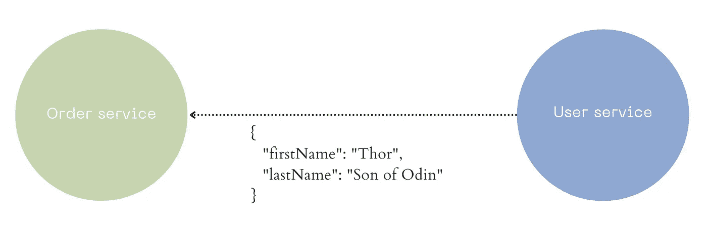
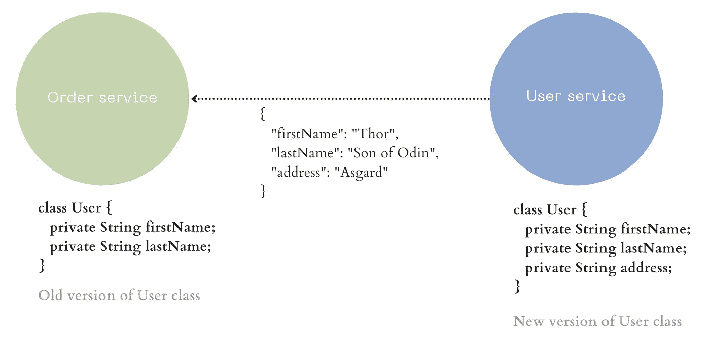
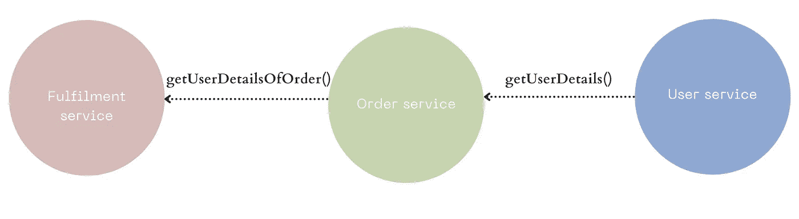
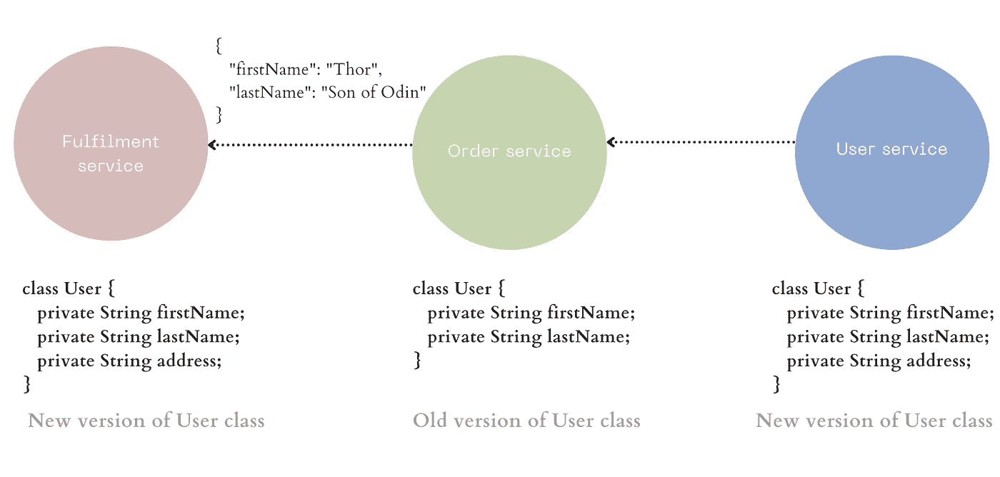

# 如何避免 Java 或 Kotlin 中的模型变更噩梦

> 原文：<https://betterprogramming.pub/how-to-avoid-model-changes-nightmare-in-java-kotlin-9f9cba2a532b>

## 在将模型变更部署到生产环境之前，您需要验证的事情


照片由[穆罕默德·拉赫马尼](https://unsplash.com/@afgprogrammer)在 [Unsplash](https://unsplash.com/photos/_Fx34KeqIEw) 上拍摄

模型的变化是可怕的。告诉我这听起来是否熟悉。您对 API 契约中使用的数据模型中的一个字段进行了小小的更改。你在你的本地机器上测试了它，你对你的改变有信心。

您将代码部署到产品中。你拍拍自己的背，呷一口茶，准备结束一天的工作。

但是，突然你开始收到警报和升级，你的电子邮件收件箱被客户投诉淹没。你知道你搞砸了一些事情。但是哪里出了问题，改变是非常简单的。

现在，您急于回滚您的更改。几分钟之内，错误就消失了。但是已经有很多业务功能被中断，客户不高兴了。

现在你在探查哪里出了问题，却发现你漏掉了一些简单的东西。

凭着多年的经验，我怎么会犯这样愚蠢的错误呢？

你为自己犯了这么小的错误而感到羞耻，以至于你想摆脱尴尬。也许如果我改名换姓离开这个国家，没有人会认出我？

你开始质疑你的职业选择。也许我应该进入一个不同的职业，我知道一些 photoshop，也许我可以做平面设计。

快，压力球在哪里？

打破生产代码并不光彩。为了帮助您避免这样的陷阱，我整理了在将您的模型变更部署到生产中之前您需要验证的东西。

虽然大多数要点也适用于其他语言，但有些要点是 Java 和 Kotlin 用户特有的。

# 如果要添加新属性，请添加 JsonIgnoreProperties 批注

使用 Jackson 解析 JSON 数据的一个常见问题是，当 JSON 包含未知属性时，反序列化会失败。当您向一个现有的模型类中添加一个新的属性时，请确保该类用`@JsonIgnoreProperties(ignoreUnknown = true)`进行了注释。

让我们看一个例子。

在本例中，订单服务调用用户服务来获取用户详细信息。


用户服务将通过序列化为 JSON 数据来返回用户类的对象。



并且我们在订单服务中去序列化这些 JSON 数据。

```
userResponseJson = getJsonResponseFromUserService()
user = jacksonObjectMapper.readValue(userResponseJson, User.class);
```

现在，明天如果我们在用户服务的用户模型中添加一个新字段“地址”,用户服务返回的 JSON 将如下所示:

这将中断订单服务中的反序列化，并出现异常。

```
com.fasterxml.jackson.databind.exc.UnrecognizedPropertyException
```

这是因为 Jackson 不确定如何处理未知属性*地址*。您可以通过在模型类中添加 JsonIgnoreProperties 注释来解决这个问题，Jackson 将忽略任何未知的属性。

> 注意:如果您计划向一个没有 JsonIgnoreProperties 的类添加一个新的属性，那么您必须首先添加注释，首先重新启动依赖服务(在本例中是 order service)，以便在依赖服务中获得最新的模型。

# **测试代码和数据的向后兼容性**

这是您在将任何模型变更部署到生产环境之前应该遵循的最重要的事情。这将有助于你发现任何隐藏在黑暗中的神秘虫子。

**代码的向后兼容性(旧模型类与新数据):**

系统中可能有客户端仍在使用您的旧模型类来反序列化新数据。为了确保反序列化不会在这里中断，请测试旧模型类是否可以反序列化新数据。

以我们之前的例子为例，我们向现有的用户类添加了一个新的属性(地址)

更改之后，用户服务将发送新的 JSON 数据，但是订单服务仍然使用旧版本的用户类来反序列化这些数据



您应该测试这个场景，并确保旧模型能够反序列化新数据。

为此编写单元测试是一个有点挑战性的问题。您需要找出一种方法来保留旧版本的模型类，并根据最新版本的类创建的数据进行测试。

**数据的向后兼容性(新模型与旧数据):**

用旧数据测试新模型的需要不是很直观(至少对我来说是这样😅).因为，一旦您改变了您的模型，您的服务中的 API 将总是发送新的数据。那么，为什么需要用旧数据进行测试呢🤔？

让我举一个例子来说明为什么需要确保这种兼容性。



正如我们前面看到的，用户服务提供了一个 API 来返回用户的详细信息。

Order service 提供了一个 API，用于返回订单的用户详细信息，它从用户服务中读取用户数据并返回相同的数据。

履行服务正在调用订单管理服务 API 来获取订单的用户详细信息。

用户服务更新了用户类别模型。和履行服务重新启动，并从用户服务中获得最新型号。



订单管理仍然使用旧版本的模型，因此返回旧的 JSON。而 fulfillment service 正在尝试使用新模型对其进行反序列化。

新模型类

旧的 JSON 数据

因此，您需要测试使用新类反序列化旧数据的场景，以避免任何不必要的意外。

# **当属性可选时设置默认值**

这一点是 Kotlin 独有的，所以 java 用户可以跳过这一点。在 kotlin 中，如果您正在反序列化带有可选属性的 JSON，请确保您的类中的这些可选属性可以为空或者设置了默认值。否则，反序列化将会中断。但是，在 JAVA 中，这不是必需的，因为 JAVA 将未知字段设置为 null。

以我们之前的用户模型为例。如果 lastName 是可选属性，并且我们试图反序列化没有 lastName 的用户数据。

```
{  
  "firstName": "Thor" 
}
```

反序列化将在这里中断，您将看到如下错误:

```
Instantiation of User value failed for JSON property lastName due to missing (therefore NULL..
```

若要解决此问题，请为该属性分配一个默认值，或者使该属性可为空。

# **删除/更改字段时迁移数据平台。**

大多数公司都有数据仓库来实现和支持他们的商业智能(BI)活动，尤其是分析。通常，主数据库中的数据被注入到数据仓库中的表中，分析报告在这些表的基础上构建。

可能已经基于您正在更改的属性创建了一些报告。因此，在更改/删除任何现有属性之前，请确保通知各自的团队并准备好迁移计划。

# **了解您的数据交换协议中的默认设置**

不同的数据交换协议及其对象映射器反序列化数据的方式不同。理解你的反序列化器的行为，尤其是知道它设置了什么默认值是非常重要的。否则，您可能会遇到意想不到的行为。

考虑这个例子，您使用 Jackson 将下面的 JSON 数据反序列化为 java 对象。

```
user = jacksonObjectMapper().readValue(json, User::class.java)
```

默认情况下，Jackson 会将未知字段设置为 null。**在这种情况下，user.lastName 将为 null。**

如果你想执行一个函数，当姓氏可用时，你可以在 user.lastName 上写一个空检查，一切都很好！

但是如果你使用 protobuf 并且使用消息反序列化同一个 JSON。

反序列化的 proto 对象将具有空字符串""的默认值。 *user.lastName* 在这种情况下不会为 null，而是一个空字符串("")

现在，如果您想要实现与上面相同的行为，在姓氏可用时执行一个函数，您将需要对空白字符串进行额外的检查。

**永远不要改变现有字段的含义。**

改变现有字段的含义是一个很大的问题。

假设您有一个产品类，单价是以卢比表示的产品价格(理想情况下，属性名称不应该如此模糊😄).后来，您意识到您需要更多的粒度，并希望以 paise 表示单价值。

您不应该更新 unitPrice 的现有行为并开始在现有属性 *unitPrice* 中发送 paise 中的单价。因为可能有其他服务基于单价以卢比为单位的假设使用该字段，而他们的假设将会失效。

相反，您应该添加一个新的字段“单价”,如果需要的话，删除旧的字段“单价”。

或者您也可以创建一个更新版本的产品类，并将其用于您的用例。

# 编写合同测试

自动化测试是防御之墙，也是守夜人，保护您的代码免受远方野人的攻击。

设置和编写一个集成测试可能看起来像是一个耗时且乏味的任务，但是从长远来看，可以把它看作是一项投资，它会把你从许多麻烦中解救出来。

在微服务架构中，单独测试服务的简单单元测试和集成测试是不够的。您需要契约测试来测试多个服务之间的集成点。

契约测试本身是一个完全不同的主题，我们不会在本文中深入讨论更多的细节。有多种工具可用于契约测试，其中最流行的是 [Pact](https://docs.pact.io/#:~:text=Pact%20is%20a%20code%2Dfirst%20consumer%2Ddriven%20contract%20testing%20tool,of%20the%20automated%20consumer%20tests.) 。

# 结论

不管你喜不喜欢，模型变更是软件工程师经常要做的事情，尤其是如果你在一个快节奏的公司工作。

我希望这几点能在你满怀信心地进行下一次车型改款时对你有所帮助。

如果我错过了任何重要的点，请让我知道。感谢阅读。