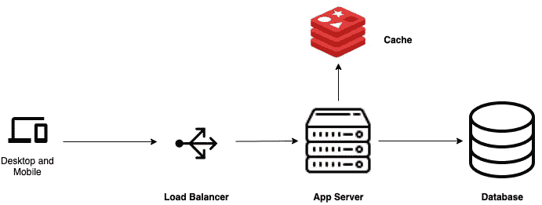
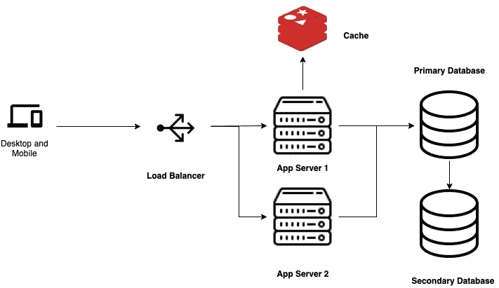
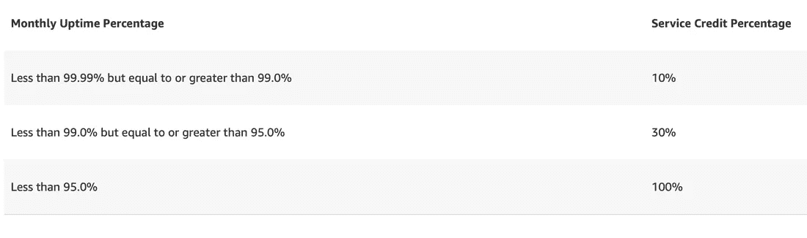

# 如何在您的服务中避免单点故障

> 原文：<https://betterprogramming.pub/how-to-avoid-single-point-of-failures-in-your-service-aa1395c5320a>

## 规划基础设施的高可用性可以让客户更加满意


Robynne Hu 在 [Unsplash](https://unsplash.com/s/photos/network?utm_source=unsplash&utm_medium=referral&utm_content=creditCopyText) 上的照片

2020 年 7 月，由于 CloudFlare 网络中断，Shopify、Discord 和 Feedly 等服务受到严重影响。

CloudFlare 启动了他们自己的 DNS 服务，名为 1.1.1.1，他们声称这加快了 DNS 查找的速度。

当他们在亚特兰大的一个路由器开始宣布坏路由时，这个 DNS 服务中断了。以下是 CloudFlare 的首席执行官所说的话:

这是一个典型的例子，说明当您的服务依赖于单个实体的可用性时，它会如何停止。

依赖 CloudFlare 的公司无法提供服务。我们将大部分基础设施外包给其他公司，因为，让我们面对现实吧，维护和运行基础设施是很困难的。创建 CDN 网络或建立我们自己的服务器并不容易。

# 什么是单点故障？

单点故障(SPOF)是指服务中单个实体的故障会导致整个服务停止运行。它可以是软件或硬件实体。

首先，系统中的故障不是你可以完全避免的。无论是硬件还是软件，都容易发生故障。这可能是由于错误的硬件组件，如路由器，或代码中的错误。但是这些错误不应该导致整个系统的失败。

> ***💡你知道吗？***
> 
> *故障是指单个单元未能完成其工作。失败是指故障导致整个系统或服务停止运行。*
> 
> 虽然错误迫在眉睫，但我们应该努力避免失败。

# 如何避开 SPOF？

在软件世界中，我们非常强调避免冗余。代码库中的冗余会降低代码的可维护性。但是说到硬件基础设施，冗余是常态。因为与软件不同，如果一个节点出现故障，另一个节点可以接管。

让我们看一个基础架构和其中各种单点故障的示例。



基本架构

当您开始构建您的应用程序时，基础结构可能看起来像上面这样。

客户端将向负载均衡器发出请求，负载均衡器将请求指向应用服务器。应用服务器从缓存或数据库获取数据，并返回响应。听起来又酷又简单！但是如果缓存服务器崩溃了呢？你可以从数据库中得到数据。但是如果数据库崩溃了呢？在您恢复数据库之前，您的服务将会停止。如果应用服务器崩溃了怎么办？你明白我的意思了！

哦，顺便说一句，如果你只有一个应用服务器，负载均衡器并不是必需的。

为了避免这种情况，您必须为这些组件添加备件。这些备胎就像你汽车上的备胎。当其中一个组件出现故障时，备用组件将接管。这就是我所说的冗余。

备件也可以是各种类型的。即主动和被动。

**主动组件**总是在工作，帮助分配负载。

**被动** **组件**保持空闲，但仅在主组件失效时接管主组件的工作。

> *🧠请记住，如果您的服务需要最短的停机时间，就需要活动备件，但这会使成本加倍。此外，如果你没有一个庞大的用户群，大部分的硬件资源都没有得到充分利用。*

让我们看看当我们给上面的系统添加一些备件时，它会是什么样子。



稍微先进的建筑

我增加了一个额外的应用服务器。负载平衡器使用循环法来决定哪个应用服务器路由流量。如果其中一台服务器出现故障，另一台服务器将为所有请求提供服务。

应用服务器直接连接到主数据库。我添加了一个辅助数据库，它将作为一个被动备用数据库。所有事务都由主数据库处理。主数据库负责将数据与辅助数据库同步。每当主数据库关闭时，辅助数据库可以接管并处理事务。为了可靠地工作，主数据库和辅助数据库应该总是同步的。

为了简洁起见，我没有为负载平衡器添加冗余，尽管您的负载平衡器也可能会停机。在这种情况下，所有进入您的服务的流量都不会被路由到应用服务器。

# 跨区域冗余

到目前为止，我们已经尽量避免个别组件的 SPOF。但是，如果所有这些服务器所在的数据中心由于电源故障或其他原因而停机，该怎么办呢？

在那一点上，所有这些冗余都无济于事。因此，理想的做法是将这些冗余放在不同的区域，而不是全部放在一个区域。

例如，您可以在一个地区(亚洲)创建主数据库，在另一个地区(欧洲)创建辅助数据库。

但是这有一个警告。当您的数据库位于不同的区域时，两者之间同步数据所需的时间会增加，因为机器之间的距离增加了。在设计您的架构时，必须牢记这一点。

但值得庆幸的是，如果你使用像 GCP 或 AWS 这样的云服务提供商，这些决定中的许多已经为你做出了。例如，在 GCP，为您的服务创建数据库时，您可以选择[高可用性](https://cloud.google.com/sql/docs/mysql/high-availability)，这将自动为您在另一个区域创建一个同步数据库。应用服务器也是如此。您可以创建一个[托管实例组](https://cloud.google.com/compute/docs/instance-groups)，它会自动为您的服务分配最小数量的服务器，如果一个服务器宕机，它会为您创建另一个。

# 故障检测和恢复

冗余很酷，但是如果某件事失败了，你需要得到通知，这样你就可以采取行动了。因此，故障检测和恢复是您应该投资的另外两件事情。

对于故障检测，您可以创建运行状况检查。有各种各样的免费服务可供你使用。为此，GCP 有自己的[正常运行时间检查](https://www.google.com/url?sa=t&rct=j&q=&esrc=s&source=web&cd=&cad=rja&uact=8&ved=2ahUKEwji-5va0aH1AhV33jgGHUg6BYUQFnoECAcQAQ&url=https%3A%2F%2Fcloud.google.com%2Fmonitoring%2Fuptime-checks&usg=AOvVaw044MCnpgOnhym4rgIABXFJ)。

一旦检测到问题，就应该触发恢复过程，并且应该启动停机的组件。这应该是一个自动的过程。但是在某些情况下，也可能需要人工干预

# 可用性和 SLA

让我们谈一谈 SLA。**SLA**或**服务水平协议**是服务为其消费者创建的策略，确保他们获得一定数量的服务可用性，比如 99.9%。通常，这是为付费客户生成的，如果服务没有达到承诺的最低可用性，他们可以要求退款。

例如，亚马逊承诺其计算服务的可用性超过 95%，如果做不到这一点，你可以获得 100%的服务积分。下面是他们的地区级 SLA 的明细:



来源:[https://aws.amazon.com/compute/sla/](https://aws.amazon.com/compute/sla/)

通过这一点，亚马逊承诺的是，即使某些节点可能关闭或不可用，他们的服务也将可用。同样，您的客户也会对您的服务有一定的可用性期望。作为一项服务，满足这些期望是你的责任。当您使用 SPOFs 创建基础架构时，您很可能会有更多的停机时间，从而导致客户失望。

您的基础设施应该是这样的，当一个组件发生故障时，其他组件应该能够承担负载，直到恢复完成。

# 包扎

在这个问题中，我只是触及了当基础架构计划外停机时所有可能出现的问题的表面。我的意图是帮助您在设计系统架构时进行更深入的思考。如果你使用的是 AWS 或 GCP 这样的托管服务，你仍然不安全。

有这样一个例子，我们的 AWS EC2 服务器出现故障，我们的一个应用程序宕机了几个小时，因为我们当时没有添加备用服务器。所以，如果你关心你的客户，在你的系统上赌博不是一件明智的事情。

```
**Want to Connect?**If you enjoyed this, you can subscribe to my [Software Engineering Weekly](https://softwareengineeringwk.substack.com) newsletter and get similar stories directly in your inbox
```