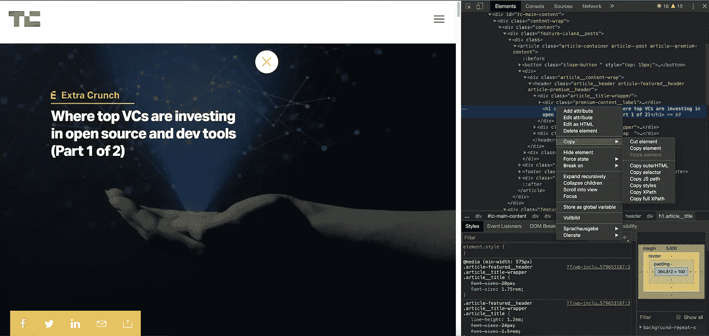

# 如何在端到端和组件测试中避免繁琐的 CSS 和 XPath 查询

> 原文：<https://betterprogramming.pub/how-to-avoid-tedious-css-and-xpath-queries-in-end-to-end-and-component-tests-732c5b86f2f6>

## 改善前端测试的五个技巧

由[凯勒·琼斯](https://unsplash.com/@gcalebjones?utm_source=medium&utm_medium=referral)在 [Unsplash](https://unsplash.com?utm_source=medium&utm_medium=referral) 上拍摄的照片

组件测试和端到端测试有一些共同点。下面是我们所关注的两种测试的简要概述:

1.  组件测试(有时简称为*单元测试*)开发成本低廉，易于执行和调试，因为它们隔离了故障。此外，它们通常可以在没有浏览器的情况下运行。示例框架:Jest、Mocha。
2.  **端到端(e2e)测试**模拟真实的用户场景，这允许您快速发现错误。与单元测试相比，这些测试的执行需要更长的时间，并且可能更加复杂。另一方面，端到端测试为您的应用程序按预期工作提供了更高的有效性。示例框架:量角器，硒。

最常见的事情之一是在 DOM 中找到一些元素，并对其进行处理(例如，单击它并期待一些输出)。如果您以前使用过基于 JavaScript 的 [Angular](https://angularjs.org/) 和 [React](https://reactjs.org/) ，那么您可能熟悉使用 jQuery 或普通 JavaScript 查询 DOM 元素。

大多数 web 开发人员应该对 CSS 有所了解。然而，对于测试或抓取，还有 XPath，它提供了一些 CSS 中没有的有趣特性。虽然 JavaScript 不直接支持 XPath，但是您可以在组件和 e2e 测试中使用它，也可以在任何现代的 web 浏览器中使用它，比如 Google Chrome。

可悲的是，这种力量往往伴随着一个警告:

*   XPath 可以做 CSS 能做的任何事情，甚至更多:例如，访问元素的父元素。这一点有时很受欢迎，因为 XPath 支持许多亲属。
*   这个优点可能会变成缺点——因为使用 XPath 经常会导致冗长而复杂的查询，而这在 CSS 中是不可能的

在本文中，我想看看 XPath 和 CSS 查询的常见问题。之后，我们将探索一些避免这些问题的方法。

**提示:**像 Google Chrome 这样的浏览器允许你在开发者工具中复制和运行 CSS 和 XPath 查询。

# 使用 XPath 查找元素时的常见问题

*   XPath 查询可以很快变得很大:`//table[@id='table2']//tr/td[contains(@class,'dues')]/a/span` vs. `#table2 .dues a span`使用 CSS
*   XPath 查询通常包含太多的层次结构和条件，这使得它们非常脆弱，将来很容易被破坏。例子:`span[contains(@class,'name')]/../../../button[contains(@class,'lock')]`。

# 使用 CSS 查找元素时的常见问题

*   CSS 查询通常包括太多的层次结构和条件，这使得它们非常脆弱，将来很容易被破坏。例子:`.main > section:first-child .info-section a.author + img`。
*   CSS 有一些众所周知的限制，比如不能选择元素的父元素

# 如何避免复杂的 XPath 和 CSS 查询

1.  对于大多数简单的情况，CSS 选择器通常更容易理解。
2.  通过减少查询中的层次结构，当您更改层次结构(例如，通过删除一个层)时，它变得不那么脆弱并且不太可能被破坏。
3.  使用 XPath，您可以搜索父元素——这在纯 CSS 选择器中是做不到的。我可以推荐祖先选择器，以避免不必要地遍历 DOM 来查找特定的父元素。例如:`//button[@attr='val']/ancestor::div[contains(@class,'post')]`。
4.  查询特定的字符串可能非常脆弱，因为文本经常会发生变化。尽管如此，仍然存在查找包含特定字符串的元素的用例。像[量角器](https://www.protractortest.org/#/api?view=ProtractorBy.prototype.cssContainingText)这样的框架有一种便捷的方法来用 CSS 和文本查找元素，相比 XPath 我更喜欢这种方法。
5.  您可以使用较小的查询，而不是单一的长查询。下面举个量角器的例子:`$('my-app .login-container').$('.login-button')`。特别是对于复杂的查询，我宁愿将一些 find 调用链接起来，也不愿使用难以理解的查询。

# 结论

感谢您阅读这篇短文。如您所见，使用 CSS 或 XPath 查询查找元素时会遇到一些问题。

然而，有一些易于遵循的规则——帮助我们编写易于阅读且不太可能出错的查询。