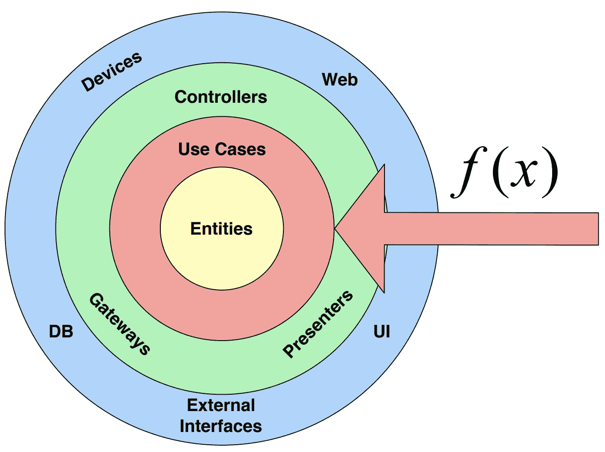

# 如何避免 Android 中的用例样板

> 原文：<https://betterprogramming.pub/how-to-avoid-use-cases-boilerplate-in-android-d0c9aa27ef27>

## 探索四种不同的方法



自从分层架构出现以来，[用例](https://proandroiddev.com/why-you-need-use-cases-interactors-142e8a6fe576)就有着争议的名声。

一方面，它们帮助你坚持 [S.O.L.I.D.](/the-real-clean-architecture-in-android-part-1-s-o-l-i-d-6a661b103451) 原则，提高你的代码可读性；另一方面，它们有时是“无用的”(它们唯一做的事情就是调用存储库方法)。

正因为如此，业界集中了以下四种方法(仅在用例只是调用存储库方法时使用):

# 方法 1:跳过用例

使用这种方法，只有当它在做一些事情时，你才有一个用例，而如果它是“无用的”，你就直接调用存储库。

这里有一个例子:

## 赞成的意见

1.  需要编写的代码更少
2.  没有冗余:对存储库方法的改变不需要用例的改变。

## 骗局

1.  不一致
2.  可伸缩性:如果 repository 方法需要不是来自表示层的额外参数，那么使用它的所有虚拟机都需要更新，对于核心存储库来说，这可能是一个很大的重构。
3.  ISP 违规:仓库通常有很多方法。因此，当您有一个知识库作为合作者时，每当您不使用的方法被添加、删除或更改时，您的类将需要重新编译。
4.  欺骗:我对这种方法的经验是，懒惰的工程师会找借口从来没有用例，因此用业务逻辑过载视图模型或存储库。

# 方法 2:保留用例

使用这种方法，您不关心您的用例是否正在做某事，因为您总是有一个用例:

这里有一个例子:

## 赞成的意见

1.  一致性。
2.  可伸缩性:如果存储库方法需要不是来自表示层的额外参数，所有使用用例的虚拟机都不需要更新，因为它们受到用例接口的保护。
3.  ISP 遵守情况。

## 骗局

1.  更多的代码要写。
2.  冗余:如果您的存储库方法签名因为从表示层获得不同的参数而改变，您将不得不更新用例类、测试和接口。

> 注意:当我说“来自表示层的参数”时，我不是指传递给用例的表示层模型，我是指来自表示层的输入，它被映射到领域模型中。

在纯 OOP 中，这两种方法是你仅有的选择，但是当你将函数式编程加入其中时，事情会变得更好。

# 方法 3:具有类型别名的功能用例

不久前，我提出了[功能用例方法](https://medium.com/swlh/functional-use-cases-f896f92e768f)，其中你有一个函数或类型别名，而不是用例的接口。

这里有一个例子:

因为你没有接口但是有高阶函数，你想注入什么就注入什么；因此，用一个用例类替换一个存储库方法只是更新 DI 层的问题。

总的来说，这是一个很好的方法，因为它消除了样板文件，但考虑到大多数 Android 项目都受到像 Koin 和 Dagger 这样的 DI 框架的严重影响，这些框架需要类型才能工作，这种方法给 DI 层带来了额外的复杂性。

在 Dagger 中，如果你有多个`suspend () -> Answer<List<SomeModel>, String>`，你将无法执行以下操作:

```
@Provides
@Singleton
fun provideGetSomeModelUseCase(
    someModelRepository: SomeModelRepository
): GetSomeModelUseCase {
    return someModelRepository::getSomeModels
}
```

除非对于每一个具体的函数，你都不加难看的`@Named` hack。

在 Koin 中，您将无法执行以下操作:

```
single<GetSomeModelUseCase> {
    get<SomeModelRepository>()::getSomeModels
}
```

## 赞成的意见

1.  编写的代码更少。
2.  没有冗余:对存储库方法的改变不需要用例的改变。
3.  一致性。
4.  可伸缩性:如果存储库方法需要不是来自表示层的额外参数，所有使用用例的虚拟机都不需要更新，因为它们受到用例接口的保护。
5.  ISP 遵守情况。

## 骗局

1.  不适用于 DI 框架

这是当时我能想到的最好的方法，正如霍华德·史塔克曾经说过的:

> “我受限于我那个时代的技术，但总有一天你会明白的。当你做到了，你将改变世界。现在和将来都是我最伟大的创造……就是你。”

# [最终]方法 4:具有功能接口的功能用例

几年后，JetBrains 回应了我的祈祷，推出了[功能接口(SAM)](https://kotlinlang.org/docs/fun-interfaces.html) 。

由于这个 Kotlin 更新，函数可以作为函数接口注入，不像类型别名，是“真正的类型”

这里有一个例子:

匕首提供了一个可以这样固定的功能:

```
@Provides
@Singleton
fun provideGetSomeModelUseCase(
    someModelRepository: SomeModelRepository
): GetSomeModelUseCase {
    return GetSomeModelUseCase(someModelRepository::getSomeModels)
}
```

锦鲤也提供功能:

```
single<GetSomeModelUseCase> {
    GetSomeModelUseCase(get<SomeModelRepository>()::getSomeModels)
}
```

## 赞成的意见

1.  编写的代码更少。
2.  没有冗余:对存储库方法的改变不需要用例的改变。
3.  一致性。
4.  可伸缩性:如果存储库方法需要不是来自表示层的额外参数，所有使用用例的虚拟机都不需要更新，因为它们受到用例接口的保护。
5.  ISP 遵守情况。
6.  与所有 DI 框架配合良好

## 反对意见:不适用

我们终于有了一个没有缺点的解决方案。

# 摘要

用例是干净架构的关键部分，开发人员总是对它们又爱又恨。

我希望通过应用这个解决方案，你会更爱他们。