# 如何避免在 SwiftUI 中使用常量值

> 原文：<https://betterprogramming.pub/how-to-avoid-using-constant-values-with-swiftui-7296a7c44c83>

## 使用间隔符、填充符、几何阅读器和规范化

杰克逊·乔斯特在 [Unsplash](https://unsplash.com?utm_source=medium&utm_medium=referral) 上的照片。

您可以使用`padding()`和`Spacer()`在视图之间创建一些间距。当你的应用程序中没有很多子视图需要调整时，这种方法可以很好地工作。

# **填充**

单单填充就能让你的视图之间有适当的间距。如果保持边缘和长度参数为零，系统将计算应用于所有边缘的空间量。

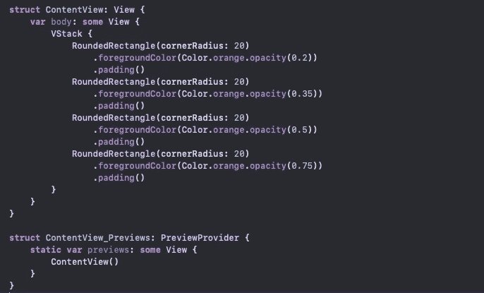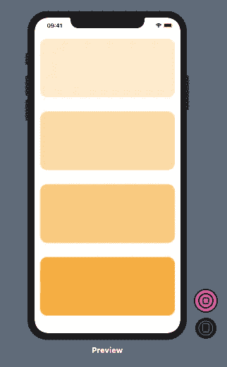

代码结果—填充

# **垫片**

`Spacer`添加沿其容器轴扩展的灵活间距。在 HStack 内部，间距将是水平的。在 VStack 内部，它将是垂直的。如果`Spacer`不包含在堆栈中，那么系统将增加两个轴的间距。

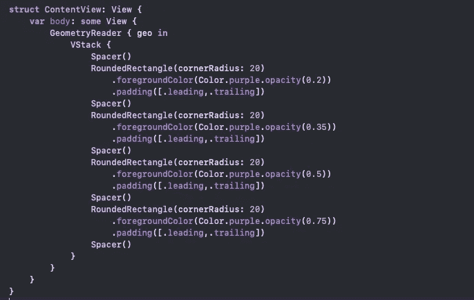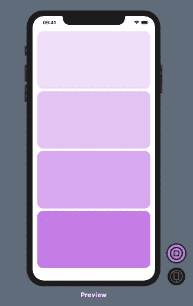

代码结果—垫片

现在，让我们通过添加一些图表来获得一个更复杂的视图。

## 圆形图

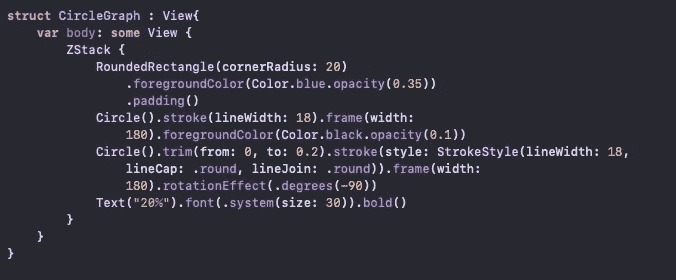

## 条形图

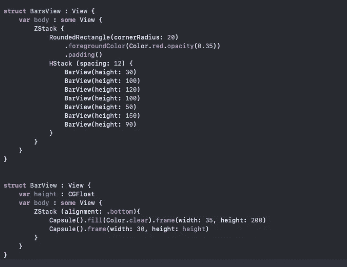

# 几何阅读器

现在我们可以看到，我们依赖于许多常数。`Spacer()`和`padding()`还不够。让我们来修复圆图。首先，从`RoundedRectangle`中移除填充，并将其添加到 ZStack，而不是圆形和条形图。

调整两个圆的框架宽度，使其仅覆盖 40%的视图:

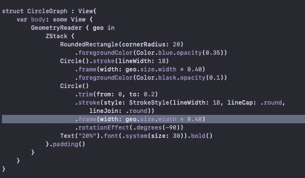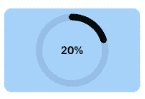

圆图代码结果

对于条形图，我们将框架的宽度改为 45%,高度改为两个胶囊视图的 80%:

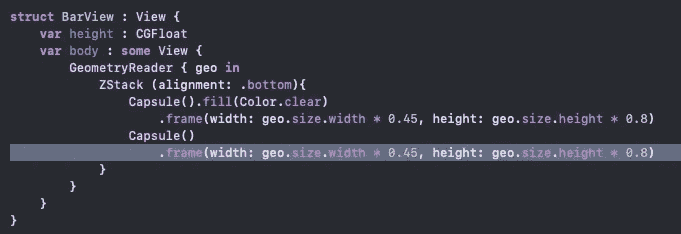

删除条形之间的间距:

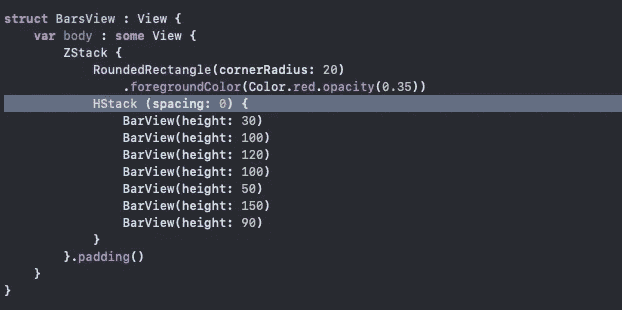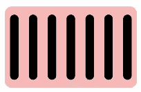

条形图代码结果

我们需要标准化第二个胶囊的高度值，使其能够在不影响视图的情况下采用任何随机值:

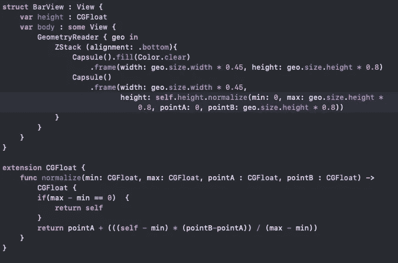

我们可以将视图添加到我们的`ContentView`中，查看应用程序中的所有内容:

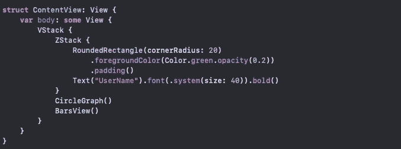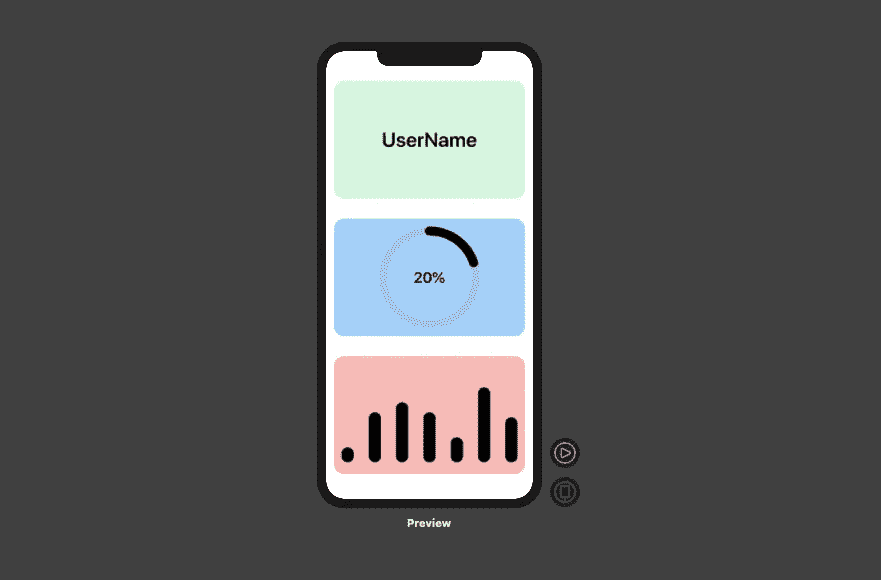

代码结果—几何阅读器

# 结论

我希望那有帮助。感谢阅读！