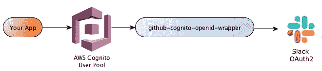
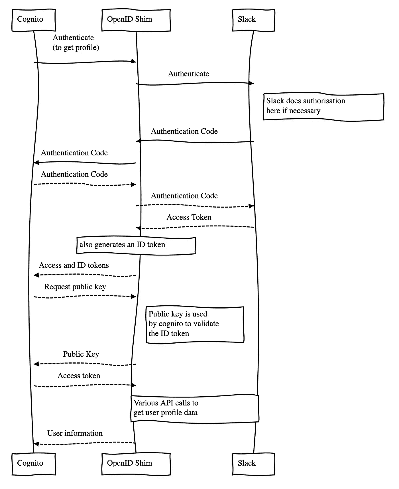
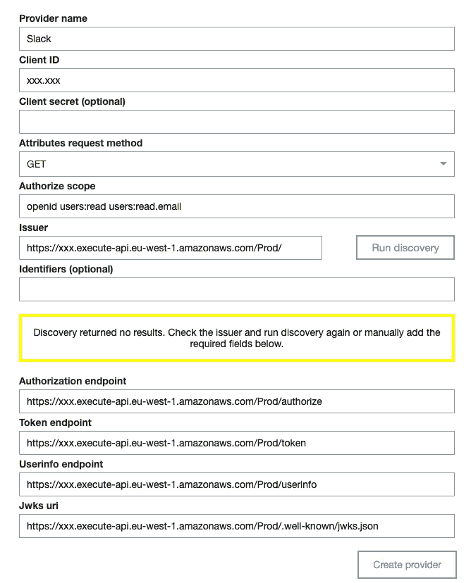

# 如何:AWS Cognito +使用 Slack 登录

> 原文：<https://betterprogramming.pub/how-to-aws-cognito-sign-in-with-slack-85430aba6cc1>

## 创建一个 OpenID Connect 兼容的 shim，用于与 AWS Cognito 一起使用的 Slack 登录

杰西·布瑟在 [Unsplash](https://unsplash.com?utm_source=medium&utm_medium=referral) 上的照片

# 问题是

用 Slack 登录只是一个 OAuth2 实现，而不是一个 [OpenID Connect](https://openid.net/connect/) (OIDC)实现。这意味着它只提供*授权*而不提供*认证*。

*   认证:这个用户是他们所说的那个人吗？
*   授权:允许用户访问特定的资源吗？

这意味着您不能在 [AWS Cognito](https://aws.amazon.com/cognito/) 中使用 Slack 的本地登录作为 OIDC 提供者，因为 Slack 只提供了一个可用于访问 Slack 资源的访问令牌，而不是一个告诉我们用户是谁的 ID 令牌。

# 解决方案

幸运的是，Slack 有一个获取用户数据的 API，我们可以用它来构建 ID 令牌。

这些都将被放在位于 AWS Cognito 和 Slack 之间的 [AWS Lambda](https://aws.amazon.com/lambda/) 中。

认知和松弛之间的λ垫片

# 它看起来像什么

归功于 [@JonesTim](https://twitter.com/JonesTim)

# 如何实施

前往[GitHub repo](https://github.com/jonoirwinrsa/slack-cognito-openid-wrapper)查看自述文件获取详细说明。下面列出了基本要素:

1.  创建一个认知用户池。(如果您使用的是 [AWS Amplify](https://aws.amazon.com/amplify/) ，请确保将默认设置从电子邮件更改为用户名验证。)
2.  使用 Cognito *域*作为 Slack 应用重定向 URL，创建一个 Slack 应用。
3.  将`example-config.sh`复制到`config.sh`并更新其中的变量。
4.  `npm install`和`npm run deploy`。
5.  使用步骤 4 中从 [CloudFormation](https://aws.amazon.com/cloudformation/) 输出的 URL，使用以下配置将*OpenID Connect Federation Provider*添加到您现有的 Cognito 用户池:

OpenID 连接提供程序

6.在 Cognito 用户池*应用客户端设置中启用新的 Slack 提供者。*

7.更新*联盟属性映射中的用户信息映射。*

7.返回 *App 客户端设置* **，**点击*启动托管 UI* 测试你的新 Slack 登录。

如果一切顺利，应该会使用代码`GET`变量将您重定向到您的应用程序。

# 出事了

如果不成功:

1.  将`src/connectors/logger.js`中的 Winston 记录器级别从`info`更改为`debug`。
2.  `npm run deploy`又来了。
3.  查看 [CloudWatch](https://aws.amazon.com/cloudwatch/) 中的 Lambda 日志。

# 奖励:反应放大登录按钮

# 资源

*   Slack Shim 代码:[https://github . com/jonoirwinrsa/slack-cognito-OpenID-wrapper](https://github.com/jonoirwinrsa/slack-cognito-openid-wrapper)
*   这是基于 GitHub Cognito Shim 的蒂莫西·琼斯的功劳。