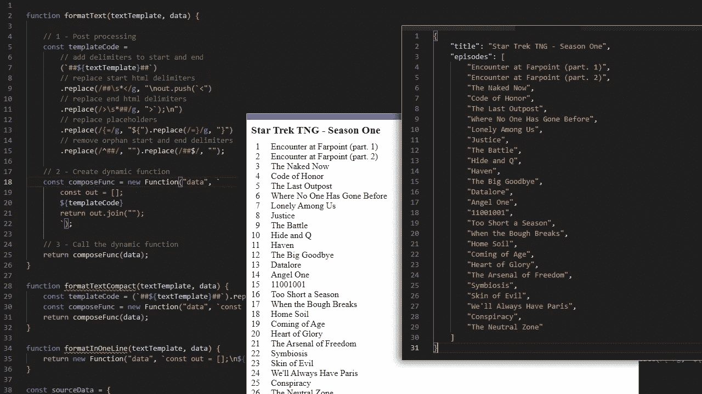
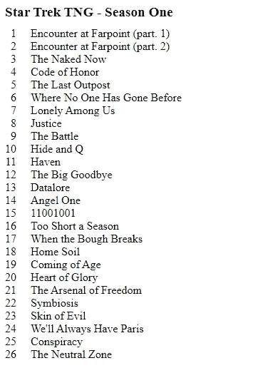

# 如何用三行代码“烘焙”一个 Javascript HTML 模板引擎

> 原文：<https://betterprogramming.pub/how-to-bake-a-javascript-html-template-engine-in-just-three-lines-of-code-669fd718c2d>

## 使用正则表达式、模板字符串和动态函数以简单快速的方式管理 HTML 模板字符串



```
**Ingredients:** Function class, Regular Expressions, Template Literals, and some curiosity**Cooking time:** 10 minutes
```

网上有几种 JavaScript 模板引擎。从强调性能的到强调语法和代码可理解性的。

除了这些方面，对于大量使用文本模板的项目来说，有一些非常好的产品绝对是理想的选择。

当然，它不会是用三行代码编写的东西来与更强大的系统竞争，但是考虑从模板开始产生文本的其他机制可能是有用和有趣的。

此外，菜单上做出来的东西可能会很有趣。

# 基本原则

通常模板引擎提供自己的语法，用来调用特定的操作，比如一个`for`循环，允许我们通过改变迭代中涉及的变量值来重复文本。有了自己的语法，通常每个引擎都必须实现一个解析器和其他功能，以便能够正确地解释指令，从而在输出中产生我们期望的文本。

但是，文章标题讲的是三行代码。那么，怎么可能只用三行代码就实现一个解析器和引擎所需的所有功能呢？嗯…这是不可能的，但这不是问题。

事实上，我们已经有了一个非常好的解释器，它是我们代码运行的 JavaScript 运行时。如果我们添加 ES6 的模板字符串和一些正则表达式，这里我们就有了紧凑引擎的所有成分。

有关更多详细信息:

*   [模板文字(模板字符串)MDN](https://developer.mozilla.org/en-US/docs/Web/JavaScript/Reference/Template_literals)
*   [正则表达式 MDN](https://developer.mozilla.org/en-US/docs/Web/JavaScript/Guide/Regular_Expressions)

假设我们有一个数据结构，我们需要通过向其中注入值来生成一些 HTML 代码，并且还必须重复代码块。显然，每个重复的代码块都必须注入从源数据中读取的不同值。

数据结构:

我们希望实现的目标:

显然，解决方案不是创建一个简单的 JavaScript 函数，而是编写一些连接字符串的代码，读取传递的数据。当然，这种类型的解决方案会产生很好的结果，但是它一点也不通用，而且它与模板引擎的概念相去甚远。

我们希望将模板放在包含一些文本的 JavaScript 字符串中，在本例中是 HTML 代码，以及一些可以对数据执行迭代和其他典型语言操作的 JavaScript 代码。

哦，我忘了，我们甚至不想写解析器！(至少今天不会)。

# 食谱

让我们考虑初始数据和我们想要获得的结果，尝试分解相关的部分。

我们有了想要在输出中生成的第一条数据:电视剧标题。在这种情况下，这是一个“一次性”脚本，只需要在一个`<div>`标签中注入`title`属性的值。

我们的模板可能像这样开始:

```
<div class="title">{= data.title =}</div>
```

我们立即注意到在标记中使用了特定的语法，反过来，在标记中使用了典型的 JavaScript 表达式来访问名为`data`的对象的`title`属性。

让我们立即分析这些首要元素:

语法`{= ... =}`允许我们在模板中引入一条指令，以便解析一个值，从传递的数据中读取该值，并调用下一代。

标识符`data` 是指被传递对象的根，可以是 JavaScript 对象、数组或任何其他值。在我们的例子中，它是一个包含第一个属性`title`的对象，我们感兴趣的是将它解析为一个插入到输出中的值。

> 使用`{=`和`=}`作为分隔符的选择完全是任意的。只要不与模板的其他部分冲突，您可以使用任何想要的字符组合。也就是说，模板中其他可能的元素不需要转换就可以在输出中结束。
> 例如，如果我们简单地使用字符`<`和`>`，那么区分一个值的占位符就比区分一个输出 HTML 标签更加困难。

此时，我们需要转换“tv series”对象的子元素，滚动剧集名称并将它们插入到一个`div`标签内的输出中。

但是在我们决定子元素必须驻留在表示剧集列表的额外的`div`标签中之前。因此，我们应该将以下开始标记添加到模板中:

```
<div class="episodes-list">
```

这一部分将在输出中打印出来，不做任何转换。

下一个零件的不同条件将不得不同于模板中表达的内容。我们必须声明一个包含剧集编号的变量(将通过在循环中递增变量来动态计算)，为了滚动剧集，我们需要一些 JavaScript 代码作为循环`for..of`。

在我们的模板中，我们将添加变量和`for..of`构造的初始部分:

```
let episodeNumber = 1;
for (let episodeName of data.episodes) {
```

我们再次引用主对象`data`，浏览包含在`episodes`属性中的数组。

在循环内部，我们应该打印带有剧集号和`episodeName`相对值的 HTML 代码，作为迭代的第 n 个元素。

```
<div class="episode-name"><span>{= episodeNumber =}</span><span>{= episodeName =}</span></div>
```

我们递增变量，并通过关闭`for..of`构造来结束:

```
episodeNumber++;
}
```

最后，我们还关闭章节列表的`div`标签，在`for..of`循环之前打开。

```
</div>
```

将所有这些放在一起，让我们想象我们已经构建了以下模板:

乍一看，这似乎没什么问题，但是这样一来，我们的“引擎”还不能区分输出文本和 JavaScript 代码，所以我们必须后退一小步，通过插入一个分隔符(一个或多个字符)来修改我们的模板，该分隔符指示从静态文本到 JavaScript 指令的转换，反之亦然。

选择这样一个分隔符的标准可以根据几个因素而变化，比如输出文本的类型(HTML 或其他)或者我们的文本所在的位置(在一个外部 HTML 文件中，在一个多行 JavaScript 字符串中，等等)。

对于这个特定的简单例子，我选择使用字符序列`##`，因为它在视觉上突出了从 HTML 代码到 JavaScript 代码的过渡，并且因为它几乎不会与任何其他代码冲突。
此时，我们的模板应该是这样的:

或者，如果我们发现它更具可读性(这两个代码块是等效的)，也可以采用这种方式。

仅此而已。在模板级别，我们的“引擎”完成工作不需要任何其他东西。

这样，它将能够用很少的操作从指令中分离出文本，并将其转换成最终的文本。

# 如何制作

到目前为止，我们只看到了与模板编写技术相关的部分，但在开始时承诺的是只用三行代码创建模板引擎的方法，所以是时候转移到我们实际“烹饪”引擎的部分了。

所需的步骤少而简洁:

1.  模板字符串的后处理:
    ***一*** 。在模板文本的开头和结尾添加用于分隔静态代码和 JavaScript 指令的相同分隔符。
    ***B*** 。用两个不同的正则表达式替换特定文本的分隔符(我们很快就会看到)。
    ***C*** 。再次用正则表达式将值`{= exp =}`的占位符替换为形式为`${exp}`的相同表达式。
    例如:`{= data.title =}`变成了`${data.title}`。
    ***D*** 。移除模板字符串开头和结尾的所有孤立分隔符。
2.  动态生成一个负责转换文本的函数。
3.  调用函数，向其传递用作参数的对象，并生成最终文本。

让我们看看接受两个参数的简单函数中的所有内容:第一个是模板文本(静态文本和可能的 JavaScript 指令)，第二个是将从中读取值的任何数据对象。

好吧，好吧。我说了三行，这里我们至少有 20 行…但是如果我们去掉所有不必要的注释和回车，剩下的是

准备好了！

你们中的一些人可能已经注意到我可以用一行代码写“……这是可能的！)但也许，考虑到生成的代码难以辨认，它应该是 clickbait。
反正；)

# 分步分析

让我们来看看在单个步骤中详细发生了什么，甚至看看我们的模板文本如何不时地变换。

我们从这个条件出发

我们在开头和结尾添加分隔符

我们使用正则表达式`##\s*<`捕获模式`## + (space or empty) + <`并用`(new line) + out.push(`<`替换它们，使用正则表达式`>\s*##`捕获模式`> + (space or empty) + ##`并用`>`); + (new line)`替换它们。我们将得到的是:

此时，最后一个后处理步骤是用 JavaScript 模板文字管理的占位符格式替换我们的占位符(如果有的话)。我们将把字符`{=`替换为`${`，将`=}`替换为`}`，以获得:

通过最后的替换，我们已经将模板转换成了正确的 JavaScript 代码。现在我们只需要将它插入到一个能够执行它的动态函数中，最后，调用该函数产生最终结果。

JavaScript 语言的 Function 类将用于生成函数，通过它可以将它将接受的参数和函数本身定义为 string。

*更多详情:* [功能 MDN](https://developer.mozilla.org/en-US/docs/Web/JavaScript/Reference/Global_Objects/Function/Function)

这是我们的参考代码:

> 我插入了两行定界注释，以便更好地与最终生成的函数进行比较

我们通过 function 类创建一个动态函数，我们向它传递第一个表示参数名称的字符串和第二个(最后一个)表示函数体的参数。我们可以看到使用多行字符串来定义主体，这允许我们插入一个占位符来调用之前转换的模板。
运行时将在内存中生成如下内容:

`composeFunc`常量将包含对函数的引用，您可以像调用任何其他显式声明的函数一样调用它。
因此:

```
return composeFunc(data);
```

将返回我们想要得到的最终文本:

使用简单样式呈现的效果如下所示:

```
.title {
    font-weight: 700;
    font-size: 1.2em;
    margin-bottom: 10px
}
.episode-name > span:first-child {
    display: inline-block;
    text-align: right;
    font-weight: 500;
    margin-right: 20px;
    min-width: 2ch;
}
```



# 结论

我们已经看到了如何使用正则表达式、模板字符串和动态函数以简单快速的方式管理 HTML 模板字符串。
确切地说，我们已经实现的东西虽然功能多样，但还远远不能被认为是真正的模板引擎。这可能是一个很好的开始想法，但有必要引入许多其他功能和验证，使系统更加实用和安全。

我们所做的更多的是一种风格上的练习，让我们“弄脏我们的手”,并仔细观察一些功能组合在一起时是如何工作的。

就像任何一道新菜一样，第一次实现往往会带来缺陷和近似。但是实验的美妙之处在于学习新的东西，不管这些成分结合得好不好。这并没有改变食谱可以改进的事实，有时，缺点可以转化为优势。嗯……我已经有想法了，我想我们将来会再来一次。

保持好奇心，保持创造力！

非常感谢我的朋友 Chiara Bernardini 对我的支持