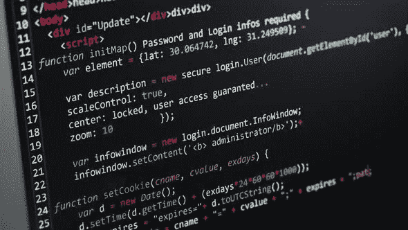
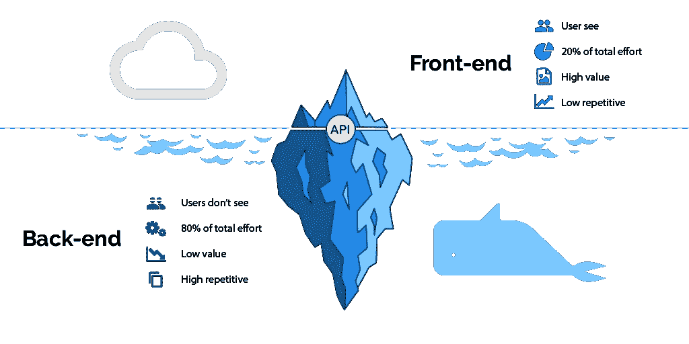

# 成为网站开发者的 7 个步骤

> 原文：<https://betterprogramming.pub/how-to-be-a-web-developer-in-7-steps-d0026719732a>

## 应该学什么，从哪里入手？

林赛·亨伍德在 [Unsplash](https://unsplash.com/search/photos/steps?utm_source=unsplash&utm_medium=referral&utm_content=creditCopyText) 上的照片

我经常被许多在另一个行业领域的朋友问:要成为一名 web 开发人员，我应该学习什么，我应该从哪里开始？

这些问题至关重要，除了职业培训中心或大学提供的机构培训之外**，**每个人都必须在一定程度上自学。

我十一岁开始开发软件。这可能看起来有点晚了，但请记住，我是用我哥哥的大学笔记做的，因为那时没有互联网。今天，我们有大量的资源，可以让我们随时随地学习我们想要的任何东西。

事实上，如此大量的信息会让我们感到迷失，所以我决定向你展示成为一名网站开发者必须采取的前七个步骤。遵循这些步骤后，你将能够选择自己的道路。

# 1.耐心

当你想进入这个行业时，第一步也是最重要的一步是要有耐心。你必须每天努力提高你的技能。尤其是在开始的时候，你可能不会意识到开发一个应用程序所花费的时间的回报。

因此，现在和永远，记住:耐心。

# 2.超文本标记语言

第一个必须学习的 web 开发技术是 HTML。HTML 对于 web 应用程序就像地基对于建筑一样。HTML 诞生于大学，用于将文档相互关联。这使得查找内容相似的文档变得更加容易。然而，web 的发展使得 HTML 被用作创建 web 应用程序的基础文档。

学习 HTML 的最大缺点是你的应用程序会有可怕的视觉效果。这可能会令人沮丧，因为你可能会觉得你的努力和结果不一致。但是每当你有这种感觉的时候，你一定要记住第一步:耐心！

通常我们和 CSS 同时学习 HTML。使用 CSS 为我们的 web 应用程序添加样式可以帮助减少前面提到的挫折，因为视觉方面得到了很大的改善。

有两个很棒的短期课程，涵盖了 HTML 最重要的方面。

## [互联网很难(但不一定如此)](https://internetingishard.com/)

一个友好的网页开发教程，适合完全的初学者。

> 学习编码应该不难。我们把一套全面的网络开发教程放在一起，帮助完全的初学者转变为有才华的互联网专业人士，让这变得更容易。我们已经有了课程，你需要的只是开始阅读的动力。

## [学你 HTML](https://github.com/denysdovhan/learnyouhtml)

本教程涵盖了 HTML 最重要的方面，包括标签、表格和样式。

# 3.半铸钢ˌ钢性铸铁(Cast Semi-Steel)

你应该采取的下一步是学习 CSS。如果 HTML 是基础，CSS 就像房子的绘画、装饰或个性化。

CSS 是吸引顾客的特性，因此也是赚钱的特性。那些不理解 CSS 重要性的人可能有兴趣知道，大多数时候，我们的 web 应用程序背后是哪种技术并不重要。通常情况下，顾客不会为他们不觉得有视觉吸引力的产品付钱。

但是当你学习 web 开发的其他部分时，你会学到很多 CSS。在你旅程的这一部分，你应该专注于学习如何设计一个网页。显然，在这一步中不需要对 CSS 有深刻的了解，但是你必须能够保护自己。随着你旅程的进行，你的 CSS 技能会逐渐提高。

这里有三个基本的可用资源:一门包含 20 个互动教程的课程、一份由导师准备的练习清单和一份参考资料。

## [CSS 教程](https://scrimba.com/g/gintrotocss)

本课程包含 20 个互动教程，将在一个小时内教会你 CSS 的基础知识。对于想要简单学习 CSS 的有抱负的 web 开发人员和设计人员来说，这是一个完美的起点。

## [CSS 练习](https://github.com/dangodev/css-exercises)

作为导师项目设计的 CSS 练习。

## [Codrops CSS 参考](https://tympanus.net/codrops/css_reference/)

一个广泛的 CSS 参考，包含学习 CSS 基础的所有重要属性和信息。

# 4.Java Script 语言

今天的革命是 [JavaScript](https://www.javascript.com/) 。

你必须掌握 JavaScript/TypeScript，因为它是网络的现在和未来的语言。请记住，没有人有水晶球，我们不知道未来 20 年会发生什么。JavaScript 是现在存在于前端的语言，是你需要能够完美处理的语言。

JavaScript 是一种诞生时就有成为脚本语言意图的语言，但如今它是一种试图覆盖多种范式的语言。这种语言的真正发展是在过去的五年里。这就是为什么 JavaScript 应该被深入研究的原因:用它你可以构建桌面、移动、后端和前端应用程序。

资源列表将会很广泛，这就是为什么我建议从下面列出的书籍开始。相信我，我告诉你，你每天都会学到新的东西。在过去的七年里，我一直是一名 JavaScript 教师，几乎每年都会修改课程大纲。但是不要惊慌，编程的基础仍然是一样的。

所以为这一步做好准备:

## 互动学习

*   [Codecademy](https://www.codecademy.com/learn/javascript)—JavaScript 基础。
*   [函数式编程](http://reactivex.io/learnrx/) —通过使用 map、filter、concatAll、reduce 和 zip，以互动的方式学习函数式编程的基本原理。

## 免费电子书

*   [雄辩的 JavaScript](http://eloquentjavascript.net/)——涵盖语言和运行时细节。
*   [讲述 JavaScript](http://speakingjs.com/)——从基础开始的深入指导。
*   [JavaScript 设计模式](http://addyosmani.com/resources/essentialjsdesignpatterns/book/) —经典和特定于 JavaScript 的设计模式。
*   [基本上足够的函数式编程指南](https://mostly-adequate.gitbooks.io/mostly-adequate-guide/)——使用 JavaScript 进行函数式编程的优秀入门。

## ES6 及以上

*   [探索 ES6](http://exploringjs.com/es6.html) —有深度章节的好介绍。
*   [探索 ES2016 和 ES2017](http://exploringjs.com/es2016-es2017.html) —跟进“探索 ES6”
*   [ES6 Katas](http://es6katas.org/) —通过在线解决单元测试来学习 ES6。
*   [实用 ES6](https://github.com/mjavascript/practical-es6) —包含实用示例和建议的电子书。

# 5.停止学习，开始练习！

现在是休息的时候了。不要试图向你的头脑中引入更多的概念。不再有新东西了。

现在你已经有足够的知识去应聘 IT 行业的工作了。在我看来，学习和巩固知识最好的方法就是进行项目。现在你能够执行项目了——把它们当作练习来强化你已经获得的知识。然而，要有足够的堆栈来生成真正的项目，还有很长的路要走。

我有一篇关于这个话题的帖子，推荐你阅读。

# 6.数据库— MySQL/PostgreSQL

一旦掌握了客户端 web 开发(前端)所基于的基本技术，就该开始掌握服务器端开发(后端)的基础了。web 开发中的这一新学科需要理解数据是如何存储的。信息是软件中最有价值的资产，因此，我们必须对数据库如何工作有广泛的了解。

人们的整个职业生涯都是围绕数据库管理展开的，所以这是一个很大很重要的领域。要开始这方面的工作，我建议您学习关系数据库:MySQL 或 PostgreSQL。

## [数据库设计](https://www.udemy.com/database-design/)

通过实用的概念和示例学习关系数据库设计。本系列适用于任何数据库系统！

## [SQL 练习](https://github.com/XD-DENG/SQL-exercise)

这些模式和问题来自 Wikibook [**SQL 练习**](https://en.wikibooks.org/wiki/SQL_Exercises) 。

# 7.后端— PHP/NodeJS/JAVA

后端语言允许您充分利用数据库的潜力，因为您可以生成动态 web 应用程序。在这些 web 应用程序中，前端将从后端接收数据，这就是 web 开发的神奇之处，因为数据是动态和持久的。

最简单的开始方式是构建一个 APIrestful 第一次会非常非常复杂，但是很正常。我们每个人都遇到过这种情况，但一旦完成，你会发现你只是揭开了冰山一角，第一次看到后端的全部潜力。

我建议开始学习 backend，先从广泛使用的语言开始，比如 [node.js](https://nodejs.org/en/) 或者 [PHP](https://www.php.net/) 。

## [PHP 初学者教程:7 天学会](https://www.guru99.com/php-tutorials.html)

PHP 是网络上最流行的脚本语言。没有 PHP，脸书、雅虎和谷歌就不会存在。本课程旨在让你成为一名 PHP 专家。一旦你理解了所有的基础知识，本课程将帮助你创建你自己的民意测验应用程序。

## [Node.js 教程:3 天学会](https://www.guru99.com/node-js-tutorial.html)

Node.js 也基于 JavaScript 框架，但它用于开发基于服务器的应用程序。在浏览整个教程时，我们将详细研究 Node.js，以及如何使用它来开发基于服务器的应用程序。

## [口袋妖怪 API](https://github.com/NyaGarcia/pokeAPI)

一个 Pokemon RESTful API，内置于 node.js、Express、MongoDB、Docker，尤其是 TypeScript。

## [前端开发节点教程](https://github.com/cwbuecheler/node-tutorial-for-frontend-devs)

一个面向前端开发人员的教程和完整示例项目，展示了如何启动和运行 Node、Express 和 [Jade](http://jade-lang.com/) ，连接到 [MongoDB](https://www.mongodb.com/) ，以及读取/写入数据库。

## [Node.js 示例应用](https://github.com/ijason/NodeJS-Sample-App)

带有 Node.js、Express 和 MongoDB 的雇员数据库 CRUD 应用程序示例。

## [PHP:正确的方法](https://phptherightway.com/)

网络上有很多过时的信息，将 PHP 新用户引入歧途，传播不良实践和不安全的代码。“PHP:正确的方法”是一个简单易读的 PHP 流行编码标准的快速参考，链接到网上的权威教程，以及贡献者认为目前的最佳实践。

# 奖励:框架

在这一点上，你将有知识开始你的职业生涯作为一个网页开发人员。然而，从第三步开始，你已经可以在这个行业找到一份工作，并从那里开始，继续发展成为一名开发人员。

下一步是深化你的框架知识，因为它们允许你轻松地配置你在这篇文章中学到的基本概念。框架是帮助你更快开发并允许你创建更大项目的工具。

现在，我将为您留下一些最有用和最流行的框架的参考资料:

*   [循序渐进 Laravel 后端教程](https://github.com/0x3fc/laravel-backend-tutorial)。
*   [Angular 教程:从零开始一步步学习 Angular](https://github.com/AngularTemplates/learn-angular-from-scratch-step-by-step)—探索 Angular 框架的基本概念和原因，使用 Angular 材质组件构建完整的 Angular 7 应用程序。
*   [spring boot for beginners](https://github.com/in28minutes/SpringBootForBeginners)——Spring Boot 有很多吸引人的地方。用它开发服务很酷也很有趣。Spring Boot 使得创建可以运行的独立的、生产级的基于 Spring 的应用程序变得很容易。大多数 Spring Boot 应用需要很少的弹簧配置。

如果你喜欢这篇文章，并想阅读类似的文章，别忘了鼓掌。

点按并拖移以不止一次鼓掌。50 是极限。

# 结论

在这篇文章中，我向你展示了成为一名 web 开发人员的第一步。第一步也是最重要的一步是你的积极态度，如果你想在这个行业里，这是你永远不能失去的。即使你已经发展了 20 年，经历了各种技术栈和公司，你也要一直，一直，一直有耐心保持成长。

你成为一名网页开发者的第一步是什么？你会给刚入行的人什么建议？