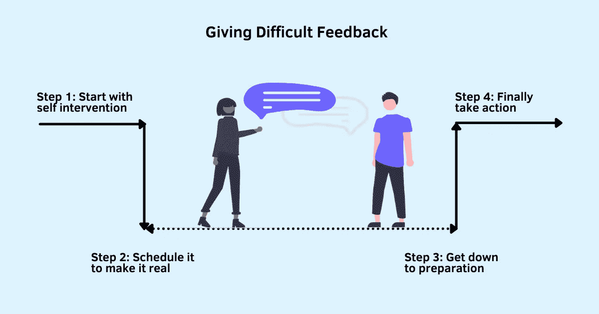

# 如何舒服地给出困难的反馈

> 原文：<https://betterprogramming.pub/how-to-be-comfortable-giving-difficult-feedback-68c91645ee18>

## 这从来都不容易，你只会变得更好

鸣谢:作者

有什么比收到难以接受的反馈更可怕的呢？给一个。担心负面反馈会伤害对方并破坏你们的关系是避免说出你需要说的话的最大阻碍之一。

如果是你需要向组织中的高层提供的反馈——另一个部门的领导、你的首席技术官、你自己的老板——该怎么办？你愿意告诉他们你的真实感受吗？

以我的经验，大部分人都不会。我们要么对自己撒个谎“没那么重要”来忽略它，要么试图拖延它，等待最佳时机出击，但这从来都不是真的。

没有说出你需要说的话会让你避开这个人，会比你有勇气面对这个人带来更多的压力和焦虑。在脑海中重复你要说的话，预测他们的反应，想象最糟糕的可能结果，这让事情变得更加困难。每一次倒带都让故事变得越来越可怕，让你相信你没有说实话是对的，不值得冒这个险。

不说出来并不能挽救你和对方的关系，只会让你更受伤。你开始在他们面前尴尬。主动回避你需要说的话会让你出洋相。被你脑海中的喋喋不休分散注意力会让你更少关注讨论，而更多关注你如何给他们留下印象*“如果我这么说，他们会知道我的感受吗？”“我怎么能隐藏我的感情呢？”“如果我的感觉对他们来说很明显呢？”*

还有一个问题。没有困难的对话不会让问题消失，只会让问题变得更糟。你不仅恨自己对此无动于衷，你还会暗地里开始恨别人。所有这些，尽管他们完全不知道这些负面的感觉。

如果这是一个对你很重要的问题，避免困难的谈话的影响不仅仅局限于伤害感情，它也会伤害你的生产力和表现。

回避对话对你没有帮助。这对另一个人毫无帮助。你通过避免困难的谈话而省下的短暂不适只会在一段时间后被放大。

给出困难的反馈可能是你在工作中必须做的最困难的事情，但是培养这种技能就像锻炼肌肉一样。它只会随着练习变得更好。这从来都不容易，你只会变得更好。

> 你生活中想要的每一个结果都有一个过程。您需要定义和实现您的过程。肯定这一点，现在你就有所进展了——哈尔·埃尔罗德

以下是我给出困难反馈的一步一步的过程。

# 第一步:从自我干预开始

> 我们在生活中面临的许多选择是混合的:有损失的风险和获得的机会，我们必须决定是接受还是拒绝这场赌博……当直接比较或权衡彼此时，损失大于收益——丹尼尔·卡内曼，思考，快与慢

这种对损失的厌恶和对负面事物的过度关注使你拒绝说出真相的潜在收益，同时关注这样做的危害。

接受给出困难反馈的唯一方法是进行深思熟虑的思考，从自我干预开始。

坐下来问自己这些问题，让大脑的意识部分参与进来，而不是让你的潜意识为你做决定。

*   我在努力避免什么？我回避的理由是什么？
*   最坏能发生什么？真的会有这么糟吗？还是我瞎编的？
*   不说我需要说的话的代价是什么？这对我个人有什么影响？
*   如果其他人对我隐瞒对我成长很重要的关键反馈，我会喜欢吗？如果我不喜欢，为什么我对别人这样做是对的？
*   拯救别人的感受和我的不适，还是帮助对方改善行为变得更好，哪个更重要？

这些问题最初可能需要一些时间，但经过足够的练习，你会自动学会接受困难的对话，并本能地发现自己不那么害怕了。

# 第二步:安排它，让它成为现实

当你对自己说“现在不是时候……我以后再做”的时候，你就在欺骗自己推迟让你不舒服的事情。即使你同意这样做是对的，光有意图是不够的。你也需要努力把你的意图变成行动。

> 我们必须学习一种叫做“预承诺”的强大技术，它包括消除未来的选择，以克服我们的冲动……这样的预承诺是强大的，因为当我们头脑清醒时，它们巩固了我们的意图，使我们不太可能在以后做出违背我们最大利益的行为

在第 1 步中，对你的回避行为和回避困难反馈的潜在后果进行自我反思，可以让你清晰地做出正确的决定。一旦你做出了决定，下一步就是立即把它安排在你的日程表上。

不是以后，就在那一刻。通过在日历上安排时间来承诺未来的行动会让你更有可能坚持你的决定。此时此刻，不要考虑你将如何去做。最重要的是让你的承诺看得见。

一旦你完成了这一步，你就已经成功了一半。下一步是不要让你的不适和紧张阻碍了你传达困难的反馈。

# 第三步:开始准备

> 准备准备准备。当有压力时，你不能应付自如；你进入了你的最高准备阶段——克里斯·沃斯

除非你已经是一个擅长进行困难对话的人，否则毫无准备地参加讨论会让你说出一些你以后很可能会后悔的话。传达正确的信息而不操纵或淡化文字需要练习和准备。

以下是我在决定说什么时应用的 3 条规则:

**规则一:不要把它私人化。**对他们的行为做出反馈。永远不要以人为中心。

例如，告诉某人“你是[主宰](https://www.techtello.com/working-with-a-dominant-personality/)”和说“当你做【这个，这个和那个】的时候，这会让我们认为你不在乎我们的意见”之间有很大的区别

第一个会立即让对方处于守势，而第二个会给他们一个机会来评估你的意见。

规则 2:练习清晰简洁的交流。保持简短。有什么话就直说，不要拐弯抹角。你需要具体地帮助他们理解你的担忧，而不是淹没在不必要的信息中。通常情况下，一两个你看到的令人烦恼的行为的例子应该足以帮助他们联系起来并理解讨论的意义。

例如，如果你的经理有在深夜打电话打扰你和家人共度夜晚的倾向，不要对此喋喋不休，将责任推给他们，让他们从字里行间去理解你隐藏的问题。直截了当，开诚布公地谈论不便之处。告诉他们他们晚上的电话是如何让你难以和家人共度美好时光的，以及为什么你需要这段休息时间来尽你最大的努力，做出富有成效的贡献。

规则 3:关注影响，而不是情绪。

描述特定行为、行动或不行动的影响。谈论影响会让大脑的一部分参与进来，使他们积极寻求解决方案，而不是谈论抑制他们逻辑思维能力并使他们难以合理解释情况的情绪。

例如:如果一位同事在工作中习惯使用冒犯性的语言，不要告诉他们他们的语言让你感觉如何，而是告诉他们这对你们的合作有什么影响。这并不意味着你无视自己的感受，根本不应该提及。然而，保持对影响的关注，同时加入情绪来引导对话，这是一个超级有效的策略，可以控制局面，并让他们参与进来，以找到双方都同意的解决方案。

使用这三条规则来写下你的对话，并练习大声说出来。

# 第四步:最终采取行动

金克拉写道“你不必一开始就变得伟大，但你必须开始变得伟大。”

换句话说，如果不采取行动，你就无法更好地给出困难的反馈。直面你的负面情绪，在你的日历上安排会议，练习你需要说的话，会把你推向正确的方向，但唯一的改善方法是采取行动。

会带来一些不适和紧张。你甚至会感到焦虑和压力。但是不要让它阻止你采取行动。承认你的感受，并委婉地告诉你的想法，靠边站，为做正确的事情让路——“我知道我正在感受[这个，这个，那个]，但现在我需要把精力集中在这次谈话上。”

重要的是陈述你的观点，不要做出假设或判断。虚心听取他人的意见是富有成效的讨论的重要组成部分。不仅要有效地倾听他们的话语，还要观察他们的肢体语言来寻找暗示，这给了你引导、调整和保持健康对话所需的信息。

结束讨论的一个很好的方式是展示你的好奇心，告诉他们如果他们也能分享[建设性的批评](https://www.techtello.com/how-to-deal-with-criticism/)，你会非常感激。

每当你发现自己拖延困难的反馈或主动回避它时，从自我干预开始，在你的日历上安排会议，练习正确地说出来，然后去做这件事。

## 摘要

1.  给出困难的反馈不会影响你与其他人的关系。没有说出你想说的话。
2.  分享建设性的批评从来都不容易。你可能会忍不住想暂时缓解一点不适，但暂时缓解问题并不会让它消失。只会给以后带来很多压力和焦虑。
3.  为了更好地给出困难的反馈，去真正地做这件事。不会变得容易，你只会变得更好。
4.  要给出困难的反馈，从自我干预开始。与其让你的大脑自动运行，逃避困难的对话，不如暂停一下，花点时间问问自己，让自己更有可能做出正确的决定。
5.  有意识地选择做正确的事情是良好的第一步。下一步是把它安排在你的日历上，让你更有可能坚持这个决定。
6.  给出困难的反馈有正确和错误的方式。通过知道你需要说什么并大声练习来保持你的信息的有效性。
7.  最后，去做这件事。为了保持对话富有成效，不要评判，只分享你的观点。给他们机会说出来，并练习积极倾听，引导对话向正确的方向发展。

在 Twitter 上关注我，了解更多故事。

*这个故事最初发表于*[*【https://www.techtello.com】*](https://www.techtello.com/giving-feedback/)*。*