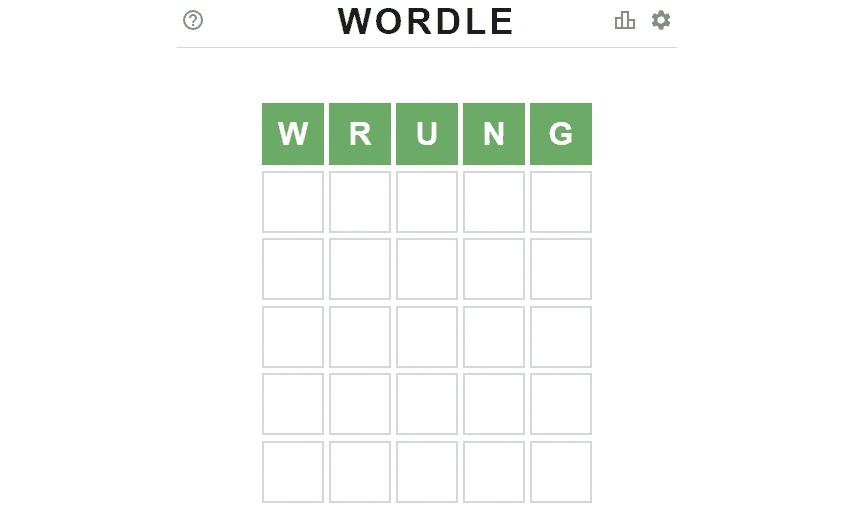
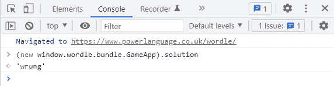
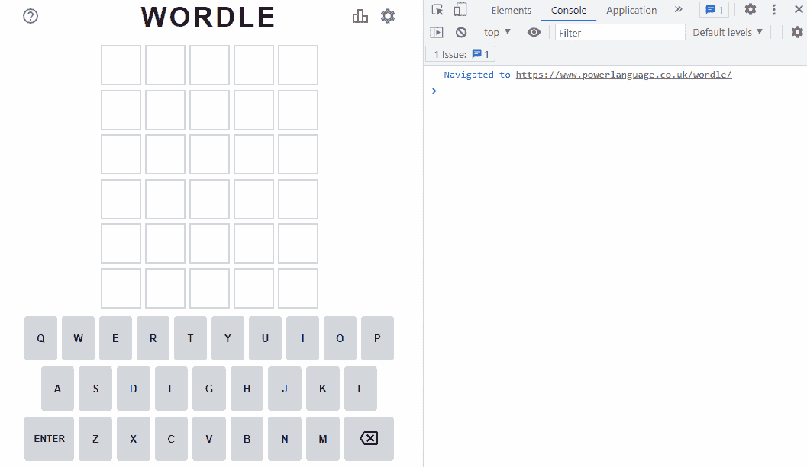
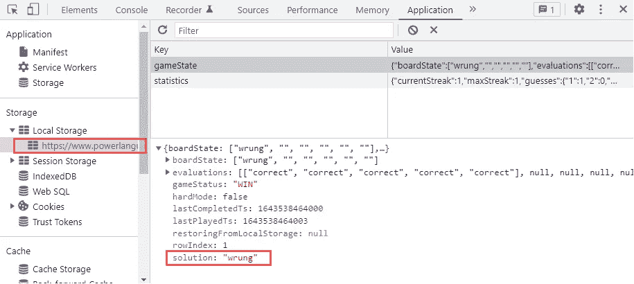
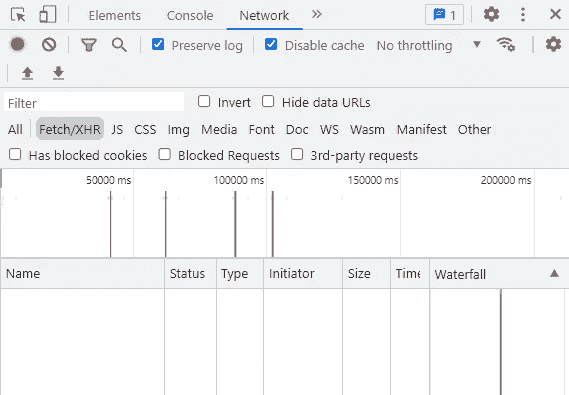
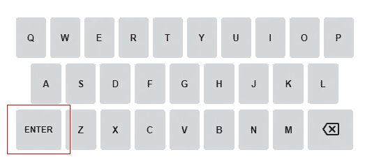
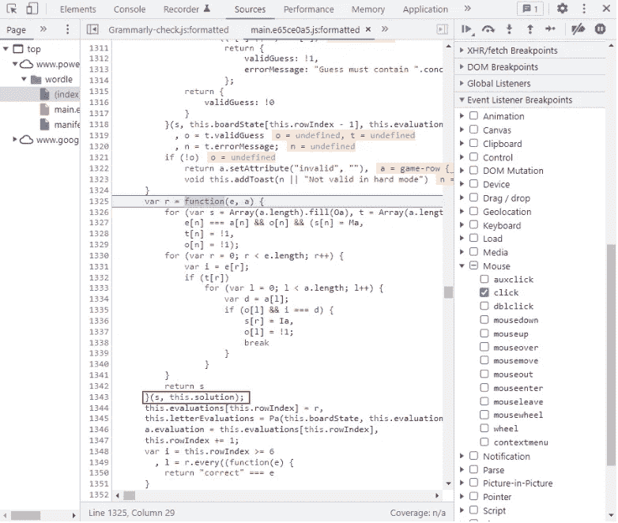

# 如何天天打沃尔多！使用浏览器控制台的简单欺骗

> 原文：<https://betterprogramming.pub/how-to-beat-wordle-every-day-an-easy-cheat-3c1dc51bc4fc>

## 快速解决病毒难题的两种方法



与我通常的文章不同，这不是关于深度学习或计算机视觉的。这是关于一个叫做 [Wordle](https://www.powerlanguage.co.uk/wordle/) **的流行网页游戏。**

由于最近我一直看到许多人在社交媒体上分享他们的日常 Wordle 结果，这让我很好奇去看看这个游戏(或者更准确地说，这个游戏的代码逻辑)，我发现了一个作弊的方法。

# 放弃

使用这个作弊手段会让游戏变得不那么有趣。如果你试图享受游戏，只是喜欢发现策略，请不要使用这个欺骗，把这篇文章看作是一个*程序员如何看待病毒网络游戏*的博客。

# 方法 1

1.  在桌面浏览器中，按下 **F12** 打开开发者工具
2.  转到**控制台**选项卡
3.  将以下代码粘贴到控制台中，然后按键盘上的 Enter 键:

```
(new window.wordle.bundle.GameApp).solution
```



它会把今天的答案返回给你



嘭！

# 方法 2

1.  在桌面浏览器中，按下 **F12** 打开开发者工具
2.  转到**应用程序**选项卡
3.  点击**下的网址** > **本地存储**



你会看到解决方法

# 我是如何发现的

当我们用 5 个字母的单词填充一行并按回车键时，在**网络**选项卡中没有 AJAX 调用被触发。

这告诉我们，它在检查你是否正确时，不需要向服务器询问答案。因此，这意味着答案已经存储在客户端的浏览器中。



没有 AJAX 调用

然后，我们可以在调试器中为鼠标单击添加一个事件侦听器，并查看当我们在虚拟键盘上单击 ENTER 时触发了哪一行代码(这将触发答案检查)。



这个解决方案正是我们所寻找的

现在我知道答案词存储在一个叫做`this.solution`的变量里。通过在整个源代码中搜索`solution`，我发现`solution`是`window.wordle.bundle.GameApp`对象中的一个属性。

因此，我们需要做的是使用`new window.wordle.bundle.GameApp`将其实例化，然后我们可以通过`.solution`获得答案属性。

这只是分享我们如何在网络浏览器中通过开发工具开发网络应用。不鼓励这样玩游戏。毕竟，当你自己猜出正确的单词时，你会有更多的乐趣。

请注意，Wordle 可能会改变其源代码或政策，使这一行欺骗代码不再工作。但是用同样的基本原理和思考步骤，你可以自己发现几乎任何流行网页游戏的诀窍。

黑客快乐！