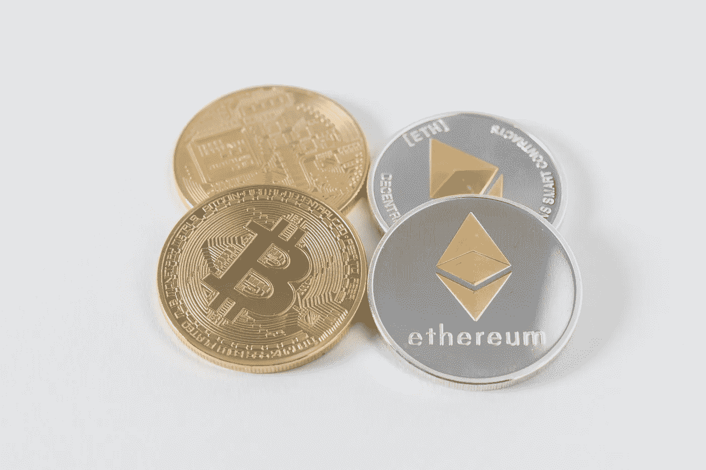

# 如何成为区块链开发者

> 原文：<https://betterprogramming.pub/how-to-become-a-blockchain-developer-7a6d643d1d4d>

## 将你的发展事业引向区块链

照片由[思想目录](https://unsplash.com/@thoughtcatalog?utm_source=unsplash&utm_medium=referral&utm_content=creditCopyText)在 [Unsplash](https://unsplash.com/s/photos/ethereum?utm_source=unsplash&utm_medium=referral&utm_content=creditCopyText) 上拍摄

*这篇文章是为那些对将职业生涯转向区块链感兴趣的专业软件开发人员写的。*

你有兴趣在区块链发展，但不知道从哪里开始？以下是我在 2020 年及以后成为区块链开发者的步骤。

# 第一步。评估你的技能

作为一名软件开发人员，你可能会有自己喜欢的堆栈。您可能已经使用过一些不同的技术，但是您目前正在使用的技术范围很小。如果是这样的话，你已经很有优势了。

全栈开发经验是一个巨大的优势，但在这一点上并不重要。可能你只关注了后端，但没有接触过网页设计。您的主要工作可能是创建 React 组件，但是当有人提到微服务时，您会感到紧张。

最重要的是，你知道自己在全筹码游戏中的优势和劣势。对我来说，我的后端技能(和兴趣)超过了我使用前端框架的倾向。

# 第二步。瞄准所需的技能组合

现在你知道了自己的优势和劣势所在，是时候[瞄准你接下来需要学习的](https://medium.com/swlh/the-skills-you-need-to-be-a-blockchain-developer-9c8f6d3372c8)了。

以太坊是进入区块链发展的最佳切入点。它的市值在所有加密货币中排名第二。它在其一生的大部分时间里都保持着这一地位(XRP 在 2017 年的繁荣时期短暂超越)，这意味着它是一个非常受欢迎的项目。以太坊有一个很大的开发者社区，所以大多数问题可以通过快速的谷歌搜索来解决，并且[以太坊基金会](https://ethereum.org/)提供了大量的文档。

首先要学习的是以太坊智能合约语言: [Solidity](https://solidity.readthedocs.io/en/v0.6.4/) 。这是以太坊网络上任何去中心化应用的主干。

接下来是[节点](https://nodejs.org/en/)和[反应](https://reactjs.org/)，非常流行的前端开发和大多数 DApp 创作者的选择工具。( [Redux](https://redux.js.org/) 也有加分)。

松露套件是一个必要的工具，可以帮助你把你的代码和你的前端结合起来。使用 Solidity、Node、 [web3js](https://web3js.readthedocs.io/en/v1.2.6/) 和 React，您可以从 Truffle 套件中创建、测试和部署 DApps。

# 第三步。学习

一些优秀的 YouTube 频道正在制作高质量的区块链发展内容。刚开始的时候从一个叫[dapfuniversity](https://www.youtube.com/channel/UCY0xL8V6NzzFcwzHCgB8orQ/videos)的创作者那里学到了很多。Gregory 主要关注智能合同和 DApp 开发。

Blockgeeks YouTube 频道[是另一个很好的资源。我也强烈推荐报名](https://www.youtube.com/channel/UCd8CDrm6rvwBZc6g7BYAkfQ/videos) [Blockgeeks 平台](https://courses.blockgeeks.com/?ref=637)。他们为区块链行业提供课程和学习资源，从开发到交易等等。我使用的 Pro-Elite 订阅费用为每年 73 美元，在我看来，这是为行业领先的资源财富支付的最低价格。

这里有一个[汇编的学习资源和教程列表](https://medium.com/blockcentric/blockchain-development-resources-b44b752f3248)可以帮助你现在就开始学习。文档和教程是你最好的朋友。

# 第四步。创造

开始做东西。将您的代码推送到 Github，让您的项目公开可见。你可以使用 Heroku 或者 Github 页面作为你的前端。将智能合约部署到以太坊测试网络是免费的！

我在 Kovan 测试网络上开发并部署了一个[去中心化交换](https://github.com/alexroan/EthereumDEX),并在 Github 页面上免费提供。你创造的越多，你学到的就越多，你的作品集里就有越多可以向感兴趣的人炫耀的东西。

创造是展示你能为区块链发展的最有效的方式。

写下你的经历。写下你学到的东西。写下你得出的结论。也许你已经养成了你认为可能对其他开发者有益的好习惯。[这里有一小段关于使用 Web3、React 和 Redux 加载区块链](https://medium.com/better-programming/ethereum-dapps-how-to-load-the-blockchain-8756ca0fa0d1)的良好实践。

# 第五步。应用

所以，你已经以投资组合的形式在网上出现了。[是时候更新你的简历，关注区块链并申请一些工作了](https://medium.com/better-programming/how-and-where-to-apply-to-blockchain-jobs-60e2c9e53909)。

幸运的是，这个行业是前瞻性的，远程文化是普遍存在的，所以大多数角色可能都是部分远程的。这很好，因为除非你在硅谷这样的科技中心，否则你所在的地方不太可能有大量的区块链工作。准备看得更远。

如果你已经在软件行业工作了几年，你会知道更新你的 LinkedIn 个人资料到“对机会开放”会引起大量的 PHP 招聘人员。NET、Java 或 *<在此处插入关键字>* 职位可用。你很有可能仍然会得到这份工作，但是特别是寻找区块链的工作将需要你比平常更多的搜寻。

Blocktribe 是一个专门针对区块链的广告板块，所以请每天关注那里新发布的职位。除此之外，[栈溢出](https://stackoverflow.com/jobs)、 [LinkedIn](https://www.linkedin.com/jobs/?originalSubdomain=uk) 、[确实](https://www.indeed.co.uk/)、[天使名单](https://angel.co/jobs)值得经常查看。

与人见面。找到离你最近的区块链中心，然后去那里，介绍你自己是一名开发人员，尽可能多地告诉别人你的详细信息(名片会有帮助)。都是人的问题。即使你没有遇到任何正在寻找开发人员的人，他们也很可能会遇到正在寻找开发人员的人。尽可能把你的详细资料给更多对区块链感兴趣的人。这相当于广撒网，让你的名字出现在那里。

# 第六步。重复

假设你通过这些步骤找到了一份工作，哇！恭喜你，你是超级巨星。

不管你有没有，下一步都是回到第一步重复。区块链空间正以极快的速度前进。持续的学习是最重要和令人兴奋的。紧跟区块链发展的最新趋势意味着你是世界上首批获得这种知识的少数人之一。多酷啊！？

重复步骤 1 至 6 将有助于你成长为区块链发展的宝贵知识来源。

# 结论

1.  评估你的技能
2.  瞄准所需的技能组合
3.  学习
4.  创造
5.  应用
6.  重复

奖励步骤:尽情享受！

 [## 区块链开发资源马上跟进

### 学习区块链、以太坊和 DApp 开发的资源列表

medium.com](https://medium.com/blockcentric/blockchain-development-resources-b44b752f3248)