# 如何成为一名区块链工程师

> 原文：<https://betterprogramming.pub/how-to-become-a-blockchain-engineer-fa4386a0504f>

## 遵循以下步骤，成为一名区块链、稳健、聪明的合同工程师

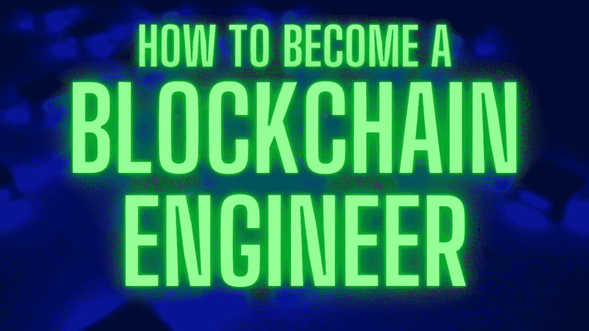

来自 [Canva](https://www.canva.com/) 的 georgejportfolio 的原始图像

## 介绍

[成为一名区块链工程师](https://blog.chain.link/how-to-become-a-smart-contract-developer/)是我和我的同事们做过的最有趣、最有回报、最令人兴奋的选择。我们已经为您开辟了起步之路！在这篇文章中，我们将告诉你如何成为一名区块链工程师，从初学者到专业人士。

剧透一下，这是我们将带你去见一位成功的区块链工程师的确切蓝图:

## 四个步骤

1.  理解为什么你应该成为区块链工程师
2.  参加区块链课程
3.  加入黑客马拉松、社区和构建
4.  开始你自己的协议，接受一份工作，自由职业者和贡献者

如果你能走到这一步，你已经做到了！虽然，我会添加一个额外的步骤 5，我们很快就会谈到。

5.你成功了！继续学习！

就是这样！这些正是你成为区块链工程师需要采取的步骤！

你也可以在这里观看我们的 YouTube 视频。

如何成为一名区块链工程师

# 第一步。了解原因

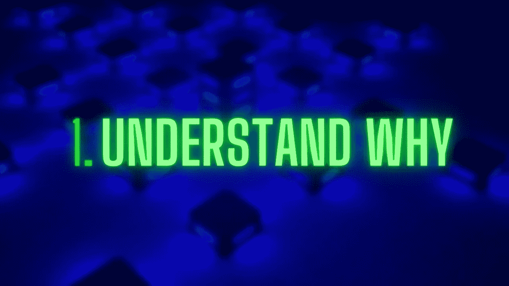

原始图片来自 [Canva](https://www.canva.com/) 的 georgejportfolio

现在，我坚信你可以通过以下步骤学会做任何事情:

1.  设定具体结果
2.  准确理解为什么你需要这个结果
3.  想办法
4.  采取大规模行动
5.  定期反思和重复你的行动

我们已经知道我们的结果是什么:成为一名区块链工程师。我们可以说得更具体一些，比如“在明年圣诞节前找到一份年薪 17.5 万美元的工作”或“在明年感恩节前启动一项拥有 1 亿美元资产的 DeFi 协议”，但在很大程度上，我们知道自己的结果是什么。

但是在开始之前我们需要知道为什么我们想要这个。当我们过了糟糕的一天或感到疲倦时，这个“为什么”是燃料，是我们可以召唤的决心的发电站，让我们保持专注，并迫使我们继续旅程。你的“为什么”越强烈，你就越能在日常生活中保持警惕。

我已经在[上写了为什么你应该成为区块链工程师](https://medium.com/coinmonks/6-reasons-why-you-should-become-a-blockchain-engineer-9954e26105dd)，但是我们可以快速回顾一下:

1.  🌎对世界产生持久的影响
2.  💨创造一个更快、身临其境的数字世界
3.  💸展望金融的未来
4.  🦖消除传统协议中的集权专制
5.  🧑‍🔬使用尖端技术工作
6.  ✅迅速成为太空领域的领导者
7.  👩‍👩‍👧‍👦加入一个令人兴奋的、萌芽的、协作的社区
8.  💰经历疯狂的经济机会

## 我们正在建设数字互动的未来

区块链使相互之间的互动更加负责、透明、高效、公平，并成为社区的主导。

区块链和智能合约解决了无数的问题，你可以从[了解更多什么是智能合约](https://chain.link/education/smart-contracts)。

## 这些社区是绝对的爆炸

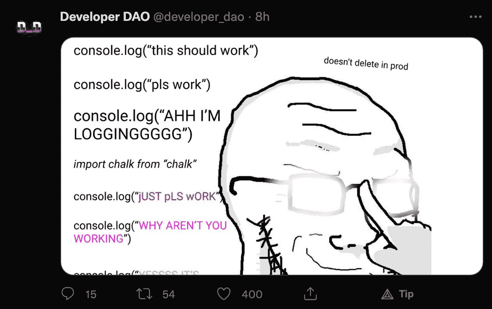

图片来自[开发商道](https://twitter.com/developer_dao/status/1457318917391601670)

老实说，[事件](https://www.ethdenver.com/)、[黑客马拉松](https://chain.link/hackathon)、[社区](https://twitter.com/developer_dao)，以及参与成员是这个空间中最棒的部分。区块链迫使人们协作，推动每个人都赢。

当这么多的人都希望你成功时，这种感觉很好。因为如果你成功了，你就帮助他们成功了。

## 当然，还有工资。

根据 2021 年软件工程薪酬雇佣状况，区块链工程师的平均薪酬是伦敦第二高的软件工程师，甚至高于 NLP、搜索和机器学习。

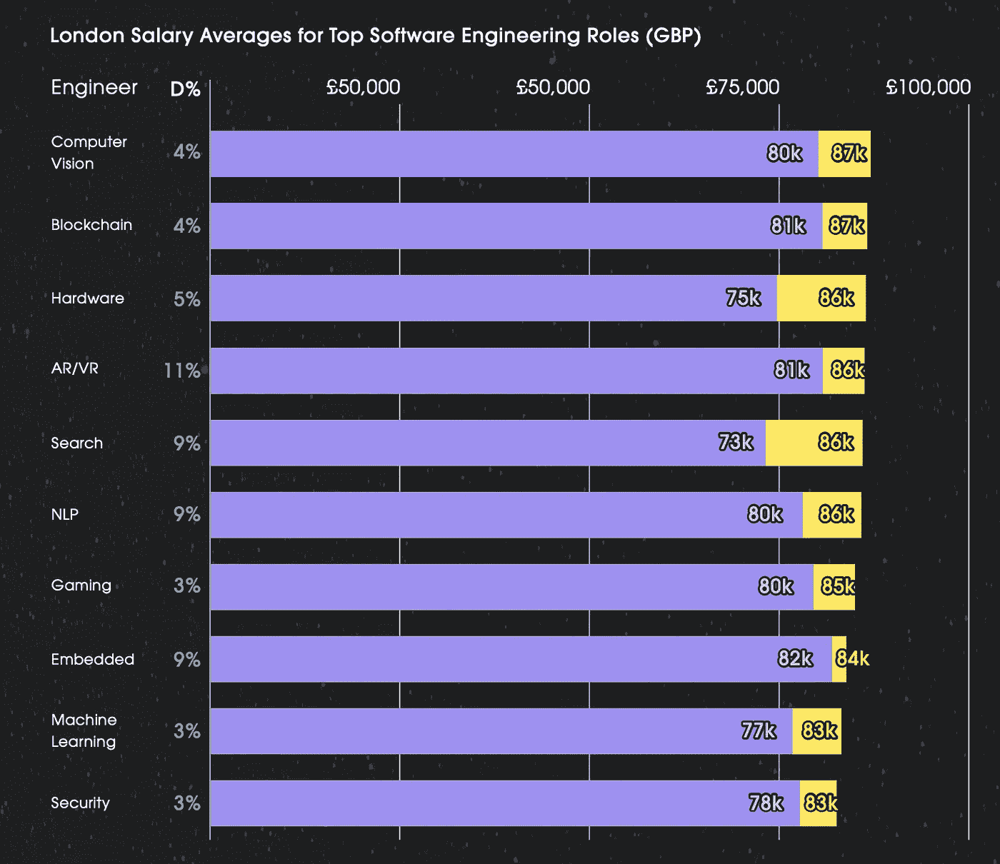

[来自雇佣的图片](https://hired.com/state-of-software-engineers)

关注你能得到多少报酬可能是最薄弱的部分，其他所有理由都是更好的理由。

# 第二步。参加区块链课程

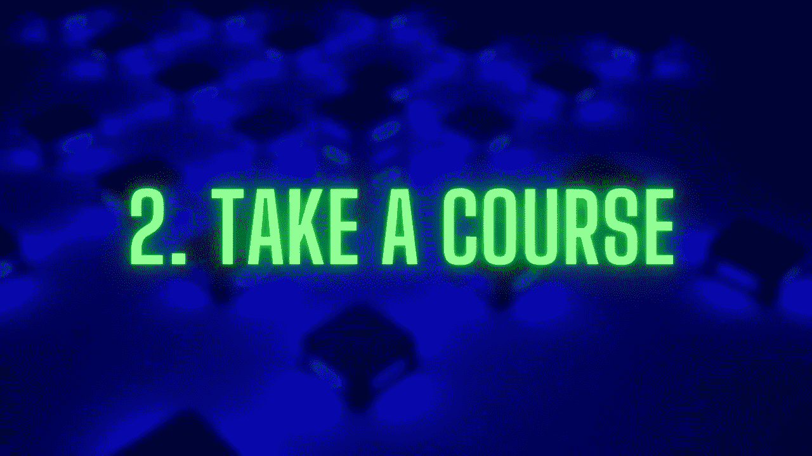

来自 [Canva](https://www.canva.com/) 的 georgejportfolio 的原始图像

如果你还没上过课。甚至不要读第三步。阅读本部分，然后选择一门课程并开始。

区块链是一个全新的世界，有很多技术需要你去了解。如果你是从零开始，区块链课程将是最有效、最快、最简单的入门方式。只要做至少一件事就能让你的基础扎实。幸运的是，无论您从哪里开始，我们都有一个关于从哪里开始的建议列表！

但是最棒的是，你仍然可以比任何其他软件工程行业更快地赶上当前区块链的趋势。为什么？嗯，它只存在了 10 年左右！而[即将完成](https://en.wikipedia.org/wiki/Turing_completeness)智能合约出现的更少了！没有和你有 10 年经验的工程师。除了区块链，其他行业都有。大学学位很好，但老实说，每个人都只是在看你做了什么。如果你有哈佛的学位，那很酷…但是你能使用`delegatecall`部署一个可升级的智能合同吗？那更酷。

哪个都没关系，挑一个，开始吧。

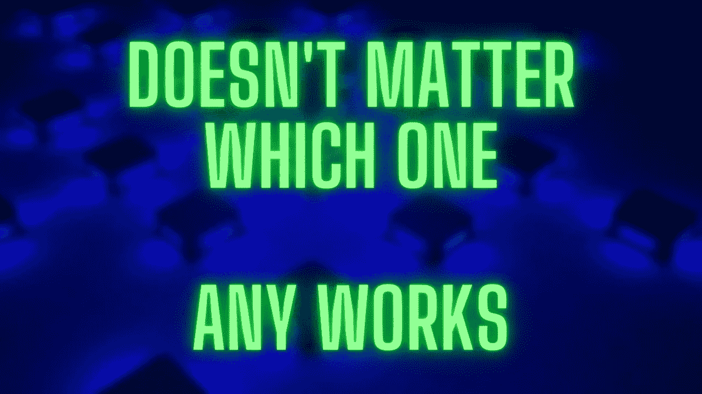

来自 [Canva](https://www.canva.com/) 的 georgejportfolio 的原始图像

分析麻痹、害怕失败和冒名顶替综合症是在这个领域起步的最大障碍，但它们都是可以克服的。通过阅读这篇文章，你被欢迎进入区块链空间！

把那些关于你不知道该做什么，或者该去哪里的先入为主的想法统统扔出窗外。你正处于学习阶段。开始采取大规模行动吧！

每天留出 10 分钟，20 分钟，没关系。只要为学习建立一个常规，你就会发现自己已经完成了教程，并回到这篇文章上进行下一步！

# 重要的学习工具:

在所有这些课程中，以下是您将学习/应该学习的工具。如果他们不教这些工具，立即放弃这门课，选择一门不同的。

[坚固度](https://docs.soliditylang.org/en/v0.8.9/)

*   [可靠性](https://docs.soliditylang.org/en/v0.8.9/)| 90%智能合同的语言
*   [Openzeppelin](https://openzeppelin.com/) |非官方的坚固性标准库
*   [Chainlink](https://docs.chain.link/) |混合智能合约的 Oracle 连接

## 重要的部署框架(选择一个并开始！)

*   [混音](https://remix.ethereum.org/) |定位起点
*   [安全帽](https://hardhat.org/)| JavaScript 框架
*   [布朗尼](https://eth-brownie.readthedocs.io/en/stable/)| python 框架
*   [Dapp 工具](https://dapp.tools/) |命令行框架

## 基础

*   [基础密码学和共识](https://andersbrownworth.com/blockchain/) |区块链如何工作
*   [区块链钱包](https://metamask.io/) & [气](https://www.investopedia.com/terms/g/gas-ethereum.asp) |如何与区块链互动
*   [稳固基础](https://docs.soliditylang.org/en/v0.8.9/) |一切稳固

## 高级概念

*   [NFTs](https://www.youtube.com/watch?v=9yuHz6g_P50) |链上的艺术和独特代币
*   [DAOs](https://www.kraken.com/en-us/learn/what-is-decentralized-autonomous-organization-dao) |分权自治组织
*   [DeFi](https://chain.link/education/defi) |分权财政
*   [可升级性](https://www.youtube.com/watch?v=bdXJmWajZRY) |如何“更改”您的智能合同

## 工具

*   [Testnets](https://faucets.chain.link/) |区块链集成测试
*   [以太扫描](https://etherscan.io/) &块浏览器|如何“看到”链上发生的事情
*   [炼金术](https://www.alchemy.com/) &节点即服务|连接网络
*   [Moralis](https://moralis.io/) |全栈应用套件

首先，让我们从 solidity 课程开始，因为 solidity 目前涵盖了区块链开发的大约 90%,并且无疑是最流行的语言。Solidity 是以太网的语言，许多区块链已经采用 solidity 和“EVM”来构建智能合约应用程序。

# 建议的坚固课程

我在 [FreeCodeCamp](https://www.freecodecamp.org/) 上的不可思议的课程！

免费课程:

*   [坚固性、区块链、智能合约课程——从初学者到专家 Python 教程](https://www.youtube.com/watch?v=M576WGiDBdQ) |由我创作！这个课程被设计成对初学者最友好，对专家最友好，最密集，最强大的课程。我强烈推荐给任何人。它教授坚固，DeFi，NFTs，Brownie，一些 Python，全栈，以及介于两者之间的任何东西。我们正在开发 javascript 版本！敬请关注。
*   [Cryptozombies](https://cryptozombies.io/) |学习智能合约的游戏化版本，solidity，这里不断被评为学习 solidity 和智能合约的起点之一。
*   [以太坊编程入门【2021 年完整课程】](https://www.youtube.com/watch?v=XLahq4qyors)| Dapp 大学的 Gregory 教授的一门令人惊叹的课程，它将为你提供使用 solidity 的所有基础知识

此外，这些网站上列出的任何内容:

*   Ethereum.org[|以太坊 org 网站上有大量的游戏、课程和更多可以开始玩的东西！](https://ethereum.org/en/developers/learning-tools/)
*   另一个惊人的关于区块链空间的教程、内容和教育材料的精选列表！
*   [Chainlink Bootcamp](https://chain.link/bootcamp/bootcamp-2021-on-demand) |一个智能合同训练营，包含用于学习 web3 的教程和材料。

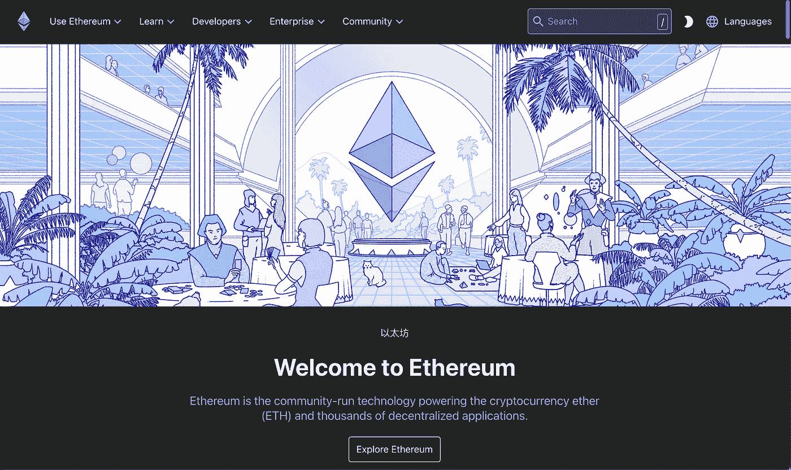

[Ethereum.org](https://ethereum.org/en/)

**付费课程，有时候，多一点动手学习很重要:**

*   他们有免费和付费的训练营！他们有绝对一流的课程和内容。
*   [Consensys Bootcamp](https://consensys.net/academy/bootcamp/) |太空中最古老的球场之一，他们知道自己在做什么！
*   最新的新兵训练营之一，他们正在他们希望专注的地方建造。
*   以太坊和坚固性:完整的开发者指南 |在这一点上有点过时，但这是我最初学到的！仍然给出了许多无论如何都不会过时的奇妙的基本原理。
*   Dapp 大学制作了大量令人惊叹的免费内容，这里是他们获取更多知识的训练营！
*   [吃积木](https://eattheblocks.com/) |另一个制作大量免费内容的组织，他们有一个训练营，可以教更多东西！
*   [Ivan on Tech Academy](https://academy.moralis.io/) |它和 Moralis 一起教授在区块链世界成为大师的技巧。

还有比这更多的工具和资源。例如，你可以在波尔卡多特生态系统中建造用于学习铁锈的[基质学院](https://www.industryconnect.org/substrate-runtime-developer-academy/)。你可以[学习 Solana 和 rust](https://learn.figment.io/protocols/solana) 在他们的生态系统中建立智能合约。你可以直接[学习 rust](https://www.rust-lang.org/learn) 对于 Solana，Polkadot，Terra，rust 对于许多其他协议来说也是巨大的。还可以学学 [Vyper](https://vyper.readthedocs.io/en/stable/) ，solidity 的大蟒姐姐！

你学过课程了吗？

你学过课程了吗？哪个都无所谓。在完成至少一门课程之前，请不要继续第 3 步！甚至不一定要来自这个列表！

# 第三步。加入黑客马拉松、社区和构建！

你上过课，对吧？

很好。

在这一点上，要做的主要事情是真正尝试你的技能，并与其他建设者联系。

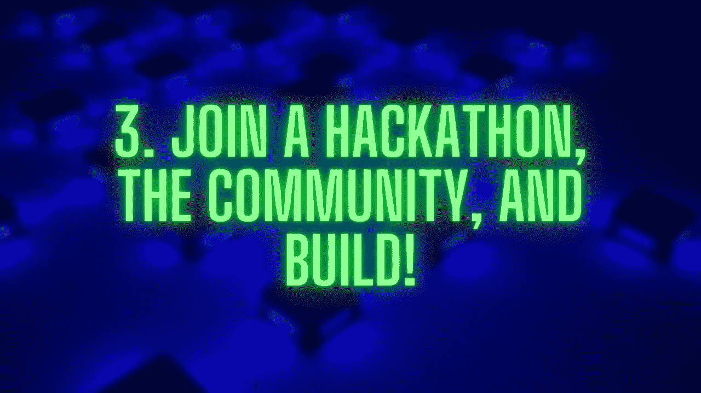

来自 [Canva](https://www.canva.com/) 的 georgejportfolio 的原始图像

做一些类型的项目。什么都不重要。一开始可能看起来很可怕，你可能觉得自己还没准备好。但是没关系。加入一个黑客马拉松，加入一个社区，开始学习更多，学习更快，并尝试你的技能。

不要陷入教程地狱，在那里你所做的只是教程！走出你的舒适区。如果你正在做的事情是熟悉的，你没有足够地挑战自己！

你现在学习的最快方法是开始建造东西。任何事。

## 做点什么——黑客马拉松

给自己一个期限。强迫自己做点什么的最简单的方法之一就是加入黑客马拉松。许多成熟的项目甚至始于黑客马拉松项目，如 1inch 或 Instadapp。黑客马拉松是从几天到几周不等的编程竞赛。你可以赢钱，但大多数工程师用它们来尝试学习新的东西！我已经写了为什么每个人都应该加入智能合同黑客马拉松。全球最棒的区块链黑客马拉松有:

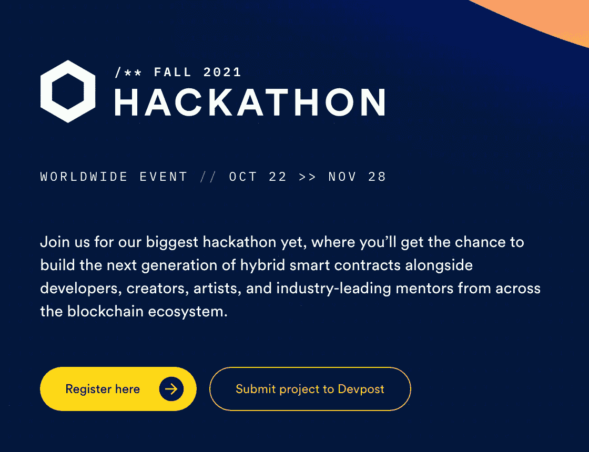

[Chainlink 黑客马拉松](https://chain.link/hackathon)

*   [ETH 全球黑客马拉松](https://ethglobal.com/)
*   [Chainlink 黑客马拉松](https://chain.link/hackathon)
*   [ETH 丹佛黑客马拉松](https://www.ethdenver.com/)
*   [Devfolio 区块链黑客马拉松](https://ethodyssey.devfolio.co/)
*   [印度联邦理工学院](https://twitter.com/ETHIndiaco)

这些也将建立你的 GitHub、GitLab 或 bitbucket 个人资料，这样当你开始找工作时，人们将能够看到你过去做了什么！把你做的所有事情放在 GitHub 上！

## 加入一些东西——社区

这个社区无疑是区块链空间中最好的部分之一。加入一个社区来问问题，提出想法，了解最新进展，这个领域每周都有新的事情发生！我最喜欢的一些是:

*   🐤 [Crypto Twitter](https://twitter.com/PatrickAlphaC) |(通常被称为“CT”)你可以关注我😃
*   🤖 [r/ethdev](https://www.reddit.com/r/ethdev/) |进行精彩的对话和分享
*   🌈[开发者道](https://twitter.com/developer_dao) |用于与空间中的其他开发者同步
*   👷🏿‍♀️ [安全帽不和](https://discord.gg/98G7Xzxa3t) |进行惊人的工装对话
*   🦄[进入以太坊不和](https://discord.gg/ahUxWYAAPp) |进行以太坊会谈！
*   🐍 [Python 区块链不和](https://discord.gg/9zk7snTfWe) |为热爱 Python 的区块链说话
*   ⛓ [Chainlink Discord](https://discord.gg/6HjdKqQxVa) |聊起混合智能合约
*   🐉关于任何事情的问题
*   🦖[智能合同研究论坛](https://www.smartcontractresearch.org/) |任何智能合同研究

社区的清单还在继续。

## 伸出援手

社区是帮助你摆脱那些会绊倒你的奇怪事情的最佳资源。当你遇到任何技术问题时，[跟随本文](https://docs.chain.link/docs/getting-help/)学习如何解决它:

1.  谷歌一下
2.  问一个关于[栈溢出](https://stackoverflow.com/questions/ask?tags=chainlink)或[栈交换](https://ethereum.stackexchange.com/)的问题
3.  在他们的 GitHub 回购上做文章
4.  在 Reddit、discord、某个论坛、任何地方都可以提问！

## 更多的人追随

除了我上面提到的那些人之外，还有很多人想让这个空间变得更好！

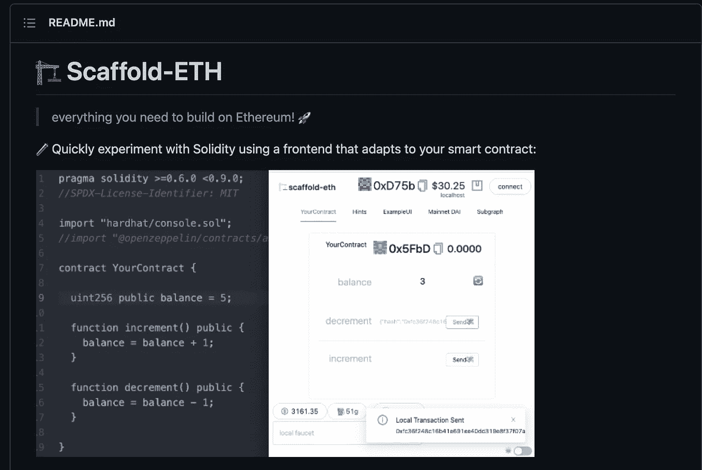

奥斯汀·格里菲斯的[脚手架——ETH](https://github.com/scaffold-eth/scaffold-eth)

*   奥斯汀·格里菲斯(Austin Griffith)| OG 巫师之一，无疑是整个宇宙中最有活力、最乐于助人的人之一。
*   [Nader Dabit](https://www.youtube.com/c/naderdabit/featured) |区块链空间的全栈精灵。
*   [Rekt.news](https://twitter.com/RektHQ) |用有趣的方式解释安全漏洞。
*   [维塔利克](https://twitter.com/VitalikButerin) |当然！以太坊的创始人！
*   埃文·凡·奈斯(Evan Van Ness)| WeekInEthereum 新闻的创始人

这个列表还可以继续下去…这个空间里有这么多乐于助人的人！

# 第四步。深入一点

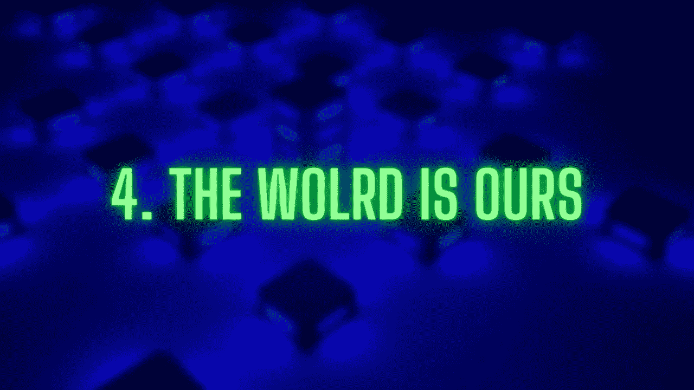

原始图片来自 [Canva](https://www.canva.com/) 的 georgejportfolio

申请工作

*   赠款和工作自由职业者
*   开始你自己的协议
*   还有别的吗…

在这一点上，你是在。你深陷其中，你将开始为你所做的一切得到回报。有很多方法可以让你的技能得到回报。

## 申请工作

一旦你在这一点上，你想开始连接一个协议，开始申请！你可以在任何地方找到区块链开发商的招聘信息。以下是一些例子:

*   [Reddit](https://www.reddit.com/r/solidity/comments/q6zz4t/solidity_developer_job_board/)
*   [密码工作列表](https://cryptojobslist.com/)
*   [GitCoin](https://gitcoin.co/explorer?network=mainnet&idx_status=open&applicants=ALL&order_by=-web3_created)
*   [WeekInEthNews](https://weekinethereumnews.com/)
*   [CryptocurrencyJobs](https://cryptocurrencyjobs.co/)

等等……或者，你可以接触你喜欢的协议，看看他们是否正在招聘！

## 自由职业者获得资助

去中心化的协议有很多正在死去的财富需要工作来使它们变得更好。如果你有一个协议的想法，申请拨款！在 [gitcoin](https://gitcoin.co/grants/) 上可以找到“在野外”获得资助的最佳地点之一，但是通常协议也会有资助项目:

*   [以太坊资助](https://ethereum.org/en/community/grants/)
*   [链环授权](https://chain.link/community/grants)
*   [索拉纳赠款](https://solana.com/grants)
*   [Uniswap 赠款](https://unigrants.org/)

还有更多。你通常也可以在任何地方找到自由职业者的工作。

## 开始你自己的协议

这个领域的一切都还是新的，还有大量的协议有待建立。如果你不知道从哪里开始，黑客马拉松是构建新协议的惊人起点。如果你被一些想法难住了，你也可以看看这个 [77 个混合智能合同用例的列表](https://blog.chain.link/44-ways-to-enhance-your-smart-contract-with-chainlink/)。

从字面上看，可能这个行业已经创造了 0.5%。我们来得太早了。有这么多东西要建。

# **第五步。继续学习**

我们已经讨论了这么多，但最后一步是继续学习。这个空间变化很快，每天都有新的进展。

通过钻研和遵循这些建议，你会不断学到新的东西。

# 摘要

每个人进入这个空间的路径都不一样。也许你选了 6 门课，然后直接投入工作。也许您可以直接从尝试构建自己的协议开始，并在此过程中学习一些课程。做这件事没有“正确”的方法。也没有错的方法。

这是一个我们绝对热爱的空间，充满了生命、活动、经济机会和真正对地球产生持久影响的机会。我真诚地希望看到你在社区建设和成长，也许有一天我们可以见面。

这种情况不会消失，所以我希望你能一起来。

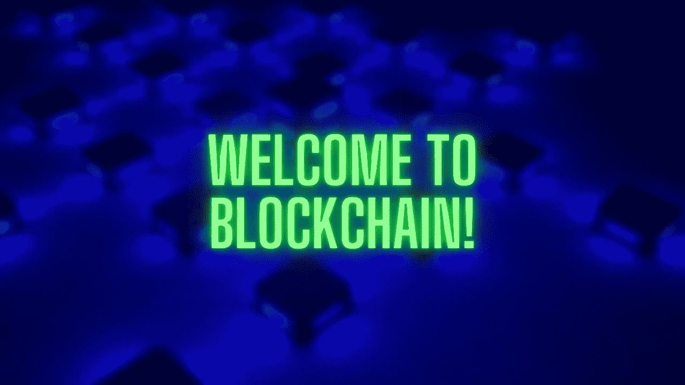

原始图片来自 [Canva](https://www.canva.com/) 的 georgejportfolio