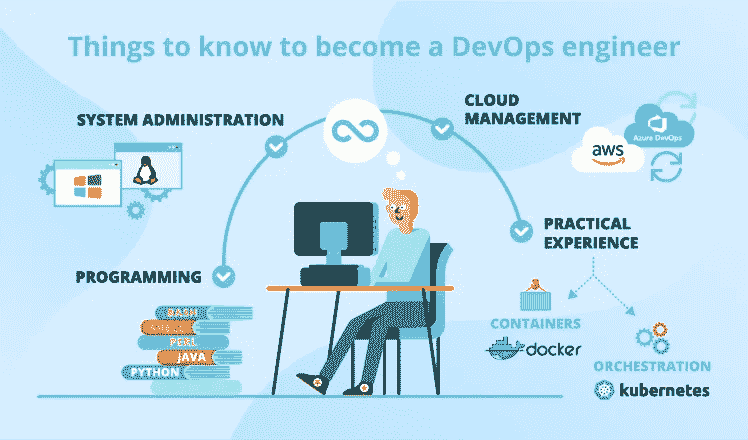
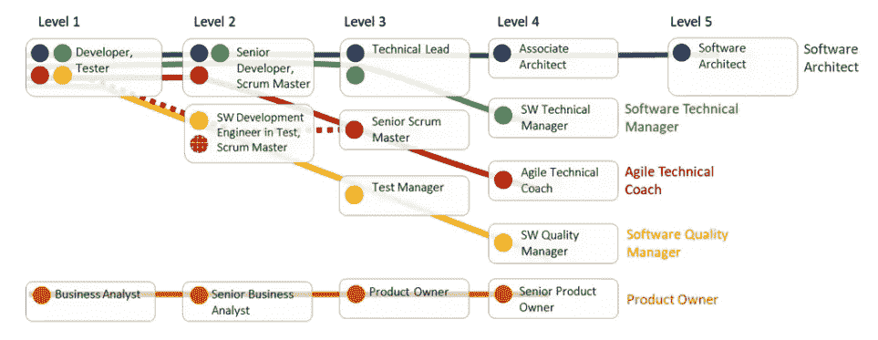
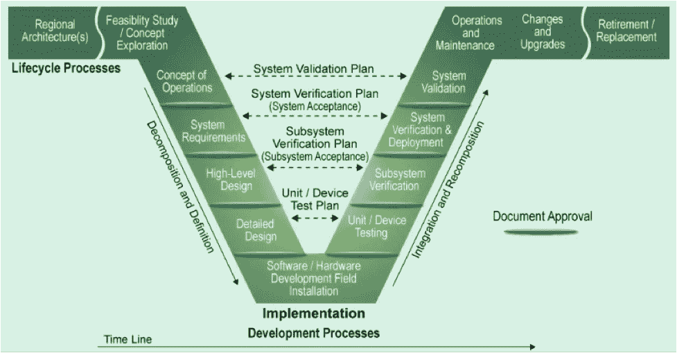
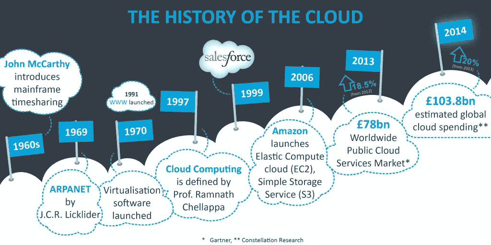
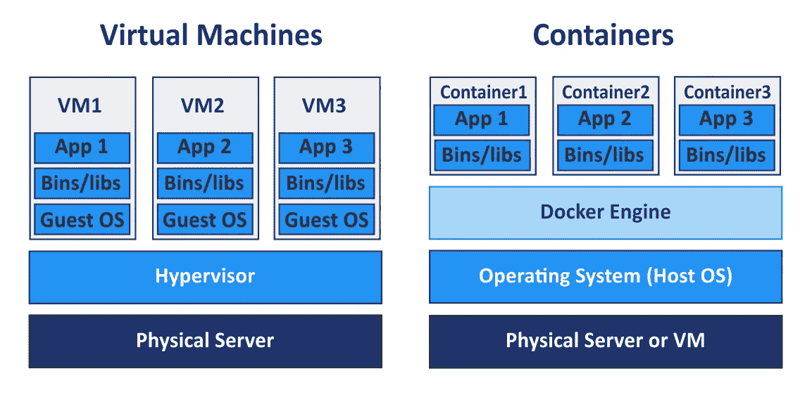
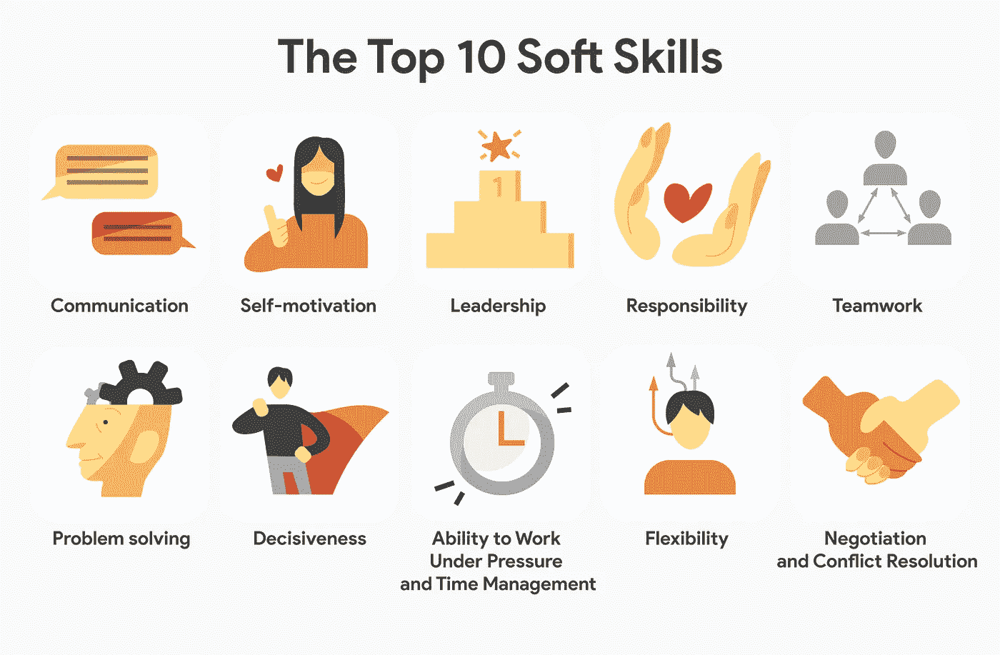

# 2020 年如何成为 DevOps 工程师

> 原文：<https://betterprogramming.pub/how-to-become-a-devops-engineer-in-2020-7618492a09d8>

## 你在 DevOps 开始职业生涯的指南

来源:[https://www . SCN soft . com/blog/how-to-be-a-devo PS-engineer](https://www.scnsoft.com/blog/how-to-become-a-devops-engineer)

2010 年代见证了 DevOps 工程师的崛起。DevOps 的工程师们现在已经在这个行业插上了他们的旗帜，并留在了这里。有兴趣成为 DevOps 工程师吗？以下是你获得这一头衔需要做的五件事:

1.  **有开发者心态**。您将像管理代码一样管理一些东西，所以您需要通过开发人员的视角来看待挑战和问题。学习 Git 并编写可维护的代码。
2.  **获取系统工程基础信息**。了解三层应用程序架构。能够解释基本的系统管理任务(以及如何自动化它们)。学习 Linux 的基础知识。
3.  **能够谈论在云中的体验。几乎每个公司都在以某种形式或方式采用云。这也让您能够证明自己的代码配置经验。**
4.  **了解一些关于容器的知识。**你不需要完全成熟的 [Kubernetes](https://kubernetes.io/) 的经验，但是你需要知道什么是容器。在 CI 构建期间关注容器的使用。
5.  **是的，** **软技能很重要。** DevOps 不仅仅是工装和技术，更是文化。要成为一名成功的 DevOps 工程师，你需要能够结交朋友并影响他人。

来源:[https://www.techrepublic.com/](https://www.techrepublic.com/)

# 1.拥有开发者的心态

需要懂 Java 还是。NET 开发才能当 DevOps 工程师？绝对不行！在面试潜在的 DevOps 工程师时，我看到太多的人在解释诸如 Git、pull requests 和 SDLC 等开发概念时缺乏信心。能够回答关于这些主题的基本问题。

另外，要意识到当你写脚本或者使用 Ansible、Chef 或 Terraform 等工具时，你实际上是在写代码。您需要为您的代码编写测试！除此之外，您还能如何确信自己编写的代码确实有效呢？

## 论维修性

学习 DevOps 的人和实践 DevOps 的人之间的区别是谁可以使用任何工具来编写可维护的代码。这不仅仅是你为之编写脚本的一次性任务。了解如何编写代码(并使用变量)，以便可以重用和/或重构代码，而无需完全重做。

来源:https://ops.fhwa.dot.gov/plan4ops/sys_engineering.htm

# 2.系统工程

这主要是针对那些有兴趣学习更多操作方面知识的开发人员。您应该获得操作系统如何与中间件一起工作的经验和理解。在这两者中需要配置哪些关键内容？网络流量是如何从浏览器流向应用服务器的？什么是三层应用程序架构？

当你理解了系统中需要配置什么东西的时候，你才可以开始把它们配置成代码。了解哪些内容可能会经常更改，或者不同应用程序之间的内容可能会有所不同，可以让您知道哪些内容可以作为变量在代码中公开，哪些内容可以硬编码。

来源:[https://times of cloud . com/cloud-tutorial/history-and-vision-of-cloud-computing/](https://timesofcloud.com/cloud-tutorial/history-and-vision-of-cloud-computing/)

# 云计算

当我说*云*时，我希望几乎所有阅读这篇文章的人都知道我在说什么。大多数企业都采用 Azure 或 AWS，甚至两者都采用，作为他们的云计算供应商。如果一个 DevOps 工程师对云计算没有一点经验，我是不会雇佣他们的。如果你现在还没有在你的公司使用这两个工具，创建你自己的帐户，开始使用一些服务。您不需要了解所有可用的 AWS 服务，但是您需要了解足够的基础知识来介绍它们、它们的作用以及它们为什么重要。

此外，谈谈你使用基础设施即代码工具的经验，比如 [Terraform](https://www.terraform.io/docs/cloud/index.html) 或 [Cloudformation](https://aws.amazon.com/cloudformation/) 。如果不将您的云环境配置为代码，您的日子将会很不好过。

来源:[https://www.docker.com/resources/what-container](https://www.docker.com/resources/what-container)

# 容器

鉴于无服务器应用的兴起，容器的使用变得有点有争议。然而，对于大多数企业来说，并不是每个应用程序都能够实现 100%无服务器化。将会有需要在容器中运行的中间件或有状态方面。要成为 DevOps 工程师，你不需要通过任何方式成为 Kubernetes 专家。同样，对于大多数企业来说，未来几年，全面发展 K8 是一个挑战。仅仅是在企业环境中安装 Docker 和运行容器的能力，就是今天许多人正在努力解决的问题。

因为容器使您的开发人员能够在本地运行他们的全部应用程序堆栈，所以能够为您的应用程序构建容器并使用它们对于真正成为一个 DevOps 商店至关重要。此外，通过为构建作业使用容器来加速 CI 构建是至关重要的。当您可以使用容器时，为什么要在 VM 上管理和修补 Java 版本来构建`.jar`文件呢？此外，了解如何在您选择的 CI 工具中使用这些容器([詹金斯](https://jenkins.io/)、 [Gitlab](https://about.gitlab.com/) 等)。

来源:[https://www . wiki job . co . uk/content/interview-advice/competencies/soft-skills](https://www.wikijob.co.uk/content/interview-advice/competencies/soft-skills)

# 软技能

这可能是有抱负的工程师最难掌握的技能，也是最容易被忽视的。DevOps 对许多组织来说是非常新的，这需要大量的培训和“技能提升”能够有效地沟通、跨越业务孤岛工作以及与组织中的不同人员合作是取得成功的唯一途径。

我知道了一个艰难的方法，那就是脚踏实地，决定你知道做某事的最好方法，对大多数人来说不会影响改变。事实上，你会为完成你正在努力做的事情制造更多的障碍。

倾听并能够理解其他人的想法。还有，不要觉得每个问题都需要解决。最有效的 DevOps 工程师可以影响和授权其他人自动解决他们自己的问题。

# 其他 DevOps 培训资源

*   阅读本书[凤凰计划](https://www.goodreads.com/book/show/17255186-the-phoenix-project)
*   参加这个免费的 [DevOps 先修课程](https://www.udemy.com/course/learn-devops/)
*   观看 Rackspace 的视频，该视频用简单的英语解释了 DevOps 的[含义](https://youtu.be/_I94-tJlovg)。
*   阅读 Quora 上专家们关于成为一名优秀 DevOps 工程师的有趣回答
*   观看并学习 mums had(Udemy 顶级讲师之一)为初学者提供的这款 [Docker 全套免费课程](https://youtu.be/zJ6WbK9zFpI)
*   加入开发者社区论坛，如 [dev.to](https://dev.to/) 、 [Hashnode](https://hashnode.com/) 、 [Dzone](https://dzone.com/) 、 [DevOps subreddit](https://www.reddit.com/r/devops/) 、 [Stack Overflow](https://stackoverflow.com/) 、 [DevOps StackExchange](https://devops.stackexchange.com/) 、 [Changelog](https://changelog.com/)