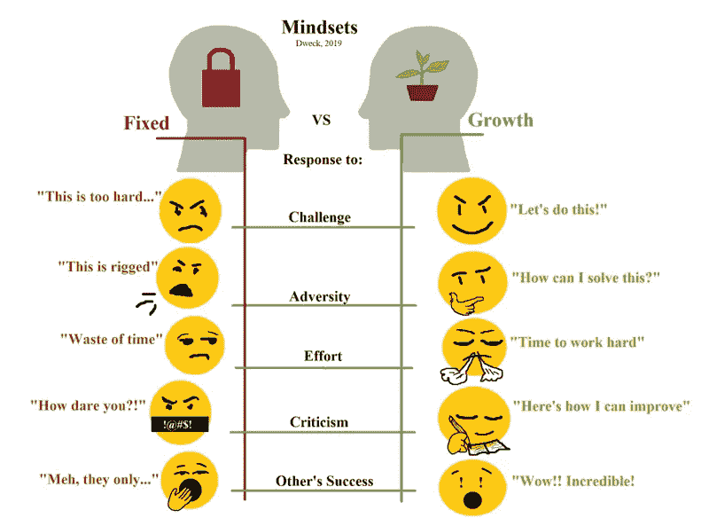

# 如何成为面向未来的开发人员

> 原文：<https://betterprogramming.pub/how-to-become-a-future-proof-developer-488548ac65d>

## 开发人员保持相关性的框架

安妮·斯普拉特在 [Unsplash](https://unsplash.com?utm_source=medium&utm_medium=referral) 上的照片

# 介绍

Angular，React，Flutter，Spark，Hadoop，Vue，Django，Laravael，Next，PyTorch，Mocha，以及数以百万计的其他框架已经受到开发者的欢迎。将来可能会出现更多的问题。

作为一名开发人员，即使在软件开发的一个领域，也很难跟上所有的框架、技术和不可避免的变化。如果你称自己为全栈开发人员，为了跟上技术和过程的步伐，需要不断学习。在有限的时间内平衡工作和生活，这是一个你需要克服的挑战，以保持相关性和领先地位。

# 你应该学习哪一个框架才能在未来保持相关性？

如果你希望我告诉你下一个将变得流行并改变技术格局的技术框架，让我向你保证我不知道，也没有人敢打赌。软件开发行业是快速变化的代名词。

几年前的技术、框架和流程现在已经过时了。如果你认为学习一门技能、一门语言或一项技术会让你成为一名经得起未来考验的专业人士，请三思。我告诉每个人的第一件事是接受你不可能学会所有新技术的事实。

信息和创新如此之多，以至于很快就变得无关紧要了。那么你需要什么框架呢？

> ***你茁壮成长唯一需要的框架就是成长心态。***

在每次技术面试中，我都有一个问题可以帮助我了解他们是如何掌握技术的。当面试一个前端开发人员时，我会问他们，*“如果我们给你一张写 API 的票会怎么样？你是怎么做到的？”*。你会惊讶地听到候选人的反应——从提供方法到说“我不想写 API”

最有希望的是那些承认他们以前没有接触过这方面的东西，并且渴望写出来的人。他们谈到依靠专家来学习最佳实践和技能。“能行”的态度是他们与众不同的地方。

> “并不是说我很聪明；只是我和问题待在一起的时间更长。”——阿尔伯特·爱因斯坦

# 什么是成长心态？

卡罗尔·德韦克的《心态》一书介绍了“固定心态”和“成长心态”的概念以及定义它们的特征。基于科学研究，这本书旨在描述特征及其对儿童的影响。

[U3170151，CC BY-SA 4.0](https://creativecommons.org/licenses/by-sa/4.0) ，通过维基共享

上图描述了不同心态之间的差异。回到我在面试中问的问题:你更有可能雇佣谁？候选人的回答决定了他们的态度。我总是提醒自己，“学一门技术技能很容易；改变态度很难。”

开发者需要接受增长思维。每个人都需要采用这一点，但是在谈论软件开发时，让我们把注意力集中在这一点上。开发软件很复杂，需要很大的毅力。每个特性都是一个新的挑战，实现它需要大量的学习。没有天生的开发人员或有天赋的开发人员。恰恰相反。

我合作过的每一个顶尖开发者都教会了我两件事。:首先，他们坚持不懈地寻求解决方案。技术框架不是争论的焦点，而是解决挑战。第二，不管结果如何，他们都会努力。他们不断学习，乐于接受反馈，并走出自己的舒适区。

在体育、企业、艺术、音乐或任何行业，顶尖的成功者都拥有一种成长的心态。他们并不像世人所说的那样是天生的天才，而是勤奋而坚定的。他们不会因为有挑战性或者没有天赋而停下来，而是继续前进，直到获得他们应得的荣耀。我见过很多开发人员坚持他们的工作方式，试图推荐他们所知道的东西。走出你的舒适区，学习新的东西是很有挑战性的。但是软件开发不都是为了解决问题吗？

如果问题不同，解决方案怎么可能相同？

技术和过程并不重要。重要的是你作为开发者的心态。如果你仍然停滞不前，抗拒改变，你就会慢慢退化和灭亡。优胜劣汰需要成长的心态。我们每个人都有固定的思维触发点，意识到这些是至关重要的。慢慢地、稳步地，你可以识别这些触发因素，并以适合成长心态的方式做出反应。

一旦你认识到固定思维的属性，你就能在你的同事和同事身上发现它们，帮助你与他们建立更好的关系。以书中的几行文字结束。

> “他没有要求没有失误的比赛。他没有要求他的球员永远不要输。他要求他们做好充分准备，全力以赴。
> 
> “我赢了吗？我输了吗？这些是错误的问题。正确的问题是:我尽力了吗？”
> 
> 如果是这样，他说，“你可能得分比别人高，但你永远不会输。”
> 
> —卡罗尔·德韦克，[心态:成功的新心理学](https://amzn.to/3yZEl3d)