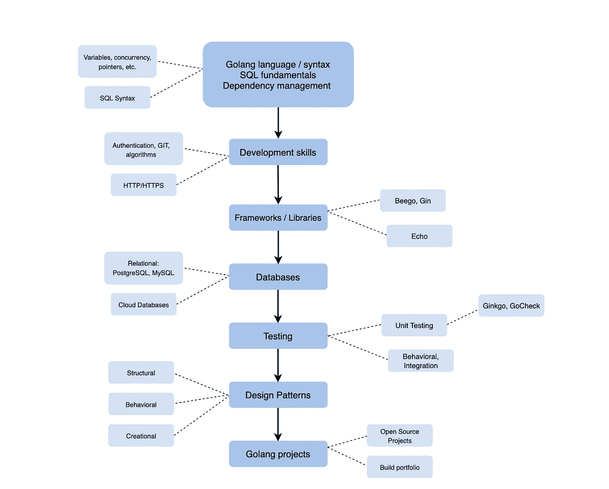

# 如何成为 Golang 开发者:6 步职业指南

> 原文：<https://betterprogramming.pub/how-to-become-a-golang-developer-a-6-step-career-guide-ce8274dd0eb3>

## Go 是一种普遍受欢迎的语言。今天，我们将讨论成为一名合格的现代围棋开发者的步骤

图片由作者提供。

Golang(也称为 Go)是一种受欢迎的编程语言——尤其是对于使用谷歌产品的人来说。许多大公司都使用 Go，比如优步、Medium、Dropbox、Salesforce、网飞、IBM 和 Twitter。

Go 是各种层次求职者的绝佳选择。但是如何开始呢？你需要知道什么？今天，我们将讨论学习围棋和建立可靠投资组合的最佳途径。

这份职业指南一览:

*   什么是 Go 开发者？
*   第一步:学习围棋的基础知识
*   第二步:掌握 Go 库和其他工具
*   步骤 3:用 Go 学习测试
*   第四步:理解围棋模式
*   第五步:开始建立你的投资组合
*   第六步:练习编码面试问题
*   接下来学什么

# 什么是 Go 开发者？

Golang 是一种静态类型的编译编程语言，由 Google 在 2009 年开发。这种语言结合了 C++的效率和 Python 的可读性。

Golang 开发人员使用 Go 语言构建网页和软件产品。Go 开发者的一般职责包括使用 Go 和使用它的全套工具和框架。大多数 Go 开发者也做测试和调试。

Golang 开发人员的大部分职位招聘还需要各种各样的其他技能，最常见的是:

*   脚本经验(Shell/PERL)
*   使用[设计模式](https://www.educative.io/blog/the-7-most-important-software-design-patterns)进行应用程序设计的经验
*   JavaScript、SOAP、REST web 服务或微服务
*   使用 Git 的经验
*   DevOps 实践知识

围棋入门门槛比较低。这是一种容易学习的语言，并附有详细的技术文档。对于那些有 C 语言经验的人来说，切换到 Go 相对容易。那么，如果学习围棋很容易，你如何找到一份使用这门语言的工作呢？我们来分解一下。

# 第一步:学习围棋的基础知识

要成为一名 Go 开发者，你需要对语言和语法有一个坚实的理解。你可以从安装语言和自学开始，或者你可以参加在线课程来指导你的学习。学习围棋的好方法应该是这样的:

1.  文件名、关键字、标识符
2.  运算符、类型、函数和常数
3.  指针、结构、方法
4.  地图、阵列、切片
5.  转到 CLI
6.  连接
7.  错误处理
8.  Goroutine，通道，缓冲区
9.  死机、延迟、出错、恢复
10.  去设计模式

你的学习道路很大程度上取决于你的背景。如果你完全是编程新手，Go 是一个很好的首选。它很容易学习，并模仿其他流行的语言，如 Python 和 C++。对于新手来说，最好从文件名、关键字和标识符等基础知识开始。然后，您可以用数据类型、运算符和字符串来构建您的基础。

如果你已经有了一些编程经验，也建议从零开始学习围棋，从围棋独有的特点入手。Go 是建立在一个不同于你所习惯的模型之上的，它以不同的方式对待面向对象编程。

Go 的目标是使用最少的关键字来减少输入和复杂性，因此你将比用其他语言如 Java 编写更少的代码。可以在没有符号表的情况下解析关键字，因为语法是 LALR(1)。Go 就像一种混合的命令式语言，但它是在考虑并发性的情况下构建的。以下是 Go 的一些独特功能:

*   没有函数或运算符重载
*   没有隐式转换以避免错误
*   没有类或类型继承
*   没有变体类型
*   没有动态代码加载或动态库
*   没有断言或不可变变量

*总结:从零开始学习 Go，重点是它的独特特性和面向对象的独特方法。*

# 第二步:掌握 Go 库和其他工具

一旦你掌握了这门语言的基础，你就应该继续学习使 Go 更容易使用的附加库和工具。大多数公司希望你有以下方面的经验:

*   Go 依赖关系管理工具
*   语义版本控制
*   脚本和存储库
*   去图书馆
*   SQL 基础知识
*   饭桶
*   基本认证
*   HTTPS 网站
*   Web 框架和路由器
*   关系数据库(PostgreSQL)

如果您已经有一些编程经验，那么您的工具箱中可能已经有了其中的一些。如果没有，不要慌！在学习如何使用 Golang 和相关技术进行构建的过程中，您将会学到这些技能中的大部分。

要学习的最重要的额外东西是框架、Go 库和数据库。许多其他技能可以在过程中或工作中学习。

框架方面，建议从 Echo、Beego、Gin、Revel、Chi 开始，Echo 对 go 最重要。

在库方面，最流行的 Go 库是 Go Kit、GORM、Gen 和 CLI。使用好的库和包会让使用 Go 更加容易。每一个都有自己独特的功能，所以选择一个符合你目标的是个好主意。

在数据库方面，拥有一些关系数据库的经验是很重要的，比如 [PostgreSQL](https://www.educative.io/blog/mongodb-versus-postgresql-databases) 或者 [MySQL](https://www.educative.io/blog/mysql-tutorial) 。除此之外，关于日志框架的知识也很有用，Zap 对于 Go 来说是最重要的。

*总结:学习 Go 库和其他成为现代高效 Golang 开发者所需的工具。*

# 步骤 3:用 Go 学习测试

测试是大多数公司都在寻找的一项重要技能。软件测试是我们如何检查实际的软件产品是否符合需求，并且一旦发布就能正常运行。

作为一名 Go 开发者，你将为现实世界构建产品，所以你需要测试你的产品的可用性和可靠性。这包括:

*   单元测试
*   集成测试
*   行为测试
*   E2E 测试

单元测试对于新的 Go 开发者来说可以说是最重要的。Go 的标准库中有一个内置的`testing`包。然而，Go 在极简主义方面出错了，所以你可能需要额外的工具来进行更健壮的测试，比如流行的框架 Ginkgo 和 GoCheck。银杏还可以用于行为测试和集成测试。

*总结:使用健壮的测试框架学习 Go 的单元测试。*

# 第四步:理解围棋模式

大多数雇主希望看到你理解 Go 的设计模式。设计模式是软件设计中常见问题的可重复的通用解决方案。不同的设计模式有助于划分业务逻辑或定义结构，以帮助完成某些任务。

Go 提供了与其他语言相似的设计模式，这些语言都属于以下几大类:

*   结构的
*   创造型的
*   行为的
*   并发
*   稳定性

最重要的是创建性的(如构建器、工厂、单例)、行为性的(如迭代器、观察器、命令)和结构性的(如适配器、桥、装饰器)。

如果你已经是一名程序员，你可能对设计模式很熟悉，可以在 Go 的上下文中开始学习。如果你是编程新手，学习这些的最好方法是实际开始用它们编码。借用一些示例实现，并围绕它们进行构建。

*总结:通过构建事物和借用样本实现来理解 Go 的设计模式。*

# 第五步:开始建立你的投资组合

一旦你有了这些步骤，是时候开始为你的投资组合构建东西了。这是一家公司将如何看到你有与 Golang 合作的真实经验。此外，事实证明，掌握一门语言的最好方法是用它来构建功能性产品，所以构建得越多，学到的就越多。

构建投资组合包括:

*   完成在线课程
*   为开源 Go 项目做贡献
*   从头开始构建 Go 项目
*   在现有项目中实现 Go 单元
*   用 Go 编码经典算法问题
*   完成相邻技术的课程(如 SQL)

你真的可以构建任何你想将技能付诸实践的东西，比如个人需求的待办事项列表、演示网站、谜题、游戏和编码挑战。

从提供证书的在线课程开始。你可以把这一点加到你的简历中，证明你已经掌握了基本知识。然后，关注 GitHub 上的开源贡献。这表明您可以构建真正的项目，并且知道如何使用流行的版本控制系统。

*总结:用 Go 来构建事物，学习技能，创建一个坚实的工作组合。*

# 第六步:练习编码面试问题

一旦你有了一个坚实的投资组合，你就可以开始练习去面试问题。这将有助于你为面试做准备，并对你刚刚学过的语言有更多的了解。编写面试问题并不是最重要的，因为它们往往很抽象，但是它们确实可以改进你的代码，帮助你在压力下工作。

当你得到一个 Go 开发者面试的机会时，你会被期望及时回答这些问题，所以尽早得到练习不会有坏处！这也有助于发现你知识上的任何差距。

一些常见问题包括:

*   什么是 goroutine？你怎么阻止它？
*   如何在运行时检查变量的类型？
*   如何在不打印的情况下格式化一个字符串？
*   在 Go 中如何连接字符串？
*   什么是 Go 2？
*   如何在 Go 中初始化一个结构体？

*总结:练习真题编码，为面试做准备，填补任何知识空白。*

# 接下来学什么

恭喜你坚持到最后！你应该很快就会成为一名 Golang 开发者。显然，前面还有很多路要走。从哪里开始很大程度上取决于你的基础知识，但建议从头开始学习围棋，以了解它的独特之处。

您的下一步应该是:

*   学习 Go 语法。
*   了解基本数据类型。
*   使用控制结构构建一些东西。
*   练习函数。

快乐学习！