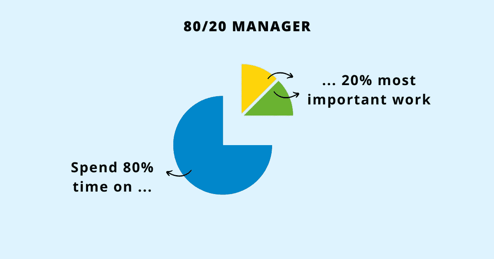

# 如何成为 80/20 经理并在工作中取得优异成绩

> 原文：<https://betterprogramming.pub/how-to-become-an-80-20-manager-and-achieve-exceptional-results-at-work-6314fed21ac6>

## 用平凡的努力获得不平凡的结果

鸣谢:作者

帕累托原则指出“80%的结果来自 20%的努力。”换句话说，你投入的工作有很大一部分被浪费了，而有一小部分带来了成果。

社会学家维尔弗雷多·帕累托通过观察英国 80%的财富来自 20%的人，首次发现了这个原则。从那以后，人们发现帕累托原则几乎适用于我们生活的各个方面:

20%的产品创造了 80%的销售价值。

*80%的问题来自 20%的客户。*

*80%的成果是由 20%的员工产生的。*

工作中 80%的问题是由 20%的同事造成的。

识别那 20%是一件大事。大多数经理都被管理职责带来的日常混乱所困扰，这些职责包括[连续会议](https://www.techtello.com/too-many-meetings-at-work/)、利益相关者的责任、灭火和赶时间。如果没有意识到他们在哪里以及如何度过他们的时间，花在做有影响的工作上的时间就会减少，而更多的时间被浪费在保持忙碌上。

80/20 经理不是这样工作的。他们把 80/20 法则应用到工作的各个方面。他们优先考虑那些会产生影响的工作，淘汰那些给人一种生产力错觉的工作，加倍努力去做那些能真正推动他们前进的工作。

他们以平凡的努力取得非凡的成就。运用 80/20 原则有助于他们取得非凡的成果——没有长时间工作的压力，也不会忙于无意义的工作。

> “80/20 原则不是一个神奇的公式。有时候，结果和原因之间的关系更接近 70/30，而不是 80/20 或 80/1。但是，50%的原因导致 50%的结果，这种情况很少发生。可以预见，宇宙是不平衡的。很少有事情是真正重要的，”—理查德·科赫

作为一名经理，将 80/20 法则应用到这五个重要领域不仅会给你带来最大的回报，还会让你的职业生涯成功而充实。

# 将 80%的时间花在 20%最重要的工作上

D.美国第 34 任总统、美国最伟大的军事指挥官之一艾森豪威尔说:

> "重要的事情很少是紧急的，紧急的事情很少是重要的."

80/20 的管理者非常理解这一点。他们没有被不重要工作的紧迫性所左右，而是着眼于未来——积极采取措施，缩小他们今天所处的位置与未来需要达到的位置之间的差距。

对重要的工作进行优先排序会成倍增加他们取得的成果。原则上:

*   做几件事，做好。
*   关注重要的问题，忽略其他的。
*   帮助他们的团队确定能以最少的努力获得最大成果的任务。
*   参加他们的出席很重要的会议。

为了将 80/20 法则付诸实践，他们采用了艾森豪威尔生产率矩阵。它是这样工作的:

1.  重要，不紧急:涉及通过战略思维进行未来规划。需要主动性。80/20 经理大部分时间都在这里。
2.  重要、紧急:处理危机管理。80/20 经理努力减少花在这里的时间，花更多的时间在#1 上。
3.  不重要，紧急:通过[委派工作](https://techtello.com/how-to-delegate-work-effectively/)，授权他们的团队承担更高层次的责任并独立决策。
4.  不重要，不紧急:消除与公司使命和目标不一致的工作。

80/20 经理通过减少工作创造价值，同时优先考虑更有影响力的工作。

# 花 80%的时间听，20%的时间说

许多经理犯了说得太多的错误。总是告诉他们的团队做什么，在每个小问题上指导他们，并给出不必要的反馈似乎是他们工作的一部分。不是的！

他们这样做是为了感觉在控制中。但是说的比听的多会让他们看不到困扰团队生产力和绩效的真正问题。

*他们说得越多，他们的人民就越少学习和成长。*

他们越是告诉别人该做什么，他们的团队就越觉得没有权力做决定。

他们越是对团队的工作吹毛求疵，就越没有动力做出高质量的工作。

80/20 经理们意识到说的比听的多的缺点。他们通过倾听团队成员的意见来练习有效倾听:

1.  他们的担忧是什么？
2.  是什么阻碍了他们自己解决问题？
3.  他们有什么想法和观点？
4.  他们怎么能自己做决定呢？
5.  人需要什么样的机会？
6.  哪些反馈有助于他们改进？

花 80%的时间听，20%的时间说，这是一种双赢。当员工的想法被倾听时，员工会感到快乐和受重视，经理也能获得信息，这些信息赋予他们的团队力量并使他们成长。

# 花 80%的时间指导 20%的优秀员工

一个高水平的执行者比一个普通的执行者多 400%的生产力。失去他们会剥夺组织的优势，同时还会产生额外的成本、时间和精力来雇佣他们的替代者。

> “人才是倍增器。你投入的精力和注意力越多，收益就越大。简而言之，你全力以赴的时间是你最有成效的时间。”—马库斯·白金汉

然而，任何组织中的高绩效员工都不容易管理。由于他们不适合正常的成长道路，一旦他们感觉到自己的旅程和成长方向之间的差异，他们就会对自己的工作失去兴趣，开始向外看。

他们有着非凡的能力来完成出色的工作，并渴望解决棘手的问题，因此他们要求经理给予更多的关注和参与。

80/20 经理非常在意不失去他们的[高绩效员工](https://www.techtello.com/high-performers/)。他们知道仅仅做好工作并不足以让他们的高绩效员工受到激励并致力于工作。

为了管理好他们的高绩效员工，一个 80/20 经理花 80%的时间指导 20%的高绩效员工。要实现这一点:

*   他们花时间去了解他们的高绩效员工，除了他们想要的和需要的，还有是什么让他们与众不同。
*   他们不只是给他们分配工作。他们向最优秀的员工展示他们的前进方向。
*   他们挑战他们驾驶自己的船，并激励他们应对沿途的风暴。
*   智力刺激是不够的。高绩效者需要与想法建立情感联系。80/20 经理通过心理投资做到这一点——他们让高绩效员工成为自己道路的创造者。
*   他们通过让他们超越团队界限的可见性来帮助他们发光。
*   他们实现了工作的公平分配，并且不会将高绩效员工作为默认的后备选项。

一个 80/20 的经理通过把他们视为守护者，给予他们应得的时间和关注，带领他们的高绩效员工走向卓越，而不是远离卓越。

# 花 80%的时间提问，20%的时间提供答案

寻找问题的答案是经理工作的一大部分。然而，做这件事有正确和错误的方法。

当你的团队面临挑战或者他们不知道如何做某事时，给他们解决方案可以暂时解除他们的障碍。你可能认为你只是节省了他们的时间。事实上，给他们提供解决方案会让他们越来越依赖你。他们从未发展出应对工作挑战所需的批判性思维技能。

80/20 经理利用问题的力量让他们的团队找到自己的解决方案:

*   他们面临什么问题？
*   他们尝试过哪些解决方案？
*   什么奏效了？什么没用？
*   还有什么其他可能的解决方案？
*   他们怎么能以小胜为目标呢？

花更多的时间提问，花更少的时间提供答案，一开始似乎有点慢，但从长远来看，这让他们的团队快了 10 倍。他们的团队采用提问技巧，并学会自我解封。他们觉得自己有权[做出自己的决定](https://www.techtello.com/decision-tree-for-making-better-decisions/)，这有助于他们前进。

# 花 80%的时间赞美，20%的时间批评

向团队提供反馈是经理角色的重要组成部分。但如果作为一名经理，你过于挑剔怎么办？

与其认可你的团队的努力，赞扬他们的成就，不如纠结于一件不符合你期望的事情，这注定会降低你团队的士气。当他们不断被提醒他们所做的一切都不够好时，他们怎么能有动力做出最好的作品呢？

一个 80/20 经理不会用反馈来提醒人们他们缺少什么——他们的弱点——而是他们带来了什么。认可每个员工的独特技能——他们的长处——会激励他们更加努力地工作。称赞他们增加了价值——即使是很小的方面——建立了他们迎接更大更好挑战的信心。

这并不意味着他们从不批评或拒绝指出他们团队的不足之处，但给予建设性的批评并不是他们的主要关注点，这只是他们策略的一小部分。无论是[积极反馈](https://www.techtello.com/how-to-give-constructive-feedback/)还是分享团队成员可以做得更好的想法，80/20 经理都会识别出影响最大的反馈，并花费他们的时间和精力来确保反馈得到良好的传递和接收。

提供反馈时:

1.  他们不会通过鼓励团队对自己的行为负责来削弱团队对自己表现的控制感。
2.  在分享建设性的批评时，他们避免做出判断，保持对行为和行动的讨论，从不谈论他们作为一个人是谁。
3.  他们不会试图修复或改变人们。相反，他们指导他们为自己做出正确的决定。
4.  当称赞时，他们的称赞是真诚的，不是为了操纵他人。
5.  他们[不称赞人们的聪明。他们称赞他们尝试新策略、寻求帮助和付出必要的努力。](https://www.techtello.com/how-to-promote-growth-mindset-in-workplace/)
6.  他们的反馈从不含糊。它可以与特定的行为或行动联系起来，使团队能够重复积极的行为并消除不良行为。

80/20 经理将反馈作为成长的工具，帮助他们的团队加强技能和能力，这将使他们的影响力提高 10 倍，同时忽略不会阻碍他们成功的弱点。

# 摘要

1.  帕累托原则指出，80%的结果产生于 20%的努力。优化这 20%，减少其余部分，可以带来巨大的结果收益。
2.  80/20 经理将帕累托原则应用于工作的方方面面。他们关注能产生最大影响的任务、问题和会议。
3.  他们把 80%的时间和注意力放在 20%最重要的工作上。通过应用艾森豪威尔生产力矩阵，他们花更多的时间关注重要的工作，减少或委派紧急任务，并消除根本不应该做的工作。
4.  他们花 80%的时间倾听他们团队的担忧、想法和意见。通过少说多听，他们能够提高团队的生产力和绩效。
5.  他们花 80%的时间来指导他们的 20%的优秀员工。让他们的高绩效员工保持高效和积极的工作态度会带来最大的收益。
6.  他们花 80%的时间问问题，20%的时间提供答案。通过帮助他们的团队确定自己的解决方案，他们使他们能够独立思考并做出自己的决定。
7.  他们花 80%的时间赞美别人，20%的时间批评别人。通过认可员工的贡献并帮助他们变得更好，他们使团队取得了超乎想象的成就。

在 Twitter 上关注我，了解更多故事。

*这个故事最初发表于*[*【https://www.techtello.com】*](https://www.techtello.com/80-20-manager/)*。*