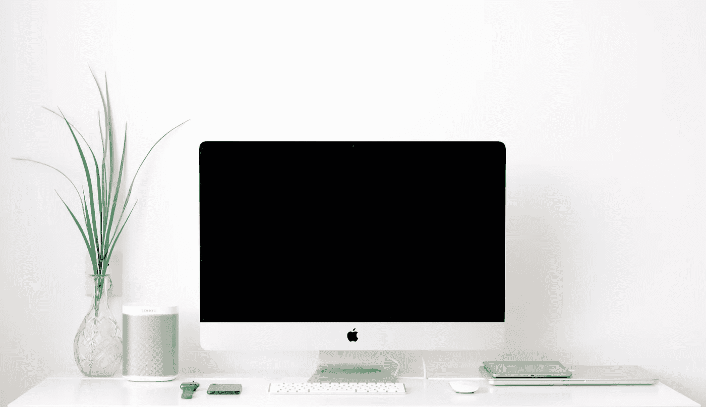

# 如何成为一名 iOS 开发者

> 原文：<https://betterprogramming.pub/how-to-become-an-ios-developer-c542bf02fd2>

## 一个巨大的有用资源列表，帮助你现在就开始做一个 iOS 开发者

照片由[鞠波·史密斯](https://unsplash.com/@jessysmith?utm_source=unsplash&utm_medium=referral&utm_content=creditCopyText)在 [Unsplash](https://unsplash.com/s/photos/mac-1060x?utm_source=unsplash&utm_medium=referral&utm_content=creditCopyText) 上拍摄

一年零八个月前，我开始了作为一名 iOS 开发人员的旅程，这是我最有成就感的职业生涯。如果你正在阅读这篇文章，希望有一天成为一名 iOS 开发人员，要知道所有的努力都是值得的。

# 关于我自己

我的名字是 Josiah Rininger，在我的职业生涯中，我有机会在我的大学移动团队中工作，并在纳什维尔的移动导师和洛杉矶的华特·迪士尼公司作为 iOS 开发人员实习，这使我在今年 4 月开始担任 iHeartMedia 的 iOS 助理工程师。

这篇文章涉及了成为一名 iOS 开发人员的所有主要类别，这是我一路走来必须解决的问题。我会提供我提到的所有资源的链接。让我们开始吧！

# **我要复习的内容**

*   去拿硬件
*   下载软件
*   做教程
*   学习基础知识
*   构建小型应用程序
*   发布到应用商店
*   熟悉框架
*   找一个导师
*   建立一个网络
*   对此感到兴奋

# 去拿硬件

作为一名 iOS 开发者，你首先需要一台 MacBook 或任何运行 macOS 的电脑。这是必需的，因为构建原生 iOS 应用程序所需的软件只能在 macOS 上运行，而苹果会为其硬件授权 macOS。在物理设备上运行和调试你的应用程序，iPhone 也是不错的选择，但这并不是必须的。

[苹果 Mac 产品](https://www.apple.com/mac/?afid=p238%7CsI6BrZjTZ-dc_mtid_1870765e38482_pcrid_454212704600_pgrid_19485452767_&cid=aos-us-kwgo-mac--slid---product-)

# 下载软件

## 开发软件

我认为唯一需要的软件是 Xcode。Xcode 是一套构建 iOS 应用所需的所有软件开发工具，对所有人都是完全免费的。

[Xcode](https://apps.apple.com/us/app/xcode/id497799835?mt=12)

## 设计软件

所有的 iOS 应用都有用户界面，所以拥有一些设计工具肯定会派上用场。我最喜欢的是 Adobe XD，主要是因为免费。Sketch 和 Figma 也是创建用户界面和实体模型的神奇工具。

[土坯 XD](https://www.adobe.com/products/xd.html) / [素描](https://www.sketch.com) / [图玛](https://www.figma.com)

## 先进的

一些更有经验的开发人员使用的工具是 Charles 和 Postman。这些对于跟踪和测试应用程序可能进行的各种网络调用非常有用。

[查尔斯](https://www.charlesproxy.com/download/latest-release/) / [邮递员](https://www.postman.com/downloads/)

# 做教程

## 在线课程

现在我们已经完成了设置，终于到了开始编码的时候了。我第一次接触 iOS 开发是斯坦福 Swift 课程，完全免费。许多人喜欢并推荐这些课程，但我开始时觉得它们对我来说有点太高级了。就个人而言，Ray Wenderlich 初级 iOS 课程对开始最有帮助，你可以免费做前两个教程。Paul Hudson 的《Swift 100 天》是另一个很好的资源。它非常全面，实际上是免费制作的，用于帮助开发者在 100 天内每天了解 iOS 开发中的各种主题。虽然我个人从未使用过 Udemy，但它在 iOS 社区中也受到了初学者的高度赞扬。

[斯坦福·斯威夫特](https://itunes.apple.com/vn/course/developing-ios-11-apps-with-swift/id1309275316) / [雷·温德里奇](https://www.raywenderlich.com/ios/paths/learn) / [斯威夫特 100 天](https://www.hackingwithswift.com/100) / [Udemy](https://www.udemy.com/course/the-art-of-real-ios-programming/)

## YouTube 频道

最重要的是，YouTube 是学习 iOS 开发的最好的、完全免费的方式。每当我有一个问题或想学习一个新的主题，我可以很容易地找到一个内容创建者，提供我正在搜索的内容。以下是我在 YouTube 上最喜欢的一些学习频道:

[肖恩·艾伦](https://www.youtube.com/channel/UCbTw29mcP12YlTt1EpUaVJw) / [让我们开发那个应用](https://www.youtube.com/channel/UCuP2vJ6kRutQBfRmdcI92mA)/R[ayWenderlich.com](https://www.youtube.com/user/rwenderlich)/[布莱恩·降临](https://www.youtube.com/channel/UCysEngjfeIYapEER9K8aikw) / [马克·莫耶肯斯](https://www.youtube.com/channel/UChH6WbyYeX0INJjrK2-6WSg) / [基洛·洛克](https://www.youtube.com/channel/UCv75sKQFFIenWHrprnrR9aA) / [约翰·桑德尔](https://www.youtube.com/channel/UCTfmK7YoPhSkRsIul50_rSA) / [保罗·哈德森](https://www.youtube.com/channel/UCmJi5RdDLgzvkl3Ly0DRMlQ)

## 播客

播客也是一个很大的帮助，特别是如果你有其他需要你关注的优先事项。我通常喜欢在通勤或锻炼时听 iOS 开发播客。我最喜欢的三个是 RayWenderlich.com 播客、iOS Dev 讨论和 Sundell 的 Swift，所有这些都可以在大多数播客平台上找到。

[RayWenderlich.com 播客](https://www.raywenderlich.com/podcast) / [iOS 开发讨论](https://podcasts.apple.com/us/podcast/ios-dev-discussions-sean-allen/id1426167395) / [Swift by Sundell](https://www.swiftbysundell.com/podcast/)

# 学习基础知识

根据你对编程的了解程度，除了特定于 iOS 的教程，我肯定会推荐你学习一些编程的基础知识。这不是必需的，但在您的旅程中绝对有用。主要用于 iOS 开发的两种语言是 Swift 和 Objective——c . Swift 实际上是在 2014 年发布的，所以它是一种语法漂亮的相当新的语言。如果你喜欢阅读，苹果在 Swift 上发布了一本书，几乎涵盖了你需要了解的关于该语言的所有内容。关于 Swift 的快速介绍，Derek Banas 在 YouTube 上有一个关于这种语言的精彩的简短介绍。

[苹果的 Swift 编程语言](https://books.apple.com/us/book/the-swift-programming-language-swift-4-2/id881256329) / [德里克·巴纳斯的 Swift 教程](https://www.youtube.com/results?search_query=derek+banas+swift)

# 构建小型应用程序

我提到的许多 YouTube 频道和在线课程可以帮助你一步一步地构建小型应用程序。这些小项目对于构建 iOS 开发的坚实基础非常有用。一旦你觉得舒服了，你就可以自己开发应用程序，而不需要遵循教程。我的第一个应用程序是 Ray Wenderlich 的 Bull Eye 应用程序，如果你有 Apple Music，Sean Allen 的音乐播放器应用程序是一个超级快速和有用的教程。

[靶心教程](https://www.raywenderlich.com/5993-your-first-ios-and-uikit-app) / [音乐播放器教程](https://www.youtube.com/watch?v=aiXvvL1wNUc)

# 发布到应用商店

最令人满意的时刻之一是当你向应用商店提交你的第一个 iOS 应用时。这也是一个非常棒的体验，可以端到端地构建一个产品，并完成一个应用的发布过程。为了做到这一点，你需要一些东西。

首先，你需要一个苹果开发者许可证。你可以通过加入苹果开发者计划来获得这个。这个程序不是免费的，但只要 99 美元，物有所值！其次，App Store Connect 是一个你想熟悉的提交和管理你的 iOS 应用的网站。第三，你需要一个能让你的应用变得真实的想法。我提交的第一个应用程序是我花了整整两天时间制作的身体质量指数计算器。它不是很大，但让我构建的东西在全球成千上万的用户面前变得栩栩如生，这让我非常满意。

[苹果开发者计划](https://developer.apple.com/programs/) / [应用商店连接](https://developer.apple.com/app-store-connect/)

# 熟悉框架

对于那些不熟悉框架的人来说，这些是共享资源包，为您提供了构建应用程序的优秀工具。

## SwiftUI & Combine

苹果最新的两个框架是 [SwiftUI](https://developer.apple.com/documentation/swiftui) 和 [Combine](https://developer.apple.com/documentation/combine) 。这两个框架似乎是 iOS 开发的未来，所以学习这两个框架对你作为 iOS 开发人员的职业生涯很有帮助。我链接的许多资源都深入到了这两个框架中。

## 重火力点

在我看来， [Firebase](https://tailwindcss.com) 是独立开发者最伟大的后端服务。它有一个数据库，你可以用于你的应用程序，以及分析，认证和许多其他工具，所有这些都是免费的。Firebase 确实有花钱的计划，但我还不需要升级。

# 找一个导师

有一件事我怎么强调都不为过，那就是找到一个导师，一个每当你遇到困难时可以问问题的人，或者一个可以指导你成为 iOS 开发者的人。在我的旅程中，我有三个主要的导师，这是我在这里的唯一原因。有一个导师最大的好处是有人会给你反馈，帮助你在职业生涯中成长，并教你最好的编码实践。我有朋友通过 iOS 开发者 Slack 频道找到了导师，该频道有超过 30，000 名会员，我将在下面链接。有很多网站可以找到导师，但实际上，找到导师的最好方式是通过网络。

[iOS 开发者 Slack 频道](https://ios-developers.io)

# 建立一个网络

## 我的网络经验

建立一个网络是我今天拥有梦想工作的首要原因。起初，这很难，但现在我已经建立了自己的关系网，每个月都有几十个招聘人员联系我，询问空缺职位，我有一种非常强烈的工作安全感。我的第一次实习是由于 Mobile Mentor 的 CEO 在寻找一名 iOS 开发人员时，在看到我的个人资料后联系了我。我现在在 iHeartMedia 的职位是因为 iHeartRadio 的一名招聘人员发消息给我，说她认为我非常适合这个职位。

我最近还参加了许多会议，这些会议帮助我与大公司和其他开发者建立了联系。令人惊讶的是，Twitter 有一个非常强大的 iOS 开发社区，我最近加入了这个社区。

## 如何开始

建立职业关系网的最佳起点是 LinkedIn。在这个过程中，将你的简历和你的账户联系起来肯定会有所帮助。通过接触 iOS 开发者和招聘人员，你会对这个行业和它周围的社区有更强烈的感觉。面对面的联系同样重要，而会议是建立这种联系的好方法。我最喜欢的是 Tapia 会议和 SwiftFest。在这样的活动中，你可以在 LinkedIn 或 Twitter 上与和你有相同 iOS 旅程的志同道合的人联系。

[塔皮亚会议](http://tapiaconference.org) / [最快](https://swiftfest.io)

# 对此感到兴奋

我想说的最后一件事是对此感到兴奋，并坚持不懈地追求学习！很快，你将会开发出影响到全世界成千上万人的应用程序，甚至有机会为一些世界上最大的公司做贡献。

# 结论

我真的希望我能帮助你们中的一些人开始成为 iOS 开发者的旅程。我希望听到任何认为这篇文章有帮助的人的反馈。